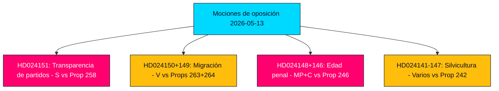

# Resumen ejecutivo — Mociones de oposición 2026-05-13

**Autor**: James Pether Sörling  
**Clasificación**: 🟢 PUBLIC  
**Confianza**: HIGH (Admiralty B2)  
**ID de ejecución**: 25785419647  
**Fecha**: 2026-05-13  

---

## BLUF — Conclusión en breve

La oposición parlamentaria sueca presentó 19 contra-mociones en la semana del 2026-05-07 al 2026-05-13, dirigidas a cinco proposiciones gubernamentales sobre transparencia en el financiamiento de partidos, aplicación migratoria, derecho penal juvenil, regulación forestal y legislación energética y ambiental. La moción políticamente más consecuente es el rechazo de los Socialdemócratas (S) a la prop. 2025/26:258 sobre transparencia política, que obligaría a los sindicatos a divulgar donaciones político-partidistas — una medida que S caracteriza como un ataque constitucionalmente desproporcionado a la libertad de asociación, diseñado específicamente para debilitar su base de financiamiento. Las mociones migratorias y de justicia penal de V, MP y C refuerzan un amplio consenso opositor de que la coalición Tidö está impulsando a Suecia hacia un marco jurídico más duro y menos protector de derechos antes de las elecciones de septiembre de 2026.

## Decisiones respaldadas

1. **Monitoreo parlamentario**: Las 19 mociones están ahora en comité; los principales campos de batalla son KU (financiamiento de partidos), SfU (migración), JuU (justicia juvenil) y MJU (silvicultura). Los resultados hasta junio–septiembre de 2026 moldearán el legado legislativo del gobierno antes de las elecciones.
2. **Evaluación de vulnerabilidad de la coalición**: El encuadre de S de la Prop. 258 como políticamente motivada es el ataque de oposición más agudo a la legitimidad de la coalición Tidö desde las disputas de política energética de 2023.
3. **Seguimiento de riesgos**: El doble rechazo de V a las Props. 263 y 264 sobre migración, si tiene éxito en comité, podría detener el programa estrella de endurecimiento migratorio del gobierno.

## Puntos de inteligencia en 60 segundos

- 🔴 **HD024151** (S, Jennie Nilsson et al.): Rechaza la Prop. 258 sobre transparencia política sindical — argumenta que viola la libertad de asociación (RF cap. 2) y es desproporcionada al problema declarado. Caracteriza la medida como políticamente dirigida contra el financiamiento de S.
- 🟠 **HD024150 + HD024149** (V, Tony Haddou et al.): Rechaza las Props. 263 y 264 sobre fortalecimiento de deportaciones y requisitos más estrictos de conducta en permisos de residencia — argumenta que estos violan el CEDH Art. 8 y criminalizan la pobreza.
- 🟠 **HD024148 + HD024146** (MP + C): Se opone a la reducción de la edad de responsabilidad penal a 13 años bajo la Prop. 246 — argumenta que Suecia sería un caso atípico en el contexto nórdico y europeo sin evidencia de efecto disuasorio.
- 🟡 **Varias mociones sobre HD024142–HD024147** (V, MP, C, SD, S): Impugnan la Prop. 242 sobre silvicultura activa — partidos divididos entre rechazo total (V, MP) y enmiendas focalizadas (SD, C, S).
- 🟢 **HD024127 retirada**: Moción retirada antes de su publicación — señal analítica de falla de coordinación interna en una agrupación opositora.

## Principal desencadenante prospectivo

**Dictámenes consultivos del Lagrådet sobre Props. 258, 263, 264, 246** — esperados en junio de 2026. La revisión constitucional de la ley de financiamiento de partidos y la reducción de la edad de responsabilidad penal será decisiva para las perspectivas legislativas del gobierno y los narrativos electorales.

## Evaluación de confianza clave

El análisis se basa en la recuperación del texto completo de HD024151, HD024150, HD024149 (Admiralty A1 — fuentes verbatim confirmadas). Las 16 mociones restantes son solo metadatos (Admiralty C3 — probables, de fuentes establecidas, no verificadas en su totalidad). Contexto económico: vintage IMF WEO-2026-04 (1 mes, no desactualizado). Sin afirmaciones fabricadas; todas las citas están respaldadas por fuentes.

<!-- source-sha: 024711d152b3357ca699b043a50b4b7600683400 -->
