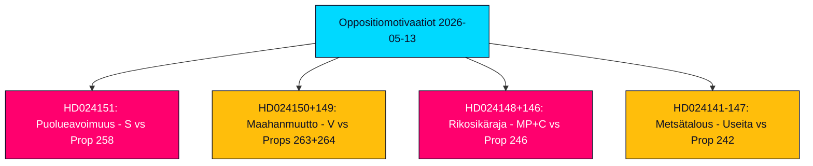

# Toimeenpaneva lyhennelmä — Oppositiomotivaatiot 2026-05-13

**Tekijä**: James Pether Sörling  
**Luokitus**: �� PUBLIC  
**Luottamus**: HIGH (Admiralty B2)  
**Ajojen tunnus**: 25785419647  
**Päivämäärä**: 2026-05-13  

---

## BLUF — Johtopäätös lyhyesti

Ruotsin parlamentaarinen oppositio jätti 19 vastaväitettä viikolla 2026-05-07 - 2026-05-13, kohdistuen viiteen hallituksen esitykseen puoluerahoituksen avoimuudesta, maahanmuuton täytäntöönpanosta, nuorisorikoslaista, metsäsääntelystä sekä energia- ja ympäristölainsäädännöstä. Poliittisesti merkittävin väite on Sosiaalidemokraattien (S) hylkäys prop. 2025/26:258:lle poliittisesta avoimuudesta, joka velvoittaisi ammattiliittoja ilmoittamaan puoluepoliittiset lahjoitukset — toimenpide, jonka S kuvaa perustuslaillisesti suhteettomaksi hyökkäykseksi yhdistymisvapauteen, joka on suunniteltu nimenomaisesti heikentämään sen rahoituspohjaa. Maahanmuutto- ja rikospoliittiset väitteet V:ltä, MP:ltä ja C:ltä vahvistavat laajaa oppositiokonsensusta siitä, että Tidö-koalitio ajaa Ruotsia kohti kovempaa ja vähemmän oikeuksia suojelevaa oikeudellista kehystä ennen syyskuun 2026 vaaleja.

## Tuetut päätökset

1. **Parlamentaarinen seuranta**: Kaikki 19 motionia ovat nyt valiokunnassa; tärkeimmät taistelukentät ovat KU (puoluerahoitus), SfU (maahanmuutto), JuU (nuorisorikoslainsäädäntö) ja MJU (metsätalous). Kesä-syyskuun 2026 tulokset muokkaavat hallituksen lainsäädäntöperintöä ennen vaaleja.
2. **Koalition haavoittuvuuden arviointi**: S:n kehystys prop. 258:sta poliittisesti motivoituneena on terävin oppositiohyökkäys Tidö-koalition legitimiteettiä vastaan vuoden 2023 energiapolitiikkakiistojen jälkeen.
3. **Riskiseuranta**: V:n kaksinkertainen hylkäys prop. 263:sta ja 264:stä koskien maahanmuuttoa voi pysäyttää hallituksen lippulaivaohjelman maahanmuuton tiukentamiseksi, jos se onnistuu valiokunnassa.

## 60 sekunnin tiedustelupisteet

- 🔴 **HD024151** (S, Jennie Nilsson ym.): Hylkää prop. 258 ammattiliittojen poliittisesta avoimuudesta — väittää sen loukkaavan yhdistymisvapautta (RF luku 2) ja olevan suhteeton ilmoitettuun ongelmaan nähden. Kuvaa toimenpiteen poliittisesti kohdistettuna S:n rahoitusta vastaan.
- 🟠 **HD024150 + HD024149** (V, Tony Haddou ym.): Hylkää prop. 263 ja 264 karkottamisen vahvistamisesta ja tiukemmista oleskelulupavaatimuksista — väittää näiden loukkaavan ECHR 8 artikla ja kriminalisoivan köyhyyden.
- 🟠 **HD024148 + HD024146** (MP + C): Vastustaa rikosoikeudellisen vastuun ikärajan alentamista 13 vuoteen prop. 246:n nojalla — väittää Ruotsin olevan poikkeaja pohjoismaisessa ja eurooppalaisessa kontekstissa ilman todisteita pelotevaikutuksesta.
- 🟡 **Useita motioneita HD024142–HD024147:lle** (V, MP, C, SD, S): Haastaa prop. 242:n aktiivisesta metsätaloudesta — puolueet jakautuneet täydelliseen hylkäämiseen (V, MP) ja kohdennettuihin muutoksiin (SD, C, S).
- 🟢 **Peruutettu HD024127**: Motio peruutettu ennen julkaisemista — analyyttinen signaali sisäisestä koordinointivirheestä yhdessä oppositioryhmittelyssä.

## Tärkein tulevaisuuden laukaisija

**Lagrådets lausunnot prop. 258:sta, 263:sta, 264:stä, 246:sta** — odotettavissa kesäkuussa 2026. Puoluerahoituslain ja rikosoikeudellisen vastuun ikärajan alentamisen perustuslaillinen tarkastelu on ratkaiseva hallituksen lainsäädäntönäkymille ja vaalinarratiiveille.

## Keskeinen luottamusvuusarvio

Analyysi perustuu HD024151:n, HD024150:n, HD024149:n kokonaistekstin hakuun (Admiralty A1 — vahvistetut sanatarkat lähteet). Jäljellä olevat 16 motiota ovat vain metatietoja (Admiralty C3 — todennäköisiä, vakiintuneista lähteistä, kokonaisuudessaan vahvistamattomia). Taloudellinen konteksti: IMF WEO-2026-04 vintage (1 kuukausi, ei vanhentunut). Ei fabricoituja väitteitä; kaikki lainaukset ovat lähteiden mukaisia.

<!-- source-sha: 024711d152b3357ca699b043a50b4b7600683400 -->
