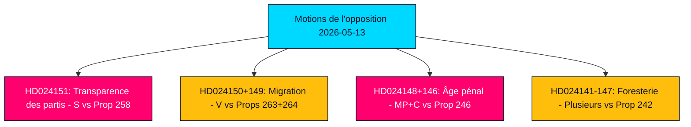

# Résumé exécutif — Motions de l'opposition 2026-05-13

**Auteur** : James Pether Sörling  
**Classification** : 🟢 PUBLIC  
**Confiance** : HIGH (Admiralty B2)  
**ID d'exécution** : 25785419647  
**Date** : 2026-05-13  

---

## BLUF — Conclusion en bref

L'opposition parlementaire suédoise a déposé 19 contre-motions la semaine du 2026-05-07 au 2026-05-13, ciblant cinq propositions gouvernementales sur la transparence du financement des partis, l'exécution de la migration, le droit pénal des jeunes, la réglementation forestière et la législation énergétique et environnementale. La motion politiquement la plus conséquente est le rejet par les Socialistes (S) de la prop. 2025/26:258 sur la transparence politique, qui obligerait les syndicats à divulguer les dons politiques — une mesure que S qualifie d'attaque constitutionnellement disproportionnée sur la liberté d'association conçue spécifiquement pour affaiblir sa base financière. Les motions migratoires et de justice pénale de V, MP et C renforcent un large consensus de l'opposition selon lequel la coalition Tidö pousse la Suède vers un cadre juridique plus dur et moins protecteur des droits avant les élections de septembre 2026.

## Décisions soutenues

1. **Surveillance parlementaire** : Les 19 motions sont maintenant en commission ; les principaux champs de bataille sont KU (financement des partis), SfU (migration), JuU (justice des jeunes) et MJU (foresterie). Les résultats d'ici juin–septembre 2026 façonneront l'héritage législatif du gouvernement avant les élections.
2. **Évaluation de la vulnérabilité de la coalition** : Le cadrage par S de la prop. 258 comme politiquement motivée est l'attaque d'opposition la plus acérée sur la légitimité de la coalition Tidö depuis les disputes sur la politique énergétique de 2023.
3. **Suivi des risques** : Le double rejet par V des props. 263 et 264 sur la migration, si réussi en commission, pourrait bloquer le programme phare de durcissement migratoire du gouvernement.

## Points de renseignement en 60 secondes

- 🔴 **HD024151** (S, Jennie Nilsson et al.) : Rejette la prop. 258 sur la transparence politique syndicale — argue qu'elle viole la liberté d'association (RF chap. 2) et est disproportionnée par rapport au problème énoncé. Qualifie la mesure de politiquement ciblée contre le financement de S.
- 🟠 **HD024150 + HD024149** (V, Tony Haddou et al.) : Rejette les props. 263 et 264 sur le renforcement des expulsions et le durcissement des conditions de permis de séjour — argue qu'elles violent la CEDH art. 8 et criminalisent la pauvreté.
- 🟠 **HD024148 + HD024146** (MP + C) : S'oppose à l'abaissement de l'âge de responsabilité pénale à 13 ans sous la prop. 246 — argue que la Suède serait un cas atypique dans le contexte nordique et européen sans preuve d'effet dissuasif.
- 🟡 **Plusieurs motions sur HD024142–HD024147** (V, MP, C, SD, S) : Contestent la prop. 242 sur la sylviculture active — partis divisés entre rejet total (V, MP) et amendements ciblés (SD, C, S).
- 🟢 **HD024127 retiré** : Motion retirée avant publication — signal analytique d'une défaillance de coordination interne dans un groupement de l'opposition.

## Principal déclencheur prospectif

**Avis consultatifs du Lagrådet sur les props. 258, 263, 264, 246** — attendus en juin 2026. L'examen constitutionnel de la loi sur le financement des partis et de l'abaissement de l'âge de responsabilité pénale sera déterminant pour les perspectives législatives du gouvernement et les narratifs électoraux.

## Évaluation de confiance clé

L'analyse s'appuie sur la récupération du texte intégral de HD024151, HD024150, HD024149 (Admiralty A1 — sources verbatim confirmées). Les 16 motions restantes sont uniquement des métadonnées (Admiralty C3 — probable, de sources établies, non vérifiées dans leur totalité). Contexte économique : vintage IMF WEO-2026-04 (1 mois, non périmé). Aucune affirmation fabriquée ; toutes les citations sont sourcées.

<!-- source-sha: 024711d152b3357ca699b043a50b4b7600683400 -->
