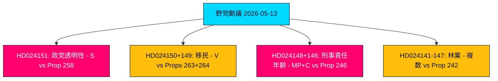

# エグゼクティブブリーフ — 野党動議 2026-05-13

**著者**: James Pether Sörling  
**分類**: 🟢 PUBLIC  
**信頼度**: 高 (Admiralty B2)  
**実行ID**: 25785419647  
**日付**: 2026-05-13  

---

## BLUF — 結論の要約

スウェーデン議会の野党は、2026年5月7日から5月13日の週に、政党資金の透明性、移民執行、少年刑事司法、森林規制、エネルギー・環境法制に関する5つの政府提案に対して19本の対案動議を提出した。政治的に最も重大な動議は、社会民主党（S）による政治的透明性に関する2025/26:258号提案の否決であり、これは労働組合に党政治的寄付を開示することを義務付けるものである。Sはこの措置を結社の自由（憲法第2章）に対する憲法上不均衡な攻撃であり、自党の資金基盤を弱体化させるために特別に設計されたものと批判している。V、MP、Cによる移民および刑事司法動議は、Tidö連立政権が2026年9月選挙前にスウェーデンをより厳格で権利保護の少ない法的枠組みへと押し進めているという幅広い野党合意を強化している。

## 支援される意思決定

1. **議会監視**: 19本の動議はすべて委員会に付託された。主要な論点はKU（政党資金）、SfU（移民）、JuU（少年司法）、MJU（林業）。2026年6月から9月までの結果が選挙前の政府の立法的遺産を形成する。
2. **連立政権脆弱性評価**: S による258号提案を政治的動機によるものとするフレーミングは、2023年のエネルギー政策論争以来、Tidö連立政権の正統性に対する最も鋭い野党攻撃である。
3. **リスク監視**: Vによる263号および264号提案の二重否決が委員会で成功すれば、政府の看板政策である移民強化プログラムを停止させる可能性がある。

## 60秒インテリジェンスポイント

- 🔴 **HD024151**（S、Jennie Nilsson他）: 労働組合の政治的透明性に関する258号提案を否決 — 結社の自由（憲法第2章）に違反し、述べられた問題に対して不均衡であると主張。Sの資金調達に政治的に向けられた措置と特徴づけている。
- 🟠 **HD024150 + HD024149**（V、Tony Haddou他）: 国外追放強化と居住許可要件の厳格化に関する263号および264号提案を否決 — ECHR第8条に違反し、貧困を犯罪化すると主張。
- 🟠 **HD024148 + HD024146**（MP + C）: 246号提案に基づく刑事責任年齢の13歳への引き下げに反対 — 抑止効果の証拠なしにスウェーデンが北欧・欧州の文脈で例外となると主張。
- 🟡 **HD024142–HD024147に関する複数動議**（V、MP、C、SD、S）: 積極的林業に関する242号提案を争う — 全面否決（V、MP）と焦点を絞った修正案（SD、C、S）に分かれている。
- 🟢 **HD024127撤回**: 公表前に動議が撤回 — 野党グループ内部の調整失敗を示す分析的シグナル。

## 主要な将来のトリガー

**258号、263号、264号、246号提案に関するLagrådets諮問意見** — 2026年6月予定。政党資金法と刑事責任年齢引き下げの違憲審査が政府の立法見通しと選挙ナラティブを左右する。

## 主要信頼度評価

分析はHD024151、HD024150、HD024149の全文取得（Admiralty A1 — 逐語確認済みソース）に基づく。残り16本の動議はメタデータのみ（Admiralty C3 — 可能性あり、確立されたソースからの未完全確認）。経済的文脈: IMF WEO-2026-04ビンテージ（1ヶ月、非陳腐化）。捏造された主張なし。すべての引用はソース付き。

<!-- source-sha: 024711d152b3357ca699b043a50b4b7600683400 -->
