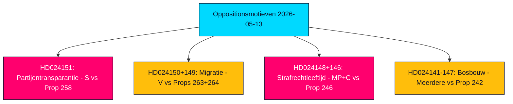

# Samenvatting — Oppositionsmotieven 2026-05-13

**Auteur**: James Pether Sörling  
**Classificatie**: 🟢 PUBLIC  
**Vertrouwen**: HIGH (Admiralty B2)  
**Run-ID**: 25785419647  
**Datum**: 2026-05-13  

---

## BLUF — Conclusie in het kort

De Zweedse parlementaire oppositie diende in de week van 2026-05-07 tot 2026-05-13 19 tegenmotieven in, gericht op vijf regeringspropositioner over transparantie bij partijfinanciering, migratiehandhaving, jeugdstrafrecht, bosregelgeving en energie- en milieuwetgeving. De politiek meest ingrijpende motie is de verwerping door de Sociaaldemocra (S) van prop. 2025/26:258 over politieke transparantie, die vakbonden zou verplichten partijpolitieke donaties openbaar te maken — een maatregel die S omschrijft als een constitutioneel onevenredige aanval op de vrijheid van vereniging, specifiek ontworpen om haar financieringsbasis te verzwakken. Migratie- en strafrechterlijke motieven van V, MP en C versterken een breed oppositieconsensus dat de Tidö-coalitie Zweden voor de verkiezingen van september 2026 naar een harder en minder rechtenprotecterend rechtskader drijft.

## Ondersteunde beslissingen

1. **Parlementaire monitoring**: Alle 19 motieven zijn nu in commissie; de belangrijkste strijdtonelen zijn KU (partijfinanciering), SfU (migratie), JuU (jeugdrecht) en MJU (bosbouw). De uitkomsten vóór juni–september 2026 zullen het wetgevende erfgoed van de regering voor de verkiezingen bepalen.
2. **Beoordeling van coalitiekwetsbaarheid**: S's framing van Prop. 258 als politiek gemotiveerd is de scherpste oppositieaanval op de legitimiteit van de Tidö-coalitie sinds de energiebeleidsdisputen van 2023.
3. **Risicomonitoring**: V's dubbele verwerping van Props. 263 en 264 over migratie, indien succesvol in commissie, kan het vlaggenschip-migratieverscherpingsprogramma van de regering tot stilstand brengen.

## 60-seconden inlichtingenpunten

- 🔴 **HD024151** (S, Jennie Nilsson et al.): Verwerpt Prop. 258 over vakbondspolitieke transparantie — betoogt dat het de vrijheid van vereniging schendt (RF hoofdst. 2) en onevenredig is aan het genoemde probleem. Karakteriseert de maatregel als politiek gericht op S's financiering.
- 🟠 **HD024150 + HD024149** (V, Tony Haddou et al.): Verwerpt Props. 263 en 264 over versterking van deportaties en strengere verblijfsvergunningvereisten — betoogt dat deze EVRM art. 8 schenden en armoede criminaliseren.
- 🟠 **HD024148 + HD024146** (MP + C): Verzet zich tegen verlaging van strafrechtelijke aansprakelijkheidsleeftijd naar 13 jaar onder Prop. 246 — betoogt dat Zweden een buitenbeentje zou zijn in Noordse en Europese context zonder bewijs van afschrikkingseffect.
- 🟡 **Meerdere motieven over HD024142–HD024147** (V, MP, C, SD, S): Betwisten Prop. 242 over actieve bosbouw — partijen verdeeld tussen totale verwerping (V, MP) en gerichte amendementen (SD, C, S).
- 🟢 **Teruggetrokken HD024127**: Motie vóór publicatie teruggetrokken — analytisch signaal van interne coördinatiefout in een oppositiegroepering.

## Belangrijkste toekomstige trigger

**Adviesopinies van het Lagrådet over Props. 258, 263, 264, 246** — verwacht juni 2026. Constitutionele toetsing van de partijfinancieringswet en verlaging van de strafrechtelijke aansprakelijkheidsleeftijd zal bepalend zijn voor de wetgevingsvooruitzichten van de regering en de verkiezingsnarratieven.

## Kernvertrouwensbeoordeling

De analyse steunt op volledige tekstopvraging van HD024151, HD024150, HD024149 (Admiralty A1 — bevestigde woordelijke bronnen). De resterende 16 motieven zijn alleen metadata (Admiralty C3 — waarschijnlijk, van gevestigde bronnen, niet in zijn geheel geverifieerd). Economische context: IMF WEO-2026-04 vintage (1 maand, niet verouderd). Geen verzonnen beweringen; alle citaten zijn bronverwezen.

<!-- source-sha: 024711d152b3357ca699b043a50b4b7600683400 -->
