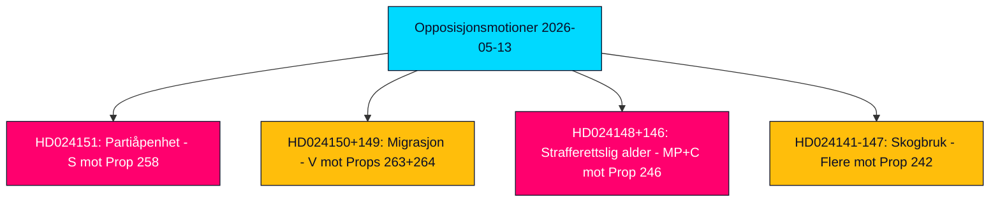

# Kortrapport — Opposisjonsmotioner 2026-05-13

**Forfatter**: James Pether Sörling  
**Klassifisering**: 🟢 PUBLIC  
**Tillit**: HIGH (Admiralty B2)  
**Kjøring-ID**: 25785419647  
**Dato**: 2026-05-13  

---

## BLUF — Konklusjon

Sveriges parlamentariske opposisjon leverte 19 motmotioner i uken fra 2026-05-07 til 2026-05-13, rettet mot fem regjeringsproposisjoner om partifinansering og åpenhet, migrasjonshåndhevelse, ungdomsstrafferett, skogregulering og energi- og miljølovgivning. Den politisk mest konsekvente motionen er Sosialdemokratenes (S) avvisning av prop. 2025/26:258 om politisk åpenhet, som ville tvinge fagforeninger til å offentliggjøre partipolitiske donasjoner — et tiltak S karakteriserer som et konstitusjonelt uforholdsmessig angrep på foreningsfriheten designet spesifikt for å svekke dens finansieringsbase. Migrasjons- og strafferettslige motioner fra V, MP og C forsterker en bred opposisjonskonsensus om at Tidö-koalisjonen driver Sverige mot et hardere og mindre rettighetsverndende juridisk rammeverk foran valget i september 2026.

## Støttede beslutninger

1. **Parlamentarisk overvåking**: Alle 19 motioner er nå i komité; de viktigste kampsonene er KU (partifinansering), SfU (migrasjon), JuU (ungdomsjuss) og MJU (skogbruk). Utfallene innen juni–september 2026 vil forme regjeringens lovgivningsarv foran valget.
2. **Vurdering av koalisjonssårbarhet**: S sin framing av prop. 258 som politisk motivert er det skarpeste opposisjonangrepet på Tidö-koalisjonens legitimitet siden energipolitikkdisputene i 2023.
3. **Risikoovervåking**: V sin doble avvisning av prop. 263 og 264 om migrasjon, hvis vellykket i komité, kan stanse regjeringens flaggskipsprogram for migrasjonsstramning.

## 60-sekunders etterretningspunkter

- 🔴 **HD024151** (S, Jennie Nilsson m.fl.): Avviser prop. 258 om faglig politisk åpenhet — hevder den krenker foreningsfrihet (RF kap. 2) og er uforholdsmessig i forhold til det angitte problemet. Karakteriserer tiltaket som politisk rettet mot S sin finansiering.
- 🟠 **HD024150 + HD024149** (V, Tony Haddou m.fl.): Avviser prop. 263 og 264 om deportasjonstyrking og strengere krav til oppholdstillatelsesadferd — hevder disse bryter EMK art. 8 og kriminaliserer fattigdom.
- 🟠 **HD024148 + HD024146** (MP + C): Motsetter seg senking av strafferettslig lavalder til 13 år under prop. 246 — hevder Sverige ville være en avviker i nordisk og europeisk kontekst uten bevis for avskrekkingseffekt.
- 🟡 **Flere motioner om HD024142–HD024147** (V, MP, C, SD, S): Utfordrer prop. 242 om aktivt skogbruk — partiene delt mellom total avvisning (V, MP) og målrettede endringer (SD, C, S).
- 🟢 **Tilbaketrukket HD024127**: Mosjon trukket tilbake før publisering — analytisk signal om intern koordineringsfeil i en opposisjonsgruppert.

## Viktigste fremtidige utløser

**Lagrådets rådgivende uttalelser om prop. 258, 263, 264, 246** — forventet juni 2026. Konstitusjonell gjennomgang av partifinansieringsloven og senking av strafferettslig lavalder vil være avgjørende for regjeringens lovgivningsutsikter og valgnarrativene.

## Nøkkeltillitsvurdering

Analysen bygger på fullteksthenting av HD024151, HD024150, HD024149 (Admiralty A1 — bekreftede ordrett kilder). De resterende 16 motionene er kun metadata (Admiralty C3 — sannsynlige, fra etablerte kilder, ubekreftede i sin helhet). Økonomisk kontekst: IMF WEO-2026-04 vintage (1 måned, ikke utdatert). Ingen fabrikerte påstander; alle sitater er kildehenvisninger.

<!-- source-sha: 024711d152b3357ca699b043a50b4b7600683400 -->
