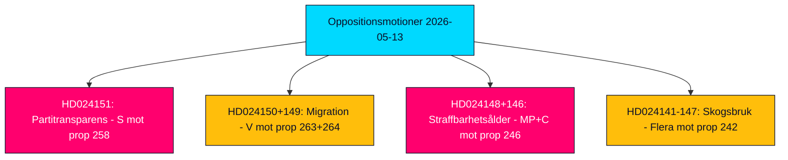

# Verkställande sammanfattning — Oppositionsmotioner 2026-05-13

**Författare**: James Pether Sörling  
**Klassificering**: 🟢 PUBLIC  
**Konfidens**: HIGH (Admiralty B2)  
**Kör-ID**: 25785419647  
**Datum**: 2026-05-13  

---

## BLUF — Slutsats i korthet

Sveriges parlamentariska opposition lämnade 19 motmotioner under veckan 2026-05-07 till 2026-05-13, inriktade på fem regeringspropositioner om partifinansiering och öppenhet, migrationsverkställighet, ungdomsbrottsrätt, skogsreglering och energi- och miljölagstiftning. Den politiskt mest konsekventa motionen är Socialdemokraternas (S) avvisande av prop. 2025/26:258 om politisk öppenhet, som skulle tvinga fackföreningar att redovisa partianhängiga donationer — en åtgärd S karakteriserar som ett konstitutionellt oproportionerligt angrepp på föreningsfriheten utformat specifikt för att försvaga dess finansieringsbas. Migrations- och straffrättsmotioner från V, MP och C förstärker en bred oppositionskonsensus om att Tidökoalitionen driver Sverige mot ett hårdare och mindre rättsskyddande rättsramverk inför valet i september 2026.

## Stödda beslut

1. **Parlamentarisk bevakning**: Alla 19 motioner är nu i utskott; de viktigaste stridsfälten är KU (partifinansering), SfU (migration), JuU (ungdomsrätt) och MJU (skogsbruk). Utfallen fram till juni–september 2026 kommer att forma regeringens lagstiftningsarv inför valet.
2. **Bedömning av koalitionssårbarhet**: S:s framställning av prop. 258 som politiskt motiverad är det skarpaste oppositionsangreppet på Tidökoalitionens legitimitet sedan energipolitikdispyterna 2023.
3. **Riskspårning**: V:s dubbla avvisning av prop. 263 och 264 om migration, om framgångsrik i utskott, kan bromsa regeringens flaggskepp för migrationsåtstramning.

## 60-sekunders underrättelsekulor

- 🔴 **HD024151** (S, Jennie Nilsson m.fl.): Avvisar prop. 258 om facklig politisk öppenhet — hävdar att den bryter mot föreningsfriheten (RF kap. 2) och är oproportionerlig mot det angivna problemet. Karakteriserar åtgärden som politiskt riktad mot S:s finansiering.
- 🟠 **HD024150 + HD024149** (V, Tony Haddou m.fl.): Avvisar prop. 263 och 264 om deportationsstärkning och striktare krav på uppehållstillstånds uppförande — hävdar att dessa bryter mot ECHR art. 8 och kriminaliserar fattigdom.
- 🟠 **HD024148 + HD024146** (MP + C): Motsätter sig sänkning av straffbarhetsåldern till 13 år under prop. 246 — hävdar att Sverige skulle vara en avvikare i nordisk och europeisk kontext utan bevis för avskräckningseffekt.
- 🟡 **Flera motioner om HD024142–HD024147** (V, MP, C, SD, S): Utmanar prop. 242 om aktivt skogsbruk — partierna delade mellan fullständigt avvisande (V, MP) och riktade ändringar (SD, C, S).
- 🟢 **Tillbakadragen HD024127**: Motion tillbakadragen innan publicering — analytisk signal om intern koordineringsfel i en oppositionsgruppering.

## Viktigaste framåtblickande trigger

**Lagrådets rådgivande yttranden om prop. 258, 263, 264, 246** — förväntat juni 2026. Konstitutionell granskning av partifinansieringslagen och sänkning av straffbarhetsåldern kommer att vara avgörande för regeringens lagstiftningsutsikter och valnarrativen.

## Nyckelkonfidensbedömning

Analysen bygger på fullständig texthämtning av HD024151, HD024150, HD024149 (Admiralty A1 — bekräftade ordagranna källhänvisningar). Återstående 16 motioner är enbart metadata (Admiralty C3 — troliga, från etablerade källor, overifierade i sin helhet). Ekonomisk kontext: IMF WEO-2026-04-vintage (1 månad, ej inaktuell). Inga fabricerade påståenden; alla citat är källhänvisade.

<!-- source-sha: 024711d152b3357ca699b043a50b4b7600683400 -->
