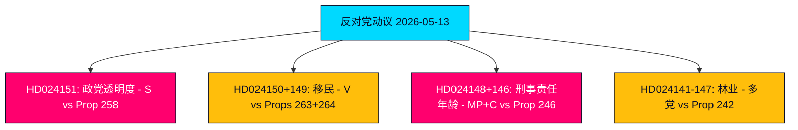

# 执行摘要 — 反对党动议 2026-05-13

**作者**: James Pether Sörling  
**分类**: 🟢 公开  
**置信度**: 高 (Admiralty B2)  
**运行ID**: 25785419647  
**日期**: 2026-05-13  

---

## BLUF — 核心结论

2026年5月7日至13日这周，瑞典议会反对党提交了19项反对动议，针对政府关于政党资金透明度、移民执法、青少年刑事司法、森林法规以及能源与环境立法的五项提案。政治上最具影响力的动议是社会民主党（S）否决关于政治透明度的2025/26:258号提案——该提案将强制要求工会披露政党政治捐款。S将此措施定性为对结社自由（宪法第二章）的宪法上不相称的攻击，专门设计用于削弱其资金基础。V、MP和C的移民和刑事司法动议强化了一个广泛的反对党共识：Tidö联合政府正在2026年9月大选前将瑞典推向更严苛、对权利保护更弱的法律框架。

## 支持的决策

1. **议会监测**：19项动议均已提交委员会；主要战线为KU（政党资金）、SfU（移民）、JuU（青少年司法）和MJU（林业）。2026年6月至9月之前的结果将塑造政府大选前的立法遗产。
2. **联合政府脆弱性评估**：S将258号提案定性为政治驱动，是自2023年能源政策争端以来对Tidö联合政府合法性最尖锐的反对党攻击。
3. **风险监测**：V对263号和264号移民提案的双重否决若在委员会成功，可能使政府的标志性移民强化计划陷入停滞。

## 60秒情报要点

- 🔴 **HD024151**（S，Jennie Nilsson等）：否决关于工会政治透明度的258号提案——主张该提案违反结社自由（宪法第二章），且与所述问题不相称。将该措施定性为政治上针对S资金来源。
- 🟠 **HD024150 + HD024149**（V，Tony Haddou等）：否决关于加强驱逐出境和严格居留许可要求的263号和264号提案——主张这些提案违反《欧洲人权公约》第8条并将贫困犯罪化。
- 🟠 **HD024148 + HD024146**（MP + C）：反对根据246号提案将刑事责任年龄降至13岁——主张在没有威慑效果证据的情况下，瑞典将成为北欧和欧洲背景下的例外。
- 🟡 **HD024142–HD024147相关多项动议**（V、MP、C、SD、S）：质疑关于积极林业的242号提案——各党派分为全面否决（V、MP）和有针对性的修正案（SD、C、S）。
- 🟢 **HD024127撤回**：动议在发布前被撤回——反对党团体内部协调失败的分析信号。

## 主要前瞻性触发因素

**Lagrådet关于258号、263号、264号、246号提案的咨询意见** — 预计2026年6月。政党资金法和刑事责任年龄下调的违宪审查将对政府的立法前景和选举叙事具有决定性影响。

## 核心置信度评估

分析基于HD024151、HD024150、HD024149的全文检索（Admiralty A1 — 确认的逐字来源）。其余16项动议仅为元数据（Admiralty C3 — 可能，来自既定来源，未完全核实）。经济背景：IMF WEO-2026-04年份（1个月，未过时）。无捏造声明；所有引用均有来源。

<!-- source-sha: 024711d152b3357ca699b043a50b4b7600683400 -->
