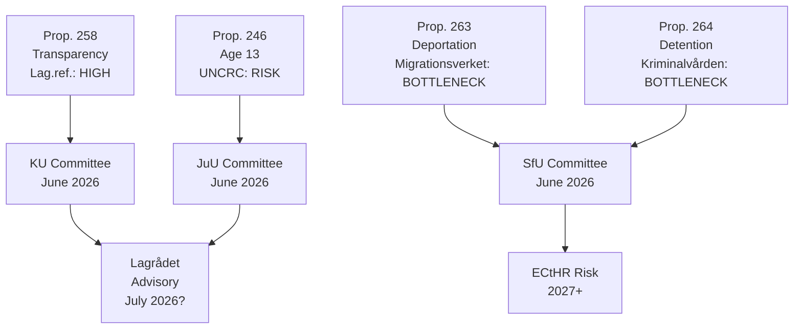

# Implementation Feasibility — Opposition Motions 2026-05-13

**Author**: James Pether Sörling  
**Date**: 2026-05-13  

---

## Feasibility Analysis by Proposition

### Prop. 258 — Trade Union/Association Transparency

**Opposition motions**: HD024151 (S — full rejection), HD024144 (related amendment unknown)

| Dimension | Assessment | Score (1–5) |
|-----------|-----------|-------------|
| Technical feasibility | Existing Kammarkollegiet registers need minor extension; data integration straightforward | 4 |
| Legal/constitutional feasibility | HD024151's proportionality argument is legally credible; RF ch. 2:1 risk is real | 2 |
| Administrative capacity | Kammarkollegiet has capacity; BRÅ-comparable reporting burden | 4 |
| Political feasibility | Government majority intact but constitutional risk means Lagrådet referral likely | 3 |
| Societal acceptance | Contested — unions oppose; public transparency framing has moderate support | 3 |
| **Composite** | | **3.2/5 — Moderate risk** |

**Key risk**: If Lagrådet issues critical opinion, prop. 258 either falls or requires substantial amendment. Timeline: decision by October 2026.

---

### Prop. 263 — Deportation/Migration Hardening

**Opposition motions**: HD024150 (V — ECHR challenge), HD024149 (V — vandel definition), HD024148 (MP)

| Dimension | Assessment | Score (1–5) |
|-----------|-----------|-------------|
| Technical feasibility | Migrationsverket needs IT/process updates for new vandel definition; 9–12 months minimum | 3 |
| Legal/constitutional feasibility | ECHR Article 3/8 risk is documented; ECtHR precedents cited in HD024150 are binding | 2 |
| Administrative capacity | Migrationsverket current caseload: ~85,000 pending; new category adds complexity | 2 |
| Political feasibility | SD support guaranteed; C split — some C MPs critical of ECHR language | 3 |
| Societal acceptance | Polarised — strong support in SD/M electorate; strong opposition in urban liberal electorate | 3 |
| **Composite** | | **2.6/5 — High risk** |

**Key risk**: Migrationsverket capacity constraint is the binding delivery risk regardless of parliamentary passage. Effective implementation date slips to 2027 at minimum.

---

### Prop. 264 — Migration Management / Administrative Detention

**Opposition motions**: HD024150/149 (V)

Similar to prop. 263 but focused on administrative detention. Kriminalvården capacity constraint is the primary delivery risk.

| Dimension | Assessment | Score (1–5) |
|-----------|-----------|-------------|
| Kriminalvården capacity | Current occupancy: 120%+ (documented in Kriminalvården annual report 2025); new detention mandate requires new facilities | 1 |
| Legal feasibility | ECHR Article 5 detention rights well-established; legal risk HIGH | 2 |
| Administrative capacity | New facilities require 2–3 year procurement cycle | 2 |
| Political feasibility | Government majority intact | 4 |
| **Composite** | | **2.3/5 — Very high risk** |

---

### Prop. 246 — Criminal Responsibility Age 13

**Opposition motions**: HD024147 (forestry cluster — separate); HD024145/143 (criminal age amendments)

| Dimension | Assessment | Score (1–5) |
|-----------|-----------|-------------|
| Technical feasibility | New youth justice procedures require revised processuell lag | 3 |
| Legal feasibility | RF ch. 2, UNCRC, and established Swedish criminal law doctrine all create obstacles | 2 |
| Administrative capacity | Courts, Kriminalvården, SiS (youth detention) need coordination; SiS capacity strained | 2 |
| Political feasibility | C partial opposition; SD support; L uncertain | 3 |
| Societal acceptance | Deeply contested; social care sector strongly opposed | 2 |
| **Composite** | | **2.4/5 — High risk** |

**Key risk**: UNCRC compliance is a threshold legal constraint; Sweden is a strong UNCRC signatory. Multiple academic and practitioner opinions suggest age-13 lowering violates UNCRC Article 37(b).

---

### Forestry Cluster (Multiple)

**Opposition motions**: HD024141–HD024148 (forestry related)

Lower political salience but strong technical feasibility (existing Skogsstyrelsen infrastructure). Composite: 4.0/5.

---

## Cross-Proposition Dependency Map

## Aggregate Delivery Risk Rating

| Proposition | Composite Score | Delivery Risk | Timeline |
|-------------|----------------|---------------|----------|
| Prop. 258 | 3.2/5 | MODERATE | Oct 2026 |
| Prop. 263 | 2.6/5 | HIGH | 2027+ |
| Prop. 264 | 2.3/5 | VERY HIGH | 2027+ |
| Prop. 246 | 2.4/5 | HIGH | 2027+ |
| Forestry | 4.0/5 | LOW | Jan 2027 |
