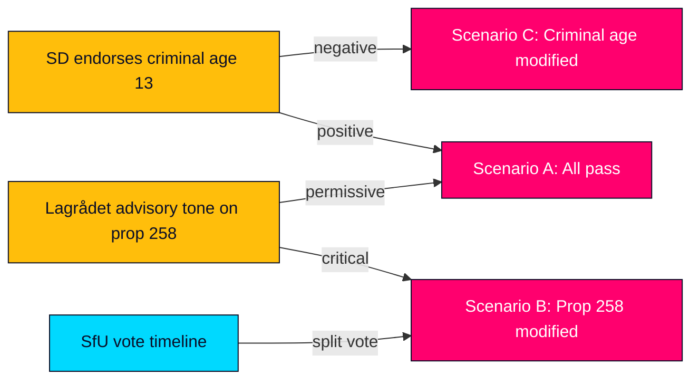

# Scenario Analysis — Opposition Motions 2026-05-13

**Author**: James Pether Sörling  
**Date**: 2026-05-13  

---

## Scenario Tree (4 scenarios, probabilities sum to 100%)

### Scenario A: Government Passes All 5 Propositions Unchanged (P=35%)

**Description**: The Tidö coalition maintains discipline. SD votes with M/KD/L on all five proposition clusters. Lagrådet reviews but finds no blocking constitutional defect in prop. 258. All motions are defeated in committee.  
**Leading indicator**: SD publicly endorses criminal age 13 (expected June 2026).  
**Election impact**: Government claims legislative mandate; S narrative of "partisan manipulation" weakens without Lagrådet validation.  
**Confidence**: MODERATE (C3)

### Scenario B: Lagrådet Forces Modification of Prop. 258 (P=30%)

**Description**: Lagrådet issues a critical advisory on prop. 258 arguing the law is disproportionate under RF ch. 2:1. Government must either withdraw or substantially amend. S's characterisation is partially vindicated. This is the most election-consequential outcome.  
**Leading indicator**: Lagrådet advisory published June–July 2026 with critical tone.  
**Election impact**: S gains narrative advantage; "Tidö targets democracy" becomes viable attack line.  
**Confidence**: MODERATE (C2)

### Scenario C: Criminal Age Provision Modified or Withdrawn (P=25%)

**Description**: SD has reservations on lowering criminal age to 13. JuU negotiation produces compromise (e.g., age 14 instead of 13) or the provision is removed from prop. 246. MP and C file partial victory in committee reservation.  
**Leading indicator**: SD spokesperson signals flexibility on age 13 (no such signal as of 2026-05-13).  
**Election impact**: Opposition demonstrates negotiating power; government seen as moderating extremes.  
**Confidence**: LOW-MODERATE (D3)

### Scenario D: Multiple Propositions Modified + Coalition Friction (P=10%)

**Description**: Multiple Lagrådet advisories, SD defections on juvenile justice and/or forestry, and SfU amendments combine to produce a legislative crisis for the Tidö coalition. Government forced to withdraw elements, creating internal M/KD/SD/L friction visible in media.  
**Leading indicator**: Two or more committee minority reservations across different clusters simultaneously.  
**Election impact**: Tidö coalition governance quality severely questioned; S leads in pre-election polls.  
**Confidence**: LOW (D4)

## Probability Summary

| Scenario | Probability | Admiralty Confidence |
|----------|------------|---------------------|
| A: All 5 pass | 35% | C3 |
| B: Prop. 258 modified | 30% | C2 |
| C: Criminal age modified | 25% | D3 |
| D: Multiple failures | 10% | D4 |
| **Total** | **100%** | |

## Leading Indicators Dashboard

