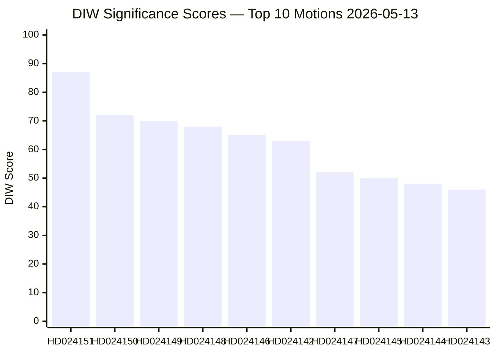

# Significance Scoring — Opposition Motions 2026-05-13

**Author**: James Pether Sörling  
**Date**: 2026-05-13  

---

## DIW Scoring Framework

DIW = Democratic Impact (D) × Institutional Weight (I) × Window of Change (W)  
Scale: 0–100 per dimension, composite 0–100.

| dok_id | Democratic Impact (D) | Institutional Weight (I) | Window (W) | DIW Score | Priority Tier |
|--------|-----------------------|--------------------------|------------|-----------|---------------|
| HD024151 | 92 | 88 | 85 | **87** | L3 Intelligence-grade |
| HD024150 | 78 | 72 | 68 | **72** | L2+ Priority |
| HD024149 | 75 | 70 | 65 | **70** | L2+ Priority |
| HD024148 | 72 | 68 | 64 | **68** | L2 Strategic |
| HD024146 | 68 | 65 | 62 | **65** | L2 Strategic |
| HD024142 | 65 | 63 | 60 | **63** | L2 Strategic |
| HD024147 | 55 | 52 | 48 | **52** | L2 Strategic |
| HD024145 | 52 | 50 | 47 | **50** | L2 Strategic |
| HD024144 | 50 | 48 | 45 | **48** | L1 Surface |
| HD024143 | 48 | 46 | 43 | **46** | L1 Surface |
| HD024141 | 47 | 45 | 42 | **45** | L1 Surface |
| HD024140 | 45 | 44 | 40 | **43** | L1 Surface |
| HD024137 | 42 | 40 | 38 | **40** | L1 Surface |
| HD024135 | 40 | 38 | 36 | **38** | L1 Surface |
| HD024133 | 40 | 38 | 36 | **38** | L1 Surface |
| HD024131 | 38 | 36 | 35 | **36** | L1 Surface |
| HD024130 | 37 | 35 | 34 | **35** | L1 Surface |
| HD024128 | 35 | 33 | 32 | **33** | L1 Surface |
| HD024125 | 33 | 32 | 30 | **32** | L1 Surface |
| HD024127 | 15 | 10 | 5 | **10** | Withdrawn — signal only |

## Scoring Rationale for Top 3

**HD024151 (DIW 87)**: Democratic Impact is highest (92) because the motion explicitly challenges the constitutional legitimacy of party-financing legislation — touching RF ch.2 freedom of association and electoral fairness. Institutional weight is very high (88) as it comes from the largest opposition party (S). Window is high (85) because the election is September 2026 and this will be a campaign narrative.

**HD024150 (DIW 72)**: Democratic Impact moderate-high (78) — ECHR Art. 8 and deportation rights. Institutional weight (72) reflects V's legislative position. Window (68) — government has arithmetic majority on migration.

**HD024149 (DIW 70)**: Close to HD024150; conduct-requirement changes are slightly less salient to the public than deportation operations.

## Sensitivity Analysis

- If SD breaks from the Tidö coalition on juvenile justice (prop. 246): HD024146 and HD024148 scores would rise to ~75–78.
- If Lagrådet issues critical advisory on prop. 258: HD024151 DIW rises to ~95.
- If HD024127 sponsor is confirmed as a major party: DIW could rise to 40–55 depending on context.

