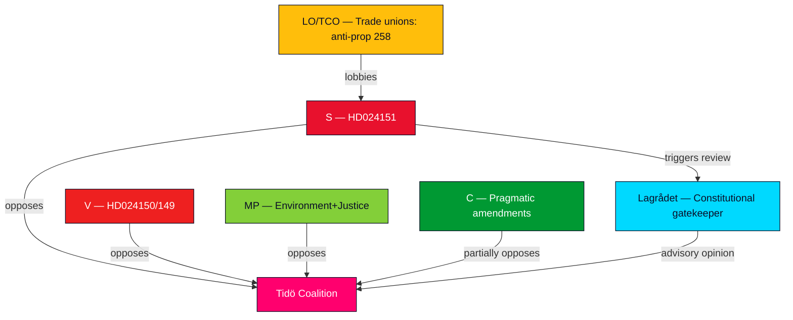

# Stakeholder Perspectives — Opposition Motions 2026-05-13

**Author**: James Pether Sörling  
**Date**: 2026-05-13  

---

## 6-Lens Stakeholder Matrix

### 1. Government Actors (Tidö Coalition — M/KD/SD/L)

**Primary interest**: Pass all 5 propositions; defend against legitimacy attacks; complete legislative programme before September 2026 election.  
**Position on key motions**:
- Prop. 258: Government will argue existing transparency is insufficient; new law is proportionate.
- Props. 263/264: Government frames as migration management, not rights violation.
- Prop. 246: Government argues lower criminal age needed for crime deterrence (gang-related).
- Prop. 242: Government defends active forestry as necessary for Swedish industry.

**Influence lever**: Parliamentary majority (Tidö: 175–176 seats, estimated) provides procedural dominance.

### 2. Socialdemokraterna (S)

**Primary interest**: Delegitimise prop. 258; protect party financing structures; establish election narrative.  
**Named actors**: Jennie Nilsson, Hans Ekström, Mirja Räihä, Per-Arne Håkansson, Peter Hedberg, Lena Malm (HD024151 signatories)  
**Influence lever**: Largest opposition party (approx. 92–95 seats); controls narrative in left-bloc; Lagrådet advisory will amplify their position.

### 3. Vänsterpartiet (V)

**Primary interest**: Differentiate V from S on migration; protect ECHR-based rights position; build pre-election identity.  
**Named actors**: Tony Haddou (HD024150, HD024149, HD024135, HD024133), Gudrun Nordborg, Malcolm Momodou Jallow  
**Influence lever**: ~24 seats; critical in SfU and JuU committee formations.

### 4. Miljöpartiet (MP)

**Primary interest**: Environmental and rights-based opposition (forestry + juvenile justice + environment).  
**Named actors**: Rebecka Le Moine (HD024147), Ulrika Westerlund (HD024148), Emma Nohrén (HD024131), Linus Lakso (HD024130)  
**Influence lever**: ~22 seats; coordinates with V and sometimes C on cross-bloc motions.

### 5. Centerpartiet (C)

**Primary interest**: Pragmatic amendments rather than outright rejection; maintain centrist credibility.  
**Named actors**: Helena Lindahl (HD024145 forestry), Ulrika Liljeberg (HD024146 juvenile), Aylin Nouri (HD024125 harbour), Rickard Nordin (HD024137 wind), Helena Vilhelmsson (HD024140 violence strategy)  
**Influence lever**: ~24 seats; pivotal in MJU and JuU if SD wobbles; C's partial opposition on juvenile age creates cross-bloc dynamics.

### 6. Civil Society / Interest Groups

**Trade unions (LO/TCO/SACO)**: Directly affected by prop. 258. LO has strong interest in opposing mandatory disclosure of political donations. Will support S position publicly and potentially legally challenge if prop. 258 passes.  
**Environmental NGOs (Naturskyddsföreningen, WWF Sverige)**: Align with MP/V forestry motions (HD024147, HD024141, HD024131).  
**Children's rights organisations (BRIS, Save the Children Sweden)**: Will amplify MP and C opposition to criminal age 13 (HD024148, HD024146).  
**Legal profession (Advokatsamfundet)**: V's ECHR Art. 8 arguments on migration likely align with bar association positions.

## Influence Network Diagram

