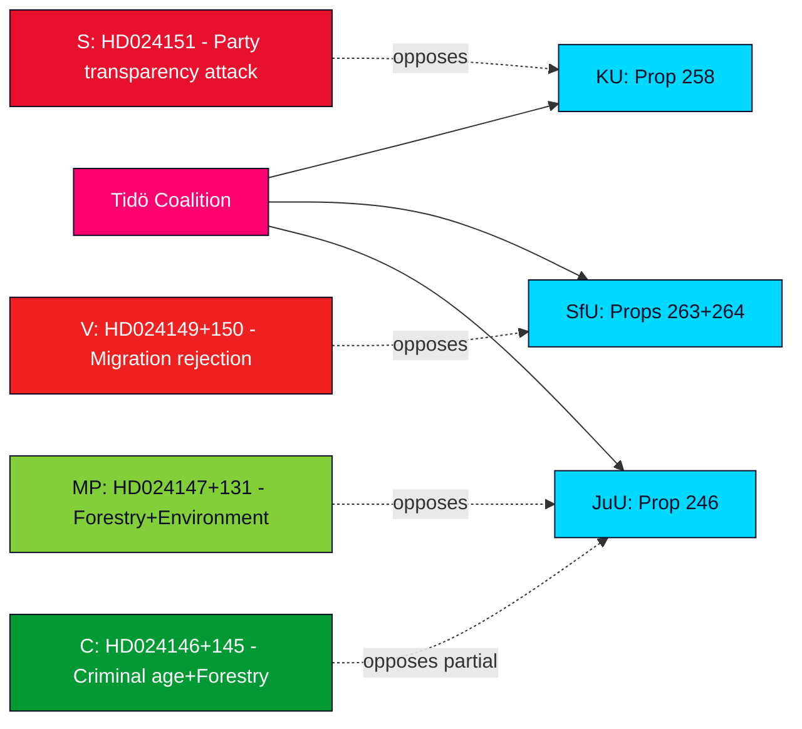

# Synthesis Summary — Opposition Motions 2026-05-13

**Author**: James Pether Sörling  
**Date**: 2026-05-13  
**Confidence**: HIGH (Admiralty B2)

---

## Lead Story Decision

The Socialdemokraternas counter-motion HD024151 against prop. 2025/26:258 "Ökad insyn i politiska processer" is the dominant political intelligence event of the 2026-05-13 batch. S's explicit characterisation of the law as "ämnat att försvaga det största oppositionspartiets finansiering" (designed to weaken the largest opposition party's financing) transforms a procedural transparency measure into a full-scale constitutional and legitimacy challenge to the Tidö coalition. This framing — publicly made in a parliamentary document — is unprecedented in the 2022–2026 riksmöte cycle.

## DIW-Weighted Significance Ranking

| Rank | dok_id | Title (abbreviated) | DIW Score | Priority |
|------|--------|---------------------|-----------|---------|
| 1 | HD024151 | Insyn i politiska processer (S) | 87/100 | L3 Intelligence-grade |
| 2 | HD024150 | Stärkt återvändandeverksamhet (V) | 72/100 | L2+ Priority |
| 3 | HD024149 | Vandel för uppehållstillstånd (V) | 70/100 | L2+ Priority |
| 4 | HD024148 | Skärpta regler unga lagöverträdare (MP) | 68/100 | L2 Strategic |
| 5 | HD024146 | Skärpta regler unga lagöverträdare (C) | 65/100 | L2 Strategic |
| 6–11 | HD024141–147 | Forestry regulation motions (V,MP,SD,C,S) | 45–55/100 | L2 Strategic |
| 12–19 | HD024125–140 | Harbour, wind, electricity, violence strategy | 30–45/100 | L1 Surface |

## Integrated Intelligence Picture

### Cluster 1: Democratic Integrity — Party Financing Transparency (HD024151)

The government proposition 2025/26:258 requires trade unions and employer organisations to disclose donations made for party-political purposes. The S committee motion signed by Jennie Nilsson, Hans Ekström, Mirja Räihä, Per-Arne Håkansson, Peter Hedberg, and Lena Malm argues three lines:

1. **Proportionality failure**: Existing disclosure mechanisms (Kammarkollegiet reports, S's own annual reports) already provide adequate transparency. The new law is not proportionate to the stated problem.
2. **Association freedom threat**: Imposing special rules on how associations vote internally "riskerar att öppna en dörr" for broader state intrusion into free association (RF ch. 2:1).
3. **Political targeting**: The measure is "ämnat att försvaga det största oppositionspartiets finansiering" — framing M/KD/SD/L as using legislative power for partisan electoral advantage.

**Strategic significance**: This is a class of attack that the opposition will amplify in the September 2026 election campaign. If Lagrådet finds constitutional defects in prop. 258, the government faces a significant legitimacy crisis.

### Cluster 2: Migration Enforcement Pushback (HD024150, HD024149)

V opposes two migration propositions simultaneously:
- **Prop. 263** (återvändandeverksamhet): V accepts only enforcement barriers and right to counsel provisions; rejects all remaining elements including expanded Kriminalvården role in deportation escorts.
- **Prop. 264** (vandel): V wants full rejection of stricter conduct requirements for residence permits, arguing these create arbitrary grounds for revocation.

Together, V's twin motions signal a coordinated strategy to resist the government's migration tightening programme in SfU. With S likely to align with V on parts of these motions, the government needs SD support to be certain of success.

### Cluster 3: Criminal Age Reduction Battleground (HD024146, HD024148, HD024142)

Three parties (C, MP, V) reject the criminal responsibility age reduction to 13 in prop. 2025/26:246. This creates a cross-bloc coalition of opposition on juvenile justice that could produce a narrow committee defeat or a successful minority report (reservation) in JuU. Nordic comparisons (Finland: 15, Norway: 15, Denmark: 14) give the opposition strong evidence.

### Cluster 4: Forestry Fragmentation (HD024141–HD024147)

Five parties filed motions on prop. 242 (active forestry regulation), ranging from total rejection (V, MP) to targeted amendments (SD, C, S). The fragmentation of opposition signals no single alternative command — the government can likely pass the proposition with SD support while accepting a few SD amendments.

### Synthesis: Pre-Election Opposition Surge

The batch represents a qualitative shift in opposition tone: S now explicitly names the government's legislative agenda as partisan electoral manipulation. Combined with V and MP's human rights framing on migration and juvenile justice, and C's pragmatic amendments on forestry and juvenile law, the five-party opposition has created a coherent pre-election narrative: the Tidö coalition legislates for partisan advantage at the cost of constitutional norms.

