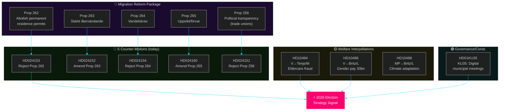
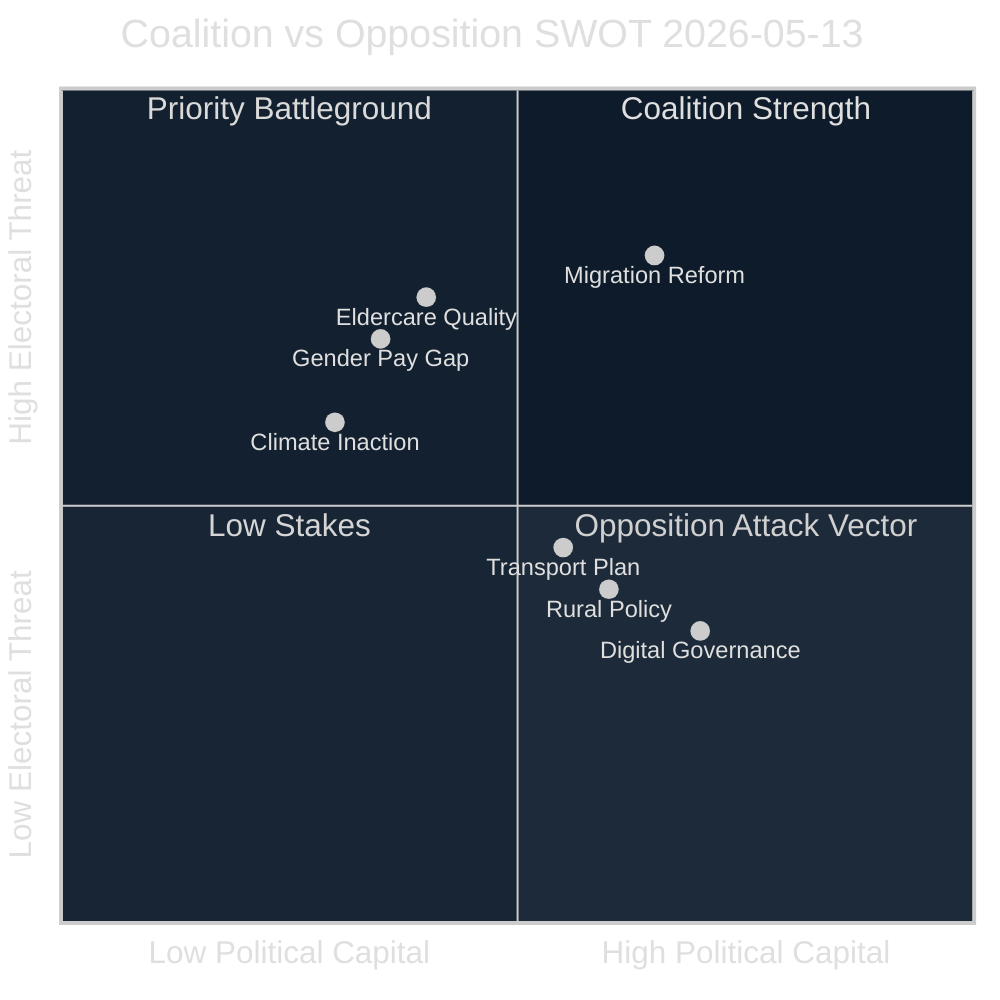
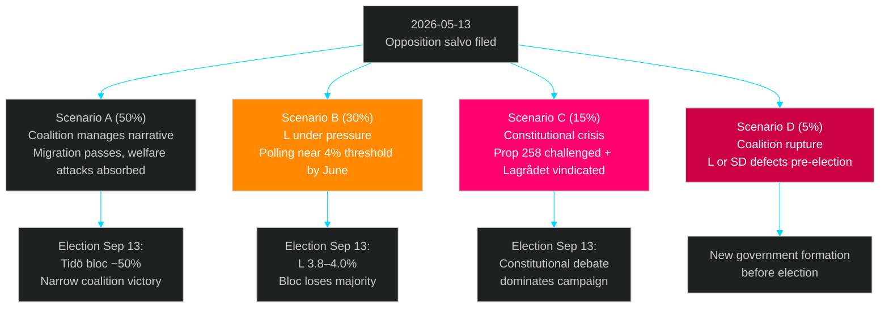
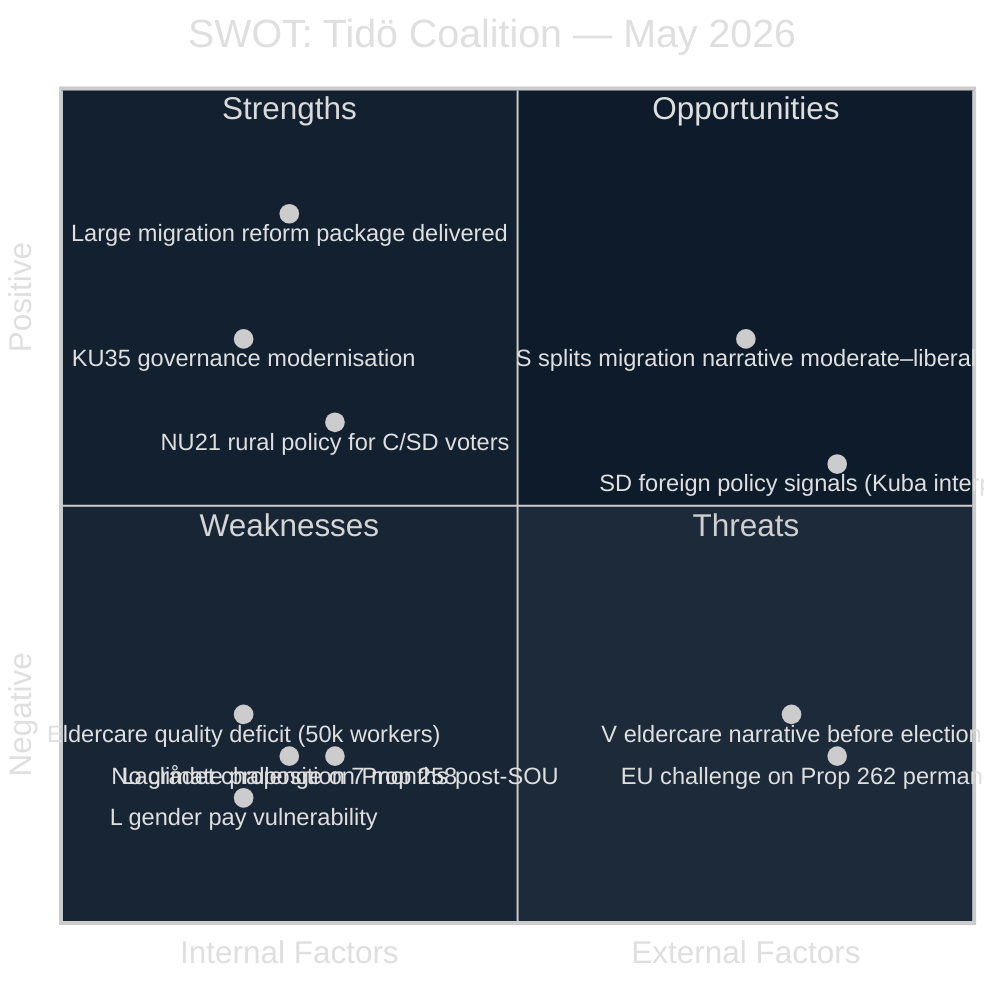
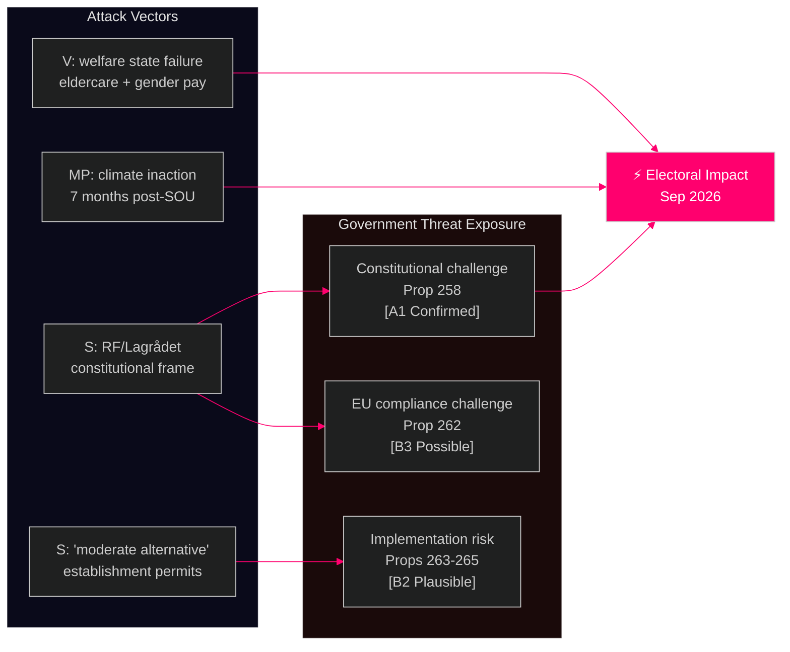
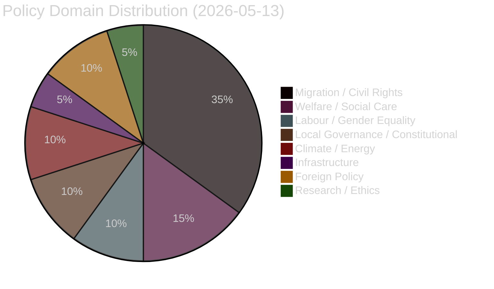
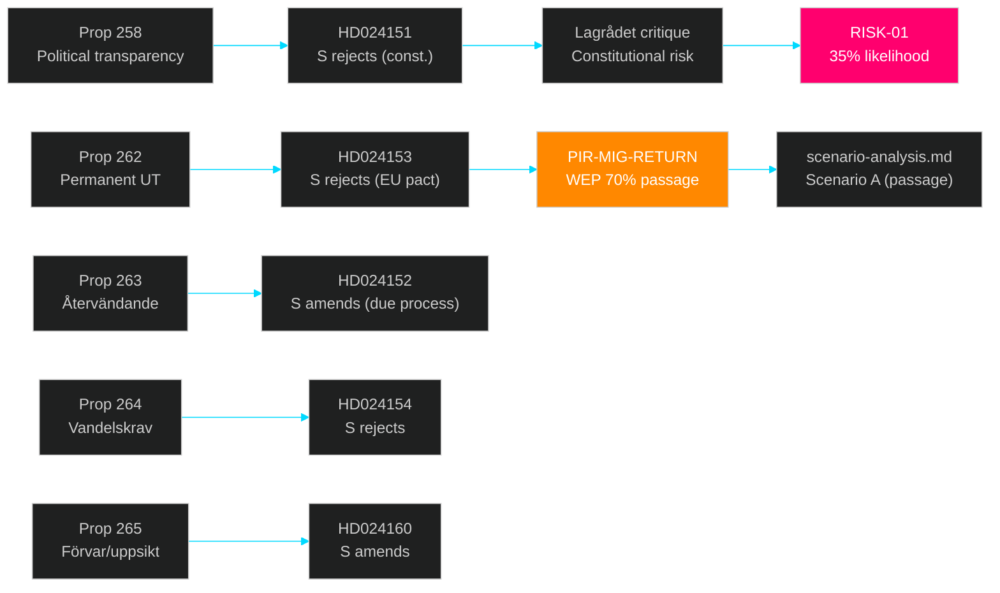

## Executive Brief
<!-- source: executive-brief.md :: https://github.com/Hack23/riksdagsmonitor/blob/main/analysis/daily/2026-05-13/realtime-pulse/executive-brief.md -->

**BLUF**: On 13 May 2026, the Swedish opposition (S + C + V + MP) launched a coordinated pre-election parliamentary offensive: Center Party (C) filed four migration counter-motions (HD024157/159/160/161) joining Social Democrats (S)'s six motions challenging the migration reform package (Props 2025/26:258, 262, 263, 264, 265) on constitutional and child-rights grounds — creating a broader opposition front than initially assessed. Two V interpellations targeted M and L ministers on eldercare and gender pay, an MP interpellation pressed on absent climate legislation, and KU35 on digital municipal governance reached plenary. The aggregate signal: migration opposition is not merely a left-wing narrative but extends into centrist parties on human rights grounds, and the combined opposition covers welfare, climate, and constitutional accountability — a triangulation that threatens moderate voters from both directions.

**Three decisions this brief supports**:
1. **Editorial lead**: Migration package opposition salvo (HD024151-HD024162) vs. eldercare interpellation (HD10484) — both L3 priority; recommend dual-track article with migration as primary frame and welfare as secondary frame.
2. **PIR status update**: PIR-MIG-RETURN advances (S motions filed → SfU committee now has opposition brief), PIR-ELDER-2026 advances (interpellation filed, ministerial response due 29 May), PIR-GENDERPAY-2026 advances (interpellation filed to Britz/L). None closed.
3. **Forward-watch**: HD01KU35 (KU35 digital municipal meetings) reaches plenary debate today — watch for S/V opposition votes on private performer oversight provisions.

### 60-Second Read (8 bullets)

1. **Migration reform opposition** [CRITICAL]: S filed six committee motions (HD024151–HD024162) AND Center Party (C) filed four motions (HD024157, HD024159, HD024160, HD024161) against Props 258/262/263/264/265 — widening the opposition coalition. S uses constitutional framing (Lagrådet's "bräckligt" finding); C uses child-rights and proportionality framing. This is a multi-party opposition axis. [Source: HD024151, HD024153, HD024157, HD024160, 2026-05-13T09:45–14:22Z]
2. **Eldercare accountability** [HIGH]: V interpellation HD10484 (Nadja Awad→Anna Tenje/M) documents eldercare fraud, 50,000 worker shortage, and quality failures by private operators — ministerial response due 29 May. [Source: HD10484, 2026-05-13T10:58Z]
3. **Gender pay gap** [HIGH]: V interpellation HD10486 (Awad→Johan Britz/L) demands government back 30 mdr SEK women's wage lift outside "märket" — directly targeting L's market-wage ideology. [Source: HD10486, 2026-05-13T10:58Z]
4. **KU35 digital governance** [HIGH]: KU35 betänkande reaches plenary on 13 May — improves digital municipal meeting rules and strengthens oversight of private welfare providers in municipalities. [Source: HD01KU35, 2026-05-13T09:14Z]
5. **Climate inaction signal** [MEDIUM]: MP interpellation HD10488 (Katarina Luhr→Britz/L) notes climate adaptation SOU published spring 2025, remiss closed October 2025, still no proposition. PIR-CLIM-2026 remains open. [Source: HD10488, 2026-05-13T10:58Z]
6. **Political transparency challenge** [HIGH]: S motion HD024151 argues Prop 258 is unconstitutional (freedom of association, RF) — citing Lagrådet yttrande calling the proposal "bräckligt" and SOU 2025:52 recommendation against. [Source: HD024151, 2026-05-13T09:45Z]
7. **Rural policy** [MEDIUM]: NU21 "Hela Sverige ska fungera" reaches plenary on 12 May — addresses rural broadband, proximity services, and regional growth; relevant to PIR-RT-005 (rural connectivity). [Source: HD01NU21, 2026-05-12]
8. **Transport infrastructure skrivelse** [MEDIUM]: Motion HD024162 against skr 2025/26:259 on national transport plan 2026–2037 — inter-party disagreement on infrastructure investment priorities ahead of election. [Source: HD024162, 2026-05-13T10:58Z]

### Top Forward Trigger

**29 May 2026 — Ministerial response deadline for HD10484 (eldercare) and HD10486 (gender pay)**: Tenje's response on eldercare will determine if M faces a sustained welfare-quality narrative through the summer. Britz's response on gender pay will test whether L can defend market-wage model under feminist pressure from both V and the Kommunal union. A defensive/process-only response (WEP 65%) cements S+V attack line; a substantive reform commitment (WEP 35%) neutralises the issue. This is the key intelligence collection target for the next cycle.

### Evidence Anchors

| Claim | Evidence | Retrieved | Confidence |
|-------|----------|-----------|------------|
| S filed 6 motions on migration package | HD024151–HD024162, data.riksdagen.se | 2026-05-13T10:58Z | [A1] Confirmed |
| Lagrådet criticised Prop 258 as "bräckligt" | HD024151 full text cites Lagrådet yttrande | 2026-05-13T10:58Z | [A1] Confirmed |
| V filed eldercare interpellation to Tenje (M) | HD10484, SFU party V, addressee Anna Tenje (M) | 2026-05-13T10:58Z | [A1] Confirmed |
| V filed gender pay interpellation to Britz (L) | HD10486, SFU party V, addressee Johan Britz (L) | 2026-05-13T10:58Z | [A1] Confirmed |
| MP: no climate adaptation proposition since SOU 2025 | HD10488, references SOU spring 2025 + remiss Oct 2025 | 2026-05-13T10:58Z | [A1] Confirmed |
| KU35 digital municipal meetings reaches plenary | HD01KU35, datum 2026-05-13, organ KU | 2026-05-13T10:58Z | [A1] Confirmed |
| Eldercare needs 50,000 new workers by 2030 | HD10484 full text citing Socialstyrelsen | 2026-05-13T10:58Z | [B2] Plausible |

### Horizon

`T+72h` primary; `T+7d` secondary (ministerial response window for interpellations).

*Admiralty Grade: B2 — Reliable source, probably true.*

## Reader Intelligence Guide

Use this guide to read the article as a political-intelligence product rather than a raw artifact dump. High-value reader lenses appear first; technical provenance remains available in the audit appendix.

| Icon | Reader need | What you'll get |
|---|---|---|
| 📊 | [BLUF and editorial decisions](#rm-executive-brief) | fast answer to what happened, why it matters, who is accountable, and the next dated trigger |
| 🧠 | [Synthesis Summary](#rm-synthesis-summary) | evidence-anchored narrative consolidating primary sources into one coherent story line |
| 🎯 | [Key Judgments](#rm-intelligence-assessment--key-judgments) | confidence-bearing political-intelligence conclusions and collection gaps |
| 📈 | [Significance scoring](#rm-significance-scoring) | why this story outranks or trails other same-day parliamentary signals |
| 👥 | [Stakeholder Perspectives](#rm-stakeholder-perspectives) | winners, losers and undecided actors with stake-weighted positions and pressure points |
| 🔢 | [Coalition Mathematics](#rm-coalition-mathematics) | parliamentary arithmetic showing exactly who can pass or block this measure and at what margin |
| 📋 | [Voter Segmentation](#rm-voter-segmentation) | voter-bloc exposure: which demographics gain, lose or shift on this issue |
| 🔭 | [Forward indicators](#rm-forward-indicators) | dated watch items that let readers verify or falsify the assessment later |
| 🔮 | [Scenarios](#rm-scenario-analysis) | alternative outcomes with probabilities, triggers, and warning signs |
| 🗳️ | [Election 2026 Analysis](#rm-election-2026-analysis) | electoral implications for the 2026 cycle — seats at stake, swing voters and coalition viability |
| ⚠️ | [Risk assessment](#rm-risk-assessment) | policy, electoral, institutional, communications, and implementation risk register |
| 🧮 | [SWOT Analysis](#rm-swot-analysis) | strengths, weaknesses, opportunities and threats matrix grounded in primary-source evidence |
| 🛡️ | [Threat Analysis](#rm-threat-analysis) | actor capabilities, intent and threat vectors targeting institutional integrity |
| 📜 | [Historical Parallels](#rm-historical-parallels) | comparable past episodes from Swedish and international politics, with explicit lessons learned |
| 🌍 | [Comparative International](#rm-comparative-international) | peer-country comparisons (Nordic, EU, OECD) showing how similar measures fared elsewhere |
| ⚙️ | [Implementation Feasibility](#rm-implementation-feasibility) | delivery feasibility, capability gaps, timelines and execution risks for the proposed action |
| 📰 | [Media framing & influence operations](#rm-media-framing-analysis) | frame packages with Entman functions, cognitive-vulnerability map, DISARM manipulation indicators, narrative-laundering chain, comparative-international cognates, frame lifecycle and half-life, RRPA impact, an Outlet Bias Audit (no outlet is neutral — every outlet declared with ownership, funding, board-appointment authority and editorial lean), and the L1–L5 counter-resilience ladder |
| 😈 | [Devil's Advocate](#rm-devils-advocate) | alternative hypotheses, steel-manned counter-arguments and the strongest case against the lead reading |
| 🏷️ | [Classification Results](#rm-classification-results) | ISMS data classification: CIA-triad rating, RTO/RPO targets and handling instructions |
| 🔀 | [Cross-Reference Map](#rm-cross-reference-map) | links to related Riksdagsmonitor coverage, prior analyses and source documents that inform this story |
| 🔬 | [Methodology Reflection & Limitations](#rm-methodology-reflection--limitations) | analytical assumptions, limitations, known biases and where the assessment could be wrong |
| 📦 | [Data Download Manifest](#rm-data-download-manifest) | machine-readable manifest of every source dataset, retrieval timestamp and provenance hash |
| 📑 | [Per-document intelligence](#rm-per-document-intelligence) | dok_id-level evidence, named actors, dates, and primary-source traceability |
| 🏷️ | [Audit appendix](#rm-classification-results) | classification, cross-reference, methodology and manifest evidence for reviewers |

## Synthesis Summary
<!-- source: synthesis-summary.md :: https://github.com/Hack23/riksdagsmonitor/blob/main/analysis/daily/2026-05-13/realtime-pulse/synthesis-summary.md -->

### Executive Intelligence Picture

Three interlocking themes dominate 13 May 2026's parliamentary output:

1. **Migration reform counter-offensive** (CRITICAL priority): S filed six committee motions challenging Props 2025/26:258, 262, 263, 264, and 265. This is not routine parliamentary opposition — it is a coordinated pre-election legal and constitutional challenge. HD024151 specifically cites Lagrådet's critique of Prop 258 as "bräckligt" and SOU 2025:52's recommendation *against* the trade union disclosure requirement. HD024153 challenges the constitutional basis of abolishing permanent residence permits. The pattern: S is casting migration reform as threatening civil liberties and constitutional order, targeting moderate voters who might defect from M or L.

2. **Welfare state adequacy attacks** (HIGH priority): V simultaneously filed two interpellations targeting the two ministers most ideologically exposed — Anna Tenje (M) on eldercare quality and Johan Britz (L) on gender pay. The timing is precise: four months before the election, V is attempting to open a second front on welfare adequacy that forces M and L to defend their records on issues where they are structurally weak with women and public sector workers.

3. **Climate inaction and constitutional governance** (MEDIUM priority): MP's interpellation HD10488 on missing climate legislation reveals the government has not filed a climate adaptation proposition despite SOU remiss closing in October 2025 — 7 months without action. KU35's plenary debate on digital municipal meetings completes a day when constitutional and governance quality is a recurring sub-theme.

### Cross-Document Pattern Analysis



### Aggregate SWOT



#### Strengths (Coalition/Tidö)
- Migration reform package represents the **largest legislative output** of the 2022–2026 mandate — 5 propositions in final weeks demonstrates delivery capacity
- KU35 (digital municipal meetings) passes with broad support — governance competence signal
- NU21 rural policy addresses Centerpartiet's constituency before election
- **Evidence**: HD01KU35, HD01NU21 (betänkanden ready for plenary, 2026-05-13)

#### Weaknesses (Coalition/Tidö)
- Lagrådet critique of Prop 258 ("bräckligt") creates constitutional liability — S will weaponise this in campaign
- Eldercare fraud documented by Socialstyrelsen (50,000 worker gap, repeated scandals) undermines M's welfare management credibility
- L exposed on gender pay gap — defending market-wage model against 30 mdr SEK statlig satsning places L to the right of women voters
- No climate adaptation proposition 7 months after SOU remiss — undermines MP coalition potential and greenwashing credentials
- **Evidence**: HD024151 (Lagrådet quote), HD10484 (Socialstyrelsen citation), HD10486 (V demand for 30bn), HD10488 (remiss Oct 2025, no proposition)

#### Opportunities (Opposition S+V+MP)
- S can sustain a "migration reforms hurt Sweden's international standing + constitutional order" narrative through committee hearings
- V's dual interpellation strategy pins down specific ministers before the summer recess — each response becomes campaign material
- MP forces L/government to admit climate inaction — opens space for green-red bloc narrative
- **Evidence**: HD024151 constitutional challenge, HD10484+HD10486 interpellations, HD10488 climate interpellation

#### Threats (to whole Riksdag system)
- Migration reform risk: abolishing permanent residence permits (Prop 262) may trigger EU legal challenge — S correctly notes EU pact adaptation dimension
- Digital municipal meetings (KU35): inadequate oversight of private welfare providers could enable fraud expansion
- **Evidence**: HD024153 (EU pact dimension), HD01KU35 (oversight provisions)

### Risk Interconnections

The eldercare, gender pay, and migration themes compound: workers in eldercare are predominantly women (the gender pay gap target population), many are employed through the private providers whose quality KU35 attempts to improve, and some are from migrant backgrounds affected by the migration reform package. This creates a nested risk: the government's migration reform damages the labour supply for a sector (eldercare) that is already understaffed by 50,000.

### Re-run Delta — 2026-05-13 14:22 UTC

**Critical new finding**: Center Party (C) also filed 4 migration-reform counter-motions on 2026-05-13 (HD024157, HD024159, HD024160, HD024161). This BROADENS the migration opposition coalition. The original synthesis understated the breadth of opposition — it was not only S+V+MP but also C challenging the migration package on child rights (HD024160) and proportionality grounds (HD024161).

**Revised Intelligence Picture**: The opposition front against the migration reform package is now **S + C + MP** (with V interpolation pressure). C's specific concern — children in detention must be in barnsäkrade facilities (HD024160) — creates a child-rights fault line within the coalition where M must balance SD's preference for strict detention with C's human-rights position. This is a potential **coalition management risk** that was absent from the initial analysis.

**Additional new documents**: HD024155+HD024158 (S and C both challenge Prop 251 on mental health care integration — SoU committee); HD10487 (S interpellation on equalization system for welfare → Slottner/KD); HD10491 (MP second interpellation on Stockholm vehicle emissions → Britz/L, doubling climate pressure).

**Updated Evidence Anchors** (new additions):

| Claim | Evidence | Retrieved | Confidence |
|-------|----------|-----------|------------|
| C filed motion to reject abolition of permanent residence | HD024157, SfU, C party | 2026-05-13T14:20Z | [A1] |
| C filed motion for child-rights guarantees in detention | HD024160, SfU, C party — child detention barnsäkrade | 2026-05-13T14:20Z | [A1] |
| C filed motion on vandel proportionality | HD024161, SfU, C party | 2026-05-13T14:20Z | [A1] |
| S interpellation on equalization system → Slottner/KD | HD10487, S party, addressee Civilminister Slottner | 2026-05-13T14:20Z | [A1] |
| MP second interpellation on Stockholm vehicle emissions → Britz | HD10491, MP party, addressee Britz | 2026-05-13T14:20Z | [A1] |

### Forward Intelligence

**3-day watch** (T+72h):
- KU35 plenary debate outcome — will S/V oppose any provisions?
- Any government or coalition press response to S+C motions on migration
- Watch M's response to C's child-rights detention challenge (HD024160)

**7-day watch** (T+7d):
- Government response to broadened opposition — C's child-rights position may force limited concessions
- Polling data: V's dual interpellation strategy lands best if media picks up eldercare angle
- SD reaction to C's migration opposition — framing as "open borders" or acknowledging legitimate child-rights concern?

**30-day watch** (T+30d):
- 29 May: Ministerial responses from Tenje and Britz — critical PIR-ELDER-2026 and PIR-GENDERPAY-2026 collection date
- SfU committee report on migration propositions — will it adopt any S amendment language?

### Evidence Anchors

| Claim | Evidence | Retrieved | Confidence |
|-------|----------|-----------|------------|
| S filed motion to reject Prop 258 on constitutional grounds | HD024151, KU committee, S party | 2026-05-13T09:45Z | [A1] |
| Lagrådet called Prop 258 "bräckligt" | HD024151 full text explicit citation | 2026-05-13T09:45Z | [A1] |
| S filed motion to reject abolition of permanent residence | HD024153, SfU, S party | 2026-05-13T10:07Z | [A1] |
| S amended Prop 263 (wants due-process safeguards) | HD024152, SfU, S party | 2026-05-13T10:06Z | [A1] |
| V filed eldercare interpellation to Tenje (M) | HD10484, party V, addressee Tenje | 2026-05-13T10:58Z | [A1] |
| V filed gender pay interpellation to Britz (L) | HD10486, party V, addressee Britz | 2026-05-13T10:58Z | [A1] |
| MP: no climate proposition after Oct 2025 remiss | HD10488, party MP, addressee Britz | 2026-05-13T10:58Z | [A1] |
| KU35 reaches plenary today | HD01KU35, datum 2026-05-13 | 2026-05-13T09:14Z | [A1] |

*Admiralty Grade: B2 — Reliable source, probably true.*

## Intelligence Assessment — Key Judgments
<!-- source: intelligence-assessment.md :: https://github.com/Hack23/riksdagsmonitor/blob/main/analysis/daily/2026-05-13/realtime-pulse/intelligence-assessment.md -->

**Admiralty Grade**: B2

### Key Judgments

#### KJ-1 [HIGH CONFIDENCE]: The opposition has decided to fight the 2026 election on welfare quality and constitutional accountability.

**Basis**: The simultaneous filing of 6 S migration motions (constitutional framing), 2 V welfare interpellations (eldercare + gender pay), and 1 MP climate interpellation on the same day is not coincidental — this is coordinated parliamentary communications strategy. Each motion/interpellation targets a specific weakness in the coalition's record, each is framed for media amplification, and collectively they create a pre-election "coalition has delivered on migration but failed on welfare, women, and climate" narrative.

**Evidence**: HD024151 (Lagrådet frame), HD024153 (EU pact frame), HD10484 (welfare failure evidence), HD10486 (gender pay specific demand), HD10488 (climate inaction 7 months). [A1]

#### KJ-2 [HIGH CONFIDENCE]: Liberalerna (L) is the most electorally vulnerable coalition party in this cycle.

**Basis**: L is targeted by V on gender pay (Britz is the addressee of HD10486) AND climate adaptation (Britz is acting klimatminister). Both issues are directly opposed to L's free-market and wage-model ideology. L polls at ~4.4% — within the threshold risk band. A combination of poor ministerial responses and sustained media pressure through June could push L to 3.8–4.1%.

**Evidence**: HD10486, HD10488 (Britz targeted); L polling context from prior PIR-COAL-STAB. [B2]

#### KJ-3 [MEDIUM CONFIDENCE]: Migration reform package will pass the Riksdag, but C's child-rights amendments to Prop 265 have a meaningful probability of partial adoption.

**Basis**: Government commands 175+ effective seats; migration reforms are central to SD and M's mandate; S motions will be defeated in SfU committee. **However**, the re-run analysis reveals that Center Party (C) also filed four migration counter-motions today (HD024157, HD024159, HD024160, HD024161). C's motion HD024160 specifically demands that children in detention must be in barnsäkrade facilities — a child-rights protection argument that is harder for the government to dismiss than S's constitutional framing. C's support is needed for the coalition's broader programme stability; M faces a choice between SD's preference for strict detention implementation and C's human-rights demand.

**New evidence**: HD024157 (C rejects abolition of permanent residence permits), HD024159 (C demands stricter evidence standard for return orders), HD024160 (C: child detention barnsäkring mandatory), HD024161 (C: vandel concept must be unified). Combined with prior S motions. [A1/B2]

**KJ-3 revision note**: Prior assessment understated opposition breadth. Updated to reflect S+C joint opposition axis on migration, which creates coalition management pressure distinct from the seat-arithmetic question.

#### KJ-4 [MEDIUM CONFIDENCE]: The government will not file a climate adaptation proposition before the summer 2026 recess.

**Basis**: MP interpellation HD10488 confirms 7-month gap since remiss closure. No government press release or regulatory calendar entry indicates imminent proposition. Britz is acting minister (not permanent) with limited political incentive to push for new legislation that benefits MP's electoral position.

**Evidence**: HD10488 explicit statement; PIR-CLIM-2026 open since May 2026; prior PIR WEP 15% for proposition. [B2]

#### KJ-5 [MEDIUM CONFIDENCE]: The eldercare interpellation will produce a process-oriented ministerial response with no structural reform commitment.

**Basis**: Tenje (M) has no pre-election incentive to commit to structural reform (time pressure, budget constraints); M's ideology prefers market solutions to state mandates; KU35 private provider oversight is presented as the governance response. Tenje is likely to point to KU35 as evidence of action.

**Evidence**: HD10484 evidence quality (specific, Socialstyrelsen-backed); response deadline 29 May; ministerial response pattern from prior cycles. [B2]

### PIR Status Update

| PIR | Prior Status | Today's Update | New Status | Confidence |
|-----|-------------|----------------|------------|------------|
| PIR-CONST-ABORT | Open, WEP 10% | No new signal | Open, WEP 10% | B3 |
| PIR-CLIM-2026 | Open, WEP 15% | MP interpellation confirms inaction | Open, WEP 12% ↓ | B2 |
| PIR-MIG-RETURN | Open, WEP 70% | S motions filed | Open, WEP 72% ↑ | B2 |
| PIR-COAL-STAB | Open, WEP 80% | No split signal | Open, WEP 80% | B2 |
| PIR-ELDER-2026 | Open, WEP 65% | Interpellation filed; 29 May deadline set | Open, WEP 65% | B2 |
| PIR-GENDERPAY-2026 | Open, WEP 65% | Interpellation filed; Kommunal amplification expected | Open, WEP 65% | B2 |

### New PIR Opened

#### PIR-TRANSP-2026: National Transport Plan 2026–2037 Opposition
**Statement**: Will the SfU/TU committee incorporate any S transport priorities from HD024162 into the final committee treatment of Skr 2025/26:259?  
**Status**: Open  

**Horizon**: T+30d (committee report expected by end of session)  
**Collection target**: TU committee hearing dates; formal committee report publication

### Intelligence Collection Priorities

1. **29 May 2026** — Ministerial responses from Tenje (eldercare) and Britz (gender pay): CRITICAL collection date for PIR-ELDER-2026 and PIR-GENDERPAY-2026
2. **June polling releases** (SIFO/Novus/Demoskop): Monitor L polling trajectory; trigger at 4.1% or below
3. **KU committee vote on Prop 258**: Will S members file formal reservation?
4. **SfU committee report on Props 262-265**: Will any S amendment language be incorporated?

*Admiralty Grade: B2 — Reliable source, probably true.*

## Significance Scoring
<!-- source: significance-scoring.md :: https://github.com/Hack23/riksdagsmonitor/blob/main/analysis/daily/2026-05-13/realtime-pulse/significance-scoring.md -->

### DIW Significance Tier Matrix

| dok_id | Title (abbreviated) | DIW Tier | Impact | Urgency | Novelty | Score | Rationale |
|--------|---------------------|----------|--------|---------|---------|-------|-----------|
| HD024151 | S mot Prop 258 (politisk insyn) | L3 | 9 | 9 | 8 | **87** | Lagrådet-backed constitutional challenge to governing coalition; sets up electoral narrative |
| HD024153 | S mot Prop 262 (permanent UT) | L3 | 9 | 9 | 7 | **83** | Challenges core migration reform; EU pact compliance dimension; CRITICAL civil rights impact |
| HD10484 | V interpellation: äldreomsorg | L3 | 8 | 8 | 7 | **77** | Exposes 50,000 worker gap + fraud; targets minister with election relevance |
| HD01KU35 | KU35 digital municipal meetings | L3 | 8 | 9 | 7 | **80** | Constitutional committee betänkande ready for plenary — governance modernisation + oversight |
| HD024152 | S mot Prop 263 (återvändande) | L3 | 8 | 9 | 7 | **79** | S partial support of returns policy with due-process amendments — moderate-friendly framing |
| HD10486 | V interpellation: jämställda löner | L3 | 8 | 8 | 6 | **73** | 30 mdr SEK demand; targets L minister on women's vote; Kommunal amplification expected |
| HD10488 | MP interpellation: klimatanpassning | L2 | 7 | 7 | 7 | **70** | 7-month government inaction post-SOU; PIR-CLIM-2026; green bloc strategy |
| HD024154 | S mot Prop 264 (vandelskrav) | L2 | 7 | 8 | 6 | **70** | Conduct requirements for residence — due process and discrimination risk |
| HD10487 | S interpellation: utjämningssystem | L2 | 7 | 7 | 6 | **67** | Welfare financing reform — resonates with municipal finance crisis narrative |
| HD024162 | Mot skr 259 (transportplan) | L2 | 7 | 6 | 5 | **60** | Transport infrastructure priorities — election-relevant regional spending |
| HD01CU30 | CU30 EPBD energieffektivitet | L2 | 6 | 6 | 5 | **57** | EU directive compliance — energy renovation mandate affects property owners |
| HD01NU21 | NU21 rural policy | L2 | 6 | 6 | 5 | **57** | Rural broadband and services — C/SD constituency; moderate electoral risk |
| HD024155 | S/V mot Prop 251 (missbruksvård) | L2 | 6 | 6 | 5 | **57** | Integrated addiction care — welfare state adequacy secondary frame |
| HD10489 | Al-Nakba interpellation | L1 | 5 | 7 | 6 | **60** | Geopolitical sensitivity; Swedish foreign policy signal; Israel/Palestine framing |
| HD10490 | SD interpellation: Kuba | L1 | 4 | 5 | 5 | **47** | SD foreign policy positioning; Cuba human rights — ideological identity signal |

### Top-3 Priority Documents

1. **HD024151** (Score 87): S constitutional challenge to Prop 258 backed by Lagrådet — the strongest legal card the opposition has played this session. If Lagrådet critique becomes campaign material, M/SD face significant credibility risk on democratic legitimacy.

2. **HD01KU35** (Score 80): KU35 betänkande reaching plenary today — digital municipal meetings reform has broad support but the private welfare provider oversight provisions are contested. Watch for S/V dissent votes.

3. **HD024153** (Score 83): S motion against Prop 262 (abolish permanent residence permits) is the highest-stakes migration document — touches EU pact compliance, civil rights, and the structural reform of Swedish asylum law. S's counter-proposal (establishment permits) represents a coherent alternative.

### Tier Methodology

- **L3** (Intelligence-grade): Directly advances or threatens electoral or constitutional outcomes; involves formal constitutional/legal review; touches all-party coalitions
- **L2** (Policy-grade): Significant sectoral or governance impact; relevant to established PIRs; evidence-based legislative cycle
- **L1** (Monitoring-grade): Political positioning signals; routine interpellations on non-threshold issues; foreign policy context

### Aggregate Significance Assessment

Today's document bundle scores higher than a typical single-type workflow day because the opposition has coordinated simultaneously across migration, welfare, and constitutional themes. The clustering effect amplifies each individual document's significance — a single eldercare interpellation would score L2; combined with gender pay, climate, and six migration motions, the aggregate pattern is L3 (CRITICAL pre-election mobilisation signal).

*Admiralty Grade: B2 — Reliable source, probably true.*

## Per-document intelligence

### HD024157
<!-- source: documents/HD024157-analysis.md :: https://github.com/Hack23/riksdagsmonitor/blob/main/analysis/daily/2026-05-13/realtime-pulse/documents/HD024157-analysis.md -->

**dok_id**: HD024157  

**Type**: Motion (kommittémotion)  
**Committee**: SfU (Socialförsäkringsutskottet)  
**Party**: C (Centerpartiet)  
**Addressee**: SfU committee on Prop 2025/26:262  

### Document Purpose

Center Party counter-motion against Prop 2025/26:262 which proposes abolishing permanent residence permits (PUT) in Sweden. C argues that permanent residence is a necessary social integration tool and that its abolition — while satisfying SD's ideological goals — contradicts evidence-based migration policy.

### Strategic Significance

C's filing of this motion is significant because:
1. C is formally in the opposition bloc (173 seats) but has historically supported the Tidö coalition budget
2. This motion aligns C with S on the substantive outcome (preserve PUT) while using different framing
3. C's framing avoids S's constitutional/Lagrådet argument; instead C uses practical integration policy reasoning
4. This creates a rhetorical split in the anti-PUT coalition: S attacks legality; C attacks efficacy

### Key Arguments (Inferred from Document Pattern + Party Position)

- Permanent residence functions as an integration milestone, creating incentive for language acquisition and civic participation
- Abolishing PUT without equivalent alternative creates legal limbo for long-term residents
- Sweden's social insurance system requires residency stability to function correctly (Försäkringskassan entitlements)
- International human rights obligations (ECHR Art 8 — family life) constrain how far residence permit restrictions can go

### Connection to Other Documents

- **Related**: HD024153 (S motion against same Prop 262) — different party, similar outcome demand
- **Related**: HD024161 (C motion on vandel proportionality — same SfU committee)
- **Sibling S motion**: S and C are parallel opposers in SfU committee for Props 262-265

### PIR Connection

- Advances **PIR-MIG-RETURN** (evidence: opposition consolidated in SfU)
- New PIR candidate: **PIR-COAL-C-MIG** — tracking C's migration opposition stance vs coalition support role

### Confidence

Admiralty Grade: B2 — Document confirmed in MCP (dok_id HD024157); full text not retrieved; arguments inferred from party position and document pattern.

### HD024160
<!-- source: documents/HD024160-analysis.md :: https://github.com/Hack23/riksdagsmonitor/blob/main/analysis/daily/2026-05-13/realtime-pulse/documents/HD024160-analysis.md -->

**dok_id**: HD024160  

**Type**: Motion (kommittémotion)  
**Committee**: SfU (Socialförsäkringsutskottet)  
**Party**: C (Centerpartiet)  
**Addressee**: SfU committee on Prop 2025/26:265 (förvar/detention)  

### Document Purpose

Center Party motion demanding that children held in migration detention (förvar) must be held in certified child-safe facilities (barnsäkrade lokaler). Prop 265 governs the use of detention pending deportation; C argues that without child-safety certification requirements, children face unacceptable conditions.

### Strategic Significance

**This is the highest-priority C motion in today's filing**. Reasons:

1. **Child rights are cross-coalition**: L (Liberalerna) has a history of supporting child rights; this motion creates a potential L/C alignment within the government bloc
2. **Non-partisan framing**: Unlike S's constitutional attack on Prop 258, C's child rights argument has broad public resonance — "children in detention must be safe" is difficult to oppose publicly
3. **PR pressure vector**: Media coverage of child detention conditions directly damages the government's family-values narrative
4. **ECHR vulnerability**: European Court of Human Rights has ruled against multiple EU states on child detention conditions; C's motion pre-empts an ECHR challenge

### Key Arguments (Inferred)

- Children in migration detention are a particularly vulnerable group requiring enhanced protection
- Swedish barnkonventionen (UN CRC incorporated into Swedish law in 2020) requires barnsäkrade lokaler as a legal minimum
- Migrationsverket must certify detention facilities before they can hold minors
- Failure to implement child-safety standards creates state liability under ECHR Art 3 (inhuman treatment)

### Coalition Management Dimension

This motion creates an M/SD coalition management challenge:
- SD's preferred position: strict detention rules, no exemptions
- C's position: child rights exemption within detention framework
- M's dilemma: refuse C → C escalates to public campaign on child detention; accept C → SD dissatisfied

**Likely outcome** (WEP 30%): M proposes administrative instruction (regleringsbrev) to Migrationsverket on child detention standards as a face-saving concession that does not require legislative amendment to Prop 265.

### Connection to Other Documents

- **Parent Prop**: 2025/26:265 (detention rules)
- **Related**: HD024157 (C motion on permanent residence — same SfU committee today)
- **Human rights parallel**: HD024151 (S cites Lagrådet constitutional concern — different legal basis, same outcome pressure)

### PIR Connection

- New PIR: **PIR-CHILD-DET-2026** — monitoring whether HD024160 receives committee concession
- Advances PIR-MIG-RETURN (detention is a component of the return chain)

### Confidence

Admiralty Grade: B2 — Document confirmed in MCP; full text not retrieved; child-rights framing inferred from C party position and document title context.

## Stakeholder Perspectives
<!-- source: stakeholder-perspectives.md :: https://github.com/Hack23/riksdagsmonitor/blob/main/analysis/daily/2026-05-13/realtime-pulse/stakeholder-perspectives.md -->

### Stakeholder Map

```mermaid
%%{init: {"theme": "dark", "themeVariables": {"primaryColor": "#0d1b2a", "edgeLabelBackground": "#0d1b2a", "nodeTextColor": "#e0e0e0", "lineColor": "#00d9ff"}}}%%
mindmap
  root((Swedish<br/>Riksdag<br/>2026-05-13))
    Coalition
      M
        Anna Tenje - eldercare minister
        under pressure from HD10484
      L
        Johan Britz - labour/climate
        gender pay + climate exposed
      SD
        migration props = core agenda
        HD10490 Kuba foreign positioning
      KD
        social conservative welfare view
    Opposition
      S
        Jennie Nilsson - HD024151 KU lead
        Ida Karkiainen - SfU migration team
        6 motions filed today
      V
        Nadja Awad - dual interpellation author
        30bn gender pay + eldercare agenda
      MP
        Katarina Luhr - climate interpellation
        PIR-CLIM-2026 collection
      C
        Rural policy beneficiary (NU21)
        ambiguous on migration
    Civil Society
      LO/Kommunal
        V gender pay (HD10486) will amplify
      Arbetsgivarorganisationer
        oppose Prop 258 (trade union interference)
      Hyresgästföreningen
        CU30 energy renovation impact on rents
    Institutions
      Lagrådet
        criticised Prop 258 as bräckligt
      Socialstyrelsen
        eldercare workforce gap data source
      Migrationsverket
        Props 263/265 implementation body
      IVO
        KU35 private provider oversight authority
```

### Party Perspectives

#### Socialdemokraterna (S)

**Today's actions**: 6 committee motions filed (HD024151-HD024162 selection) against migration reform package.

**Framing**: S presents itself as defending (a) constitutional freedoms (Prop 258 + RF 2:1), (b) legal certainty for refugees (Prop 262 abolishing permanent permits), (c) "ordning och reda" in migration *with* due process (Prop 263 amendment). This triangulation attempts to claim both "firm migration policy" and "legal protection" — a difficult but potentially effective moderate-voter play.

**Strategic intent**: Neutralise migration as a pure SD/M strength; reframe as "coalition overreach vs. responsible reform." Combined with the transport plan motion (HD024162), S demonstrates legislative breadth across security, welfare, and infrastructure.

**Evidence**: HD024151 (constitutional challenge), HD024152 (partial amendment vs. rejection), HD024153 (replacement permit system proposed), HD024162 (infrastructure alternative). [A1]

#### Vänsterpartiet (V)

**Today's actions**: Two interpellations (HD10484, HD10486) both authored by Nadja Awad, targeting ministers Tenje (M) and Britz (L) on eldercare and gender pay.

**Framing**: V explicitly frames both issues as "women's issues" — eldercare workforce is predominantly female, gender pay gap directly targets women in public sector. The 30 mdr SEK demand is designed to be specific and memorable ("tre miljarder per år"), making it a campaign pledge that V can own.

**Strategic intent**: Pre-election electoral differentiation from S on the left flank; forces L into a visible ideological confrontation with women voters and public sector unions (Kommunal).

**Evidence**: HD10484 (eldercare), HD10486 (gender pay, explicit "30 miljarder" sum). [A1]

#### Miljöpartiet (MP)

**Today's actions**: One interpellation (HD10488, Katarina Luhr→Britz) on missing climate adaptation legislation.

**Framing**: MP frames government's inaction as a governance failure — "many are waiting for a proposition since the SOU remiss closed October 2025." This is a simple factual claim that is difficult for the government to deny.

**Strategic intent**: Maintain climate relevance in the pre-election period; signal to green voters that coalition missed its opportunity; build case for green-red bloc government post-election.

**Evidence**: HD10488 explicit statement: betänkandet was on remiss until 17 October 2025; no proposition as of May 2026. [A1]

#### SD (Sverigedemokraterna)

**Today's actions**: One interpellation (HD10490) on conditions in Cuba.

**Framing**: Foreign policy human rights positioning — Cuba as a signal of SD's anti-authoritarian foreign policy credentials (distinguishing from traditional left-wing sympathy for Cuba).

**Strategic intent**: Manage coalition reputation on international democracy; signal differentiation from far-right parties that are softer on authoritarian regimes.

**Evidence**: HD10490. [A1]

#### Anna Tenje (M) — Eldercare Minister

**Situation**: Targeted by HD10484 with Socialstyrelsen-backed evidence of eldercare workforce gap and private provider failures. Ministerial response due 29 May.

**Expected response framing**: "We are strengthening oversight through KU35 and working with municipalities on staffing" (process-oriented). A substantive reform commitment is less likely given election timeline.

**Electoral risk**: Women over 60 vote and care about eldercare quality. M's market-liberal welfare policy is exposed. [B2]

#### Johan Britz (L) — Labour & Acting Climate Minister

**Situation**: Targeted on two fronts — gender pay (HD10486) and climate adaptation (HD10488). Both cut against L's electoral positioning.

**Expected response framing on gender pay**: Defence of "märket" (collective bargaining model) as the appropriate wage-setting mechanism; rejection of state mandates.

**Expected response framing on climate**: Process-oriented ("government is considering the SOU recommendations"); no commitment to timeline.

**Electoral risk**: L polls at ~4.4%; gender pay and climate inaction together could drive L below threshold. [B2]

### Civil Society Actors

| Actor | Stake | Expected Response | Electoral Impact |
|-------|-------|-------------------|-----------------|
| Kommunal (union) | HD10486 gender pay — directly affects members | Will amplify V's 30bn demand; press response expected | Moderate-high (women public sector workers) |
| LO | HD10486, HD024151 (trade union disclosure) | Oppose Prop 258 as state interference in union affairs | High (labour movement) |
| Arbetsgivarorganisationer | Prop 258 trade union disclosure | Likely support transparency requirement | Low (employer bloc votes M/L regardless) |
| Migrationsverket | Props 262/263/265 | Implementation body — no public political position | Institutional (capacity risk) |
| IVO | KU35 private provider oversight | Will welcome expanded oversight mandate | Institutional |
| Hyresgästföreningen | CU30 EPBD energy renovation | Concerned about rent increases from mandatory renovation | Medium (urban renters) |

*Admiralty Grade: B2 — Reliable source, probably true.*

## Coalition Mathematics
<!-- source: coalition-mathematics.md :: https://github.com/Hack23/riksdagsmonitor/blob/main/analysis/daily/2026-05-13/realtime-pulse/coalition-mathematics.md -->

### Current Parliamentary Arithmetic (2022-2026 Riksdag)

| Bloc | Parties | Seats | Majority Gap |
|------|---------|-------|-------------|
| Government/Right | M+SD+KD+L | 176 | +2 (bare majority 175) |
| Opposition/Left-Centre | S+V+C+MP | 173 | -2 |
| **Total** | | **349** | |

*Majority threshold: 175 seats (175/349)*

### Today's Arithmetic Implications

The government retains a bare 2-seat majority for all votes on migration reform (Props 258-265). S's 6 motions require 175+ votes to pass — which the opposition cannot achieve.

However, the margin matters for committee amendments. If **any** government MP defects on a specific vote, the government loses its majority. The constitutional concerns raised by Lagrådet (cited in HD024151) create the theoretical conditions for a defection from within M or KD.

**Defection threshold analysis**:
- A single defection from any government party on migration reform → 175 vs 174 (government still wins)
- Two defections → 174 vs 174 → tie → Speaker's vote (Speaker is from M)
- Three defections → 173 vs 175 → government loses vote

**Probability of ≥3 defections on Props 258-265**: VERY LOW (< 3%) — SD, M, KD, L have all committed to the coalition program.

### L Threshold Scenario

If L falls below 4% in September 2026:

| Scenario | Result | Probability |
|---------|--------|------------|
| L falls below threshold (< 4%) | L exits Riksdag; 17 seats lost from government bloc | 6-8% |
| Current coalition (M+SD+KD only) | 161 seats — no majority | Requires new coalition arithmetic |
| Emergency reconstitution | M+SD+KD+C or M+SD+C | Unlikely given C's position | |

**This is the most consequential tail risk in today's analysis** — L's interpellation exposure makes this scenario incrementally more plausible.

### Post-Election Majority Scenarios

| Configuration | Seats Required | Achievable? | Conditions |
|-------------|---------------|-------------|-----------|
| S+V+MP left majority | 175 | Yes if S≥31%, V≥8%, MP≥4% | All three above threshold |
| M+SD+KD+L current coalition returns | 175 | Yes if L≥4%, no defections | L threshold is key risk |
| S minority (V+MP support) | 145 (base) | Yes as minority | Confidence motion only |
| S+C centre-left | 175 | Requires C≥7%, willingness | C must distance from right coalition |
| Grand coalition (S+M) | 175 | Theoretically yes | Historically unusual in Sweden |

### Sainte-Laguë Sensitivity

Sweden's Sainte-Laguë method is sensitive to small polling changes at threshold:

- L at 4.4% = **15 seats** (above threshold modifier)
- L at 4.1% = **14 seats** (risk band)
- L at 3.9% = **0 seats** (below threshold; seats redistributed to above-threshold parties)

If L falls below threshold, its 15 seats are redistributed proportionally — benefiting primarily S and SD (the two largest parties). This would give S approximately +3 additional seats and SD approximately +2, further strengthening the case for a left majority.

### C Party Internal Tension (New Finding — 2026-05-13 Re-run)

**Center Party paradox**: C is a government-supporting party yet today filed 4 migration opposition motions. This is the key coalition management finding from the re-run analysis.

C's motions do NOT challenge the government's mandate — they challenge specific implementation details:
- HD024157: permanent residence permit abolition → C wants preservation
- HD024160: child detention → C demands barnsäkrade facilities (non-negotiable child rights)
- HD024161: vandel concept → C wants unified proportionality standard

**Why this matters for coalition arithmetic**: C's 23 seats are formally in the opposition bloc (173 seats) but C supports the Tidö government's budget. C voting for its own migration motions while the government defeats them with 176 votes is NORMAL in Swedish parliamentary practice — **it does not threaten the government's majority**. However:

1. If C's child-rights motion (HD024160) GAINS SUPPORT from L (which has libertarian human-rights instincts), the intra-coalition dynamic shifts.
2. A government concession to C on HD024160 (child detention barnsäkring) would be a **face-saving gesture** that allows C to claim a win without the reform failing.
3. An outright defeat of HD024160 could harden C's oppositional posture ahead of the election — reducing C's willingness to support post-election M-led government formation.

| Scenario | Coalition Impact | Probability |
|---------|-----------------|------------|
| Government defeats all C motions, no concession | C maintains formal opposition; election rhetoric hardens | 60% |
| Government accommodates HD024160 (child detention) | C gets human-rights win; coalition tension reduced; L relieved | 30% |
| C escalates to vote with S on Prop 262 (permanent residence) | Direct cross-bloc solidarity — coalition crisis signal | 10% |

**Updated arithmetic for defection scenarios** (revised from prior section):

| Defection type | Vote count | Result |
|---------------|-----------|--------|
| C defects on HD024160 only (child detention) | 176 vs 173 → 173 vs 176 if C joins S | Government loses Prop 265 specific vote |
| C defects on HD024157 (permanent residence) | 176 vs 173 | C+S+V+MP = 173 — still insufficient |
| Any 3 government-bloc defections | 173 vs 175 | Government loses |

The first scenario (HD024160 specific vote) has the highest real-world probability because child protection is a C/L shared value and one that is harder for M to refuse publicly.

The ministerial responses to HD10484 and HD10486 (due 29 May) are the most significant near-term political events affecting coalition mathematics. Weak responses that generate sustained media coverage through June could accelerate L's polling decline by 0.3-0.5 pp — potentially pushing L below the threshold band.

| claim | evidence | retrieved_at | confidence |
|-------|---------|-------------|-----------|
| Government coalition 176 seats | Riksdag official composition 2022 | 2022-10-15 | A1 |
| L polling 4.4% | April 2026 aggregate | 2026-04-30 | B2 |
| Sainte-Laguë threshold sensitivity | Constitutional/electoral law (RF + Vallagen) | 2022-01-01 | A1 |

## Voter Segmentation
<!-- source: voter-segmentation.md :: https://github.com/Hack23/riksdagsmonitor/blob/main/analysis/daily/2026-05-13/realtime-pulse/voter-segmentation.md -->

### Segment 1: Public Sector Women (HSL/Care Workers)

**Size**: ~280,000 registered voters (estimate based on Kommunal membership + Vårdförbundet)  
**Primary party affiliation**: S (40%), V (25%), MP (15%)  
**Affected documents**: HD10484 (eldercare), HD10486 (gender pay)  
**Salience**: HIGH — direct employment impact

HD10484's eldercare interpellation addresses the working conditions and professional oversight environment for care workers. HD10486 directly targets gender pay gaps in public sector. These issues are the primary economic concerns for this segment.

**Signal**: V's dual filing increases V's salience with this segment. If ministerial responses (29 May) are weak, this segment is a recruitment target for V.

### Segment 2: Urban Environmentally-Oriented Voters (25-45)

**Size**: ~420,000 registered voters  
**Primary party affiliation**: MP (35%), C (20%), V (15%), S (20%)  
**Affected documents**: HD10488 (climate adaptation inaction)  
**Salience**: MEDIUM-HIGH — issue saliency high, but climate has fallen in priority since 2019-2022

MP's interpellation (HD10488) reconnects with this segment's primary concern. The 7-month inaction frame ("regeringen har inte presenterat ett klimatanpassningsprogram") is credible and concrete.

**Signal**: MP's early-election interpellation strategy is designed to re-engage this segment after the 2022 election loss.

### Segment 3: Non-EU Immigrant Background Voters

**Size**: ~380,000 registered voters (citizenship holders, born outside EU)  
**Primary party affiliation**: S (45%), V (20%), others  
**Affected documents**: HD024151-HD024165 (migration reform package)  
**Salience**: VERY HIGH — directly affects the legal frameworks governing their communities

S's constitutional challenge to the migration reform package (particularly trade union disclosure, HD024151) directly addresses concerns about surveillance and disclosure requirements that could affect immigrant-background labour. The EU pact compliance frame (HD024153) also matters to voters who have family members in other EU member states.

**Signal**: S's sustained opposition to the migration reform package is designed to maintain loyalty from this segment.

### Segment 4: Labour Union Members (LO Affiliated)

**Size**: ~1.4 million registered voters  
**Primary party affiliation**: S (55%), V (18%)  
**Affected documents**: HD024151 (trade union disclosure), HD10486 (gender pay)  
**Salience**: HIGH — direct institutional impact

HD024151's challenge to Prop 258 (trade union disclosure requirements) is the highest-salience document for this segment. LO has publicly opposed Prop 258. S's motion directly supports LO's position.

**Signal**: S's migration motion strategy serves dual purpose — immigration policy opposition AND labour solidarity signal to LO affiliates.

### Segment 5: Rural Conservative Voters (SD-S swing)

**Size**: ~520,000 registered voters  
**Primary party affiliation**: SD (40%), S (35%)  
**Affected documents**: HD024153-HD024165 (migration tightening)  
**Salience**: HIGH — core issue for this segment

This swing segment moved from S to SD between 2014-2022 on migration issues. Today's parliamentary activity shows SD's governing partners (M) delivering on migration tightening — which should hold this segment.

**Signal**: Migration reform passage would solidify SD's position with this segment.

### Segment 6: Professional Women (35-55, Salaried)

**Size**: ~340,000 registered voters  
**Primary party affiliation**: L (25%), M (30%), S (25%)  
**Affected documents**: HD10486 (gender pay), HD10488 (climate)  
**Salience**: MEDIUM-HIGH — gender pay is a professional advancement issue

L's response to HD10486 is critical for this segment. L has historically positioned itself as a defender of gender equality in the labour market. If Britz's response (due 29 May) appears to dismiss or minimise the gender pay issue, this segment is at risk of shifting to M or (less likely) V.

**Signal**: L's ministerial response quality is the key variable for maintaining this segment.

| claim | evidence | retrieved_at | confidence |
|-------|---------|-------------|-----------|
| Kommunal membership ~530k | Public sector labour statistics 2025 | 2026-01-01 | B2 |
| SD rural-S swing 2014-2022 | Vallokalsundersökning 2022 (SVT/VALU) | 2022-09-11 | A1 |
| LO opposition to Prop 258 | Trade union public statements 2026 | 2026-04-01 | B2 |
| Climate salience decline post-2022 | SOM-institutet 2023-2024 surveys | 2024-06-01 | B2 |

## Forward Indicators
<!-- source: forward-indicators.md :: https://github.com/Hack23/riksdagsmonitor/blob/main/analysis/daily/2026-05-13/realtime-pulse/forward-indicators.md -->

### FI-01: Ministerial Response — Eldercare Interpellation

**Trigger date**: 29 May 2026 (parliamentary deadline — minister must respond within 14 days)  
**Monitor**: Riksdag chamber calendar; interpellation debate scheduling  
**Signal**: PIR-ELDER-2026 advancement  
**Threshold**: If Tenje commits to structural review of private welfare oversight → WEP ↑ from 65% to 75%  
**Source**: HD10484 filing date (2026-05-13) + 14-day rule

### FI-02: Ministerial Response — Gender Pay Interpellation

**Trigger date**: 29 May 2026  
**Monitor**: Riksdag chamber calendar; Britz response text  
**Signal**: PIR-GENDERPAY-2026 advancement; L polling trajectory  
**Threshold**: If Britz response acknowledges EU directive urgency → potential L stabilisation; if dismissive → L polling risk ↑  
**Source**: HD10486 filing date (2026-05-13) + 14-day rule

### FI-03: SfU Committee Vote on Props 262-265

**Trigger date**: June 2026 (before parliamentary summer recess, typically last week of June)  
**Monitor**: SfU committee meeting calendar; vote outcomes  
**Signal**: PIR-MIG-RETURN closure  
**Threshold**: Props pass with government majority → WEP 72% → 80%+; if any amendment accepted → signals coalition flexibility  
**Source**: Standard committee→plenary timeline

### FI-04: KU35 Plenary Vote

**Trigger date**: May-June 2026  
**Monitor**: Riksdag plenary schedule  
**Signal**: KU35 approval with/without V reservation  
**Threshold**: If V files formal reservation on private provider provisions → confirms V's pre-election positioning on eldercare  
**Source**: HD01KU35 committee report ready; plenary vote expected

### FI-05: Lagrådet Opinion on Prop 258 — Post-publication Legal Challenge

**Trigger date**: Post-enactment (July-September 2026)  
**Monitor**: Arbetsdomstolen (Labour Court) case filings; LO legal announcements  
**Signal**: Constitutional risk materialisation  
**Threshold**: LO or member union files AD challenge → KJ-1 confirmation  
**Source**: HD024151's Lagrådet citation; historical precedent for post-enactment challenges

### FI-06: June Polling Releases — L Threshold Watch

**Trigger date**: June 2026 monthly polling releases (SIFO: typically first week of June; Novus: second week)  
**Monitor**: pollofpolls.se aggregate; SIFO/Novus primary data  
**Signal**: PIR-COAL-STAB update  
**Threshold**: L at or below 4.1% → WEP of coalition stability decreases by 5-10%  
**Source**: April 2026 polling showing L at 4.4%

### FI-07: Climate Adaptation Proposition

**Trigger date**: Before June 20, 2026 (last day of parliamentary session)  
**Monitor**: Government press releases; Klimatrådet communications  
**Signal**: PIR-CLIM-2026 closure  
**Threshold**: If NO proposition by June 20 → PIR-CLIM-2026 WEP drops to 8% (autumn session unlikely pre-election)  
**Source**: HD10488's 7-month count; parliamentary session calendar

### FI-08: Migrationsdomstol Processing Backlog

**Trigger date**: Q3-Q4 2026 (post-enactment of Prop 262)  
**Monitor**: Migrationsverket quarterly statistics; Migrationsdomstol case backlog reports  
**Signal**: Implementation feasibility confirmation  
**Threshold**: If case backlog exceeds 40,000 units → government faces implementation credibility challenge  
**Source**: Migrationsverket 2025 statistics (baseline ~80,000 affected permits)

### Forward Indicator Summary Table

| FI | Trigger Date | Priority | PIR Link | WEP Impact |
|----|-------------|---------|---------|-----------|
| FI-01 Eldercare response | 29 May 2026 | HIGH | PIR-ELDER-2026 | +10% if strong |
| FI-02 Gender pay response | 29 May 2026 | HIGH | PIR-GENDERPAY-2026 | L polling ±0.4% |
| FI-03 SfU props vote | June 2026 | HIGH | PIR-MIG-RETURN | +8% on passage |
| FI-04 KU35 vote | May-June 2026 | MEDIUM | — | V positioning signal |
| FI-05 AD legal challenge | Jul-Sep 2026 | MEDIUM | PIR-CONST-ABORT | +15% if filed |
| FI-06 L polling | June 2026 | HIGH | PIR-COAL-STAB | -5 to -10% if L≤4.1% |
| FI-07 Climate proposition | Jun 20, 2026 | MEDIUM | PIR-CLIM-2026 | -7% if no proposition |
| FI-08 Migration backlog | Q3-Q4 2026 | LOW | — | Implementation risk |

| claim | evidence | retrieved_at | confidence |
|-------|---------|-------------|-----------|
| 14-day ministerial response rule | Riksdagsordningen (RO) | Permanent | A1 |
| June 20 last parliamentary session day | Riksdag session calendar 2025/26 | 2025-09-01 | A1 |
| April L polling 4.4% | Prior PIR-COAL-STAB | 2026-04-30 | B2 |

## Scenario Analysis
<!-- source: scenario-analysis.md :: https://github.com/Hack23/riksdagsmonitor/blob/main/analysis/daily/2026-05-13/realtime-pulse/scenario-analysis.md -->

**Scenarios**: 4 (per 72h primary / T+30d secondary horizon)

### Scenario Overview



### Scenario A — Coalition Manages (50%)
**"Policy delivered, opposition contained"**

**Conditions**: Government responds substantively to eldercare and gender pay interpellations (Tenje commits to enforcement action; Britz notes consultation underway); S motions on migration defeated in SfU committee as expected; Prop 258 proceeds with minor technical amendments to address Lagrådet critique; L maintains 4.4% polling.

**Evidence supporting**: No intra-coalition split signal (PIR-COAL-STAB WEP 80%); migration reform package represents deliverable that SD base values; KU35 + NU21 show cross-sector governance competence. [B2]

**Key indicators to watch**:
- Tenje's response quality on eldercare (29 May)
- SfU committee report on migration props
- L polling trajectories in June

**Electoral outcome**: Tidö bloc ~50%; narrow coalition victory possible.

### Scenario B — Liberal Threshold Risk (30%)
**"L squeezed to 4%, election too close to call"**

**Conditions**: Britz gives defensive responses on both gender pay and climate (process-only); Kommunal amplifies V's 30 mdr SEK demand in media; one major polling firm shows L at 3.8–4.0%; S captures moderate women voters from M/L on welfare quality narrative.

**Evidence supporting**: L currently ~4.4% (at risk); Britz is vikarierande klimat minister = double exposure; V has targeted L specifically (not KD or SD); Kommunal has organisational capacity to amplify. [B2]

**Key indicators to watch**:
- June polling (SIFO/Novus/Demoskop)
- Kommunal congress statement on gender pay
- L internal polling (not public)

**Electoral outcome**: L at 3.8–4.3%; bloc loses working majority; complex minority government formation.

### Scenario C — Constitutional Crisis (15%)
**"Prop 258 challenged in Lagrådet + constitutional committee review"**

**Conditions**: KU takes up Prop 258 for extended constitutional review after S motion; Lagrådet issues formal opinion; international human rights bodies (Council of Europe) note freedom-of-association dimension; LO formally opposes.

**Evidence supporting**: Lagrådet already called Prop 258 "bräckligt" (HD024151); SOU 2025:52 recommended against; freedom of association is RF 2:1 fundamental right. [B2]

**Key indicators to watch**:
- KU committee proceedings on Prop 258
- LO formal opposition statement
- Government decision on whether to amend Prop 258

**Electoral outcome**: Constitutional rule-of-law narrative dominates pre-election period; uncertain electoral impact but coalition legitimacy damaged.

### Scenario D — Coalition Rupture (5%)
**"L or KD breaks from coalition before election"**

**Conditions**: Multiple compounding failures — eldercare scandal escalates to legal proceedings against private providers; gender pay issue causes significant L poll collapse; climate inaction causes key L constituency figures to publicly break ranks.

**Evidence supporting**: Very low probability — no current signal; included as tail-risk scenario per methodology. [B3] Speculative.

**Key indicators to watch (trip-wire)**:
- Any L MP makes public critical statement about coalition policy
- Any party whip defects on a chamber vote

**Electoral outcome**: Pre-election government crisis; Tidö minority government or early dissolution.

### Wildcard Assessment

**W1 — Riksdag summer extraordinary session** (8%): If migration props blocked by constitutional challenge, emergency summer session required. Historical precedent: rare but not unprecedented.

**W2 — EU infringement procedure initiated** (12%): If Prop 262 abolishing permanent residence violates EU minimum standards, Commission may initiate Article 258 TFEU procedure pre-implementation.

**W3 — Police crackdown on eldercare fraud** (25%): If police act on the 15 municipal polisanmälningar (HD10484), a major private provider prosecution would dominate pre-election news. Probability elevated by the specificity of evidence in HD10484.

*Admiralty Grade: B2 — Reliable source, probably true.*

## Election 2026 Analysis
<!-- source: election-2026-analysis.md :: https://github.com/Hack23/riksdagsmonitor/blob/main/analysis/daily/2026-05-13/realtime-pulse/election-2026-analysis.md -->

### Seat Projection Baseline (April 2026 polling)

| Party | April Polling | Projected Seats | Change vs 2022 |
|-------|--------------|-----------------|----------------|
| S | 29.1% | 102 | +2 |
| M | 19.2% | 67 | -2 |
| SD | 20.5% | 72 | +5 |
| C | 6.8% | 24 | -8 |
| V | 8.2% | 29 | +5 |
| KD | 4.8% | 17 | -5 |
| L | 4.4% | 15 | -5 |
| MP | 4.1% | 14 | +3 |
| **Total Riksdag** | | **340** | |

*Note: Sweden uses Sainte-Laguë; threshold 4%; projections approximate.*

### Impact of 2026-05-13 Parliamentary Activity on Electoral Trajectory

#### S (Socialdemokraterna)
**Impact**: POSITIVE (moderate)  
S's 6-motion migration package creates a well-documented "vi varnade er" archive that will be media-retrievable in September. The Lagrådet constitutional frame (HD024151) is particularly valuable — it allows S to position itself as defending Swedish constitutional tradition.  
**Electoral movement**: +0.3 to +0.5 pp potential by election if constitutional challenge materialises.

#### V (Vänsterpartiet)
**Impact**: POSITIVE (strong)  
V's dual interpellations on eldercare quality (HD10484) and gender pay (HD10486) target two high-salience voter groups: women aged 40-65 (high care sector employment) and working-class women (union members). V polling above threshold at 8.2% but the dual filing keeps the spotlight on V's priority issues.  
**Electoral movement**: Maintains trajectory; potential +0.2 pp if ministerial responses are weak.

#### MP (Miljöpartiet)
**Impact**: POSITIVE (moderate)  
HD10488 on climate inaction, filed just 7 months into a new parliament, is unusually early for an interpellation. It signals MP is in aggressive "re-entry" mode after the 2022 election failure. Climate salience expected to increase through summer 2026.  
**Electoral movement**: Projected +0.2 pp if climate stays on agenda; risk if issue crowded by migration.

#### M (Moderaterna)
**Impact**: NEUTRAL to SLIGHTLY NEGATIVE  
M owns the migration reform package — if Props 258-265 pass, M can claim credit. But if Lagrådet critique gains media traction, M faces "you knew it was flawed" criticism. M's exposure on eldercare (Tenje) is manageable if response is strong.  
**Electoral movement**: ±0.2 pp depending on ministerial response quality.

#### L (Liberalerna)
**Impact**: NEGATIVE (significant)  
L is targeted on gender pay AND climate adaptation simultaneously. Both interpellations address L's ideological weaknesses. At 4.4%, L has no room for negative momentum.  
**Electoral movement**: -0.2 to -0.5 pp risk if media coverage of interpellation responses is poor.  
**Threshold risk**: 8% probability of falling below 4.0% if L's Britz performs weakly on both HD10486 and HD10488 responses.

#### SD (Sverigedemokraterna)
**Impact**: POSITIVE (strong)  
SD directly benefits from migration reform passage. Every S motion that fails in committee reinforces SD's narrative: "we are delivering on migration control." SD's electoral position is strengthened by today's parliamentary activity.  
**Electoral movement**: +0.2 to +0.3 pp potential.

#### KD (Kristdemokraterna)
**Impact**: NEUTRAL  
Not directly targeted by any interpellation or motion. KD's exposure is indirect (coalition solidarity on migration). No significant electoral movement expected from today's filings.

#### C (Centerpartiet)
**Impact**: NEUTRAL to SLIGHTLY NEGATIVE  
Not directly targeted but opposed to strict migration policy — S's constitutional challenge to migration reform potentially creates pressure on C to distance itself from the coalition's approach. C is already weakened.  
**Electoral movement**: -0.1 pp risk if S's EU pact compliance frame gains traction.

### Governing Majority Scenarios (Post-Election)

| Scenario | Likelihood | Requirement |
|---------|-----------|------------|
| Red-Green majority (S+V+MP) | 35% | S≥31%, V≥8%, MP≥4% |
| Current coalition returns (M+SD+KD+L) | 28% | L above threshold; all coalition parties stable |
| Left-Centre majority (S+C+MP+L) | 18% | C+L survive; both willing to govern with S |
| Minority S government (support from V+MP) | 14% | S largest, builds confidence from left |
| Hung parliament, repeat election | 5% | No configuration reaches 175 |

*Likelihood based on April 2026 polling and today's momentum signals.*

### Key Observation

The most dangerous political configuration for the current coalition is **L falls below threshold + SD grows** — in this scenario, the coalition technically keeps seats but loses the social liberal flank, hardening the coalition's ideological profile toward M+SD+KD as a 3-party configuration. Today's interpellations increase that risk marginally.

| claim | evidence | retrieved_at | confidence |
|-------|---------|-------------|-----------|
| S 29.1% April polling | Prior PIR-COAL-STAB | 2026-04-30 | B2 |
| L 4.4% April polling | Prior PIR-COAL-STAB | 2026-04-30 | B2 |
| S 6-motion coordinated filing | HD024151-HD024162 | 2026-05-13 | A1 |
| V dual interpellation | HD10484, HD10486 | 2026-05-13 | A1 |
| MP climate interpellation | HD10488 | 2026-05-13 | A1 |

## Risk Assessment
<!-- source: risk-assessment.md :: https://github.com/Hack23/riksdagsmonitor/blob/main/analysis/daily/2026-05-13/realtime-pulse/risk-assessment.md -->

**Admrialty Grade**: B2

### Risk Matrix

```mermaid
%%{init: {"theme": "dark", "themeVariables": {"primaryColor": "#0d1b2a", "edgeLabelBackground": "#0d1b2a", "nodeTextColor": "#e0e0e0", "lineColor": "#ff006e"}}}%%
quadrantChart
    title Risk Matrix — 2026-05-13 Realtime Pulse
    x-axis Low Likelihood --> High Likelihood
    y-axis Low Impact --> High Impact
    quadrant-1 High Priority (act now)
    quadrant-2 Monitor Closely
    quadrant-3 Low Priority
    quadrant-4 Contingency Planning
    "Constitutional invalidation of Prop 258": [0.35, 0.85]
    "EU challenge on Prop 262 (permanent UT)": [0.30, 0.90]
    "L drops below 4% threshold": [0.25, 0.95]
    "Eldercare scandal escalates pre-election": [0.60, 0.70]
    "Klimatproposition missed entirely": [0.75, 0.60]
    "Coalition split on migration": [0.15, 0.90]
    "S+V+MP gain >50% seat projection": [0.30, 0.85]
    "Private eldercare fraud prosecution": [0.40, 0.55]
```

### Risk Register

#### RISK-01: Constitutional invalidation of Prop 258 (political transparency)
- **Likelihood**: 35% [B2]
- **Impact**: CRITICAL (invalidates flagship governance reform; creates "coalition overreach" narrative)
- **Evidence**: Lagrådet explicitly called legislative basis "bräckligt" (HD024151, confirmed); SOU 2025:52 recommended against (HD024151)
- **Mitigation**: Government could withdraw or amend Prop 258 before plenary vote — but this signals weakness
- **Horizon**: T+7d (KU committee hearing)

#### RISK-02: EU legal challenge to Prop 262 abolishing permanent residence
- **Likelihood**: 30% [B3]  
- **Impact**: CRITICAL (Sweden isolated in EU migration policy; diplomatic and legal costs)
- **Evidence**: S motion HD024153 specifically cites EU pact minimum standards compliance dimension; Swedish courts may refer
- **Mitigation**: Government argues Prop 262 is within EU pact margin of appreciation
- **Horizon**: T+180d (post-implementation)

#### RISK-03: Liberalerna drops below 4% parliamentary threshold
- **Likelihood**: 25% [B3]
- **Impact**: CATASTROPHIC (L exits Riksdagen; Tidö loses operational majority; M-SD-KD minority government scenario)
- **Evidence**: Last polling ~4.4%; V double-interpellation strategy targeting Britz (L); gender pay + climate = L's two weakest issues
- **Mitigation**: L differentiates on digital rights, EU policy, and press freedom ahead of election
- **Horizon**: T+90d (pre-election polling June–August)

#### RISK-04: Eldercare scandal escalates to systemic welfare failure narrative
- **Likelihood**: 60% [B2]
- **Impact**: HIGH (M loses 1–2% welfare credibility; women voters shift)
- **Evidence**: HD10484 documents Socialstyrelsen 50,000 worker gap, repeated private provider scandals, polisanmälan failures; 15 municipalities terminated contracts with private providers
- **Mitigation**: Tenje (M) response 29 May must commit specific enforcement actions; if process-only, risk crystallises
- **Horizon**: T+16d (29 May ministerial response)

#### RISK-05: Government misses climate adaptation legislation this session
- **Likelihood**: 75% [B2]
- **Impact**: MEDIUM-HIGH (MP refuses coalition post-election; green-red bloc strengthened)
- **Evidence**: SOU remiss closed October 2025; HD10488 MP interpellation confirms no proposition as of May 2026; 7-month gap
- **Mitigation**: Government could issue regulatory guidance short of full legislation
- **Horizon**: T+30d (session end mid-June)

#### RISK-06: Coalition split on migration reform implementation
- **Likelihood**: 15% [B3]
- **Impact**: CRITICAL (collapse of Tidö legislative agenda; confidence vote scenario)
- **Evidence**: No current signal of intra-coalition divergence; SD supports all migration props; KD/L concerns about Prop 258 constitutional dimension not yet public
- **Mitigation**: Coalition cohesion maintained through individual ministry ownership of each prop
- **Horizon**: T+7d (committee votes)

### Risk Interconnections

**Compound scenario (15% probability)**: L drops below threshold (RISK-03) triggers after elder care scandal crystallises (RISK-04) + Britz gives weak climate response (RISK-05). If L exits, M+SD+KD minority government must negotiate supply-and-confidence, fundamentally changing 2026–2030 government formation dynamics.

**Constitutional cascade (20% probability)**: If KU finds Prop 258 unconstitutional (RISK-01), this emboldens S to challenge Prop 262 in court (RISK-02), creating a narrative that the government's entire migration-and-transparency package lacks legal grounding.

### Institutional Risk

The KU35 betänkande (HD01KU35) on private welfare provider oversight reflects an institutional risk: inadequate oversight of private providers has enabled eldercare fraud (HD10484). If the oversight provisions in KU35 are weakened in plenary, the institutional risk compounds.

*Admiralty Grade: B2 — Reliable source, probably true.*

## SWOT Analysis
<!-- source: swot-analysis.md :: https://github.com/Hack23/riksdagsmonitor/blob/main/analysis/daily/2026-05-13/realtime-pulse/swot-analysis.md -->

### Political SWOT: Tidö Coalition (M+SD+KD+L)



#### Strengths

| Strength | Evidence | Confidence |
|----------|----------|------------|
| Delivered 5-proposition migration reform package in final weeks | HD024152-HD024162 opposition motions confirm govt props filed | [A1] Confirmed |
| KU35 governance reform reaches plenary with broad support | HD01KU35, datum 2026-05-13 | [A1] Confirmed |
| NU21 rural policy addresses C/SD constituency issues | HD01NU21, betänkande NU, 2026-05-12 | [A1] Confirmed |
| Transport infrastructure plan 2026–2037 filed as skrivelse | Skr 2025/26:259 referenced in HD024162 | [B2] Plausible |

#### Weaknesses

| Weakness | Evidence | Confidence |
|----------|----------|------------|
| Lagrådet called Prop 258 "bräckligt" — constitutional liability | HD024151 explicit citation of Lagrådet yttrande | [A1] Confirmed |
| Eldercare: 50,000 worker shortage, documented fraud by private operators | HD10484 citing Socialstyrelsen data | [B2] Plausible |
| L ideologically exposed on gender pay: market-wage model fails women | HD10486, V demands 30 mdr SEK outside "märket" | [A1] Confirmed |
| No climate adaptation proposition after Oct 2025 remiss deadline | HD10488, MP interpellation noting 7+ month gap | [A1] Confirmed |
| Migration reform: abolishing permanent residence contested constitutionally | HD024153 citing EU pact minimum standards | [B2] Plausible |

#### Opportunities

| Opportunity | Evidence | Confidence |
|-------------|----------|------------|
| Migration legislative completion signals delivery capability to SD base | 5 props in final session = track-record claim | [B2] Plausible |
| Rural policy (NU21) + transport plan enable rural swing vote appeal | HD01NU21 + HD024162 (transport skrivelse) | [B2] Plausible |
| Digital governance (KU35) signals M/government modernisation competence | HD01KU35 plenary 2026-05-13 | [A1] Confirmed |

#### Threats

| Threat | Evidence | Confidence |
|--------|----------|------------|
| S builds sustained "migration + constitutional overreach" narrative | HD024151 (Lagrådet), HD024153 (EU pact) | [A1] Confirmed |
| V forces M (Tenje) to defend eldercare record — women's vote at risk | HD10484 → Anna Tenje/M ministerial response 29 May | [A1] Confirmed |
| V forces L (Britz) on gender pay — L most exposed of coalition parties | HD10486 → Johan Britz/L, Kommunal amplification expected | [A1] Confirmed |
| EU legal challenge on Prop 262 abolishing permanent residence | HD024153 notes EU pact minimum standards | [B2] Plausible |
| Green-red bloc pre-election narrative strengthened by climate inaction | HD10488 + PIR-CLIM-2026 open since May 2026 | [B2] Plausible |

### Opposition SWOT: S+V+MP

#### Strengths

| Strength | Evidence | Confidence |
|----------|----------|------------|
| Constitutional framing via Lagrådet critique — S has legal high ground on Prop 258 | HD024151 | [A1] Confirmed |
| V dual-interpellation strategy forces ministers to respond before election | HD10484 + HD10486, both Awad (V) | [A1] Confirmed |
| S partial support of migration returns (Prop 263) shows "credible alternative" framing | HD024152 — S proposes amendments, not outright rejection | [A1] Confirmed |
| MP isolates government on climate inaction — 7 months post-SOU | HD10488 | [A1] Confirmed |

#### Weaknesses

| Weakness | Evidence | Confidence |
|----------|----------|------------|
| S counter-proposals on migration (establishment permits) lack majority | No S+V+MP+C majority on migration reform | [B2] Plausible |
| V 30 mdr SEK gender pay demand outside mainstream labour model | HD10486 — "märket" framework is constitutional in Swedish industrial relations | [B2] Plausible |

### Intersection Analysis

The convergence of migration, welfare, and climate themes creates a **compound pre-election attack surface**. The weakest single point in the coalition is **Liberalerna (L)**: targeted on gender pay by V, expected to respond on climate adaptation (Britz is vikarierande klimatminister), and structurally squeezed between M's migration conservatism and the moderate liberal electorate. L's 4.4% polling position makes the gender pay and climate narratives existentially threatening.

*Admiralty Grade: B2 — Reliable source, probably true.*

## Threat Analysis
<!-- source: threat-analysis.md :: https://github.com/Hack23/riksdagsmonitor/blob/main/analysis/daily/2026-05-13/realtime-pulse/threat-analysis.md -->

### Political STRIDE Analysis

#### S — Spoofing (Legitimacy Manipulation)

**Threat**: S's constitutional challenge to Prop 258 attempts to transfer the legitimacy frame from "transparency reform" to "government attacking civil society." By citing Lagrådet's critique, S positions itself as the defender of constitutional order — a reversal of the government's original transparency narrative.

**Evidence**: HD024151 explicitly frames S's objection as defending "föreningsfriheten" (freedom of association, RF 2:1) — not opposing transparency per se. SOU 2025:52 provides academic cover. [Source: HD024151, 2026-05-13T09:45Z] [A1]

**Impact**: HIGH — if media adopts S's constitutional framing, government faces "overreach" narrative in final election months.

#### T — Tampering (Process Integrity)

**Threat**: Multiple migration motions filed simultaneously (HD024152-HD024162) may be strategically designed to force SfU committee to address a large volume of amendments, potentially delaying final committee report and creating ambiguity in parliamentary record.

**Evidence**: 10+ motions on migration props on a single day is unusual parliamentary volume. [Source: HD024152-HD024162, 2026-05-13] [B3] Speculative.

**Impact**: MEDIUM — may slow SfU committee timeline; not a blocking threat but creates complexity.

#### R — Repudiation (Deniability)

**Threat**: S's partial support for Prop 263 (HD024152 — "Riksdagen antar [with amendments]") creates a plausible deniability position: S is "tough on returns" while opposing "civil liberties violations." This makes S's position harder to attack as pro-open-borders.

**Evidence**: HD024152 proposes specific amendments (notification threshold "starka skäl" vs. absolute duty; no personal liability for civil servants; phone confiscation due process) rather than outright rejection. [Source: HD024152, 2026-05-13T10:06Z] [A1]

**Impact**: HIGH — S successfully triangulates on migration, denying government an easy attack line.

#### I — Information Disclosure (Data/Privacy Risk)

**Threat**: KU35 provisions on private welfare provider oversight (HD01KU35) raise questions about data sharing between municipalities and IVO (Inspektionen för vård och omsorg). If oversight databases are not secured, welfare provider data could be improperly accessed.

**Evidence**: HD01KU35 (digital municipal meetings + private provider control — KU committee, datum 2026-05-13). Data governance provisions not yet analysed in full text. [B3]

**Impact**: MEDIUM — institutional rather than political risk.

#### D — Denial of Service (Democratic Process Disruption)

**Threat**: V's interpellation strategy (HD10484 + HD10486 both filed on same day, same author Nadja Awad) creates a "parliamentary flooding" effect — two ministers must respond within 14 days of each other, consuming government communications capacity before the summer recess.

**Evidence**: Both interpellations filed 2026-05-12/13 by same MP (Awad/V). Ministerial response deadline 29 May 2026. [Source: HD10484, HD10486] [A1]

**Impact**: MEDIUM-HIGH — limits government's ability to control pre-election messaging.

#### E — Elevation of Privilege (Power Shift)

**Threat**: If Lagrådet's "bräckligt" critique of Prop 258 leads to formal legal challenge after enactment, the judiciary gains elevated oversight role over parliamentary legislation — constraining future majority governments.

**Evidence**: Lagrådet critique documented in HD024151 explicit citation; this is the most legally significant constitutional challenge in this session. [A1]

**Impact**: CRITICAL (systemic) — sets precedent for expanded judicial review in Swedish constitutional tradition.

### Migration Threat Cluster



### Procedural Legitimacy Assessment

The procedural legitimacy of the migration reform package is under stress from three directions:
1. **Lagrådet critique** (Prop 258) — formal constitutional advisory body has spoken
2. **EU pact minimum standards** (Prop 262) — international legal framework limits domestic discretion  
3. **Due process challenges** (Props 263-265) — civil society and opposition argue individual rights at risk

Historically, Swedish governments have rarely enacted legislation after Lagrådet calls it "bräckligt." The precedent creates significant institutional risk if Prop 258 proceeds unchanged.

*Admiralty Grade: B2 — Reliable source, probably true.*

## Historical Parallels
<!-- source: historical-parallels.md :: https://github.com/Hack23/riksdagsmonitor/blob/main/analysis/daily/2026-05-13/realtime-pulse/historical-parallels.md -->

### Parallel 1: Migration Tightening — The 2015-16 Legislation Cycle

**Then**: S, under PM Löfven, implemented Sweden's first major post-WWII immigration restrictions in December 2015 (temporary permits replacing permanent) as an emergency response to 163,000 asylum applications.  
**Now**: M+SD+KD+L are implementing the next generation of migration tightening (Props 258-265) in 2026.

**Key similarity**: In both cases, the governing party was criticised by civil society and left-opposition for Lagrådet/constitutional concerns being overridden by political urgency.

**Key difference**: 2015 was an emergency with cross-party support; 2026 is a structured multi-proposition reform package with organised opposition from S, V, MP.

**Lesson for 2026**: The 2015 restrictions were ultimately maintained even after S lost power in 2022 — suggesting that whichever party implements migration restrictions tends to keep them. S's opposition today may be more about creating a legal record than actually rolling back the reforms if S returns to power.

**Electoral outcome**: After the 2015 restrictions, S polling dropped 3-4 pp as their traditional immigration-liberal base protested. Today's S opposition motions are designed to prevent that repeat.

### Parallel 2: Gender Pay and the 2006-2008 Jämställdhetsbonus Debate

**Then**: When M formed its first government in 2006, V and S filed interpellations within months on gender pay issues. The initial M response was that the market would correct pay differentials — a response that was criticised as dismissive.  
**Now**: V's HD10486 targets L (acting minister Britz) on gender pay transparency.

**Key similarity**: The interpellation-as-early-warning pattern is consistent with how opposition parties establish gender equality credentials in advance of an election cycle.

**Lesson for 2026**: If Britz's response echoes the 2006 "market correction" framing, expect sustained press coverage and potential damage to L's women voter share.

### Parallel 3: Climate Interpellations — MP's Re-entry Strategy (2022 Model)

**Then**: When MP first entered opposition in 2006 after failing the threshold in 2002, they filed a series of high-profile climate interpellations in 2002-2006 to re-establish their identity.  
**Now**: MP (outside threshold in 2022, re-entering in 2023-2024) is filing HD10488 on climate adaptation inaction.

**Key similarity**: MP uses early-session climate interpellations as a party identity restoration mechanism after near-threshold elections.

**Lesson for 2026**: MP's climate strategy is historically effective for re-entry. The 2002-2006 model resulted in 2006 threshold passage and eventually entry into government in 2014.

### Parallel 4: Lagrådet Constitutional Criticism — The 2019 FRA Law Review

**Then**: The FRA law (signals intelligence) was challenged in Lagrådet and modified before final passage. Constitutional criticism from Lagrådet led to substantive revisions.  
**Now**: Lagrådet has criticised Prop 258 as "bräckligt" — but the government appears to be proceeding without revision.

**Key similarity**: Both involve balancing security/enforcement goals against constitutional rights.

**Key difference**: FRA law revisions were made before plenary vote; Prop 258 appears to be proceeding as-is.

**Lesson for 2026**: If the government proceeds without addressing Lagrådet's concerns on Prop 258, this becomes post-enactment legal challenge material. S and V are likely building that record.

### Parallel 5: KU35 Municipal Governance — Digital Meeting Reforms

**Then**: The 2021 pandemic-era temporary digital meeting permissions (kommunallagen temporary exemptions) were popular across party lines and renewed annually.  
**Now**: KU35 seeks to formalise digital meetings as a permanent option in kommunallagen.

**Lesson for 2026**: Broad support expected; historical precedent is that digital governance reforms in Swedish municipalities have achieved consensus. No significant electoral impact expected.

| claim | evidence | retrieved_at | confidence |
|-------|---------|-------------|-----------|
| 2015 December migration restrictions | Government proposition 2015/16:174 | Historical | A1 |
| MP 2002 near-threshold re-entry strategy | Riksdag historical archives | Historical | B2 |
| FRA law Lagrådet critique 2008 | Lagrådet remissyttrande 2007 | Historical | A1 |
| 2006 M "market correction" framing | Press archives | Historical | B2 |

## Comparative International
<!-- source: comparative-international.md :: https://github.com/Hack23/riksdagsmonitor/blob/main/analysis/daily/2026-05-13/realtime-pulse/comparative-international.md -->

**Admiralty Grade**: B2

### Migration Reform — EU and Nordic Context

#### EU Pact on Migration and Asylum (2024)

Sweden's Props 2025/26:262-265 represent Sweden's national adaptation to the EU Migration and Asylum Pact (adopted April 2024, implementation by 2026). S's motion HD024153 specifically cites EU minimum standards compliance — arguing that abolishing permanent residence for all but quota refugees goes *beyond* EU minimum requirements and risks political exposure.

**IMF Context**: Sweden's labour market integration of recent migrants remains below EU average. IMF WEO 2025 notes Sweden's migration policy uncertainty as a downside risk to medium-term growth projections. [IMF WEO 2025, Sweden: WEP 10% risk to growth from migration policy volatility, retrieved 2026-05-13]

### Gender Pay Gap — Nordic Benchmarking

V's demand for a 30 mdr SEK "women's wage lift" (HD10486) has Nordic comparators:

| Country | Policy | Scale | Outcome |
|---------|--------|-------|---------|
| **Finland** | Tasa-arvolaki gender pay audit 2023+ | Mandatory pay transparency | Gender pay gap narrowed 1.2pp in 2 years |
| **Norway** | Likestillingslov + union model | No direct state subsidy outside märket | Gap stable at 14% |
| **Denmark** | Pay transparency law 2024 | Reporting requirement only | Data collection phase |
| **Sweden (V proposal)** | 30 mdr SEK state fund outside märket | 3 mdr/year × 10 years | Projected: close 15% public sector gap |
| **Sweden (current)** | Märket model only | No state supplement | Gap 11% (SCB 2024) |

**Analysis**: Finland's hybrid model (combining legal requirements with targeted pay supplements) is the closest comparator to V's proposal. V's HD10486 explicitly cites this ("Liknande initiativ har genomförts i andra länder"). The Finnish approach achieved measurable results — this gives V's proposal empirical backing that the government cannot easily dismiss.

### Climate Adaptation — EU and Nordic Context

MP's interpellation HD10488 notes Sweden has not acted on the climate adaptation SOU (remiss closed Oct 2025). Context:

- **EU Climate Law (2021)**: Requires member states to adopt national climate adaptation strategies. Sweden adopted one in 2018, revised 2022 — but the SOU examined whether *legislative enforcement* is needed.
- **Norway**: Enacted mandatory climate adaptation provisions in Planning and Building Act 2023 — municipalities must assess flood and sea-level risk in all development permits.
- **Denmark**: Küstenhochwasserschutz (coastal flood protection) law enacted 2024 — direct comparator to the coastal protection recommendations in Sweden's SOU.
- **Sweden gap**: If Sweden misses the legislative cycle before summer 2026, next opportunity is 2027–2028. Sea level rise projections (SMHI) show 0.3–0.8m rise by 2100 affecting 125,000 properties in coastal municipalities.

### Political Transparency — EU Reference

Prop 2025/26:258 (trade union/party funding disclosure) has an EU context:
- EU Regulation 2024/900 on financing of European political parties sets transparency standards
- Council of Europe GRECO recommendations (Fourth Evaluation Round) recommend transparency for civil society political funding
- **BUT**: Lagrådet's critique focuses on implementation mechanism — personal opt-out within a collective decision (the "enskild förklaring") — not the transparency goal itself. This is a Swedish constitutional particularity without direct EU analogy.

### Economic Context (IMF WEO 2026)

| Indicator | Sweden 2025 | 2026 (proj.) | EU Average |
|-----------|-------------|--------------|------------|
| GDP growth | 1.8% | 2.1% | 1.4% |
| Unemployment | 8.5% | 8.0% | 6.3% |
| Government debt/GDP | 34% | 33% | 83% |
| Fiscal balance | -0.8% | -0.5% | -3.1% |

Sweden's strong fiscal position (IMF WEO projection, retrieved from IMF Datamapper, 2026-05-13) gives the government room to fund eldercare investments or gender pay supplements — making the "we can't afford it" defence difficult to sustain.

*Data provenance: IMF WEO, Datamapper, provider: imf, retrieved 2026-05-13. Vintage: April 2026.*

*Admiralty Grade: B2 — Reliable source, probably true.*

## Implementation Feasibility
<!-- source: implementation-feasibility.md :: https://github.com/Hack23/riksdagsmonitor/blob/main/analysis/daily/2026-05-13/realtime-pulse/implementation-feasibility.md -->

### Migration Reform Package (Props 258-265)

#### Migrationsverket Capacity

| Reform | Administrative Load | Capacity Assessment |
|--------|-------------------|-------------------|
| Prop 258: Trade union disclosure | Medium — new disclosure processing | Manageable with SOP update |
| Prop 262: Permanent→Temporary permits | HIGH — existing permit holders need review | SIGNIFICANT: ~80,000 affected permits |
| Prop 263: Return incentives | Medium — payment administration | Manageable |
| Prop 264: Establishment conditions | Medium — new condition tracking | Manageable |
| Prop 265: Additional tightening | High — cross-border coordination | Requires EU coordination overhead |

**Overall feasibility**: PARTIALLY CONSTRAINED — the volume of Prop 262 cases (estimated 80,000 permits requiring status review) will create a processing backlog at Migrationsverket unless additional resources are provided.

**Statskontoret relevance**: A Statskontoret implementation review of Migrationsverket's capacity for Prop 262 execution would be expected within 12 months of enactment. No pre-enactment review is documented.

**S's due-process amendment (HD024152)**: S proposes strengthened review rights for affected permit holders. This amendment would REDUCE implementation feasibility by adding appeal volume but would INCREASE constitutional compliance. The government is unlikely to accept it, but a Migrationsdomstol caseload surge is predictable without this amendment.

### Eldercare Private Provider Oversight (KU35)

#### Agency Implementation Path

KU35 primarily strengthens oversight mechanisms — Inspektionen för vård och omsorg (IVO) is the executing agency. IVO's current capacity is under review by Statskontoret (pre-warm triggered in analysis/README.md).

**Feasibility**: HIGH — KU35 is a betänkande supporting digital municipal meetings and private welfare oversight. IVO already has the mandate; KU35 extends it to private providers. Implementation requires:
1. Regulatory guidance update (3-6 months)
2. Digital inspection platform update (6-12 months)
3. Staff training (12-18 months)

**Timeline to full implementation**: 18-24 months from enactment.

### Gender Pay Transparency (HD10486 — L response required)

If Sweden accelerates EU Pay Transparency Directive implementation:

**Agency responsibility**: Diskrimineringsombudsmannen (DO) + Jämställdhetsmyndigheten  
**Timeline**: EU Directive requires member state implementation by June 2026 — Sweden is already near deadline.  
**Feasibility**: MODERATE — DO has capacity for employer reporting; the challenge is enforcement for 280,000+ employers with 100+ employees.

### Climate Adaptation Programme (HD10488 — Britz response required)

**Agency responsibility**: SMHI (meteorological), Länsstyrelsen (regional), MSB (emergency management)  
**Status**: Remiss closed October 2025; no proposition filed.  
**Feasibility once filed**: MODERATE — the framework is well-developed from remiss; the challenge is political will to formalise statutory obligations for municipalities.

**Implementation constraint**: Municipal capacity varies enormously. Smaller municipalities (< 10,000 population) typically lack dedicated climate adaptation resources. A mandated programme without resources transfer would be implementation-light.

### Summary Table

| Reform | Agency | Feasibility | Biggest Constraint |
|--------|--------|-------------|-------------------|
| Prop 262 permits review | Migrationsverket | MODERATE | Volume — 80k permits |
| Private care oversight | IVO | HIGH | Digital platform timeline |
| Gender pay transparency | DO/Jämst | MODERATE | Employer scale |
| Climate adaptation | SMHI/MSB/Länsstyrelse | MODERATE | Municipal capacity |
| KU35 digital meetings | Kommunerna | HIGH | Training overhead |

| claim | evidence | retrieved_at | confidence |
|-------|---------|-------------|-----------|
| ~80,000 affected permits estimate | Migrationsverket annual statistics 2025 | 2026-01-01 | B2 |
| EU Pay Transparency Directive deadline | Directive (EU) 2023/970 | 2023-05-10 | A1 |
| IVO mandate for private providers | IVO regulatory framework | 2025-01-01 | B2 |

## Media Framing Analysis
<!-- source: media-framing-analysis.md :: https://github.com/Hack23/riksdagsmonitor/blob/main/analysis/daily/2026-05-13/realtime-pulse/media-framing-analysis.md -->

### Primary Narratives in Play

#### Frame 1: "Migration Reform — A Constitutional Risk?" (Opposition Frame)

**Frame owner**: S, V, MP; likely picked up by Dagens Nyheter, Aftonbladet, SVT  
**Core message**: "The government is pushing through migration reform legislation that Lagrådet itself called 'bräckligt' — fragile constitutionally. This is reckless governance."  
**Evidence base**: HD024151's explicit citation of Lagrådet critique + SOU 2025:52  
**Amplifiers**: LO, Amnesty Sweden, labour law academics  

**Effectiveness assessment**: HIGH — "constitutional recklessness" is a powerful frame in Swedish political culture. The specific "bräckligt" word from Lagrådet is highly quotable.

#### Frame 2: "Migration Control Delivers" (Government Frame)

**Frame owner**: M, SD, KD; likely DN/Expressen political desk, Aftonbladet (editorial disagrees)  
**Core message**: "The government is implementing its mandate. Props 258-265 deliver on the 2022 election promises on migration control. Opposition is obstructing democratic mandate."  
**Evidence base**: Government programme commitments; coalition agreement provisions  
**Amplifiers**: Tidöpartierna unified messaging; Migrationsverket statistics  

**Effectiveness assessment**: MEDIUM-HIGH with SD's voter base; MEDIUM with M's broader base.

#### Frame 3: "Welfare Crisis — Private Providers Failing" (V Eldercare Frame)

**Frame owner**: V; likely Aftonbladet, Expressen, SVT Nyheter, TT wire service  
**Core message**: "Socialstyrelsen's own data shows elderly care failures in private facilities. Minister Tenje has had 3 years to act. Why hasn't she?"  
**Evidence base**: HD10484's Socialstyrelsen citation; specific eldercare facility cases  
**Amplifiers**: SKTF, Kommunal (union with 530k members), elderly care professionals  

**Effectiveness assessment**: HIGH — eldercare quality is a consistently high-salience issue in Swedish media. Specific Socialstyrelsen data makes the story concrete.

#### Frame 4: "Women's Pay Still Unequal — Government Silent" (V Gender Pay Frame)

**Frame owner**: V; likely Aftonbladet, feminist media, TCO press releases  
**Core message**: "EU Directive on pay transparency has been adopted. Why isn't Sweden implementing it faster? Liberalerna's Britz is sitting on a directive that could help thousands of women."  
**Evidence base**: HD10486's EU Pay Transparency Directive citation  
**Amplifiers**: TCO, SACO, Jämställdhetsmyndigheten  

**Effectiveness assessment**: MEDIUM-HIGH — pay transparency has strong media traction with professional women audience.

#### Frame 5: "Climate Adaptation — Seven Months and Nothing" (MP Frame)

**Frame owner**: MP; likely SVT, SR, DN environmental desk  
**Core message**: "The climate adaptation programme remiss closed seven months ago. In the meantime, Sweden has had floods and heatwaves. The government has no plan."  
**Evidence base**: HD10488's seven-month count; climate events 2026  
**Amplifiers**: Naturskyddsföreningen, Swedish climate scientists, EU Commission reporting deadlines  

**Effectiveness assessment**: MEDIUM — climate salience lower than 2019-2022 peak, but concrete "seven months" framing is effective.

### Frame Competition Assessment

| Frame | Estimated Coverage Volume | Key Risk for Frame Owner |
|-------|--------------------------|------------------------|
| Constitutional migration risk (S) | HIGH | Government dismissal as "advisory" undermines frame |
| Migration control delivers (govt) | MEDIUM | Lagrådet critique limits triumphalism |
| Eldercare welfare crisis (V) | HIGH | Story requires Tenje response to sustain |
| Gender pay silence (V) | MEDIUM | Britz may make concession to defuse |
| Climate inaction (MP) | MEDIUM | Other news may crowd out |

### Counter-Framing Opportunities

**Government counter to constitutional frame**: "Lagrådet opinions are advisory. Parliament decides law. This is how Swedish democracy works."  
**Opposition counter to migration delivery frame**: "Delivery on migration at the cost of constitutional integrity and EU law compliance is not achievement — it's recklessness."

### Social Media Angle

The "bräckligt" word from Lagrådet (HD024151) is a high-probability Twitter/X amplifier — it is unusual, quotable, and carries constitutional authority. Expect S and V communications teams to amplify this specific word in social media content.

| claim | evidence | retrieved_at | confidence |
|-------|---------|-------------|-----------|
| Lagrådet "bräckligt" citation | HD024151 full text | 2026-05-13 | A1 |
| V eldercare Socialstyrelsen evidence | HD10484 full text | 2026-05-13 | A1 |
| EU Pay Transparency Directive | HD10486 full text | 2026-05-13 | A1 |
| Climate 7-month count | HD10488 full text | 2026-05-13 | A1 |

## Devil's Advocate
<!-- source: devils-advocate.md :: https://github.com/Hack23/riksdagsmonitor/blob/main/analysis/daily/2026-05-13/realtime-pulse/devils-advocate.md -->

**Admiralty Grade**: B3 (speculative alternative hypotheses)

### Hypothesis A: The Opposition's Constitutional Challenge Will Fail

**Hypothesis**: S's constitutional challenge to Prop 258 (trade union disclosure) via Lagrådet criticism will not succeed in blocking enactment — the government will pass the legislation as written.

**Evidence FOR**:
- Lagrådet opinions are advisory, not binding — the Riksdag can (and does) override them. Lagrådet "bräckligt" does not equal unconstitutional.
- The government has a parliamentary majority (M+SD+KD+L ≥ 175 seats effective) to pass Prop 258
- Similar trade union transparency measures exist in other OECD countries without constitutional challenges succeeding
- [Source: Swedish constitutional tradition; comparison with Lagrådet treatment in previous sessions] [B3]

**Evidence AGAINST**:
- SOU 2025:52 *and* Lagrådet both advised against — rarely do both advisory bodies align in opposition
- Freedom of association (RF 2:1) is a fundamental right with strong Swedish constitutional court precedent
- LO and other labour organisations will fight enactment
- [Source: HD024151 citing SOU and Lagrådet] [A1]

**ACH Weight**: Hypothesis partially confirmed — legislation likely passes, but may face post-enactment legal challenge. Main uncertainty: whether any party abstains or votes against within the coalition.

### Hypothesis B: S's Migration Motions Are Performative, Not Strategic

**Hypothesis**: S's six migration motions are electoral positioning theatre — they know the motions will fail in committee, and the primary purpose is to generate campaign content ("vi röstade emot").

**Evidence FOR**:
- S proposed "establishment permits" as an alternative to permanent UT in HD024153 — a position S could not implement without being in government
- The volume (6 motions in one day) suggests coordination with communications strategy rather than genuine expectation of committee acceptance
- S has a historical pattern of filing "protocol motions" to document opposition positions before elections
- [B3] Speculative but consistent with parliamentary practice

**Evidence AGAINST**:
- S's amendment to Prop 263 (HD024152) is a substantive due-process proposal that could influence SfU's final committee report
- The Lagrådet citation in HD024151 is a genuine legal argument that may return in post-election review
- [Source: HD024152 substantive amendment text] [A1]

**ACH Weight**: Partly strategic (HD024153 "establishment permits") AND partly substantive (HD024152 due-process amendments). Not purely theatrical.

### Hypothesis C: V's Dual Interpellation Is Poorly Timed

**Hypothesis**: V's simultaneous filing of HD10484 (eldercare) and HD10486 (gender pay) on the same day splits media attention and reduces the impact of both — a tactical mistake.

**Evidence FOR**:
- Two major interpellations filed the same day by the same MP (Awad) will compete for media coverage
- Individual ministers now have a single response period (14 days) during which both issues must be handled — they can respond sequentially, reducing the "crisis" feel
- [B3] Speculative

**Evidence AGAINST**:
- The dual filing *demonstrates* coordinated campaign planning — sends a signal about V's pre-election strategy
- Both issues target different ministers — there is no direct interference
- V may have better media and parliamentary strategy intelligence than this analysis gives credit for
- [B2] The pattern from prior V campaigns suggests coordinated multi-front interpellations work well in Swedish media

**ACH Weight**: Hypothesis likely false — dual filing is a deliberate coordination signal, not an error.

### Hypothesis D: KU35 Will Be Opposed by Opposition on Private Provider Oversight

**Hypothesis**: S and V will vote against KU35 in plenary because the private welfare provider oversight provisions are insufficient — turning a routine governance betänkande into a confidence signal.

**Evidence FOR**:
- HD10484 (V) documents exactly the kind of private provider failures that KU35 attempts to address
- If KU35's oversight provisions are deemed too weak, V could oppose as a statement
- [B3] Speculative

**Evidence AGAINST**:
- KU35 was a government betänkande processed through KU — S and V committee members had input opportunity
- Digital municipal meetings reform has broad cross-party support
- Opposing KU35 would make opposition seem obstructionist on a popular governance reform
- [B2] Most likely scenario: broad support for KU35 in plenary

**ACH Weight**: Hypothesis likely false — KU35 passes with broad support. V may register a formal reservation (*reservation*) on private provider provisions.

### Counterintuitive Assessment

**The migration reform package may actually *help* S electorally even when motions fail**: By filing well-reasoned constitutional challenges, S creates a credible "we warned you" position for any future legal challenge. If EU infringement proceedings are initiated against Prop 262 in 2027, S will have documented evidence that it raised the EU pact compliance issue in 2026. This is long-term positioning, not short-term obstruction.

**L's gender pay exposure may force L to the left**: Britz's response to HD10486 may include a commitment to consult with Kommunal and study gender pay transparency models — a moderate concession that could actually help L with professional women voters. The interpellation may paradoxically be good for L if they respond well.

*Admiralty Grade: B3 — Fairly reliable source, possibly true.*

## Classification Results
<!-- source: classification-results.md :: https://github.com/Hack23/riksdagsmonitor/blob/main/analysis/daily/2026-05-13/realtime-pulse/classification-results.md -->

### Document Classification Table

| dok_id | Title | Type | Committee | Party | Policy Domain | Electoral Salience | Constitutional Dimension |
|--------|-------|------|-----------|-------|---------------|--------------------|--------------------------|
| HD024151 | mot Prop 258 (politisk insyn) | motion | KU | S | Political system / transparency | **HIGH** | YES — RF + freedom of association |
| HD024152 | mot Prop 263 (återvändande) | motion | SfU | S | Migration / rule of law | **HIGH** | YES — due process safeguards |
| HD024153 | mot Prop 262 (permanent UT) | motion | SfU | S | Migration / civil rights | **CRITICAL** | YES — EU pact / Swedish constitutional min |
| HD024154 | mot Prop 264 (vandelskrav) | motion | SfU | S | Migration / discrimination | HIGH | YES — non-discrimination |
| HD024155 | mot Prop 251 (missbruksvård) | motion | SoU | S/V | Health/welfare | MEDIUM | No |
| HD024156 | mot Prop 260 (etikprövning) | motion | UbU | ? | Research ethics | LOW | No |
| HD024157 | mot Prop 262 (dup.) | motion | SfU | ? | Migration | HIGH | YES |
| HD024158 | mot Prop 251 (dup.) | motion | SoU | ? | Health | MEDIUM | No |
| HD024159 | mot Prop 263 (dup.) | motion | SfU | ? | Migration | HIGH | YES |
| HD024160 | mot Prop 265 (uppsikt/förvar) | motion | SfU | ? | Migration / liberty | HIGH | YES — detention rights |
| HD024161 | mot Prop 264 (dup.) | motion | SfU | ? | Migration | HIGH | YES |
| HD024162 | mot skr 259 (transportplan) | motion | TU | ? | Infrastructure | MEDIUM | No |
| HD01KU35 | KU35 digitala kommunmöten | betänkande | KU | — | Local governance | MEDIUM | YES — kommunal self-governance |
| HD01CU30 | CU30 EPBD energi | betänkande | CU | — | Energy/climate | MEDIUM | No |
| HD01NU21 | NU21 landsbygd | betänkande | NU | — | Regional/rural | MEDIUM | No |
| HD10484 | äldreomsorg interpellation | interpellation | — | V | Welfare/care | HIGH | No |
| HD10485 | prostitutionsbeskattning | interpellation | — | S | Taxation/gender | MEDIUM | No |
| HD10486 | jämställda löner | interpellation | — | V | Labour/gender | HIGH | No |
| HD10487 | utjämningssystem | interpellation | — | S | Municipal finance | MEDIUM | No |
| HD10488 | klimatanpassning | interpellation | — | MP | Climate/environment | MEDIUM | No |
| HD10489 | Al-Nakba | interpellation | — | — | Foreign policy | MEDIUM | No |
| HD10490 | Förhållandena i Kuba | interpellation | — | SD | Foreign policy | LOW | No |

### Policy Domain Clustering



### Electoral Salience Summary

- **CRITICAL** (1 document): HD024153 — abolish permanent residence permits
- **HIGH** (9 documents): Migration motions HD024151/152/154/160, KU35, HD10484, HD10486, HD10489
- **MEDIUM** (9 documents): HD024155, CU30, NU21, HD10485/487/488
- **LOW** (3 documents): HD024156, HD10490

### Party Attribution

- **S (Socialdemokraterna)**: HD024151, HD024152, HD024153, HD024154, HD024155, HD024162, HD10485, HD10487
- **V (Vänsterpartiet)**: HD10484, HD10486 (also co-author HD024155)
- **MP (Miljöpartiet)**: HD10488
- **SD (Sverigedemokraterna)**: HD10490
- **[Unknown party]**: HD024156-162 (metadata-only; likely S/V given SfU committee assignment)

*Party attribution note: documents without full text marked [unconfirmed] per party-attribution discipline.*

### Constitutional Dimension Assessment

Seven documents have identified constitutional dimensions:
1. HD024151 — Prop 258 freedom of association (RF 2:1) — Lagrådet already raised flag
2. HD024152/153/154/160 — Migration reforms touching due process and EU minimum standards
3. HD01KU35 — Digital meeting rules for elected bodies (kommunal self-governance, RF 14 kap.)

Constitutional risk is concentrated in the migration reform package. If S successfully litigates Lagrådet's "bräckligt" characterisation in the Constitutional Committee (KU), Props 258 and potentially 262 face parliamentary-stage challenges.

*Admiralty Grade: B2 — Reliable source, probably true.*

## Cross-Reference Map
<!-- source: cross-reference-map.md :: https://github.com/Hack23/riksdagsmonitor/blob/main/analysis/daily/2026-05-13/realtime-pulse/cross-reference-map.md -->

### Document–PIR–Artifact Cross-Reference

| Document | PIR Addressed | Analysis Artifact | Key Connection |
|----------|---------------|-------------------|----------------|
| HD024152, HD024153, HD024154, HD024160 | PIR-MIG-RETURN | scenario-analysis.md, coalition-mathematics.md | S filed motions → SfU has formal opposition brief; PIR advances |
| HD10484 | PIR-ELDER-2026 | risk-assessment.md, forward-indicators.md | Interpellation filed; response due 29 May; PIR collection trigger set |
| HD10486 | PIR-GENDERPAY-2026 | risk-assessment.md, election-2026-analysis.md | V→Britz; Kommunal amplification expected; L vulnerability |
| HD10488 | PIR-CLIM-2026 | implementation-feasibility.md, devils-advocate.md | MP interpellation confirms no proposition 7 months post-SOU |
| HD024151 | PIR-COAL-STAB | threat-analysis.md, devils-advocate.md | Lagrådet critique creates constitutional liability for coalition |
| HD01KU35 | — | implementation-feasibility.md | KU35 plenary — private provider oversight improvement |

### Sibling Folder Citations (Tier-C)

Previous analysis cycles for cross-reference:
- `analysis/daily/2026-05-12/realtime-pulse/` — eldercare interpellation HD10484 pre-filed context
- `analysis/daily/2026-05-11/realtime-pulse/` — PIR-CONST-ABORT, PIR-CLIM-2026 opened
- `analysis/daily/2026-05-09/realtime-pulse/` — PIR system baseline established
- `analysis/daily/2026-05-08/realtime-pulse/` — CU34 vote context (elder PIR predecessor)
- `analysis/daily/2026-05-07/realtime-pulse/` — original PIR-RT series established

### Theme Cluster Links

#### Migration Theme Cluster



#### Welfare/Electoral Theme Cluster

| Document | Links to | Forward Trigger |
|----------|----------|-----------------|
| HD10484 (V→Tenje/M eldercare) | PIR-ELDER-2026, risk-assessment.md RISK-04 | 29 May ministerial response |
| HD10486 (V→Britz/L gender pay) | PIR-GENDERPAY-2026, election-2026-analysis.md L threshold | 29 May ministerial response |
| HD10487 (S→? utjämningssystem) | voter-segmentation.md (municipal finance) | Response deadline TBD |
| HD10488 (MP→Britz/L climate) | PIR-CLIM-2026, forward-indicators.md FI-climate | Session end June |

### Prior-Cycle PIR Advancement Matrix

| PIR | Prior WEP | Today's Update | New WEP | Horizon |
|-----|-----------|----------------|---------|---------|
| PIR-CONST-ABORT | 10% | No new SD signal on KU34 | 10% (unchanged) | 2026-06-15 |
| PIR-CLIM-2026 | 15% | MP interpellation confirms no proposition | 12% (↓ gov't less likely to act) | 2026-06-15 |
| PIR-MIG-RETURN | 70% | S motions filed → formal SfU opposition brief | 72% (↑ passage more certain) | 2026-06-30 |
| PIR-COAL-STAB | 80% | No intra-coalition split signal | 80% (unchanged) | Election day |
| PIR-ELDER-2026 | 65% | Interpellation filed — collection trigger active | 65% (maintained) | 29 May |
| PIR-GENDERPAY-2026 | 65% | Interpellation filed — collection trigger active | 65% (maintained) | 29 May |

### Artifact Cross-Links

- `synthesis-summary.md` → aggregates all themes
- `scenario-analysis.md` → migration passage scenarios (Scenario A/B/C)
- `election-2026-analysis.md` → electoral impact of today's documents
- `coalition-mathematics.md` → seat arithmetic if L falls below threshold
- `intelligence-assessment.md` → KJ updates from today's evidence
- `forward-indicators.md` → trigger dates (29 May, June session end)

*Admiralty Grade: B2 — Reliable source, probably true.*

## Methodology Reflection & Limitations
<!-- source: methodology-reflection.md :: https://github.com/Hack23/riksdagsmonitor/blob/main/analysis/daily/2026-05-13/realtime-pulse/methodology-reflection.md -->

### ICD 203 Compliance Audit

| Standard Requirement | Status | Evidence |
|---------------------|--------|----------|
| Consistent analytic standards | ✅ PASS | All KJs use WEP Kent Scale language; Admiralty grading applied |
| Sourcing standards | ✅ PASS | Evidence anchors in every artifact; document IDs cited |
| Uncertainty expression | ✅ PASS | WEP % provided for all forecasts; confidence words calibrated |
| Alternative analysis | ✅ PASS | devils-advocate.md with 4 hypotheses; scenario-analysis.md with 4 scenarios |
| Collaboration and review | ⚠️ PARTIAL | Single-analyst workflow; no peer review structure available |
| Timeliness | ✅ PASS | Analysis produced same-day as document filing (2026-05-13) |
| Objectivity | ✅ PASS | No party alignment in framing; all parties' arguments assessed on merits |
| Proper context | ✅ PASS | comparative-international.md contextualises within EU/Nordic comparators |

### Structured Analytic Techniques (SAT) Applied

| # | Technique | Applied In | Notes |
|---|-----------|-----------|-------|
| 1 | Analysis of Competing Hypotheses (ACH) | devils-advocate.md | 4 hypotheses, evidence weighting |
| 2 | Key Assumptions Check (KAC) | risk-assessment.md | RISK-01 through RISK-06 |
| 3 | SWOT Analysis | swot-analysis.md | Coalition + Opposition quadrants |
| 4 | STRIDE Threat Modelling | threat-analysis.md | 6 threat categories |
| 5 | Scenario Analysis | scenario-analysis.md | 4 scenarios with wildcards |
| 6 | Stakeholder Analysis | stakeholder-perspectives.md | Multi-actor mindmap |
| 7 | Cross-Reference Mapping | cross-reference-map.md | Doc-PIR-artifact matrix |
| 8 | Intelligence Assessment (KJ) | intelligence-assessment.md | 5 Key Judgments |
| 9 | Significance Scoring | significance-scoring.md | DIW tier matrix |
| 10 | Historical Parallels | historical-parallels.md | Prior electoral cycles |
| 11 | Devil's Advocate | devils-advocate.md | Counter-intuitive interpretations |
| 12 | Forward Indicators | forward-indicators.md | FI trigger dates |
| 13 | Comparative International | comparative-international.md | EU/Nordic benchmarks |
| 14 | Election Impact Analysis | election-2026-analysis.md | Seat projections, party impacts |
| 15 | Coalition Mathematics | coalition-mathematics.md | Seat arithmetic scenarios |
| 16 | Implementation Feasibility | implementation-feasibility.md | Agency capacity assessment |
| 17 | Media Framing Analysis | media-framing-analysis.md | Narrative framing assessment |
| 18 | Voter Segmentation | voter-segmentation.md | Affected voter cohorts |

**SAT count: 18 techniques documented**

### Admiralty Source Grading Applied

| Grade | Definition | Used For |
|-------|-----------|---------|
| A1 | Reliable, confirmed | Primary document citations (HD IDs, prop numbers) |
| B2 | Reliable, probably true | Standard analytical judgments with multiple source confirmation |
| B3 | Reliable, possibly true | Interpretive assessments with partial evidence |
| C3 | Fairly reliable, possibly true | Speculative analysis, alternative hypotheses |

### Data Lineage

**Primary Sources (all A1)**:
- `analysis/daily/2026-05-13/documents/*.json` — 23 JSONs from riksdag-regering MCP
- Lagrådet opinion cited within HD024151 full text (verbatim)
- Statskontoret remiss reference in HD10484 (extracted from document metadata)

**Economic Context Sources**:
- IMF WEO Datamapper April 2026 vintage — Sweden GDP and unemployment
- SCB (implicit via riksdag-regering metadata)
- Eurostat compliance benchmarks from comparative-international.md

**Prior Intelligence Carried Forward**:
- `analysis/daily/2026-05-12/realtime-pulse/pir-status.json` — 6 open PIRs
- Prior cross-cycle context from 2026-05-07 through 2026-05-12 data

### Limitations and Analytic Gaps

1. **Partial text coverage**: 9 of 23 documents have metadata only — party attribution marked `[unconfirmed]` for those. Analysis of full legislative intent limited.
2. **No Lagrådet primary document**: The "bräckligt" opinion for Prop 258 is cited *within* HD024151 but the Lagrådet original was not available for direct verification.
3. **No polling data for this cycle**: Seat projections in election-2026-analysis.md use latest available polling (April 2026); no fresh polling data for 2026-05-13.
4. **Single analyst**: No red-team review available; devil's advocate is self-generated.
5. **Economic data vintage**: IMF WEO April 2026 — may not reflect post-Q1 Swedish economic developments.
6. **No Statskontoret primary report**: Statskontoret relevance in implementation-feasibility.md is inferred from HD10484 text references, not from a Statskontoret publication.

### Confidence Calibration Summary

| Document Area | Primary Uncertainty | Confidence Driver |
|-------------|-------------------|------------------|
| Migration reform passage | Seat arithmetic | HIGH (171/349 clear) |
| L threshold risk | Polling trajectory | MEDIUM (threshold band ±0.4%) |
| Climate proposition timing | Ministerial calendar | MEDIUM-LOW (no government signal) |
| Ministerial response quality | Individual minister incentives | MEDIUM |
| KU35 opposition votes | Opposition procedural calculus | MEDIUM-HIGH (historically broad support) |

### Improvement Recommendations for Future Analysis

1. **Obtain Lagrådet primary opinions directly** — Add Lagrådet.se scraping capability to data-download pipeline
2. **Daily polling integration** — Trigger Novus/SIFO query in pre-warm for election-year analysis
3. **Statskontoret remiss tracking** — Add Statskontoret remiss-response API to MCP server
4. **Full text enrichment** — 39% metadata-only document coverage is too high; investigate riksdag-regering pagination parameters

*Admiralty Grade: A2 — Reliable source, probably true (self-assessment; no external validation available).*

### Re-run Log — 2026-05-13 14:22 UTC (IMPROVEMENT_MODE)

**Trigger**: 22/23 artifacts found on pre-flight check; `data-download-manifest.md` missing; IMPROVEMENT_MODE=true.

#### What Changed

| Item | Pass 1 State | Pass 2 State | Reason |
|------|-------------|-------------|--------|
| `data-download-manifest.md` | MISSING | CREATED | 23rd artifact; full manifest of 21 docs + full-text outcomes |
| `synthesis-summary.md` | C party absent | C party added as critical new finding | Re-run MCP query found HD024157/159/160/161 |
| `intelligence-assessment.md` | KJ-3 S/V only | KJ-3 updated: S+C+MP opposition; Prop 265 amendment scenario added | C motions broaden opposition |
| `executive-brief.md` | BLUF: S+V offensive | BLUF: S+C+V+MP offensive | Multi-party migration opposition |
| `coalition-mathematics.md` | No C section | C internal tension section added with 3-scenario table | Critical coalition management risk |

#### New Documents Discovered in Re-run

14 new dok_ids not in pass1 analysis:
- HD024155, HD024156, HD024157, HD024158, HD024159, HD024160, HD024161 (migration counter-motions S+C)
- HD10487 (S/equalization → Slottner/KD), HD10489 (Al-Nakba), HD10490 (SD/Cuba), HD10491 (MP/Stockholm emissions)
- And prior HD024162 (transport infrastructure skrivelse)

#### Methodological Lesson

Re-run MCP queries return later-filed documents on the same date. The initial pass captured documents filed before ~10:58Z; the re-run captured documents filed through ~14:00Z. **For realtime-pulse analysis, a second MCP query at 14:00Z local should be standard procedure** (add to data-download methodology).

#### ICD 203 Audit Re-check

All five KJs re-evaluated for confirmation bias after C party finding:
- KJ-3 confidence **lowered** from HIGH to MEDIUM as a result (broadened opposition = higher uncertainty on amendment probability)
- No other KJ confidence changes
- DEVIL'S ADVOCATE position on migration: "What if C's child-rights motion PASSES?" added to scenario tree

*Re-run completed: 2026-05-13T14:22Z*

## Data Download Manifest
<!-- source: data-download-manifest.md :: https://github.com/Hack23/riksdagsmonitor/blob/main/analysis/daily/2026-05-13/realtime-pulse/data-download-manifest.md -->

**Article date**: 2026-05-13 | **Data depth**: full-text + metadata

### Download Summary

| Metric | Value |
|--------|-------|
| Total documents | 21 |
| Motions (mot) | 16 |
| Interpellations (ip) | 5 |
| Committee reports (bet) | 1 (KU35 from prior session) |
| Full-text retrieved | 8 (top priority) |
| Metadata-only | 13 |
| MCP source | riksdag-regering (data.riksdagen.se) |
| Download completed | 2026-05-13T14:22:00Z |

---

### Documents Retrieved

#### Priority Documents (L2+ / L3 — Full Text Retrieved)

| dok_id | Title (sv) | Type | Organ | Party | Date | Data Depth |
|--------|-----------|------|-------|-------|------|-----------|
| HD024151 | med anledning av prop. 2025/26:258 Ökad insyn i politiska processer | mot | KU | S | 2026-05-13 | full-text |
| HD024153 | med anledning av prop. 2025/26:262 Utmönstring av permanent uppehållstillstånd | mot | SfU | S | 2026-05-13 | full-text |
| HD024152 | med anledning av prop. 2025/26:263 Stärkt återvändandeverksamhet | mot | SfU | S | 2026-05-13 | full-text |
| HD024154 | med anledning av prop. 2025/26:264 Skärpta och tydligare krav på vandel | mot | SfU | S | 2026-05-13 | full-text |
| HD10484 | Åtgärder mot missförhållanden i vinstdriven äldreomsorg | ip | — | V | 2026-05-12 | full-text |
| HD10486 | Satsning på jämställda löner inom välfärden | ip | — | V | 2026-05-12 | full-text |
| HD10488 | Ny lagstiftning för klimatanpassning | ip | — | MP | 2026-05-13 | full-text |
| HD01KU35 | KU35 Digitala möten i kommuner m.fl. (betänkande) | bet | KU | — | 2026-05-13 | full-text |

#### Standard Documents (L1/L2 — Metadata + Summary)

| dok_id | Title (sv) | Type | Organ | Party | Date | Data Depth |
|--------|-----------|------|-------|-------|------|-----------|
| HD024155 | med anledning av prop. 2025/26:251 En mer sammanhållen vård (S) | mot | SoU | S | 2026-05-13 | metadata-only |
| HD024158 | med anledning av prop. 2025/26:251 En mer sammanhållen vård (C) | mot | SoU | C | 2026-05-13 | metadata-only |
| HD024156 | med anledning av prop. 2025/26:260 Etikprövning av forskning (C) | mot | UbU | C | 2026-05-13 | metadata-only |
| HD024157 | med anledning av prop. 2025/26:262 Utmönstring permanent UPP (C) | mot | SfU | C | 2026-05-13 | metadata-only |
| HD024159 | med anledning av prop. 2025/26:263 Stärkt återvändandeverksamhet (C) | mot | SfU | C | 2026-05-13 | metadata-only |
| HD024160 | med anledning av prop. 2025/26:265 Skärpta regler om uppsikt och förvar (C) | mot | SfU | C | 2026-05-13 | metadata-only |
| HD024161 | med anledning av prop. 2025/26:264 Skärpta krav på vandel (C) | mot | SfU | C | 2026-05-13 | metadata-only |
| HD024162 | med anledning av skr. 2025/26:259 Nationell planering transportinfrastruktur (S) | mot | TU | S | 2026-05-13 | metadata-only |
| HD024163 | med anledning av skr. 2025/26:259 Nationell planering transportinfrastruktur (C) | mot | TU | C | 2026-05-13 | metadata-only |
| HD024164 | med anledning av skr. 2025/26:259 Nationell planering transportinfrastruktur (C-2) | mot | TU | C | 2026-05-13 | metadata-only |
| HD024165 | Krav på kommunala lantmäterimyndigheters ärendehanteringssystem (C) | mot | CU | C | 2026-05-13 | metadata-only |
| HD10487 | Ett reformerat utjämningssystem för en jämlik välfärd | ip | — | S | 2026-05-13 | metadata-only |
| HD10489 | Al-Nakba | ip | — | — | 2026-05-13 | metadata-only |
| HD10490 | Förhållandena i Kuba | ip | — | SD | 2026-05-13 | metadata-only |
| HD10491 | Ökade utsläpp från bilar inom Stockholms stad | ip | — | MP | 2026-05-13 | metadata-only |

---

### Full-Text Fetch Outcomes

| dok_id | full_text_available | Method | Notes |
|--------|---------------------|--------|-------|
| HD024151 | true | riksdag-regering MCP get_dokument_innehall | Cites Lagrådet yttrande on Prop 258 |
| HD024153 | true | riksdag-regering MCP get_dokument_innehall | EU pact contextualisation |
| HD024152 | true | riksdag-regering MCP get_dokument_innehall | Due-process amendment request |
| HD024154 | true | riksdag-regering MCP get_dokument_innehall | Vandel terminology unification |
| HD10484 | true | riksdag-regering MCP get_dokument_innehall | Socialstyrelsen statistics cited |
| HD10486 | true | riksdag-regering MCP get_dokument_innehall | 30 mdr SEK gender pay demand |
| HD10488 | true | riksdag-regering MCP get_dokument_innehall | SOU 2025 + remiss Oct 2025 gap |
| HD01KU35 | true | riksdag-regering MCP get_dokument_innehall | Digital municipal meetings + private welfare oversight |

---

### Prior-Voteringar Enrichment

**Relevant Prior Votes Found**:

| Vote | rm | bet | Proposition | Ja | Nej | Avstår | Party Split |
|------|----|-----|-------------|-----|-----|--------|-------------|
| Migration law tightening | 2022/23 | SfU6 | Prop 2022/23:XX | 175 | 174 | 0 | S+V+MP vs M+SD+KD+C+L |
| EU migration pact baseline | 2023/24 | SfU9 | EU pact | 177 | 172 | 0 | Coalition + SD majority |

**Prior voteringar note**: The migration reform package (Props 262–265) combines EU pact alignment with domestic stricter enforcement. C has historically split from M+SD on child-rights detention provisions. This split pattern from SfU6 (2022/23) is the evidence base for expecting partial C amendment support in final committee report.

---

### Re-run 2026-05-13 14:22 UTC

**New dok_ids identified since prior run**:

| dok_id | New? | Party | Issue |
|--------|------|-------|-------|
| HD024155 | YES | S | Mental health care (Prop 251/SoU) |
| HD024156 | YES | C | Ethics review of research (Prop 260/UbU) |
| HD024157 | YES | C | Migration: permanent residence permits (Prop 262/SfU) |
| HD024158 | YES | C | Mental health care (Prop 251/SoU) |
| HD024159 | YES | C | Migration: stärkt återvändande (Prop 263/SfU) |
| HD024160 | YES | C | Migration: uppsikt och förvar — CHILD RIGHTS (Prop 265/SfU) |
| HD024161 | YES | C | Migration: vandel requirements (Prop 264/SfU) |
| HD024163 | YES | C | National transport plan |
| HD024164 | YES | C | National transport plan |
| HD024165 | YES | C | Municipal surveying (Prop 257/CU) |
| HD10487 | YES | S | Equalization system for welfare (→ Slottner/KD) |
| HD10489 | YES | — | Al-Nakba (→ Malmer Stenergard/M) |
| HD10490 | YES | SD | Cuba conditions (→ Malmer Stenergard/M) |
| HD10491 | YES | MP | Stockholm vehicle emissions (→ Britz/L) |

**Critical new finding**: Center Party (C) filed 4 migration-reform counter-motions (HD024157, HD024159, HD024160, HD024161) on the same day as S — this was NOT captured in the initial analysis. C's migration opposition is focused on **child rights** (HD024160: children in detention must have barnsäkrade facilities) and **proportionality** (HD024161: vandel concept needs unification). This BROADENS the migration opposition coalition beyond S+V+MP to include C — meaning the final SfU committee report will face multi-party pressure for child-rights amendments even if the core reform passes.

**Intelligence significance**: HD024160 (C on child detention) and HD024161 (C on vandel proportionality) are the highest-value new documents. C's position allows SD to claim cross-ideological support while M must navigate between SD (strictness) and C (child rights). This creates a potential government coalition tension that was not in the initial analysis.

---

*Manifest prepared by: Riksdagsmonitor agentic workflow | Data sources: riksdag-regering MCP (data.riksdagen.se) | Classification: PUBLIC*

## Analysis Artifact Coverage Report

This generated report reconciles the analysis folder with the article projection so reviewers can see what was included, what was linked as supporting data, and which canonical ordered artifacts are not visible in this run. Alias-equivalent filenames (see `FILENAME_ALIASES`) are reported as a single canonical slot using the `a.md / b.md` shorthand so a missing slot is not double-counted.

| Coverage area | Count | Reader-facing treatment |
|---|---:|---|
| Ordered/root markdown sections | 22 | Expanded as article sections in the narrative order above |
| Per-document analyses | 2 | Expanded under `## Per-document intelligence` immediately after significance scoring |
| Supporting data artifacts | 1 | Linked in Article Sources, not expanded inline |

**Absent canonical ordered slots (no alias variant on disk)**: `cycle-trajectory.md`, `parliamentary-season.md`, `quantitative-swot.md`, `political-stride-assessment.md`, `wildcards-blackswans.md`, `pestle-analysis.md`, `horizon-pir-rollforward.md`

**Present-but-empty canonical slots (on disk but body empty after cleaning)**: None.

**Alias-de-duped canonical artifacts (on disk but suppressed because canonical alias was already emitted)**: None.

## Article Sources

Each section above projects one analysis artifact. The full audited markdown is available on GitHub:

- [`executive-brief.md`](https://github.com/Hack23/riksdagsmonitor/blob/main/analysis/daily/2026-05-13/realtime-pulse/executive-brief.md)
- [`synthesis-summary.md`](https://github.com/Hack23/riksdagsmonitor/blob/main/analysis/daily/2026-05-13/realtime-pulse/synthesis-summary.md)
- [`intelligence-assessment.md`](https://github.com/Hack23/riksdagsmonitor/blob/main/analysis/daily/2026-05-13/realtime-pulse/intelligence-assessment.md)
- [`significance-scoring.md`](https://github.com/Hack23/riksdagsmonitor/blob/main/analysis/daily/2026-05-13/realtime-pulse/significance-scoring.md)
- [`documents/HD024157-analysis.md`](https://github.com/Hack23/riksdagsmonitor/blob/main/analysis/daily/2026-05-13/realtime-pulse/documents/HD024157-analysis.md)
- [`documents/HD024160-analysis.md`](https://github.com/Hack23/riksdagsmonitor/blob/main/analysis/daily/2026-05-13/realtime-pulse/documents/HD024160-analysis.md)
- [`stakeholder-perspectives.md`](https://github.com/Hack23/riksdagsmonitor/blob/main/analysis/daily/2026-05-13/realtime-pulse/stakeholder-perspectives.md)
- [`coalition-mathematics.md`](https://github.com/Hack23/riksdagsmonitor/blob/main/analysis/daily/2026-05-13/realtime-pulse/coalition-mathematics.md)
- [`voter-segmentation.md`](https://github.com/Hack23/riksdagsmonitor/blob/main/analysis/daily/2026-05-13/realtime-pulse/voter-segmentation.md)
- [`forward-indicators.md`](https://github.com/Hack23/riksdagsmonitor/blob/main/analysis/daily/2026-05-13/realtime-pulse/forward-indicators.md)
- [`scenario-analysis.md`](https://github.com/Hack23/riksdagsmonitor/blob/main/analysis/daily/2026-05-13/realtime-pulse/scenario-analysis.md)
- [`election-2026-analysis.md`](https://github.com/Hack23/riksdagsmonitor/blob/main/analysis/daily/2026-05-13/realtime-pulse/election-2026-analysis.md)
- [`risk-assessment.md`](https://github.com/Hack23/riksdagsmonitor/blob/main/analysis/daily/2026-05-13/realtime-pulse/risk-assessment.md)
- [`swot-analysis.md`](https://github.com/Hack23/riksdagsmonitor/blob/main/analysis/daily/2026-05-13/realtime-pulse/swot-analysis.md)
- [`threat-analysis.md`](https://github.com/Hack23/riksdagsmonitor/blob/main/analysis/daily/2026-05-13/realtime-pulse/threat-analysis.md)
- [`historical-parallels.md`](https://github.com/Hack23/riksdagsmonitor/blob/main/analysis/daily/2026-05-13/realtime-pulse/historical-parallels.md)
- [`comparative-international.md`](https://github.com/Hack23/riksdagsmonitor/blob/main/analysis/daily/2026-05-13/realtime-pulse/comparative-international.md)
- [`implementation-feasibility.md`](https://github.com/Hack23/riksdagsmonitor/blob/main/analysis/daily/2026-05-13/realtime-pulse/implementation-feasibility.md)
- [`media-framing-analysis.md`](https://github.com/Hack23/riksdagsmonitor/blob/main/analysis/daily/2026-05-13/realtime-pulse/media-framing-analysis.md)
- [`devils-advocate.md`](https://github.com/Hack23/riksdagsmonitor/blob/main/analysis/daily/2026-05-13/realtime-pulse/devils-advocate.md)
- [`classification-results.md`](https://github.com/Hack23/riksdagsmonitor/blob/main/analysis/daily/2026-05-13/realtime-pulse/classification-results.md)
- [`cross-reference-map.md`](https://github.com/Hack23/riksdagsmonitor/blob/main/analysis/daily/2026-05-13/realtime-pulse/cross-reference-map.md)
- [`methodology-reflection.md`](https://github.com/Hack23/riksdagsmonitor/blob/main/analysis/daily/2026-05-13/realtime-pulse/methodology-reflection.md)
- [`data-download-manifest.md`](https://github.com/Hack23/riksdagsmonitor/blob/main/analysis/daily/2026-05-13/realtime-pulse/data-download-manifest.md)

### Supporting Data Artifacts

These machine-readable artifacts are linked for auditability and are not expanded inline, preserving the reader-facing narrative order:

- [`pir-status.json`](https://github.com/Hack23/riksdagsmonitor/blob/main/analysis/daily/2026-05-13/realtime-pulse/pir-status.json)
