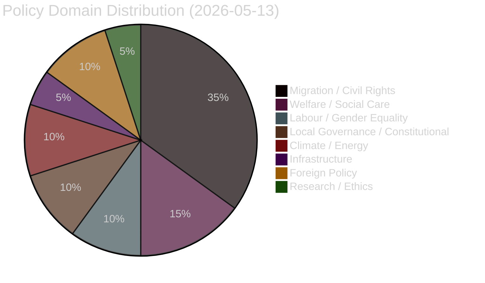

# Classification Results — 2026-05-13 Realtime Pulse

**Date**: 2026-05-13 | **Type**: realtime-pulse | **Horizon**: T+72h

## Document Classification Table

| dok_id | Title | Type | Committee | Party | Policy Domain | Electoral Salience | Constitutional Dimension |
|--------|-------|------|-----------|-------|---------------|--------------------|--------------------------|
| HD024151 | mot Prop 258 (politisk insyn) | motion | KU | S | Political system / transparency | **HIGH** | YES — RF + freedom of association |
| HD024152 | mot Prop 263 (återvändande) | motion | SfU | S | Migration / rule of law | **HIGH** | YES — due process safeguards |
| HD024153 | mot Prop 262 (permanent UT) | motion | SfU | S | Migration / civil rights | **CRITICAL** | YES — EU pact / Swedish constitutional min |
| HD024154 | mot Prop 264 (vandelskrav) | motion | SfU | S | Migration / discrimination | HIGH | YES — non-discrimination |
| HD024155 | mot Prop 251 (missbruksvård) | motion | SoU | S/V | Health/welfare | MEDIUM | No |
| HD024156 | mot Prop 260 (etikprövning) | motion | UbU | ? | Research ethics | LOW | No |
| HD024157 | mot Prop 262 (dup.) | motion | SfU | ? | Migration | HIGH | YES |
| HD024158 | mot Prop 251 (dup.) | motion | SoU | ? | Health | MEDIUM | No |
| HD024159 | mot Prop 263 (dup.) | motion | SfU | ? | Migration | HIGH | YES |
| HD024160 | mot Prop 265 (uppsikt/förvar) | motion | SfU | ? | Migration / liberty | HIGH | YES — detention rights |
| HD024161 | mot Prop 264 (dup.) | motion | SfU | ? | Migration | HIGH | YES |
| HD024162 | mot skr 259 (transportplan) | motion | TU | ? | Infrastructure | MEDIUM | No |
| HD01KU35 | KU35 digitala kommunmöten | betänkande | KU | — | Local governance | MEDIUM | YES — kommunal self-governance |
| HD01CU30 | CU30 EPBD energi | betänkande | CU | — | Energy/climate | MEDIUM | No |
| HD01NU21 | NU21 landsbygd | betänkande | NU | — | Regional/rural | MEDIUM | No |
| HD10484 | äldreomsorg interpellation | interpellation | — | V | Welfare/care | HIGH | No |
| HD10485 | prostitutionsbeskattning | interpellation | — | S | Taxation/gender | MEDIUM | No |
| HD10486 | jämställda löner | interpellation | — | V | Labour/gender | HIGH | No |
| HD10487 | utjämningssystem | interpellation | — | S | Municipal finance | MEDIUM | No |
| HD10488 | klimatanpassning | interpellation | — | MP | Climate/environment | MEDIUM | No |
| HD10489 | Al-Nakba | interpellation | — | — | Foreign policy | MEDIUM | No |
| HD10490 | Förhållandena i Kuba | interpellation | — | SD | Foreign policy | LOW | No |

## Policy Domain Clustering

## Electoral Salience Summary

- **CRITICAL** (1 document): HD024153 — abolish permanent residence permits
- **HIGH** (9 documents): Migration motions HD024151/152/154/160, KU35, HD10484, HD10486, HD10489
- **MEDIUM** (9 documents): HD024155, CU30, NU21, HD10485/487/488
- **LOW** (3 documents): HD024156, HD10490

## Party Attribution

- **S (Socialdemokraterna)**: HD024151, HD024152, HD024153, HD024154, HD024155, HD024162, HD10485, HD10487
- **V (Vänsterpartiet)**: HD10484, HD10486 (also co-author HD024155)
- **MP (Miljöpartiet)**: HD10488
- **SD (Sverigedemokraterna)**: HD10490
- **[Unknown party]**: HD024156-162 (metadata-only; likely S/V given SfU committee assignment)

*Party attribution note: documents without full text marked [unconfirmed] per party-attribution discipline.*

## Constitutional Dimension Assessment

Seven documents have identified constitutional dimensions:
1. HD024151 — Prop 258 freedom of association (RF 2:1) — Lagrådet already raised flag
2. HD024152/153/154/160 — Migration reforms touching due process and EU minimum standards
3. HD01KU35 — Digital meeting rules for elected bodies (kommunal self-governance, RF 14 kap.)

Constitutional risk is concentrated in the migration reform package. If S successfully litigates Lagrådet's "bräckligt" characterisation in the Constitutional Committee (KU), Props 258 and potentially 262 face parliamentary-stage challenges.

*Admiralty Grade: B2 — Reliable source, probably true.*
