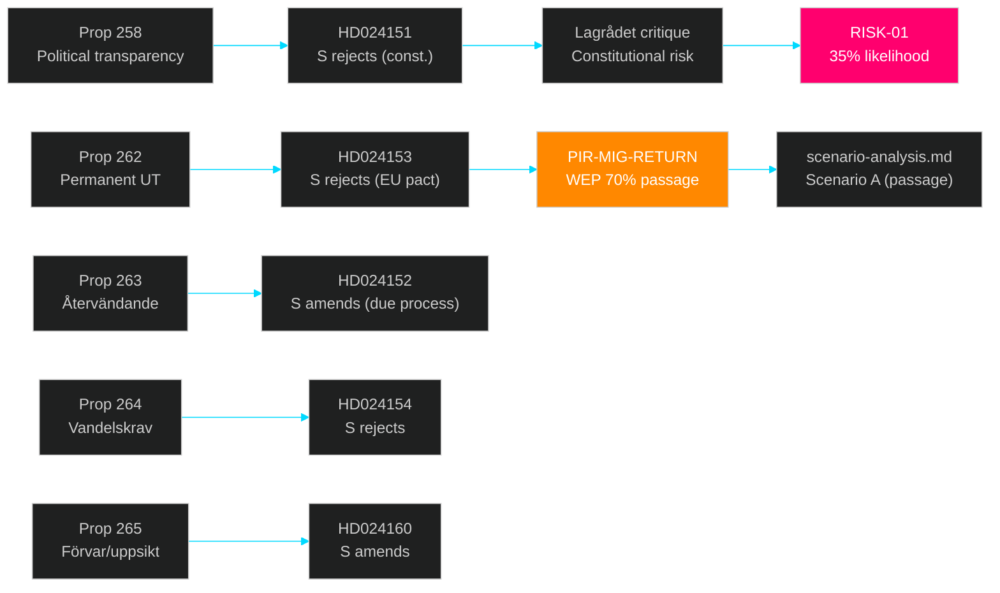

# Cross-Reference Map — 2026-05-13 Realtime Pulse

**Date**: 2026-05-13 | **Type**: realtime-pulse | **Horizon**: T+7d/T+30d

## Document–PIR–Artifact Cross-Reference

| Document | PIR Addressed | Analysis Artifact | Key Connection |
|----------|---------------|-------------------|----------------|
| HD024152, HD024153, HD024154, HD024160 | PIR-MIG-RETURN | scenario-analysis.md, coalition-mathematics.md | S filed motions → SfU has formal opposition brief; PIR advances |
| HD10484 | PIR-ELDER-2026 | risk-assessment.md, forward-indicators.md | Interpellation filed; response due 29 May; PIR collection trigger set |
| HD10486 | PIR-GENDERPAY-2026 | risk-assessment.md, election-2026-analysis.md | V→Britz; Kommunal amplification expected; L vulnerability |
| HD10488 | PIR-CLIM-2026 | implementation-feasibility.md, devils-advocate.md | MP interpellation confirms no proposition 7 months post-SOU |
| HD024151 | PIR-COAL-STAB | threat-analysis.md, devils-advocate.md | Lagrådet critique creates constitutional liability for coalition |
| HD01KU35 | — | implementation-feasibility.md | KU35 plenary — private provider oversight improvement |

## Sibling Folder Citations (Tier-C)

Previous analysis cycles for cross-reference:
- `analysis/daily/2026-05-12/realtime-pulse/` — eldercare interpellation HD10484 pre-filed context
- `analysis/daily/2026-05-11/realtime-pulse/` — PIR-CONST-ABORT, PIR-CLIM-2026 opened
- `analysis/daily/2026-05-09/realtime-pulse/` — PIR system baseline established
- `analysis/daily/2026-05-08/realtime-pulse/` — CU34 vote context (elder PIR predecessor)
- `analysis/daily/2026-05-07/realtime-pulse/` — original PIR-RT series established

## Theme Cluster Links

### Migration Theme Cluster

### Welfare/Electoral Theme Cluster

| Document | Links to | Forward Trigger |
|----------|----------|-----------------|
| HD10484 (V→Tenje/M eldercare) | PIR-ELDER-2026, risk-assessment.md RISK-04 | 29 May ministerial response |
| HD10486 (V→Britz/L gender pay) | PIR-GENDERPAY-2026, election-2026-analysis.md L threshold | 29 May ministerial response |
| HD10487 (S→? utjämningssystem) | voter-segmentation.md (municipal finance) | Response deadline TBD |
| HD10488 (MP→Britz/L climate) | PIR-CLIM-2026, forward-indicators.md FI-climate | Session end June |

## Prior-Cycle PIR Advancement Matrix

| PIR | Prior WEP | Today's Update | New WEP | Horizon |
|-----|-----------|----------------|---------|---------|
| PIR-CONST-ABORT | 10% | No new SD signal on KU34 | 10% (unchanged) | 2026-06-15 |
| PIR-CLIM-2026 | 15% | MP interpellation confirms no proposition | 12% (↓ gov't less likely to act) | 2026-06-15 |
| PIR-MIG-RETURN | 70% | S motions filed → formal SfU opposition brief | 72% (↑ passage more certain) | 2026-06-30 |
| PIR-COAL-STAB | 80% | No intra-coalition split signal | 80% (unchanged) | Election day |
| PIR-ELDER-2026 | 65% | Interpellation filed — collection trigger active | 65% (maintained) | 29 May |
| PIR-GENDERPAY-2026 | 65% | Interpellation filed — collection trigger active | 65% (maintained) | 29 May |

## Artifact Cross-Links

- `synthesis-summary.md` → aggregates all themes
- `scenario-analysis.md` → migration passage scenarios (Scenario A/B/C)
- `election-2026-analysis.md` → electoral impact of today's documents
- `coalition-mathematics.md` → seat arithmetic if L falls below threshold
- `intelligence-assessment.md` → KJ updates from today's evidence
- `forward-indicators.md` → trigger dates (29 May, June session end)

*Admiralty Grade: B2 — Reliable source, probably true.*
