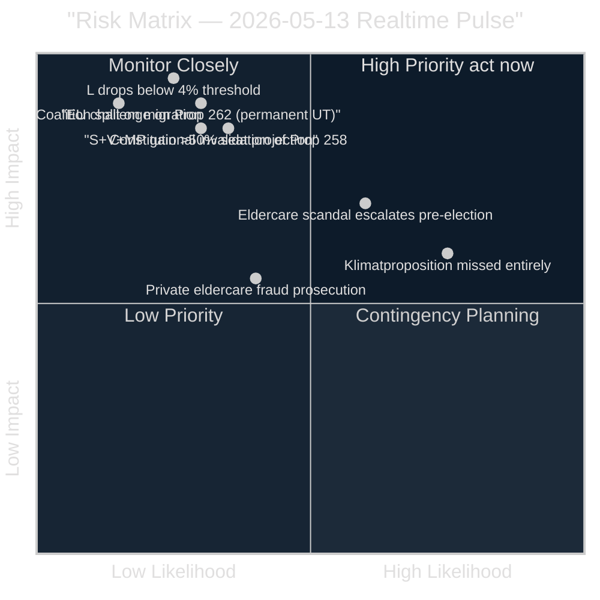

# Risk Assessment — 2026-05-13 Realtime Pulse

**Date**: 2026-05-13 | **Type**: realtime-pulse | **Horizon**: T+7d / T+30d / T+90d  
**Admrialty Grade**: B2

## Risk Matrix

## Risk Register

### RISK-01: Constitutional invalidation of Prop 258 (political transparency)
- **Likelihood**: 35% [B2]
- **Impact**: CRITICAL (invalidates flagship governance reform; creates "coalition overreach" narrative)
- **Evidence**: Lagrådet explicitly called legislative basis "bräckligt" (HD024151, confirmed); SOU 2025:52 recommended against (HD024151)
- **Mitigation**: Government could withdraw or amend Prop 258 before plenary vote — but this signals weakness
- **Horizon**: T+7d (KU committee hearing)

### RISK-02: EU legal challenge to Prop 262 abolishing permanent residence
- **Likelihood**: 30% [B3]  
- **Impact**: CRITICAL (Sweden isolated in EU migration policy; diplomatic and legal costs)
- **Evidence**: S motion HD024153 specifically cites EU pact minimum standards compliance dimension; Swedish courts may refer
- **Mitigation**: Government argues Prop 262 is within EU pact margin of appreciation
- **Horizon**: T+180d (post-implementation)

### RISK-03: Liberalerna drops below 4% parliamentary threshold
- **Likelihood**: 25% [B3]
- **Impact**: CATASTROPHIC (L exits Riksdagen; Tidö loses operational majority; M-SD-KD minority government scenario)
- **Evidence**: Last polling ~4.4%; V double-interpellation strategy targeting Britz (L); gender pay + climate = L's two weakest issues
- **Mitigation**: L differentiates on digital rights, EU policy, and press freedom ahead of election
- **Horizon**: T+90d (pre-election polling June–August)

### RISK-04: Eldercare scandal escalates to systemic welfare failure narrative
- **Likelihood**: 60% [B2]
- **Impact**: HIGH (M loses 1–2% welfare credibility; women voters shift)
- **Evidence**: HD10484 documents Socialstyrelsen 50,000 worker gap, repeated private provider scandals, polisanmälan failures; 15 municipalities terminated contracts with private providers
- **Mitigation**: Tenje (M) response 29 May must commit specific enforcement actions; if process-only, risk crystallises
- **Horizon**: T+16d (29 May ministerial response)

### RISK-05: Government misses climate adaptation legislation this session
- **Likelihood**: 75% [B2]
- **Impact**: MEDIUM-HIGH (MP refuses coalition post-election; green-red bloc strengthened)
- **Evidence**: SOU remiss closed October 2025; HD10488 MP interpellation confirms no proposition as of May 2026; 7-month gap
- **Mitigation**: Government could issue regulatory guidance short of full legislation
- **Horizon**: T+30d (session end mid-June)

### RISK-06: Coalition split on migration reform implementation
- **Likelihood**: 15% [B3]
- **Impact**: CRITICAL (collapse of Tidö legislative agenda; confidence vote scenario)
- **Evidence**: No current signal of intra-coalition divergence; SD supports all migration props; KD/L concerns about Prop 258 constitutional dimension not yet public
- **Mitigation**: Coalition cohesion maintained through individual ministry ownership of each prop
- **Horizon**: T+7d (committee votes)

## Risk Interconnections

**Compound scenario (15% probability)**: L drops below threshold (RISK-03) triggers after elder care scandal crystallises (RISK-04) + Britz gives weak climate response (RISK-05). If L exits, M+SD+KD minority government must negotiate supply-and-confidence, fundamentally changing 2026–2030 government formation dynamics.

**Constitutional cascade (20% probability)**: If KU finds Prop 258 unconstitutional (RISK-01), this emboldens S to challenge Prop 262 in court (RISK-02), creating a narrative that the government's entire migration-and-transparency package lacks legal grounding.

## Institutional Risk

The KU35 betänkande (HD01KU35) on private welfare provider oversight reflects an institutional risk: inadequate oversight of private providers has enabled eldercare fraud (HD10484). If the oversight provisions in KU35 are weakened in plenary, the institutional risk compounds.

*Admiralty Grade: B2 — Reliable source, probably true.*
