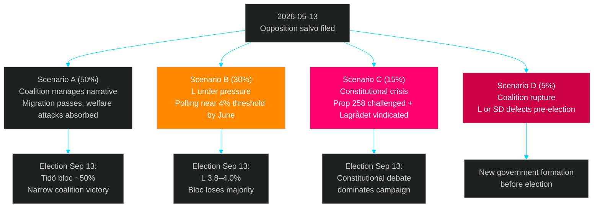

# Scenario Analysis — 2026-05-13 Realtime Pulse

**Date**: 2026-05-13 | **Type**: realtime-pulse | **Horizon**: T+7d/T+90d  
**Scenarios**: 4 (per 72h primary / T+30d secondary horizon)

## Scenario Overview

## Scenario A — Coalition Manages (50%)
**"Policy delivered, opposition contained"**

**Conditions**: Government responds substantively to eldercare and gender pay interpellations (Tenje commits to enforcement action; Britz notes consultation underway); S motions on migration defeated in SfU committee as expected; Prop 258 proceeds with minor technical amendments to address Lagrådet critique; L maintains 4.4% polling.

**Evidence supporting**: No intra-coalition split signal (PIR-COAL-STAB WEP 80%); migration reform package represents deliverable that SD base values; KU35 + NU21 show cross-sector governance competence. [B2]

**Key indicators to watch**:
- Tenje's response quality on eldercare (29 May)
- SfU committee report on migration props
- L polling trajectories in June

**Electoral outcome**: Tidö bloc ~50%; narrow coalition victory possible.

## Scenario B — Liberal Threshold Risk (30%)
**"L squeezed to 4%, election too close to call"**

**Conditions**: Britz gives defensive responses on both gender pay and climate (process-only); Kommunal amplifies V's 30 mdr SEK demand in media; one major polling firm shows L at 3.8–4.0%; S captures moderate women voters from M/L on welfare quality narrative.

**Evidence supporting**: L currently ~4.4% (at risk); Britz is vikarierande klimat minister = double exposure; V has targeted L specifically (not KD or SD); Kommunal has organisational capacity to amplify. [B2]

**Key indicators to watch**:
- June polling (SIFO/Novus/Demoskop)
- Kommunal congress statement on gender pay
- L internal polling (not public)

**Electoral outcome**: L at 3.8–4.3%; bloc loses working majority; complex minority government formation.

## Scenario C — Constitutional Crisis (15%)
**"Prop 258 challenged in Lagrådet + constitutional committee review"**

**Conditions**: KU takes up Prop 258 for extended constitutional review after S motion; Lagrådet issues formal opinion; international human rights bodies (Council of Europe) note freedom-of-association dimension; LO formally opposes.

**Evidence supporting**: Lagrådet already called Prop 258 "bräckligt" (HD024151); SOU 2025:52 recommended against; freedom of association is RF 2:1 fundamental right. [B2]

**Key indicators to watch**:
- KU committee proceedings on Prop 258
- LO formal opposition statement
- Government decision on whether to amend Prop 258

**Electoral outcome**: Constitutional rule-of-law narrative dominates pre-election period; uncertain electoral impact but coalition legitimacy damaged.

## Scenario D — Coalition Rupture (5%)
**"L or KD breaks from coalition before election"**

**Conditions**: Multiple compounding failures — eldercare scandal escalates to legal proceedings against private providers; gender pay issue causes significant L poll collapse; climate inaction causes key L constituency figures to publicly break ranks.

**Evidence supporting**: Very low probability — no current signal; included as tail-risk scenario per methodology. [B3] Speculative.

**Key indicators to watch (trip-wire)**:
- Any L MP makes public critical statement about coalition policy
- Any party whip defects on a chamber vote

**Electoral outcome**: Pre-election government crisis; Tidö minority government or early dissolution.

## Wildcard Assessment

**W1 — Riksdag summer extraordinary session** (8%): If migration props blocked by constitutional challenge, emergency summer session required. Historical precedent: rare but not unprecedented.

**W2 — EU infringement procedure initiated** (12%): If Prop 262 abolishing permanent residence violates EU minimum standards, Commission may initiate Article 258 TFEU procedure pre-implementation.

**W3 — Police crackdown on eldercare fraud** (25%): If police act on the 15 municipal polisanmälningar (HD10484), a major private provider prosecution would dominate pre-election news. Probability elevated by the specificity of evidence in HD10484.

*Admiralty Grade: B2 — Reliable source, probably true.*
