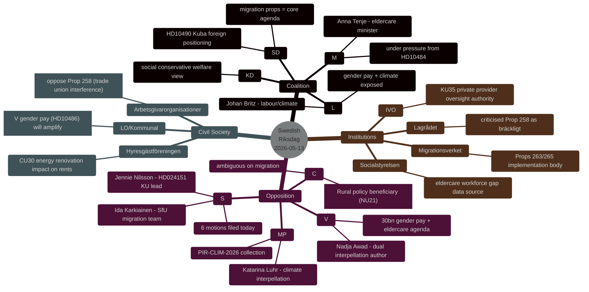

# Stakeholder Perspectives — 2026-05-13 Realtime Pulse

**Date**: 2026-05-13 | **Type**: realtime-pulse | **Horizon**: T+7d/T+30d

## Stakeholder Map

## Party Perspectives

### Socialdemokraterna (S)

**Today's actions**: 6 committee motions filed (HD024151-HD024162 selection) against migration reform package.

**Framing**: S presents itself as defending (a) constitutional freedoms (Prop 258 + RF 2:1), (b) legal certainty for refugees (Prop 262 abolishing permanent permits), (c) "ordning och reda" in migration *with* due process (Prop 263 amendment). This triangulation attempts to claim both "firm migration policy" and "legal protection" — a difficult but potentially effective moderate-voter play.

**Strategic intent**: Neutralise migration as a pure SD/M strength; reframe as "coalition overreach vs. responsible reform." Combined with the transport plan motion (HD024162), S demonstrates legislative breadth across security, welfare, and infrastructure.

**Evidence**: HD024151 (constitutional challenge), HD024152 (partial amendment vs. rejection), HD024153 (replacement permit system proposed), HD024162 (infrastructure alternative). [A1]

### Vänsterpartiet (V)

**Today's actions**: Two interpellations (HD10484, HD10486) both authored by Nadja Awad, targeting ministers Tenje (M) and Britz (L) on eldercare and gender pay.

**Framing**: V explicitly frames both issues as "women's issues" — eldercare workforce is predominantly female, gender pay gap directly targets women in public sector. The 30 mdr SEK demand is designed to be specific and memorable ("tre miljarder per år"), making it a campaign pledge that V can own.

**Strategic intent**: Pre-election electoral differentiation from S on the left flank; forces L into a visible ideological confrontation with women voters and public sector unions (Kommunal).

**Evidence**: HD10484 (eldercare), HD10486 (gender pay, explicit "30 miljarder" sum). [A1]

### Miljöpartiet (MP)

**Today's actions**: One interpellation (HD10488, Katarina Luhr→Britz) on missing climate adaptation legislation.

**Framing**: MP frames government's inaction as a governance failure — "many are waiting for a proposition since the SOU remiss closed October 2025." This is a simple factual claim that is difficult for the government to deny.

**Strategic intent**: Maintain climate relevance in the pre-election period; signal to green voters that coalition missed its opportunity; build case for green-red bloc government post-election.

**Evidence**: HD10488 explicit statement: betänkandet was on remiss until 17 October 2025; no proposition as of May 2026. [A1]

### SD (Sverigedemokraterna)

**Today's actions**: One interpellation (HD10490) on conditions in Cuba.

**Framing**: Foreign policy human rights positioning — Cuba as a signal of SD's anti-authoritarian foreign policy credentials (distinguishing from traditional left-wing sympathy for Cuba).

**Strategic intent**: Manage coalition reputation on international democracy; signal differentiation from far-right parties that are softer on authoritarian regimes.

**Evidence**: HD10490. [A1]

### Anna Tenje (M) — Eldercare Minister

**Situation**: Targeted by HD10484 with Socialstyrelsen-backed evidence of eldercare workforce gap and private provider failures. Ministerial response due 29 May.

**Expected response framing**: "We are strengthening oversight through KU35 and working with municipalities on staffing" (process-oriented). A substantive reform commitment is less likely given election timeline.

**Electoral risk**: Women over 60 vote and care about eldercare quality. M's market-liberal welfare policy is exposed. [B2]

### Johan Britz (L) — Labour & Acting Climate Minister

**Situation**: Targeted on two fronts — gender pay (HD10486) and climate adaptation (HD10488). Both cut against L's electoral positioning.

**Expected response framing on gender pay**: Defence of "märket" (collective bargaining model) as the appropriate wage-setting mechanism; rejection of state mandates.

**Expected response framing on climate**: Process-oriented ("government is considering the SOU recommendations"); no commitment to timeline.

**Electoral risk**: L polls at ~4.4%; gender pay and climate inaction together could drive L below threshold. [B2]

## Civil Society Actors

| Actor | Stake | Expected Response | Electoral Impact |
|-------|-------|-------------------|-----------------|
| Kommunal (union) | HD10486 gender pay — directly affects members | Will amplify V's 30bn demand; press response expected | Moderate-high (women public sector workers) |
| LO | HD10486, HD024151 (trade union disclosure) | Oppose Prop 258 as state interference in union affairs | High (labour movement) |
| Arbetsgivarorganisationer | Prop 258 trade union disclosure | Likely support transparency requirement | Low (employer bloc votes M/L regardless) |
| Migrationsverket | Props 262/263/265 | Implementation body — no public political position | Institutional (capacity risk) |
| IVO | KU35 private provider oversight | Will welcome expanded oversight mandate | Institutional |
| Hyresgästföreningen | CU30 EPBD energy renovation | Concerned about rent increases from mandatory renovation | Medium (urban renters) |

*Admiralty Grade: B2 — Reliable source, probably true.*
