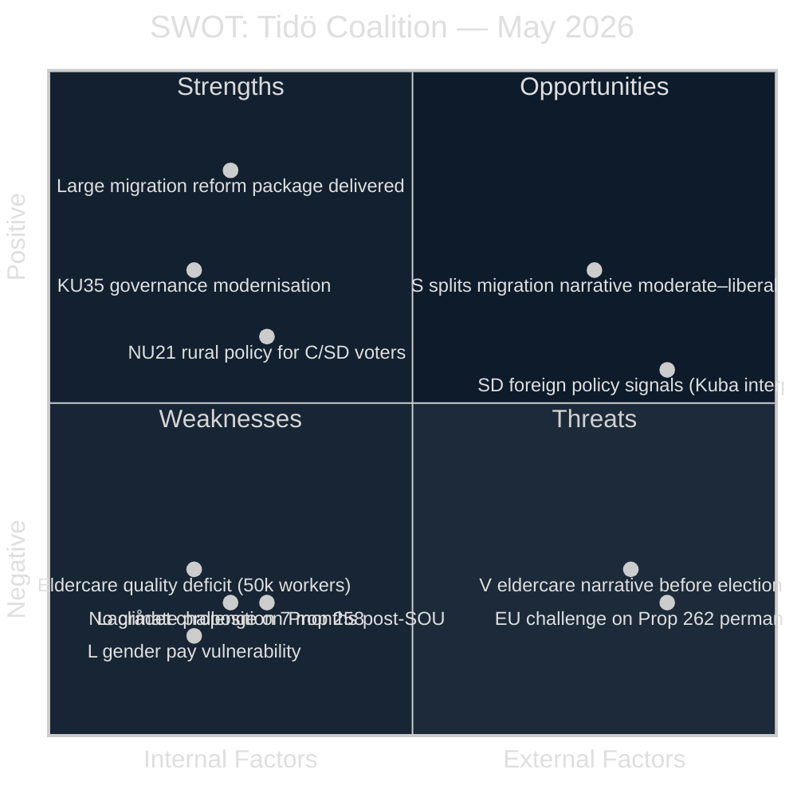

# SWOT Analysis — 2026-05-13 Realtime Pulse

**Date**: 2026-05-13 | **Type**: realtime-pulse | **Horizon**: T+30d / T+90d

## Political SWOT: Tidö Coalition (M+SD+KD+L)

### Strengths

| Strength | Evidence | Confidence |
|----------|----------|------------|
| Delivered 5-proposition migration reform package in final weeks | HD024152-HD024162 opposition motions confirm govt props filed | [A1] Confirmed |
| KU35 governance reform reaches plenary with broad support | HD01KU35, datum 2026-05-13 | [A1] Confirmed |
| NU21 rural policy addresses C/SD constituency issues | HD01NU21, betänkande NU, 2026-05-12 | [A1] Confirmed |
| Transport infrastructure plan 2026–2037 filed as skrivelse | Skr 2025/26:259 referenced in HD024162 | [B2] Plausible |

### Weaknesses

| Weakness | Evidence | Confidence |
|----------|----------|------------|
| Lagrådet called Prop 258 "bräckligt" — constitutional liability | HD024151 explicit citation of Lagrådet yttrande | [A1] Confirmed |
| Eldercare: 50,000 worker shortage, documented fraud by private operators | HD10484 citing Socialstyrelsen data | [B2] Plausible |
| L ideologically exposed on gender pay: market-wage model fails women | HD10486, V demands 30 mdr SEK outside "märket" | [A1] Confirmed |
| No climate adaptation proposition after Oct 2025 remiss deadline | HD10488, MP interpellation noting 7+ month gap | [A1] Confirmed |
| Migration reform: abolishing permanent residence contested constitutionally | HD024153 citing EU pact minimum standards | [B2] Plausible |

### Opportunities

| Opportunity | Evidence | Confidence |
|-------------|----------|------------|
| Migration legislative completion signals delivery capability to SD base | 5 props in final session = track-record claim | [B2] Plausible |
| Rural policy (NU21) + transport plan enable rural swing vote appeal | HD01NU21 + HD024162 (transport skrivelse) | [B2] Plausible |
| Digital governance (KU35) signals M/government modernisation competence | HD01KU35 plenary 2026-05-13 | [A1] Confirmed |

### Threats

| Threat | Evidence | Confidence |
|--------|----------|------------|
| S builds sustained "migration + constitutional overreach" narrative | HD024151 (Lagrådet), HD024153 (EU pact) | [A1] Confirmed |
| V forces M (Tenje) to defend eldercare record — women's vote at risk | HD10484 → Anna Tenje/M ministerial response 29 May | [A1] Confirmed |
| V forces L (Britz) on gender pay — L most exposed of coalition parties | HD10486 → Johan Britz/L, Kommunal amplification expected | [A1] Confirmed |
| EU legal challenge on Prop 262 abolishing permanent residence | HD024153 notes EU pact minimum standards | [B2] Plausible |
| Green-red bloc pre-election narrative strengthened by climate inaction | HD10488 + PIR-CLIM-2026 open since May 2026 | [B2] Plausible |

## Opposition SWOT: S+V+MP

### Strengths

| Strength | Evidence | Confidence |
|----------|----------|------------|
| Constitutional framing via Lagrådet critique — S has legal high ground on Prop 258 | HD024151 | [A1] Confirmed |
| V dual-interpellation strategy forces ministers to respond before election | HD10484 + HD10486, both Awad (V) | [A1] Confirmed |
| S partial support of migration returns (Prop 263) shows "credible alternative" framing | HD024152 — S proposes amendments, not outright rejection | [A1] Confirmed |
| MP isolates government on climate inaction — 7 months post-SOU | HD10488 | [A1] Confirmed |

### Weaknesses

| Weakness | Evidence | Confidence |
|----------|----------|------------|
| S counter-proposals on migration (establishment permits) lack majority | No S+V+MP+C majority on migration reform | [B2] Plausible |
| V 30 mdr SEK gender pay demand outside mainstream labour model | HD10486 — "märket" framework is constitutional in Swedish industrial relations | [B2] Plausible |

## Intersection Analysis

The convergence of migration, welfare, and climate themes creates a **compound pre-election attack surface**. The weakest single point in the coalition is **Liberalerna (L)**: targeted on gender pay by V, expected to respond on climate adaptation (Britz is vikarierande klimatminister), and structurally squeezed between M's migration conservatism and the moderate liberal electorate. L's 4.4% polling position makes the gender pay and climate narratives existentially threatening.

*Admiralty Grade: B2 — Reliable source, probably true.*
