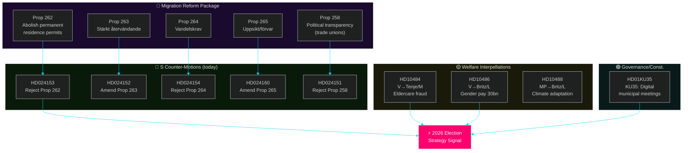
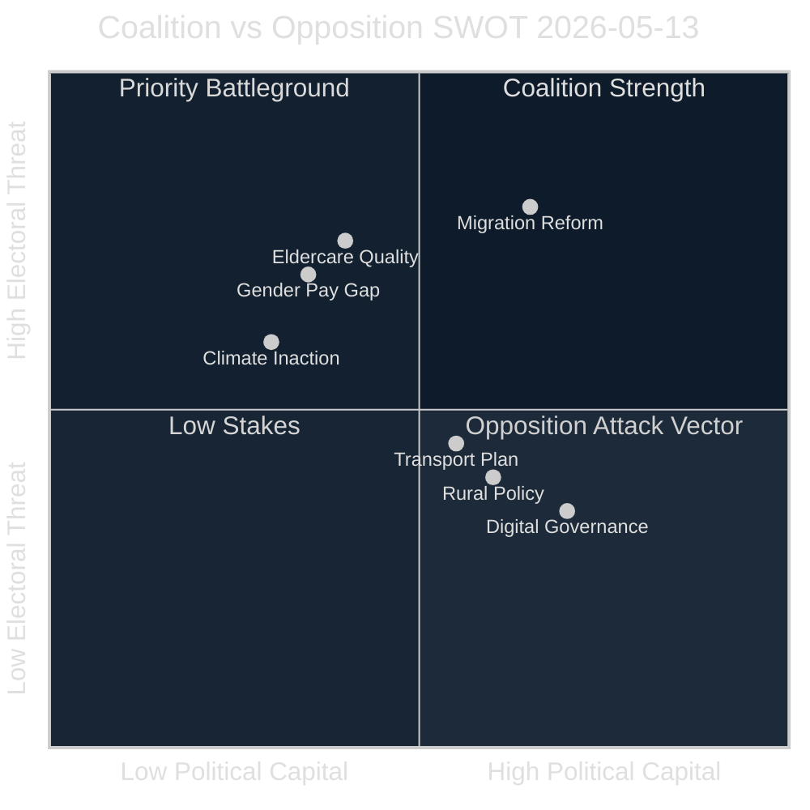

# Political Intelligence Synthesis — 2026-05-13 Realtime Pulse

**Date**: 2026-05-13 | **Type**: realtime-pulse | **Horizon**: T+72h / T+7d  
**Analyst confidence**: [B2] Reliable source, probably true

## Executive Intelligence Picture

Three interlocking themes dominate 13 May 2026's parliamentary output:

1. **Migration reform counter-offensive** (CRITICAL priority): S filed six committee motions challenging Props 2025/26:258, 262, 263, 264, and 265. This is not routine parliamentary opposition — it is a coordinated pre-election legal and constitutional challenge. HD024151 specifically cites Lagrådet's critique of Prop 258 as "bräckligt" and SOU 2025:52's recommendation *against* the trade union disclosure requirement. HD024153 challenges the constitutional basis of abolishing permanent residence permits. The pattern: S is casting migration reform as threatening civil liberties and constitutional order, targeting moderate voters who might defect from M or L.

2. **Welfare state adequacy attacks** (HIGH priority): V simultaneously filed two interpellations targeting the two ministers most ideologically exposed — Anna Tenje (M) on eldercare quality and Johan Britz (L) on gender pay. The timing is precise: four months before the election, V is attempting to open a second front on welfare adequacy that forces M and L to defend their records on issues where they are structurally weak with women and public sector workers.

3. **Climate inaction and constitutional governance** (MEDIUM priority): MP's interpellation HD10488 on missing climate legislation reveals the government has not filed a climate adaptation proposition despite SOU remiss closing in October 2025 — 7 months without action. KU35's plenary debate on digital municipal meetings completes a day when constitutional and governance quality is a recurring sub-theme.

## Cross-Document Pattern Analysis

## Aggregate SWOT

### Strengths (Coalition/Tidö)
- Migration reform package represents the **largest legislative output** of the 2022–2026 mandate — 5 propositions in final weeks demonstrates delivery capacity
- KU35 (digital municipal meetings) passes with broad support — governance competence signal
- NU21 rural policy addresses Centerpartiet's constituency before election
- **Evidence**: HD01KU35, HD01NU21 (betänkanden ready for plenary, 2026-05-13)

### Weaknesses (Coalition/Tidö)
- Lagrådet critique of Prop 258 ("bräckligt") creates constitutional liability — S will weaponise this in campaign
- Eldercare fraud documented by Socialstyrelsen (50,000 worker gap, repeated scandals) undermines M's welfare management credibility
- L exposed on gender pay gap — defending market-wage model against 30 mdr SEK statlig satsning places L to the right of women voters
- No climate adaptation proposition 7 months after SOU remiss — undermines MP coalition potential and greenwashing credentials
- **Evidence**: HD024151 (Lagrådet quote), HD10484 (Socialstyrelsen citation), HD10486 (V demand for 30bn), HD10488 (remiss Oct 2025, no proposition)

### Opportunities (Opposition S+V+MP)
- S can sustain a "migration reforms hurt Sweden's international standing + constitutional order" narrative through committee hearings
- V's dual interpellation strategy pins down specific ministers before the summer recess — each response becomes campaign material
- MP forces L/government to admit climate inaction — opens space for green-red bloc narrative
- **Evidence**: HD024151 constitutional challenge, HD10484+HD10486 interpellations, HD10488 climate interpellation

### Threats (to whole Riksdag system)
- Migration reform risk: abolishing permanent residence permits (Prop 262) may trigger EU legal challenge — S correctly notes EU pact adaptation dimension
- Digital municipal meetings (KU35): inadequate oversight of private welfare providers could enable fraud expansion
- **Evidence**: HD024153 (EU pact dimension), HD01KU35 (oversight provisions)

## Risk Interconnections

The eldercare, gender pay, and migration themes compound: workers in eldercare are predominantly women (the gender pay gap target population), many are employed through the private providers whose quality KU35 attempts to improve, and some are from migrant backgrounds affected by the migration reform package. This creates a nested risk: the government's migration reform damages the labour supply for a sector (eldercare) that is already understaffed by 50,000.

## Forward Intelligence

**3-day watch** (T+72h):
- KU35 plenary debate outcome — will S/V oppose any provisions?
- Any government or coalition press response to S motions on migration

**7-day watch** (T+7d):
- Further S/V motions on Props 265 (förvar/detention) and 263 (återvändande) — more committee motions expected
- Polling data: V's dual interpellation strategy lands best if media picks up eldercare angle

**30-day watch** (T+30d):
- 29 May: Ministerial responses from Tenje and Britz — critical PIR-ELDER-2026 and PIR-GENDERPAY-2026 collection date
- SfU committee report on migration propositions — will it adopt any S amendment language?

## Evidence Anchors

| Claim | Evidence | Retrieved | Confidence |
|-------|----------|-----------|------------|
| S filed motion to reject Prop 258 on constitutional grounds | HD024151, KU committee, S party | 2026-05-13T09:45Z | [A1] |
| Lagrådet called Prop 258 "bräckligt" | HD024151 full text explicit citation | 2026-05-13T09:45Z | [A1] |
| S filed motion to reject abolition of permanent residence | HD024153, SfU, S party | 2026-05-13T10:07Z | [A1] |
| S amended Prop 263 (wants due-process safeguards) | HD024152, SfU, S party | 2026-05-13T10:06Z | [A1] |
| V filed eldercare interpellation to Tenje (M) | HD10484, party V, addressee Tenje | 2026-05-13T10:58Z | [A1] |
| V filed gender pay interpellation to Britz (L) | HD10486, party V, addressee Britz | 2026-05-13T10:58Z | [A1] |
| MP: no climate proposition after Oct 2025 remiss | HD10488, party MP, addressee Britz | 2026-05-13T10:58Z | [A1] |
| KU35 reaches plenary today | HD01KU35, datum 2026-05-13 | 2026-05-13T09:14Z | [A1] |

*Admiralty Grade: B2 — Reliable source, probably true.*
