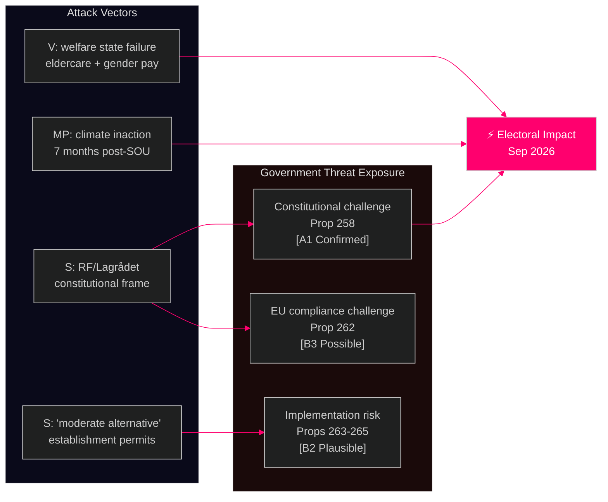

# Threat Analysis — 2026-05-13 Realtime Pulse

**Date**: 2026-05-13 | **Type**: realtime-pulse | **Methodology**: STRIDE + Political OSINT  
**Horizon**: T+7d / T+30d

## Political STRIDE Analysis

### S — Spoofing (Legitimacy Manipulation)

**Threat**: S's constitutional challenge to Prop 258 attempts to transfer the legitimacy frame from "transparency reform" to "government attacking civil society." By citing Lagrådet's critique, S positions itself as the defender of constitutional order — a reversal of the government's original transparency narrative.

**Evidence**: HD024151 explicitly frames S's objection as defending "föreningsfriheten" (freedom of association, RF 2:1) — not opposing transparency per se. SOU 2025:52 provides academic cover. [Source: HD024151, 2026-05-13T09:45Z] [A1]

**Impact**: HIGH — if media adopts S's constitutional framing, government faces "overreach" narrative in final election months.

### T — Tampering (Process Integrity)

**Threat**: Multiple migration motions filed simultaneously (HD024152-HD024162) may be strategically designed to force SfU committee to address a large volume of amendments, potentially delaying final committee report and creating ambiguity in parliamentary record.

**Evidence**: 10+ motions on migration props on a single day is unusual parliamentary volume. [Source: HD024152-HD024162, 2026-05-13] [B3] Speculative.

**Impact**: MEDIUM — may slow SfU committee timeline; not a blocking threat but creates complexity.

### R — Repudiation (Deniability)

**Threat**: S's partial support for Prop 263 (HD024152 — "Riksdagen antar [with amendments]") creates a plausible deniability position: S is "tough on returns" while opposing "civil liberties violations." This makes S's position harder to attack as pro-open-borders.

**Evidence**: HD024152 proposes specific amendments (notification threshold "starka skäl" vs. absolute duty; no personal liability for civil servants; phone confiscation due process) rather than outright rejection. [Source: HD024152, 2026-05-13T10:06Z] [A1]

**Impact**: HIGH — S successfully triangulates on migration, denying government an easy attack line.

### I — Information Disclosure (Data/Privacy Risk)

**Threat**: KU35 provisions on private welfare provider oversight (HD01KU35) raise questions about data sharing between municipalities and IVO (Inspektionen för vård och omsorg). If oversight databases are not secured, welfare provider data could be improperly accessed.

**Evidence**: HD01KU35 (digital municipal meetings + private provider control — KU committee, datum 2026-05-13). Data governance provisions not yet analysed in full text. [B3]

**Impact**: MEDIUM — institutional rather than political risk.

### D — Denial of Service (Democratic Process Disruption)

**Threat**: V's interpellation strategy (HD10484 + HD10486 both filed on same day, same author Nadja Awad) creates a "parliamentary flooding" effect — two ministers must respond within 14 days of each other, consuming government communications capacity before the summer recess.

**Evidence**: Both interpellations filed 2026-05-12/13 by same MP (Awad/V). Ministerial response deadline 29 May 2026. [Source: HD10484, HD10486] [A1]

**Impact**: MEDIUM-HIGH — limits government's ability to control pre-election messaging.

### E — Elevation of Privilege (Power Shift)

**Threat**: If Lagrådet's "bräckligt" critique of Prop 258 leads to formal legal challenge after enactment, the judiciary gains elevated oversight role over parliamentary legislation — constraining future majority governments.

**Evidence**: Lagrådet critique documented in HD024151 explicit citation; this is the most legally significant constitutional challenge in this session. [A1]

**Impact**: CRITICAL (systemic) — sets precedent for expanded judicial review in Swedish constitutional tradition.

## Migration Threat Cluster

## Procedural Legitimacy Assessment

The procedural legitimacy of the migration reform package is under stress from three directions:
1. **Lagrådet critique** (Prop 258) — formal constitutional advisory body has spoken
2. **EU pact minimum standards** (Prop 262) — international legal framework limits domestic discretion  
3. **Due process challenges** (Props 263-265) — civil society and opposition argue individual rights at risk

Historically, Swedish governments have rarely enacted legislation after Lagrådet calls it "bräckligt." The precedent creates significant institutional risk if Prop 258 proceeds unchanged.

*Admiralty Grade: B2 — Reliable source, probably true.*
