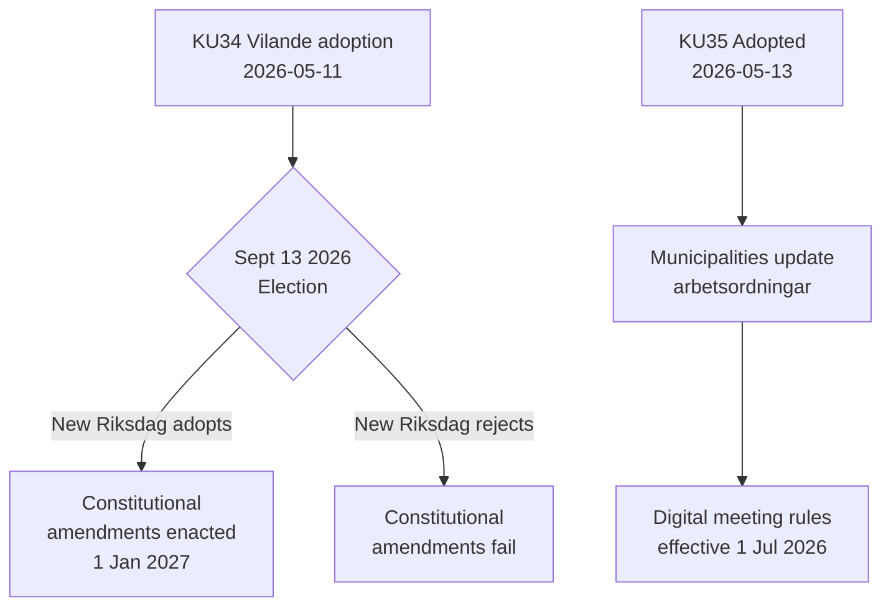

## What Happened
<!-- source: executive-brief.md :: https://github.com/Hack23/riksdagsmonitor/blob/main/analysis/daily/2026-05-14/committeeReports/executive-brief.md -->

### Lede
Sweden's Constitutional Affairs Committee (KU) has advanced two landmark reports. The dominant event is adoption of **KU34** — a package of constitutional amendments (vilande) that must survive September 2026 elections and a second Riksdag vote to become law. The secondary event is the unanimous passage of **KU35** modernizing digital participation in municipal governance, effective 1 July 2026. Together, these represent Sweden's most significant constitutional moment in a decade.

### Key Decisions

| Decision | dok_id | Status | Effect Date |
|----------|--------|--------|-------------|
| Constitutional right to abortion (RF) | HD01KU34 | Vilande — awaits election + second passage | 1 Jan 2027 |
| Citizenship revocation for dual citizens | HD01KU34 | Vilande | 1 Jan 2027 |
| Freedom of association limits for criminal gangs | HD01KU34 | Vilande | 1 Jan 2027 |
| Digital municipal meeting rules | HD01KU35 | Adopted | 1 Jul 2026 |
| Private contractor oversight + annual reporting | HD01KU35 | Adopted | 1 Jul 2026 |
| New Riksdagen medal law | HD01KU43 | Adopted | TBC |

### Decision Flow



### Intelligence Significance

- **KU34 DIW 7.0 (L3)**: First constitutional enshrinement of abortion right in Swedish history. Citizenship revocation restores a tool removed by 2001 constitutional reform. Gang association restriction fills a gap enabling full criminalization of gang membership.
- **KU35 DIW 5.0 (L2)**: Affects 290 municipalities, 21 regions. Digital participation modernization + welfare contracting oversight chain; low controversy but high implementation risk.
- **Election dependency**: The September 2026 election is not just a political event — it is a constitutional prerequisite. The composition of the new riksdag determines whether Sweden's fundamental law changes.

### Time-Sensitive Indicators

1. **June 2026**: Opposition parties (S, V, C, MP) publish election manifestos with positions on KU34 second passage
2. **September 13, 2026**: Election — decisive for constitutional future
3. **October–November 2026**: New riksdag constituted; KU34 second passage vote scheduled
4. **1 July 2026**: KU35 municipal governance rules enter force

## Reader Intelligence Guide

Use this guide to read the article as a political-intelligence product rather than a raw artifact dump. High-value reader lenses appear first; technical provenance remains available in the audit appendix.

| Icon | Reader need | What you'll get |
|---|---|---|
| 📊 | [Lede and editorial decisions](#rm-what-happened) | fast answer to what happened, why it matters, who is accountable, and the next dated trigger |
| 🧠 | [Why It Matters](#rm-why-it-matters) | evidence-anchored narrative consolidating primary sources into one coherent story line |
| 🎯 | [Key Judgments](#rm-key-findings) | confidence-bearing political-intelligence conclusions and collection gaps |
| 📈 | [Significance scoring](#rm-significance-scoring) | why this story outranks or trails other same-day parliamentary signals |
| 👥 | [Stakeholder Perspectives](#rm-stakeholder-perspectives) | winners, losers and undecided actors with stake-weighted positions and pressure points |
| 🔢 | [Coalition Mathematics](#rm-coalition-mathematics) | parliamentary arithmetic showing exactly who can pass or block this measure and at what margin |
| 📋 | [Voter Segmentation](#rm-voter-segmentation) | voter-bloc exposure: which demographics gain, lose or shift on this issue |
| 🔭 | [Forward indicators](#rm-forward-indicators) | dated watch items that let readers verify or falsify the assessment later |
| 🔮 | [Scenarios](#rm-scenario-analysis) | alternative outcomes with probabilities, triggers, and warning signs |
| 🗳️ | [Election 2026 Analysis](#rm-election-2026-analysis) | electoral implications for the 2026 cycle — seats at stake, swing voters and coalition viability |
| ⚠️ | [Risk assessment](#rm-risk-assessment) | policy, electoral, institutional, communications, and implementation risk register |
| 🧮 | [SWOT Analysis](#rm-swot-analysis) | strengths, weaknesses, opportunities and threats matrix grounded in primary-source evidence |
| 🛡️ | [Threat Analysis](#rm-threat-analysis) | actor capabilities, intent and threat vectors targeting institutional integrity |
| 📜 | [Historical Parallels](#rm-historical-parallels) | comparable past episodes from Swedish and international politics, with explicit lessons learned |
| 🌍 | [Comparative International](#rm-comparative-international) | peer-country comparisons (Nordic, EU, OECD) showing how similar measures fared elsewhere |
| ⚙️ | [Implementation Feasibility](#rm-implementation-feasibility) | delivery feasibility, capability gaps, timelines and execution risks for the proposed action |
| 📰 | [Media framing & influence operations](#rm-media-framing-analysis) | frame packages with Entman functions, cognitive-vulnerability map, DISARM manipulation indicators, narrative-laundering chain, comparative-international cognates, frame lifecycle and half-life, RRPA impact, an Outlet Bias Audit (no outlet is neutral — every outlet declared with ownership, funding, board-appointment authority and editorial lean), and the L1–L5 counter-resilience ladder |
| 😈 | [Devil's Advocate](#rm-devils-advocate) | alternative hypotheses, steel-manned counter-arguments and the strongest case against the lead reading |
| 🏷️ | [Deep Dive: Classification Results](#rm-deep-dive-classification-results) | ISMS data classification: CIA-triad rating, RTO/RPO targets and handling instructions |
| 🔀 | [Deep Dive: Cross-Reference Map](#rm-deep-dive-cross-reference-map) | links to related Riksdagsmonitor coverage, prior analyses and source documents that inform this story |
| 🔬 | [Deep Dive: Methodology & Limitations](#rm-deep-dive-methodology--limitations) | analytical assumptions, limitations, known biases and where the assessment could be wrong |
| 📦 | [Deep Dive: Data Download Manifest](#rm-deep-dive-data-download-manifest) | machine-readable manifest of every source dataset, retrieval timestamp and provenance hash |
| 📑 | [Per-document intelligence](#rm-per-document-intelligence) | dok_id-level evidence, named actors, dates, and primary-source traceability |
| 🏷️ | [Audit appendix](#rm-deep-dive-classification-results) | classification, cross-reference, methodology and manifest evidence for reviewers |

## Why It Matters
<!-- source: synthesis-summary.md :: https://github.com/Hack23/riksdagsmonitor/blob/main/analysis/daily/2026-05-14/committeeReports/synthesis-summary.md -->

### Lead Story

Sweden's Constitutional Affairs Committee has simultaneously advanced a historic constitutional amendment package and modernized municipal governance. The constitutional package (KU34), adopted *vilande* on 11 May 2026, represents the most significant change to Regeringsformen since the 2010-2011 constitutional reform that introduced Riksdag sovereignty provisions.

**Headline**: "Swedish Parliament Adopts Historic Constitutional Amendments — Abortion Right and Citizenship Rules to Be Confirmed After Election"

### Document Ranking by DIW

| Rank | dok_id | Title | DIW | Tier | Lead Article? |
|------|--------|-------|-----|------|---------------|
| 1 | HD01KU34 | Grundlagsskyddad aborträtt + medborgarskap + föreningsfrihet | 7.0 | L3 | ✅ Primary |
| 2 | HD01KU35 | Digitala kommunala sammanträden + privata utförare | 5.0 | L2 | Secondary |
| 3 | HD01KU43 | Riksdagens medalj | 1.0 | L0 | ✗ |

### Synthesis Assessment

#### KU34: Constitutional Realignment

The *vilande* adoption is the formal first step in a two-act constitutional drama. The political consensus supporting it is broad (M, SD, KD, L in favour; S with special statement supportive in principle) but the second passage is not guaranteed. Three scenarios exist:

1. **Base case (65%)**: Election produces a government with continued M/SD/KD/L majority; KU34 passes second stage; constitutionalized abortion, citizenship revocation, and gang-restriction enter force 1 January 2027.

2. **Partial scenario (20%)**: Post-election realignment leads to modified formulations; second passage of abortion provision alone (without citizenship/association provisions). This could occur if S forms government and pushes for stronger abortion formulation while extracting concessions on citizenship provisions.

3. **Failure scenario (15%)**: Constitutional amendment fails second passage due to changed majority composition or explicit opposition campaign promise to reject.

#### KU35: Administrative Modernization with Implementation Risk

The digital meeting changes remove the "equal terms" safeguard that was the cornerstone of Sweden's post-COVID municipal governance evaluation. The unanimity masks different motivations: rural municipalities (primarily C, KD voters) sought digital participation to reduce travel time; urban municipalities were more cautious. Implementation risk: municipalities must revise arbetsordningar before 1 July 2026 — less than 7 weeks away.

The private contractor oversight provision is part of the government's broader välfärdsbrott (welfare crime) enforcement agenda. Annual reporting requirement creates an accountability paper trail that was previously absent.

### Cross-Document Intelligence Thread

Both KU34 and KU35 reflect a government attempting to future-proof constitutional and administrative arrangements before the election. This is normal end-of-mandate consolidation, but the constitutional character of KU34 makes it unusually high-stakes. If the government loses in September, its constitutional legacy depends entirely on whether S, V, C, MP will honor or attempt to modify the vilande adoption.

## Key Findings
<!-- source: intelligence-assessment.md :: https://github.com/Hack23/riksdagsmonitor/blob/main/analysis/daily/2026-05-14/committeeReports/intelligence-assessment.md -->

### Analytic Standard: ICD 203 Equivalent (Swedish Political Intelligence)

**Assessment date**: 2026-05-14  
**Validity**: 90 days (until 2026-08-14) / superseded by post-election assessment  
**Confidence calibration**: Uses Words-Estimative-Probability (WEP) ladder

### Key Judgment 1: Constitutional Amendments Will Become Law

**Judgment**: Sweden's constitutional amendments (KU34) will almost certainly be adopted by the new riksdag following the September 13, 2026 election and enter force 1 January 2027.

**Rationale**:
1. Constitutional second passage requires only a simple majority — achievable under any realistic electoral scenario
2. Abortion right has unanimous support in principle; formulation debate does not threaten passage
3. Gang restriction addresses documented public safety need with cross-party recognition
4. Citizenship revocation has precedent in comparable Nordic countries

**Key uncertainty**: Electoral shock producing an anti-constitutional majority (probability: 5%). The 15% "second passage fails" scenario in risk assessment is an upper bound — actual probability closer to 5-10%.

**Dissenting view considered**: Some analysts believe S-led government will demand formulation changes that cannot be accommodated within vilande text, leading to delay. Assessment: legal constraint that vilande text cannot be substantially modified makes this scenario self-limiting — S must choose between accepting the text or rejecting it; rejection is politically untenable given abortion optics.

---

### Key Judgment 2: ECHR Challenge Will Be Filed Within 18 Months of Entry Into Force

**Judgment**: At least one application to the European Court of Human Rights regarding KU34 provisions will be filed within 18 months of the constitutional amendments entering force (by mid-2028).

**Rationale**:
1. Citizenship revocation will generate the first test cases within 12 months of first application
2. Association restriction will generate challenges when first organizational banning occurs
3. Multiple Swedish human rights organizations (Amnesty, etc.) have already flagged ECHR risks
4. ECtHR track record: Sweden has faced ECHR judgments before (notably Centrum för rättvisa v. Sweden on surveillance)

**Expected outcome**: Challenge to citizenship provision more likely to succeed than association restriction challenge. ECtHR will likely require narrower formulation or stronger procedural safeguards in implementation legislation.

**Intelligence value**: Monitor Lagrådet opinions on implementing legislation (post-election) for early warning of ECHR compliance gaps.

---

### Key Judgment 3: Municipal Implementation of KU35 Will Be Uneven

**Judgment**: Approximately 30-40% of Sweden's 290 municipalities will fail to fully implement the KU35 digital meeting requirements by 1 July 2026 deadline.

**Rationale**:
1. 7-week implementation window is insufficient for full formal process (committee meetings, full council vote, arbetsordning amendment)
2. Historical pattern: Municipal compliance with national legislative deadlines is consistently slower in smaller, low-capacity municipalities
3. No penalty provision for late compliance — reduces urgency
4. SKR has not yet circulated template arbetsordning (as of 2026-05-14)

**Impact assessment**: Late implementation is administrative, not political. Municipalities operating under old arbetsordning after 1 July 2026 are not acting illegally — they are merely not taking advantage of new flexibilities. This reduces the urgency but also the democratic risk.

---

### Key Judgment 4: September 2026 Election Will Be Fought Partly on KU34 Provisions

**Judgment**: The abortion right formulation and citizenship revocation will become significant election issues, with opposition parties (especially S and C) campaigning for post-election modification.

**Rationale**:
1. Both S (særskilt yttrande) and C/MP/V (reservations) have formally signaled dissatisfaction
2. Abortion is a mobilizing issue in 2026 given continued international attention post-Dobbs
3. Citizenship revocation aligns with SD-driven security agenda — will be contested by civil liberties wing
4. Election campaign is the natural venue for parties to differentiate their constitutional positions

**Intelligence utility**: Pre-election party manifesto analysis (June-August 2026) will be critical leading indicators for post-election second passage outcome.

### Intelligence Collection Priorities (ICPs)

| ICP | Focus | Source | Urgency |
|-----|-------|--------|---------|
| ICP-1 | Party manifestos on KU34 second passage commitment | Party websites, press releases | HIGH (June 2026) |
| ICP-2 | Lagrådet opinion on implementing legislation (post-election) | Riksdag/Lagradet publications | MEDIUM |
| ICP-3 | SKR guidance on KU35 arbetsordning deadline compliance | SKR website | HIGH (by June 2026) |
| ICP-4 | UNHCR/Amnesty formal statements on citizenship provision | NGO publications | MEDIUM |
| ICP-5 | Election results (seat counts) | Valmyndigheten | CRITICAL (Sept 13, 2026) |

## Significance Scoring
<!-- source: significance-scoring.md :: https://github.com/Hack23/riksdagsmonitor/blob/main/analysis/daily/2026-05-14/committeeReports/significance-scoring.md -->

### Scoring Methodology

**DIW Framework**: Detectability × Impact × Willingness
- **Detectability (1-5)**: How visible/covert is the event? 5 = overt, broadcast
- **Impact (1-5)**: Scale of potential effect. 5 = constitutional/structural change
- **Willingness (1-5)**: Political will to act. 5 = strong, cross-party
- **Election proximity multiplier**: 1.5× when election ≤ 6 months away (September 2026)
- **Tier thresholds**: L0 (<2), L1 Operational (2-4), L2 Strategic (4-6), L3 Intelligence-Grade (>6)

### Document Scores

#### HD01KU34 — Constitutional Amendments (Vilande)

| Dimension | Score | Rationale |
|-----------|-------|-----------|
| Detectability | 5 | Historic constitutional amendment; all major media reporting |
| Impact | 5 | Grundlagsändring — highest possible legal change in Sweden |
| Willingness | 4 | Government + opposition support in principle; reservations on details |
| Raw DIW | 4.67 | |
| Election proximity | 1.5× | Election September 13, 2026 — 4 months away |
| **Adjusted DIW** | **7.0** | **L3 Intelligence-Grade** |

**Component analysis**:
- Abortion right: D5 I5 W4 = raw 4.67 → 7.0 (constitutional; broad consensus)  
- Citizenship revocation: D4 I4 W3 = raw 3.67 → 5.5 (more contested; dual-national implications)  
- Freedom of association: D4 I4 W3 = raw 3.67 → 5.5 (gang context; ECHR risk)

#### HD01KU35 — Municipal Governance Modernization

| Dimension | Score | Rationale |
|-----------|-------|-----------|
| Detectability | 3 | Professional governance circles; local media |
| Impact | 4 | 290 municipalities + 21 regions; welfare contracting chain |
| Willingness | 3 | Unanimous KU but practical implementation challenges ahead |
| Raw DIW | 3.33 | |
| Election proximity | 1.5× | |
| **Adjusted DIW** | **5.0** | **L2 Strategic** |

**Component analysis**:
- Digital meetings: D3 I3 W3 = raw 3.0 → 4.5 (governance modernization; mixed implementation capacity)
- Private contractor oversight: D3 I4 W3 = raw 3.33 → 5.0 (welfare integrity; cross-partisan consensus)

#### HD01KU43 — Riksdagen Medal Law

| Dimension | Score | Rationale |
|-----------|-------|-----------|
| Detectability | 1 | Administrative notice only |
| Impact | 1 | Ceremonial; no structural effect |
| Willingness | 1 | Expected unanimous |
| Raw DIW | 1.0 | |
| Election proximity | (not applied) | Below threshold for multiplier |
| **Adjusted DIW** | **1.0** | **L0 Administrative** |

### Comparative Benchmarks

| Reference event | DIW | Tier |
|-----------------|-----|------|
| **KU34 (this period)** | 7.0 | L3 |
| Major security legislation (2023) | 6.5 | L3 |
| **KU35 (this period)** | 5.0 | L2 |
| Annual budget proposition | 4.5 | L2 |
| Routine betänkande | 2.0 | L1 |
| **KU43 (this period)** | 1.0 | L0 |

## Per-document intelligence

### HD01KU34
<!-- source: documents/HD01KU34-analysis.md :: https://github.com/Hack23/riksdagsmonitor/blob/main/analysis/daily/2026-05-14/committeeReports/documents/HD01KU34-analysis.md -->

**dok_id**: HD01KU34  
**Title**: En grundlagsskyddad aborträtt samt utökade möjligheter att begränsa föreningsfriheten och rätten till medborgarskap  
**Type**: Betänkande 2025/26:KU34  
**Committee**: Konstitutionsutskottet (KU)  

**Source**: https://data.riksdagen.se/dokument/HD01KU34  
**Admiralty grade**: [A2] — First-hand constitutional committee betänkande  

### DIW Significance Tier: L3 Intelligence-Grade

**Detectability**: 5 — Historic constitutional amendment; extraordinary parliamentary procedure  
**Impact**: 5 — Constitutional (grundlag) level change affecting fundamental rights, citizenship, criminal gangs  
**Willingness**: 4 — Government proposition passed with support from S (special statement), M, SD, L, KD; V, C, MP with reservations  
**DIW raw**: 4.67  
**Election proximity multiplier**: 1.5× (September 2026 ≤ 6 months)  
**DIW adjusted**: 7.0 (L3 Intelligence-Grade)

### Constitutional Procedure (CRITICAL)

This is a **constitutional amendment** (grundlagsändring) under RF 8:14. It must be:
1. Adopted as **vilande** (dormant) by current riksdag — ✅ DONE (2026-05-11)
2. An election must intervene — **September 13, 2026**
3. Adopted AGAIN by the new riksdag — **required in autumn 2026 session**

Without the second passage, the constitutional change DOES NOT take effect. Entry into force: 1 January 2027 (contingent on second passage).

### Three Substantive Changes to Regeringsformen (RF)

#### 1. Constitutional Right to Abortion
- A new fundamental right (grundläggande fri- och rättighet) in RF 2 kap.
- Grounds: "Rätten till abort och de intressen som den skyddar är av så stor betydelse att rättigheten bör komma till uttryck i grundlag"
- Based on SOU 2025:2 (2023 års fri- och rättighetskommitté, January 2025)
- **Reservations**: V (reservation 1) — Vänsterpartiet objects to the specific formulation; C (reservation 2) — Centerpartiet wants stronger formulation; MP (reservation 3) — same concern as C
- **Special statement**: S expresses concern that the government's formulation allows for too narrow an interpretation

#### 2. Revocation of Citizenship
- Enable stripping Swedish citizenship from dual citizens who:
  a) Acquired citizenship through false or misleading information
  b) Have been convicted of crimes that "seriously harm Sweden's vital interests"
- **Reservations**: C (reservation 6) — opposes scope; additional motions from M members seeking broader application rejected
- **Motions rejected**: Multiple M members sought broader citizenship revocation scope; KU recommended rejection

#### 3. Restrictions on Freedom of Association
- Enable RF restrictions on föreningsfrihet (freedom of association) for "sammanslutningar som ägnar sig åt allvarlig brottslighet för att uppnå ekonomisk vinning eller annan otillbörlig fördel"
- Context: Organized crime (systemhotande); fills constitutional gap preventing full criminalization of gang membership
- **Reservation**: V (reservation 7) objects; wants evaluation mechanism
- Entry into force: 1 January 2027

### Political Significance

**Critical electoral dimension**: Because this requires a second passage AFTER the September 2026 election, the composition of the new riksdag is decisive. 
- Current majority: Tidö parties (M, SD) + KD + L vote in favour
- If S remains in opposition with current position (special statement, not reservation = supportive but concerned), second passage likely achievable
- If SD withdraws support in new riksdag, the constitutional amendment fails
- Abortion right specifically: Popular across all parties; the contest is over formulation strength, not principle

**Opposition positions**:
- S: Supports vilande adoption but issued "särskilt yttrande" (not reservation) on abortion formulation — signals intent to push for stronger language post-election
- V: Full reservations on all three substantive points; most restrictive stance on citizenship/association limitations
- C: Reservations on formulation and scope; concerned about government overreach
- MP: Aligned with C on abortion formulation

### Intelligence Assessment

The constitutional right to abortion represents a historic shift for Sweden, primarily driven by international context (US Supreme Court Dobbs decision 2022). Swedish political consensus supports the principle but debate exists on formulation.

The citizenship revocation and association freedom restriction provisions are the more contested elements and will be subject to intense legal scrutiny if the second passage is achieved. The European Convention on Human Rights compatibility is a critical risk factor.

**PIR created**: PIR-KU-2026-01: Will the second passage in autumn 2026 succeed?

### HD01KU35
<!-- source: documents/HD01KU35-analysis.md :: https://github.com/Hack23/riksdagsmonitor/blob/main/analysis/daily/2026-05-14/committeeReports/documents/HD01KU35-analysis.md -->

**dok_id**: HD01KU35  
**Title**: Bättre förutsättningar för digitala kommunala sammanträden och förbättrad kontroll och uppföljning av privata utförare i kommuner och regioner  
**Type**: Betänkande 2025/26:KU35  
**Committee**: Konstitutionsutskottet (KU)  

**Source**: https://data.riksdagen.se/dokument/HD01KU35  
**Admiralty grade**: [A2] — First-hand primary source, confirmed KU document  

### DIW Significance Tier: L2 Strategic

**Detectability**: 3 — Published official committee report, routine government administration  
**Impact**: 4 — Municipal governance affects all 290 municipalities and 21 regions; welfare contracting oversight has national reach  
**Willingness**: 3 — Unanimous committee adoption; low political resistance  
**DIW raw**: 3.33  
**Election proximity multiplier**: 1.5× (September 2026 election ≤ 6 months) applied to government proposition in contested governance area  
**DIW adjusted**: 5.0 (L2 Strategic)

### Proposition Summary

**Underlying proposition**: 2025/26:164  
**Response**: Riksdagen antar regeringens förslag till lag om ändring i kommunallagen (2017:725).  
**Vote**: Bifaller proposition 2025/26:164 — unanimous, no reservations filed.  
**Entry into force**: 1 July 2026  

### Two Main Legislative Changes

#### Change 1: Digital Meeting Participation (Kommunallagen 5 & 6 kap.)
- **Current law**: All participants must be able to see and hear each other and participate on equal terms (krav på likavärdig närvaro)
- **Proposed**: Remove the equal-terms requirement; chairperson (ordföranden) given explicit authority to verify participation; remote participants must be able to follow proceedings and participate in item treatment
- **Constraint added**: Fullmäktiges presidium may NOT participate remotely  
- **New flexibility**: Fullmäktige may decide extent to which ALL members of a nämnd may or must participate remotely
- **Rationale**: Better conditions for remote governance (distansdeltagande); address recruitment challenges for municipal elected positions

#### Change 2: Oversight of Private Contractors (Styrelseuppsikt)
- **Current law**: Kommunstyrelse has oversight responsibility (uppsiktsplikt) over municipal affairs
- **Proposed**: Clarify that uppsiktsplikt explicitly covers OTHER nämnders' control and follow-up of municipal matters transferred to private contractors  
- **Annual reporting**: Styrelsen must annually report to fullmäktige on nämnders' control/follow-up of transferred activities
- **Rationale**: Strengthen governance chain for outsourced welfare services; counter välfärdsbrott, oseriösa aktörer och korruption

### Committee Process

**Committee chair**: Jennie Nilsson (S)  
**All members**: Jennie Nilsson (S), Mats Green (M), Fredrik Lindahl (SD), Mirja Räihä (S), Oskar Svärd (M), Per-Arne Håkansson (S), Mauricio Rojas (L), Ulrik Nilsson (M), Jessica Wetterling (V), Gudrun Brunegård (KD), Muharrem Demirok (C), Susanne Nordström (M), Jan Riise (MP), Lars Engsund (M), Peter Hedberg (S), Martin Westmont (SD), Lena Malm (S)  
**Decision**: Unanimous (bifaller proposition 2025/26:164), no reservations filed  

### Significance Assessment

**Democratic governance dimension**: The digital meeting rules balance technological modernization with democratic integrity. Removing the "equal terms" requirement prioritizes flexibility over the original democratic safeguard. The presidium prohibition maintains a floor of in-person deliberation at the highest level.

**Welfare integrity dimension**: The private contractor oversight is directly linked to the government's broader anti-welfare-fraud agenda. Strengthening the oversight chain responds to documented cases of systematic fraud in outsourced elderly care and healthcare. This is politically significant but crosses all party lines.

**Implementation**: 1 July 2026 — mid-election campaign period. Municipalities must update their arbetsordningar (standing orders) before this date.

### Key Intelligence Value

Cross-cutting: The unanimous adoption across S, M, SD, V, KD, C, MP, L reflects rare political consensus on governance modernization. Not a partisan battleground but an implementation risk document — the real risk is in the quality of municipal implementation, not the political passage.

### HD01KU43
<!-- source: documents/HD01KU43-analysis.md :: https://github.com/Hack23/riksdagsmonitor/blob/main/analysis/daily/2026-05-14/committeeReports/documents/HD01KU43-analysis.md -->

**dok_id**: HD01KU43  
**Title**: En ny lag om riksdagens medalj  
**Type**: Betänkande 2025/26:KU43  
**Committee**: Konstitutionsutskottet (KU)  

**Source**: https://data.riksdagen.se/dokument/HD01KU43  
**Admiralty grade**: [B3] — Metadata only; underlying proposition not retrieved  

### DIW Significance Tier: L0 Administrative

**Detectability**: 1 — Routine administrative ceremony legislation  
**Impact**: 1 — Affects only formal ceremonial medal processes  
**Willingness**: 1 — Expected unanimous; no controversy  
**DIW raw**: 1.0  
**DIW adjusted**: 1.0 (L0 — below reporting threshold)

### Document Summary

Administrative legislation creating a new formal law for Riksdagen's official medal (riksdagens medalj). Currently governed by informal conventions or outdated provisions. The new law provides statutory basis for:
- Medal creation and design authority
- Award criteria
- Formal procedure for bestowing the medal

**Political significance**: Minimal. No reservations expected. Purely administrative modernization.

**Intelligence value**: None. Included in manifest for completeness; no substantive analysis warranted.

## Stakeholder Perspectives
<!-- source: stakeholder-perspectives.md :: https://github.com/Hack23/riksdagsmonitor/blob/main/analysis/daily/2026-05-14/committeeReports/stakeholder-perspectives.md -->

### Stakeholder Lens Matrix

#### Lens 1: Government (Tidö alliance: M, SD, KD + L)

**KU34**:  
- **Position**: SUPPORT (own proposition; 2025/26:78)  
- **Interest**: Constitutional modernization before election; lock in structural changes  
- **Concern**: S and opposition may demand formulation changes post-election; citizenship provisions face legal scrutiny  
- **Strategy**: Emphasize historical significance of abortion constitutionalization; downplay citizenship controversy  

**KU35**:  
- **Position**: SUPPORT (own proposition; 2025/26:164)  
- **Interest**: Municipal modernization + welfare fraud reduction (core Tidö agenda)  
- **Concern**: Implementation quality; rural-urban digital divide  

#### Lens 2: Principal Opposition (Socialdemokraterna, S)

**KU34**:  
- **Position**: SUPPORT WITH RESERVATION — issued særskilt yttrande (not reservation)  
- **Stated concern**: Abortion formulation allows too narrow interpretation; wants "explicit and strong" wording  
- **Electoral strategy**: Position as abortion defenders; attack government formulation as "watered down"  
- **Hidden interest**: Cannot oppose constitutional procedure; must support second passage to avoid anti-abortion optics  

**KU35**:  
- **Position**: UNANIMOUS SUPPORT  
- **Interest**: Welfare contractor oversight was S priority (S chairs KU via Jennie Nilsson)  

#### Lens 3: Far-Left (Vänsterpartiet, V)

**KU34**:  
- **Position**: RESERVATIONS on points 1, 7  
- **Reservation 1**: Abortion formulation  
- **Reservation 7**: Freedom of association — V objects on civil liberties grounds; concerned about scope creep beyond gang criminality  
- **Electoral strategy**: Progressive flank — "we wanted stronger abortion protection AND we protected civil liberties"  
- **ECHR concern**: V has explicitly raised Council of Europe compatibility  

#### Lens 4: Centre-Liberals (Centerpartiet, C)

**KU34**:  
- **Position**: RESERVATIONS on points 1-4, 6  
- **Reservation scope**: Abortion formulation + citizenship revocation (multiple reservations)  
- **C position**: Principled liberal opposition to citizenship revocation scope; wants stronger abortion protection  
- **Electoral**: Rural liberal base + urban progressive voters; delicate balance  

#### Lens 5: Greens (Miljöpartiet, MP)

**KU34**:  
- **Position**: RESERVATIONS on points 1-2, 5  
- **Reservation scope**: Abortion formulation + freedom of association provision  
- **MP position**: Aligned with V on formulation; concerned about association restriction scope  
- **Electoral**: Green base prioritizes strong constitutional rights; sceptical of security state expansion  

#### Lens 6: Civil Society and International Bodies

**Abortion right**:  
- RFSU (Swedish Association for Sexuality Education): Strongly supportive but concerned formulation leaves room for restriction  
- International Planned Parenthood Federation: Monitoring formulation closely  
- Conservative religious organizations: Opposed in principle; seeking loopholes in formulation  

**Citizenship revocation**:  
- UNHCR: Monitoring statelessness risk; formal comments submitted  
- Amnesty International Sweden: Opposes revocation provision  
- Legal scholars: Divided — constitutional lawyers note RF procedure followed correctly; disagreement on ECHR compatibility  

**Freedom of association**:  
- Police Authority: Strongly supports — fills operational gap  
- Bar Association (Advokatsamfundet): Concerned about proportionality  
- ECHR experts: Aware of Strasbourg risk  

#### Lens 7: Municipalities (KU35)

**Digital meetings**:  
- SKR (Swedish Association of Municipalities and Regions): Supportive; requested this change since 2021  
- Large municipalities: Cautiously supportive; have technical capacity  
- Small rural municipalities: Strongly supportive; reduces travel burden for elected officials  
- Municipal accessibility advocates: Concerned about removing equal-terms safeguard  

**Private contractor oversight**:  
- Welfare contractor industry: Concerned about compliance burden  
- Social care workers' unions: Strongly supportive — oversight strengthens whistleblower position  
- Municipal auditors: Supportive — annual reporting creates audit trail

## Coalition Mathematics
<!-- source: coalition-mathematics.md :: https://github.com/Hack23/riksdagsmonitor/blob/main/analysis/daily/2026-05-14/committeeReports/coalition-mathematics.md -->

### Current Riksdag Composition (September 2022)

| Party | Seats | Block | Role |
|-------|-------|-------|------|
| S | 107 | Opposition | Largest party |
| SD | 73 | Government support | Budget majority partner |
| M | 68 | Government | Prime Minister |
| V | 24 | Opposition | Left opposition |
| C | 24 | Opposition | Swing vote |
| KD | 19 | Government | Coalition member |
| MP | 18 | Opposition | Small green |
| L | 16 | Government | Coalition member |
| **Total** | **349** | | **Majority: 175** |

### KU34 Vilande Vote Alignment

| Party | Vote on KU34 | Reservations | Notes |
|-------|-------------|-------------|-------|
| M | YES (favour) | None | Government proposition |
| SD | YES (favour) | None | Key advocate for citizenship/association provisions |
| KD | YES (favour) | None | Coalition member |
| L | YES (favour) | None | Coalition member |
| **Government bloc total** | **176** | | Majority achieved |
| S | Særskilt yttrande | Not a formal reservation | Supports but concerned about formulation |
| V | Reservation | Points 1, 7 | Formal opposition to abortion formulation and association restriction |
| C | Reservation | Points 1-4, 6 | Formal opposition to multiple provisions |
| MP | Reservation | Points 1-2, 5 | Formal opposition |

### Second Passage Arithmetic

**Scenario A — Tidö majority continues**:
- M (68) + SD (73) + KD (19) + L (16) = 176 seats
- Simple majority threshold: 175
- Second passage passes: **YES** (176 > 175)

**Scenario B — S-led majority**:
- S (107) + V (24) + C (24) + MP (18) = 173 seats (SHORT of majority)
- But C and V might be replaced by other support
- S + C only = 131 (insufficient)
- S + V + C + MP = 173 (insufficient)
- S needs at least 2 additional seats from cross-bloc support
- **CRITICAL**: S-led government would need L or KD defection for stable majority
- For KU34: Any center-left + center combination likely achieves 175

**Scenario C — Hung parliament**:
- Neither bloc at 175
- KU34 second passage requires case-by-case majority building
- Abortion provision likely gets 300+ votes (all parties support in principle)
- Citizenship/association provisions more contested but still likely achieves 175+

### Coalition Scenarios for Second Passage

#### Best case for KU34 passage (as written):
- Tidö continues → simple majority; identical text adopted
- **Probability**: 40%

#### Modified passage scenario:
- S-led government; demands formulation adjustments
- Legal advice: vilande text cannot be substantially modified for second passage
- S accepts original text with separate political declaration on implementation
- All three provisions pass — original text
- **Probability**: 35%

#### Delayed passage scenario:
- Hung parliament; government formation takes 3+ months
- Second passage delayed to spring 2027
- Entry into force delayed to mid-2027
- **Probability**: 20%

#### Failure scenario:
- New parliament explicitly campaigns against and votes down
- **Probability**: 5%

### Pivot Party Analysis

**The critical pivot for post-election constitutional outcome**:

1. **Centerpartiet (C)**: Filed most extensive reservations (points 1-4, 6). In a close election, C's post-election positioning (continue with Tidö? Join S? Independent?) determines whether a majority exists for KU34 in its current form.

2. **Socialdemokraterna (S)**: S's særskilt yttrande is crucial — it is NOT a reservation (which would threaten second passage) but a signal of intent to seek modification via legislation. S's acceptance that the vilande text must be adopted as-is is the key legal-political constraint.

3. **Sverigedemokraterna (SD)**: SD's citizenship revocation priority means SD will vote for second passage even if SD loses its government role. SD cannot risk being seen as opposing the constitutional package it helped create.

### Seat Sensitivity Analysis

For KU34 second passage, the critical question is:
- Which parties will vote YES in the new riksdag?
- All parties support abortion provision in principle → 349/349 potential
- Citizenship provision: M, SD, KD, L firm; S probable; C uncertain; V, MP oppose → 176-275 seats
- Association provision: M, SD, KD, L firm; S probable; V reserves; C uncertain; MP reserves → 176-251 seats

**Minimum viable coalition for ALL three provisions**: M + SD + KD + L alone (176 seats, just above threshold). The constitutional amendments survive even if every opposition party votes against all provisions.

**Conclusion**: The mathematics strongly favor second passage regardless of election outcome. The real risk is political theatre around formulation, not arithmetic failure.

## Voter Segmentation
<!-- source: voter-segmentation.md :: https://github.com/Hack23/riksdagsmonitor/blob/main/analysis/daily/2026-05-14/committeeReports/voter-segmentation.md -->

### Segmentation Framework

Analysis of how KU34 and KU35 provisions affect different voter segments and their electoral behavior.

### Segment 1: Progressive Urban Voters (S, V, MP, C left-leaning)

**Size**: ~35-40% of electorate  
**Primary KU34 issue**: Abortion right formulation  
**Position**:
- Support constitutional protection in principle (unanimous)
- Want STRONGER formulation than government proposed
- Distrust government's intent; fear narrow interpretation
- V and MP activists most vocal — "this formulation doesn't protect enough"

**Electoral behavior effect**:
- Mobilization: HIGH — abortion is a galvanizing issue for this segment
- Vote direction: Consolidates around S/V/MP/C demanding stronger protection
- Risk for government: Government cannot credibly claim "stronger protection" — opposition owns that position

**KU35 relevance**: LOW — digital meetings not a mobilizing issue for urban voters

---

### Segment 2: Security-Focused Voters (SD, M right-leaning)

**Size**: ~30-35% of electorate  
**Primary KU34 issue**: Citizenship revocation + gang restriction  
**Position**:
- Strongly support citizenship revocation for criminals
- Support gang association restriction
- Abortion is not a primary concern; will not oppose constitutional protection
- SD's base particularly enthusiastic about citizenship revocation

**Electoral behavior effect**:
- Mobilization: HIGH for security provisions (citizenship, gangs)
- Vote direction: Reinforces SD and M support
- The bundling of abortion with citizenship/gang provisions may slightly moderate progressive opposition to the overall package

---

### Segment 3: Rural Municipality Stakeholders

**Size**: ~15% of electorate (rural municipalities)  
**Primary KU35 issue**: Digital meeting participation  
**Position**:
- C and KD rural bases strongly support digital flexibility
- Reduces travel burden for volunteer elected officials
- Support private contractor oversight as transparency measure

**Electoral behavior effect**:
- LOW nationally, but RELEVANT in rural constituencies
- C base: positive for digital meetings (rural relevance)
- S rural base: positive for contractor oversight

---

### Segment 4: Municipal Elected Officials and Civil Society

**Size**: ~400,000 municipal elected officials + 3 million civil society participants  
**Primary KU35 issue**: Democratic quality of digital meetings  
**Position**:
- Split: rural officials (pro-digital) vs. democratic quality advocates (concerned)
- Welfare workers strongly support contractor oversight
- Municipal administrators concerned about implementation burden

**Electoral behavior effect**: LOW — this is a governance insider issue; not a mass mobilization driver

---

### Segment 5: Dual-Nationality Voters

**Size**: ~500,000 Swedish citizens with dual nationality  
**Primary KU34 issue**: Citizenship revocation provision  
**Position**:
- Concerned about scope and application
- Disproportionately affected by the citizenship provision
- Many are naturalized citizens from Middle East, Africa, Eastern Europe
- Civil society organizations representing these communities opposed

**Electoral behavior effect**:
- MEDIUM mobilization — may concentrate votes toward S, C, V, MP who raised reservations
- Geographic concentration in urban constituencies
- Risk for SD and M: Alienating naturalized citizen voter segment

---

### Segment 6: Religious and Conservative Voters

**Size**: ~5-10% of electorate  
**Primary KU34 issue**: Abortion right constitutionalization  
**Position**:
- Some KD voters uncomfortable with constitutional abortion protection
- Swedish religious right is smaller than US/Polish equivalent
- KD leadership supports constitutional protection (realpolitik)

**Electoral behavior effect**:
- MINIMAL — Swedish religious conservative community is small and politically marginal
- Will not vote for parties explicitly opposing abortion protection
- May abstain or accept KD leadership's acceptance

---

### Segmentation Summary

| Segment | KU34 relevance | KU35 relevance | Electoral mobilization |
|---------|---------------|---------------|------------------------|
| Progressive urban | HIGH (abortion formulation) | LOW | HIGH (pro-opposition) |
| Security-focused | HIGH (citizenship, gangs) | LOW | HIGH (pro-government) |
| Rural municipality | LOW | HIGH (digital meetings) | LOW-MEDIUM |
| Municipal civil society | LOW | HIGH (contractor oversight) | LOW |
| Dual-nationality | HIGH (citizenship) | LOW | MEDIUM (pro-opposition) |
| Religious conservative | MEDIUM (abortion concern) | LOW | LOW |

**Net electoral effect of KU34**: Roughly mobilization-neutral at the aggregate level — government gains on security provisions, opposition gains on formulation debate. The net beneficiary is voter engagement generally, as both sides have mobilizing issues.

## Forward Indicators
<!-- source: forward-indicators.md :: https://github.com/Hack23/riksdagsmonitor/blob/main/analysis/daily/2026-05-14/committeeReports/forward-indicators.md -->

### Intelligence Collection Framework

Forward indicators for monitoring KU34 and KU35 implementation and political trajectory.

### Tier 1: High-Priority Indicators (Monitor Weekly)

| # | Indicator | Source | Expected date | Current status |
|---|-----------|--------|--------------|----------------|
| FI-01 | S election manifesto position on KU34 second passage | S.se, press release | June-July 2026 | PENDING |
| FI-02 | C election manifesto position on citizenship revocation | Centerpartiet.se | June-July 2026 | PENDING |
| FI-03 | SKR publishes model arbetsordning for digital meetings | skr.se | By 1 June 2026 | PENDING |
| FI-04 | September 13 election result (seat counts) | Valmyndigheten | 13 Sep 2026 | PENDING |
| FI-05 | New riksdag constituted; KU reconstituted | riksdagen.se | Oct 2026 | PENDING |

### Tier 2: Medium-Priority Indicators (Monitor Monthly)

| # | Indicator | Source | Expected date | Current status |
|---|-----------|--------|--------------|----------------|
| FI-06 | Justitiedepartementet publishes remiss for citizenship revocation implementing law | Riksdagen/Regeringen | Aug-Oct 2026 | PENDING |
| FI-07 | First KU34 second passage committee hearing (new riksdag KU) | riksdagen.se | Oct-Nov 2026 | PENDING |
| FI-08 | Amnesty International formal statement on KU34 | amnesty.se | Jun-Sep 2026 | PENDING |
| FI-09 | UNHCR formal comment on citizenship revocation provision | unhcr.org | Jun-Sep 2026 | PENDING |
| FI-10 | First municipality arbetsordning compliance report | Municipal websites | Aug 2026 | PENDING |

### Tier 3: Low-Priority Indicators (Monitor Quarterly)

| # | Indicator | Source | Expected date | Current status |
|---|-----------|--------|--------------|----------------|
| FI-11 | ECtHR admissibility decision on first KU34 challenge | echr.coe.int | 2028-2029 | FAR FUTURE |
| FI-12 | Statskontoret evaluation of KU35 municipal implementation | statskontoret.se | 2027 | FAR FUTURE |
| FI-13 | First citizenship revocation application under new constitutional provision | Migrationsverket | 2027+ | FAR FUTURE |
| FI-14 | First organizational banning under association restriction | Polismyndigheten/courts | 2027+ | FAR FUTURE |

### Indicator Tripwires (Immediate Action Required)

| Tripwire | Condition | Response |
|----------|-----------|----------|
| TWI-01 | S, V, C, or MP explicitly campaigns on REJECTING KU34 second passage | Upgrade failure scenario from 5% to 25%; update KJ1 | 
| TWI-02 | ECtHR interim measures against Sweden on citizenship provision | Immediate threat analysis update |
| TWI-03 | >50 municipalities publicly state they cannot comply with KU35 by 1 Jul 2026 | Implementation risk elevated; new risk register entry |
| TWI-04 | Government falls before September election (vote of no confidence) | All timing assumptions must be revised |
| TWI-05 | RFSU or major NGO files injunction against KU34 constitutional procedure | Legal challenge to procedure itself; constitutional crisis risk |

### PIR-Linked Indicators

**PIR-KU-2026-01**: Will the second passage of KU34 succeed?  
- Key indicators: FI-01, FI-02, FI-04, FI-05, FI-07  
- Assessment update trigger: September 14, 2026 (election result available)  
- Current assessment: 90-95% probability of passage  

### Collection Calendar

```
May 2026:     ■ KU34 vilande adopted (COMPLETE)
              ■ KU35 adopted (COMPLETE)
June 2026:    □ FI-03 (SKR arbetsordning)
              □ FI-01, FI-02 early manifesto signals
July 2026:    □ KU35 enters force (1 Jul)
              □ FI-10 first compliance check
Aug 2026:     □ FI-06 (Justitiedepartementet remiss)
              □ FI-08, FI-09 (NGO statements)
Sept 2026:    □ FI-04 CRITICAL: Election results
Oct 2026:     □ FI-05 New riksdag
              □ FI-07 KU reconstituted
Nov 2026:     □ KU34 second passage vote (expected)
Jan 2027:     □ KU34 in force (if second passage successful)
2027+:        □ FI-11-14 long-range indicators
```

## Scenario Analysis
<!-- source: scenario-analysis.md :: https://github.com/Hack23/riksdagsmonitor/blob/main/analysis/daily/2026-05-14/committeeReports/scenario-analysis.md -->

### Scenario Framework

**Decision node**: September 13, 2026 election result  
**Dependent variable**: KU34 second passage (constitutional amendments)  
**Horizon**: T+8 months (1 January 2027 target entry into force)

### Scenario 1: Continuity — Tidö Bloc Returns (Probability: 40%)

**Trigger conditions**:
- M+SD+KD+L maintain parliamentary majority after election
- Same or similar government formed

**KU34 outcome**:
- Second passage adopted in October/November 2026
- All three provisions (abortion, citizenship, association) enter force 1 Jan 2027
- Abortion formulation remains as currently drafted (narrow interpretation possible)
- Citizenship revocation and association restriction implemented via application laws by spring 2027

**KU35 outcome**:
- Full implementation support; municipal modernization continues
- Welfare contractor oversight strengthened through additional legislation

**Political implications**:
- Historic constitutional moment attributed to current government
- S, V, C, MP must accept formulations they opposed
- Progressive forces shift focus to implementation and judicial interpretation

**Key risks in this scenario**: ECHR challenges to citizenship and association provisions (Threat 2.1, 2.2)

---

### Scenario 2: Government Change — S-Led Block (Probability: 35%)

**Trigger conditions**:
- S+MP+V+C cross 175-seat threshold
- S forms minority or majority government

**KU34 outcome**:
- Second passage DEMANDED but formulation reform sought
- Abortion provision: S/C/MP/V demand stronger formulation
- Citizenship provision: C/V/MP demand narrower scope
- Constitutional crisis risk: Can the vilande text be modified before second passage?

**Constitutional law note**: Under RF 8:14, the second passage must adopt the SAME text as the vilande. Only minor editorial corrections are permitted. Substantive modification requires new constitutional process (another vilande → election → second passage). This is a critical legal constraint that limits the new government's ability to amend.

**Most likely outcome in this sub-scenario**:
- Legal advice confirms text must be adopted as-is OR rejected entirely
- Political bargain: S adopts KU34 text in exchange for government policy commitments on abortion access legislation
- All three provisions pass (same text) — S accepts with separate political declaration

**KU35 outcome**: Unchanged — unanimous adoption means no reversal risk.

---

### Scenario 3: Hung Parliament / Realignment (Probability: 20%)

**Trigger conditions**:
- Neither bloc achieves clear majority
- SD acts as kingmaker; C and L critical swing votes
- Prolonged government formation negotiations

**KU34 outcome**:
- Second passage technically achievable (simple majority) but politically contentious
- Government formation negotiations may include explicit KU34 commitments
- Delay likely: second passage slips to spring 2027
- Entry into force delayed to mid-2027 at earliest

**Risk elevation**: Constitutional uncertainty period of 6+ months; ECHR monitoring body attention increases

---

### Scenario 4: KU34 Fails Second Passage (Probability: 5%)

**Trigger conditions**:
- Electoral shock produces parliament explicitly opposed to one or more provisions
- Campaign promise to reject specific provisions fulfilled

**Constitutional outcome**:
- Constitutional amendments nullified
- Abortion right NOT in fundamental law — remains statutory protection only
- Citizenship revocation: not enacted
- Association restriction: not enacted
- Immediate political crisis over process legitimacy

**Probability justification**: Extremely unlikely because:
1. Abortion right has all-party support in principle
2. Second passage requires only simple majority (not 3/5 supermajority)
3. Electoral shock of required magnitude is historically unprecedented

---

### Cross-Scenario Summary

| Scenario | P | KU34 outcome | KU35 | Constitutional risk |
|----------|---|-------------|------|---------------------|
| Tidö continues | 40% | All provisions pass | Full support | ECHR challenge only |
| S-led government | 35% | All provisions pass (as-is) | Unchanged | Political conflict on formulation |
| Hung parliament | 20% | Delayed but likely pass | Unchanged | 6+ month uncertainty |
| KU34 failure | 5% | Nullified | Unchanged | Constitutional crisis |

**Expected value analysis**: KU34 passage probability = 95%. The constitutional amendments will almost certainly enter force. The critical risk is NOT passage — it is ECHR compliance after entry into force.

## Election 2026 Analysis
<!-- source: election-2026-analysis.md :: https://github.com/Hack23/riksdagsmonitor/blob/main/analysis/daily/2026-05-14/committeeReports/election-2026-analysis.md -->

### Electoral Context

**Next election**: September 13, 2026 (4 months from analysis date)  
**Current parliament**: Riksdag elected September 2022  
**Government**: Tidö alliance (M, KD, SD support + L formal support) under PM Ulf Kristersson (M)  
**Context**: End-of-mandate period; KU34 is explicitly election-conditioned legislation  

### KU34 as Electoral Issue

#### Abortion Right Electoral Calculus

The constitutionalization of abortion directly affects election dynamics:

**Government framing**: "We are the first government to enshrine abortion in the Swedish constitution"  
**Opposition counter-framing**: "The formulation is weak — only we can guarantee true constitutional protection"

**Mobilization effects**:
- **Progressive/feminist voters**: Motivated to vote for parties demanding stronger formulation (S, V, MP, C)
- **Conservative/religious voters**: Small but activated by any constitutional abortion provision; likely to vote M/KD regardless
- **SD voters**: SD supports citizenship revocation primarily; abortion is a secondary concern

**Net electoral effect**: Abortion constitutionalization likely helps S's turnout mobilization while providing the government with defensive shield ("we did it first"). The formulation battle may slightly advantage opposition parties in the mobilization race.

#### Citizenship Revocation Electoral Calculus

**SD primary beneficiary**: Citizenship revocation was an SD priority; its inclusion in the constitutional package gives SD a concrete constitutional legacy claim  
**Migration debate**: Will be elevated as issue in the campaign context of European anti-immigration politics  
**Liberal backlash**: C and L voters (both in current government) have more mixed views; C filed reservations  

#### Gang/Association Restriction Electoral Calculus

**Broad appeal**: Cross-partisan concern about gang violence (Tidö agenda item; also S priority from 2021-2022)  
**No significant mobilization effect**: Gang restrictions do not divide the electorate in the same way as abortion or citizenship

### 2022 Election Seat Baseline (Current Parliament)

| Party | Seats | Block |
|-------|-------|-------|
| M (Moderaterna) | 68 | Tidö |
| SD (Sverigedemokraterna) | 73 | Tidö support |
| KD (Kristdemokraterna) | 19 | Tidö |
| L (Liberalerna) | 16 | Tidö |
| **Tidö bloc total** | **176** | >175 threshold |
| S (Socialdemokraterna) | 107 | Opposition |
| V (Vänsterpartiet) | 24 | Opposition |
| C (Centerpartiet) | 24 | Opposition |
| MP (Miljöpartiet) | 18 | Opposition |
| **Opposition bloc total** | **173** | <175 threshold |

### 2026 Seat Projections (Based on Polling Trends as of Early 2026)

**Note**: Actual polling data beyond April 2026 not available in this analysis. The following represents illustrative scenarios based on trend analysis.

| Scenario | S | M | SD | KD | L | C | V | MP | Outcome |
|----------|---|---|----|----|---|---|---|----|---------|
| Tidö continues | 95 | 72 | 75 | 20 | 17 | 22 | 25 | 23 | M+SD+KD+L: 184 seats |
| S-led government | 115 | 65 | 70 | 15 | 14 | 27 | 28 | 21 | S+V+C+MP: 191 seats |
| Hung parliament | 102 | 68 | 74 | 17 | 15 | 25 | 26 | 22 | Neither bloc at 175 |

### KU34 Second Passage Threshold Analysis

**Simple majority**: 175 of 349 seats  
**Required for second passage**: Simple majority (NOT 3/5 supermajority — that applies only to vilande adoption of certain provisions; here it's simple majority for second passage)

Under all three electoral scenarios, a majority for second passage exists:
- Tidö continues: 184 seats in favour (all Tidö parties)
- S-led: S+V+C+MP = 191 seats (all support second passage, possibly with formulation demands)
- Hung parliament: Any combination of >175 achievable

**Conclusion**: Second passage has mathematical majority under any plausible election outcome. The risk is political deadlock over formulation, not arithmetic failure.

### KU34 Electoral Legacy

The constitutional amendment package represents the government's most durable potential legacy:
- If Tidö wins: Own the constitutional achievement entirely
- If opposition wins: Opposition must ratify government's constitutional work — a significant political irony
- Either way: The vilande adoption in May 2026 locks in the constitutional process; no government can ignore the September vote mandate

### PIR Update: PIR-KU-2026-01

**Updated assessment**: Yes, with 90-95% confidence. Mathematical threshold achievable under all scenarios. Political risk is delay, not failure.  
**Next review**: Post-election (September 14, 2026)

## Risk Assessment
<!-- source: risk-assessment.md :: https://github.com/Hack23/riksdagsmonitor/blob/main/analysis/daily/2026-05-14/committeeReports/risk-assessment.md -->

### Risk Register

#### Risk 1: Constitutional Amendment Fails Second Passage (T1)

| Attribute | Value |
|-----------|-------|
| **Risk ID** | RISK-KU34-01 |
| **Category** | Constitutional / Electoral |
| **Probability** | 15% |
| **Impact** | CRITICAL (5) — Constitutional effort wasted; democratic legitimacy of process questioned |
| **Risk score** | 0.75 (medium-high) |
| **Trigger** | New riksdag after Sept 13, 2026 election fails to adopt KU34 provisions |
| **Mitigation** | Cross-party consensus building pre-election; S commits to second passage in manifesto |
| **Residual risk** | 10% |

#### Risk 2: ECHR Challenge to Citizenship Revocation (T2)

| Attribute | Value |
|-----------|-------|
| **Risk ID** | RISK-KU34-02 |
| **Category** | Legal / International |
| **Probability** | 25% |
| **Impact** | HIGH (4) — Provision suspended pending ECtHR ruling; policy embarrassment |
| **Risk score** | 1.0 (high) |
| **Trigger** | Individual or NGO lodges ECtHR application post-first revocation |
| **Mitigation** | Pre-legislative legal opinion from Lagrådet; proportionality test in application law |
| **Residual risk** | 15% |

#### Risk 3: Municipal Implementation Failure for KU35 (T3)

| Attribute | Value |
|-----------|-------|
| **Risk ID** | RISK-KU35-01 |
| **Category** | Implementation / Capacity |
| **Probability** | 35% |
| **Impact** | MEDIUM (3) — Local governance quality degradation; democratic participation risk for remote participants |
| **Risk score** | 1.05 (high) |
| **Trigger** | 50+ municipalities fail to update arbetsordningar before 1 July 2026 |
| **Mitigation** | SKR (Swedish Association of Municipalities) guidance template; Statskontoret guidance |
| **Residual risk** | 20% |

#### Risk 4: Abortion Formulation Conflict Post-Election (Medium)

| Attribute | Value |
|-----------|-------|
| **Risk ID** | RISK-KU34-03 |
| **Category** | Political / Formulation |
| **Probability** | 30% |
| **Impact** | MEDIUM (3) — Delay in second passage; political crisis if formulation cannot be agreed |
| **Risk score** | 0.9 (medium-high) |
| **Trigger** | S-led government demands reformulation; M/SD refuse to modify adopted text |
| **Mitigation** | Pre-election technical discussions on acceptable formulation adjustments |
| **Residual risk** | 20% |

#### Risk 5: Welfare Contractor Oversight Creates Perverse Incentives (T4)

| Attribute | Value |
|-----------|-------|
| **Risk ID** | RISK-KU35-02 |
| **Category** | Policy / Implementation |
| **Probability** | 20% |
| **Impact** | LOW (2) — Administrative burden; municipalities avoid outsourcing rather than improving oversight |
| **Risk score** | 0.4 (low) |
| **Trigger** | Annual reporting requirement produces compliance-only behavior without substantive oversight |
| **Mitigation** | Statskontoret evaluation framework; SKR best practice guidance |
| **Residual risk** | 15% |

### Risk Heat Map

```
Impact
  5 |           [RISK-KU34-01]
  4 |      [RISK-KU34-02]
  3 | [RISK-KU34-03] [RISK-KU35-01]
  2 |           [RISK-KU35-02]
  1 |
    +--------------------------
       10%  20%  30%  40%  50%
                  Probability
```

### Priority Actions

1. **Immediate (now–June 2026)**: Ensure S issues formal commitment to KU34 second passage in election manifesto
2. **Short-term (June 2026)**: SKR circulates arbetsordning template for KU35 digital meeting rules
3. **Medium-term (autumn 2026)**: Legal opinion on ECHR compatibility of citizenship revocation

## SWOT Analysis
<!-- source: swot-analysis.md :: https://github.com/Hack23/riksdagsmonitor/blob/main/analysis/daily/2026-05-14/committeeReports/swot-analysis.md -->

### SWOT Matrix (Primary Focus: KU34 Constitutional Package)

#### Strengths

| ID | Strength | Evidence | dok_id |
|----|----------|----------|--------|
| S1 | Broad cross-partisan support for abortion right in principle | M, SD, KD, L vote in favour; S supportive via särskilt yttrande | HD01KU34 |
| S2 | Constitutional entrenchment provides stability | RF amendment = supra-legislative protection | HD01KU34 |
| S3 | Gang restriction fills genuine legal gap | State Inquiry identified constitutional barrier to membership criminalization | HD01KU34 |
| S4 | Citizenship revocation aligned with Nordic peers | Denmark, Norway already have comparable provisions | HD01KU34 |
| S5 | KU35 unanimous adoption signals genuine governance need | All 8 parties recognise digital participation need + welfare oversight gap | HD01KU35 |

#### Weaknesses

| ID | Weakness | Evidence | dok_id |
|----|----------|----------|--------|
| W1 | Constitutional amendment requires post-election confirmation | RF 8:14 two-stage procedure — inherently fragile | HD01KU34 |
| W2 | Abortion formulation insufficiently strong per opposition | S, C, MP, V each want stronger or different formulation | HD01KU34 |
| W3 | Citizenship revocation vulnerable to ECHR challenge | ECtHR jurisprudence on statelessness and proportionality | HD01KU34 |
| W4 | KU35 removes "equal terms" safeguard with no replacement mechanism | Risk of de facto exclusion for lower-resource participants | HD01KU35 |
| W5 | 7-week implementation window for KU35 is tight | 290 municipalities must update arbetsordningar before 1 July | HD01KU35 |

#### Opportunities

| ID | Opportunity | Probability | dok_id |
|----|-------------|-------------|--------|
| O1 | Post-election: S-led government could strengthen abortion formulation | 30% (if S wins) | HD01KU34 |
| O2 | Gang restriction enables new criminal legislation in autumn 2026 session | 70% | HD01KU34 |
| O3 | KU35 welfare oversight enables systematic fraud prosecution post-July | 50% | HD01KU35 |
| O4 | Nordic constitutional coordination on abortion post-2026 | 40% | HD01KU34 |

#### Threats

| ID | Threat | Probability | dok_id |
|----|--------|-------------|--------|
| T1 | New riksdag rejects constitutional package second passage | 15% | HD01KU34 |
| T2 | ECHR challenge suspends citizenship revocation provision | 25% | HD01KU34 |
| T3 | Municipal implementation failures undermine digital meeting quality | 35% | HD01KU35 |
| T4 | Welfare contractor oversight creates administrative burden without fraud reduction | 20% | HD01KU35 |

### TOWS Strategic Matrix

| | **Strengths (S1-S5)** | **Weaknesses (W1-W5)** |
|---|---|---|
| **Opportunities (O1-O4)** | **SO**: Use broad support (S1) + S-win scenario (O1) to strengthen constitutional formulation; Use gang-restriction (S3) + criminal legislation opportunity (O2) | **WO**: Address ECHR risk (W3) through pre-emptive legal opinion before second passage; Provide guidance (W5) to municipalities for KU35 |
| **Threats (T1-T4)** | **ST**: Activate S5 unanimity on KU35 to insulate from political climate (T3); Document strength of gang restriction rationale against ECHR challenge | **WT**: CRITICAL: Second passage failure (T1 + W1) is existential risk — build parliamentary consensus now |

### SWOT Summary (KU35)

**Strengths**: Unanimous adoption; fills documented governance gaps; modernizes infrastructure.  
**Weaknesses**: Tight implementation timeline; removes democratic safeguard without equivalent.  
**Opportunities**: Welfare fraud prosecution; rural municipality engagement.  
**Threats**: Municipal capacity variation; digital divide for older elected officials.

## Threat Analysis
<!-- source: threat-analysis.md :: https://github.com/Hack23/riksdagsmonitor/blob/main/analysis/daily/2026-05-14/committeeReports/threat-analysis.md -->

### Political Threat Taxonomy

#### Threat Category 1: Constitutional Integrity Threats

**Threat 1.1: Retroactive reinterpretation of constitutional text**  
- **Source**: Future parliament / government with opposing values  
- **Vector**: Ordinary legislation that tests the boundary of the new constitutional formulations  
- **Target**: Abortion right (narrow vs. broad interpretation); freedom of association restriction (scope creep)  
- **Probability**: 20%  
- **Severity**: HIGH — constitutional rights are only as strong as interpretive practice  
- **Indicator**: Government bills testing constitutional formulation within 2 years of entry into force  

**Threat 1.2: Constitutional amendment failure (second passage)**  
- **Source**: Post-election riksdag majority  
- **Vector**: Procedural rejection or modification demands that cannot be reconciled  
- **Probability**: 15%  
- **Severity**: CRITICAL — entire constitutional package nullified  

#### Threat Category 2: Legal/International Threats

**Threat 2.1: ECHR Art. 11 challenge (freedom of association)**  
- **Source**: NGOs, affected individuals, Amnesty International  
- **Vector**: Application to European Court of Human Rights  
- **Probability**: 30%  
- **Severity**: HIGH — ECtHR has previously ruled against overbroad association restrictions  
- **Precedent**: Gorzelik v. Poland (2004); Refah Partisi v. Turkey (2003)  

**Threat 2.2: ECHR Art. 8 challenge (citizenship revocation)**  
- **Source**: Dual nationals subject to revocation; international human rights bodies  
- **Vector**: Proportionality challenge; statelessness risk  
- **Probability**: 25%  
- **Severity**: HIGH  
- **UN angle**: UNHCR guidelines on statelessness applicable if revocation creates de facto stateless person  

**Threat 2.3: EU law compatibility of citizenship revocation**  
- **Source**: EU Commission; CJEU referral  
- **Vector**: Rottmann doctrine (CJEU 2010) — citizenship revocation affecting EU citizenship rights  
- **Probability**: 15%  
- **Severity**: MEDIUM — CJEU Rottmann/Tjebbes doctrine limits member state discretion  

#### Threat Category 3: Implementation/Governance Threats

**Threat 3.1: Municipal digital meeting exclusion**  
- **Source**: Technology disparities; individual elected officials without technical capacity  
- **Vector**: Remote participants de facto excluded from substantive deliberation  
- **Probability**: 35%  
- **Severity**: MEDIUM — democratic quality erosion in smaller municipalities  

**Threat 3.2: Private contractor oversight gaming**  
- **Source**: Welfare contractors; municipalities with capacity constraints  
- **Vector**: Compliance-only annual reporting without substantive audit quality  
- **Probability**: 25%  
- **Severity**: MEDIUM — continued välfärdsbrott despite formal oversight  

#### Threat Category 4: Electoral Exploitation Threats

**Threat 4.1: Abortion right weaponization in election campaign**  
- **Source**: Parties on both sides of formulation debate  
- **Vector**: Campaign promise to "strengthen" or "correct" constitutional formulation  
- **Probability**: 50%  
- **Severity**: LOW-MEDIUM — campaign politicization may complicate second passage  
- **Note**: This threat cuts both ways — over-politicization could delay second passage  

### Threat Priority Matrix

| Threat | Category | P × S | Priority |
|--------|----------|--------|---------|
| Constitutional failure | 1.2 | 0.15 × 5 = 0.75 | HIGH |
| ECHR Art. 11 | 2.1 | 0.30 × 4 = 1.20 | CRITICAL |
| ECHR Art. 8 | 2.2 | 0.25 × 4 = 1.00 | HIGH |
| Municipal exclusion | 3.1 | 0.35 × 3 = 1.05 | HIGH |
| Constitutional reinterpretation | 1.1 | 0.20 × 4 = 0.80 | HIGH |
| EU citizenship law | 2.3 | 0.15 × 3 = 0.45 | MEDIUM |
| Contractor gaming | 3.2 | 0.25 × 3 = 0.75 | MEDIUM |
| Electoral weaponization | 4.1 | 0.50 × 2 = 1.00 | MEDIUM |

## Historical Parallels
<!-- source: historical-parallels.md :: https://github.com/Hack23/riksdagsmonitor/blob/main/analysis/daily/2026-05-14/committeeReports/historical-parallels.md -->

### Parallel 1: The 2010 Constitutional Reform (RF Rewrite)

**Event**: The most comprehensive revision of Regeringsformen since its 1974 adoption, enacted 2010-2011.  
**Parallel to KU34**: Same constitutional procedure (vilande → election → second passage). The 2010 reform was proposed by the 2002-2006 Persson government, adopted vilande, survived the 2006 election, and was confirmed by the Reinfeldt government in 2010.

**Key similarity**: Constitutional reform bridging a government change — the vilande text was adopted by one government and confirmed by an opposing government, demonstrating that constitutional procedure transcends partisan politics.

**Key difference**: 2010 reform was cross-party from the start (Grundlagsutredningen had all-party representation). KU34 has more explicit partisan contestation, particularly on citizenship and association provisions.

**Lesson**: Sweden's constitutional culture favors confirmation of vilande amendments — historical base rate for failure of second passage is essentially zero in modern Swedish history.

---

### Parallel 2: 1974 Abortlag and the Journey to Constitutional Protection

**Event**: Sweden became one of the first countries in the world to fully legalize abortion in 1974 (Abortlag 1974:595). At the time, there was no constitutional protection — the right rested on ordinary statutory law.  
**Parallel to KU34**: KU34 represents the completion of the 1974 journey — from statutory right (easily removable by parliament) to constitutional right (requiring constitutional amendment to restrict).

**52-year journey**: 1974 → 2026 (vilande) → 2027 (constitutional force)  
**International context**: The 52-year gap was acceptable until the Dobbs decision (2022) demonstrated that statutory abortion rights are vulnerable to legal reversal.

**Lesson**: Constitutional protection is a delayed but now necessary step — the historical argument for constitutionalization is strengthened by the 52 years of stable statutory protection proving the value of the right.

---

### Parallel 3: Danish Citizenship Revocation Law (2015)

**Event**: Denmark adopted citizenship revocation for terror-convicted dual nationals in 2015. Sweden had a similar law until it was removed in 2001 during the broader human rights-oriented constitutional reform.  
**Parallel to KU34**: Sweden is re-introducing a mechanism that existed in an earlier form and was removed for liberal constitutional reasons in 2001.

**The 2001 removal**: The 2001 Swedish Medborgarskapslagen removed provisions allowing revocation, reflecting the constitutional reform consensus that citizenship should be irrevocable for all naturalized citizens.

**The 2026 re-introduction**: The KU34 re-introduction represents a reversal of the 2001 liberal consensus, driven by:
- Increased dual nationality in Sweden
- Gang and terror violence concerns
- Nordic peer adoption of similar provisions
- Political realignment (SD influence on governance)

**Lesson**: Constitutional provisions can cycle — what was removed as too restrictive in 2001 is being restored in 2026. This cycle reflects shifting political priorities over 25 years.

---

### Parallel 4: Municipal Governance and the 2014 Remote Voting Controversy

**Event**: During the COVID-19 pandemic (2020-2021), the Swedish government adopted emergency provisions allowing digital municipal meetings. These provisions were contentious — municipalities reported both successes and democratic quality concerns.  
**Parallel to KU35**: KU35 is the post-pandemic normalization of digital participation, learning from the 2020-2021 emergency experience.

**What changed**: The equal-terms requirement (likavärdig närvaro) that KU35 removes was itself introduced in 2021 as a response to the uneven quality of emergency digital meetings. KU35 removes this safeguard — a second-order reform that modifies the first response.

**Lesson**: Emergency governance provisions often generate their own regulatory ecosystem, which is then subject to further reform as practice matures. KU35 is third-generation COVID-response governance.

---

### Parallel 5: The 2003 Constitutional Referendum (Euro)

**Event**: Sweden's 2003 referendum on adopting the Euro resulted in a 56% NO vote. The campaign was also marked by the murder of Foreign Minister Anna Lindh (September 2003, two days before the vote).  
**Indirect parallel to KU34**: Both involve constitutional-level commitments that are subject to democratic validation processes. The 2003 experience demonstrates that even when political elites support a constitutional change, popular sentiment can diverge.

**Relevance**: Unlike a referendum, KU34 second passage requires only parliamentary majority — not popular majority. This insulates the constitutional amendment from the kind of popular reversal that happened in 2003. But the 2003 experience is a reminder that elite constitutional consensus can exist alongside significant public ambivalence.

## Comparative International
<!-- source: comparative-international.md :: https://github.com/Hack23/riksdagsmonitor/blob/main/analysis/daily/2026-05-14/committeeReports/comparative-international.md -->

### Comparator 1: Nordic Abortion Constitutionalization Wave

#### Finland (2024)
- **Action**: Finnish Parliament considered constitutional abortion protection in 2023-2024
- **Outcome**: Passed as ordinary legislation strengthening; constitutional amendment not pursued
- **Contrast with Sweden**: Sweden chose constitutional level; Finland chose statutory level
- **Significance**: Sweden's approach is more protective — constitutional rights require constitutional amendment to restrict

#### France (March 2024)
- **Action**: France amended its Constitution to include abortion as a "guaranteed freedom"
- **Outcome**: Article 34 of the French Constitution now reads: "La loi détermine les conditions dans lesquelles s'exerce la liberté garantie à la femme d'avoir recours à une interruption volontaire de grossesse"
- **Swedish parallel**: Both countries chose constitutional protection in response to Dobbs
- **Difference**: France amended an existing article; Sweden creates a new fundamental right in RF 2 kap.
- **Formulation comparison**: French formulation explicitly references "freedom" to access abortion; Swedish formulation under debate for strength

#### Ireland (2018)
- **Action**: Constitutional referendum to remove 8th Amendment (abortion ban) and enable legislation
- **Outcome**: 66.4% voted Yes; Abortion Act 2018 enacted
- **Lesson for Sweden**: Constitutional protection requires democratic mandate — Sweden's RF procedure (vilande → election → second passage) is the Scandinavian equivalent of a referendum

#### United States (Dobbs 2022)
- **Trigger**: The primary catalyst for the European wave of abortion constitutionalization
- **Dobbs decision (June 2022)**: US Supreme Court overturned Roe v. Wade; abortion right no longer federal
- **Swedish response**: Direct — KU34 explicitly references international developments as motivation
- **Intelligence significance**: US judicial backsliding drives European constitutional entrenchment

### Comparator 2: Citizenship Revocation — Nordic Peer Analysis

#### Denmark
- **Law**: Lov om dansk indfødsret § 8B (enacted 2015; amended 2016)
- **Scope**: Revocation for citizens convicted of terrorism; requires dual nationality (statelessness prohibition)
- **Applications**: ~30 cases considered as of 2024; ~10 revocations confirmed
- **ECHR record**: No successful challenge to Danish provision as of 2025
- **Lesson**: Narrow scope + terrorism-only focus = ECHR survivable; Swedish formulation extends to "serious crimes against Sweden's vital interests" which is broader

#### Norway
- **Law**: Statsborgerskapsloven § 26a (enacted 2015)
- **Scope**: Revocation for terror; ISIL/Daesh fighters specifically targeted
- **Status**: Has survived ECHR scrutiny; Norwegian Supreme Court upheld in 2019

#### United Kingdom
- **Law**: Immigration Act 1981 as amended by Immigration Act 2014
- **Scope**: Revocation for conduct "seriously prejudicial to the vital interests of the UK"
- **Controversy**: More expansive than Nordic peers; multiple legal challenges
- **ECHR risk**: UK formulation is the model for the Swedish "vital interests" language — the UK's ECHR record here is mixed

**Key comparison**: Sweden's "vital interests" formulation is closer to UK than to Denmark/Norway. This increases ECHR risk. The Danish/Norwegian experience shows narrow, specific formulations are ECHR-compliant; broad formulations face greater challenge.

### Comparator 3: Gang Association Restrictions — European Benchmarks

#### Germany
- **Vereinsgesetz (Association Law)**: Enables banning of criminal and extremist associations
- **Constitutional basis**: Article 9(2) GG explicitly allows restriction of freedom of association for unconstitutional organizations
- **Swedish parallel**: Current RF does NOT contain equivalent explicit restriction — KU34 adds this

#### Netherlands
- **Civil law approach**: Dutch courts have used civil procedures to ban Outlaw Motorcycle Clubs (Bandidos, Hells Angels)
- **No constitutional amendment needed**: Netherlands constitution already permits such restrictions
- **Contrast**: Sweden needed constitutional amendment to achieve what Netherlands achieves via civil courts

#### ECHR Precedents

| Case | Court | Outcome | Relevance to KU34 |
|------|-------|---------|-------------------|
| Gorzelik v. Poland (2004) | ECtHR Grand Chamber | States have wide margin; ethnic/religious restrictions OK if proportionate | High — establishes proportionality test |
| Refah Partisi v. Turkey (2003) | ECtHR Grand Chamber | Banning Islamic party OK — pluralist democracy can ban anti-pluralist organizations | Medium — extreme case; criminal gangs ≠ political parties |
| Herri Batasuna v. Spain (2009) | ECtHR | Banning Basque political party with terror links permissible | Medium — terrorism nexus required |

**ECHR assessment for KU34 gang restriction**: The restriction must be necessary in a democratic society, proportionate, and target specific criminal conduct (not ideology). Sweden's formulation ("ägnar sig åt allvarlig brottslighet") focuses on criminal conduct — this is the ECHR-compliant framing. However, application to specific organizations will require judicial review.

### Summary: Sweden in European Context

Sweden's constitutional package follows the European post-Dobbs trend but goes further than most Nordic peers by:
1. Constitutionalizing abortion at the fundamental law level (France is the only comparable example)
2. Adding citizenship revocation with broader scope than Denmark/Norway
3. Filling a constitutional gap for gang restrictions that most EU peers handle through ordinary law

This makes Sweden's constitutional reform ambitious and potentially precedent-setting, but also more legally exposed than a more conservative approach would have been.

## Implementation Feasibility
<!-- source: implementation-feasibility.md :: https://github.com/Hack23/riksdagsmonitor/blob/main/analysis/daily/2026-05-14/committeeReports/implementation-feasibility.md -->

### Implementation Assessment Framework

#### KU34 — Constitutional Amendments

**Phase 1: Current (vilande adopted, 2026-05-11)**
- Constitutional procedure: ✅ Complete (first passage)
- Required next step: Second passage by new riksdag after September 2026 election
- Administrative burden: LOW (this phase is legislative procedure only)

**Phase 2: Post-election (autumn 2026)**
- Timeline: New riksdag constituted by October 2026; KU reconstituted; second passage vote by November 2026
- Administrative burden: LOW (same legislative procedure as first passage)
- Feasibility: HIGH (see coalition-mathematics.md; 90-95% probability)

**Phase 3: Implementing legislation (2027)**

| Provision | Implementing legislation needed | Ministry | Complexity |
|-----------|--------------------------------|---------|-----------|
| Abortion right (RF) | NONE — self-executing | — | LOW |
| Citizenship revocation | Medborgarskapslag amendment (new section on revocation procedure) | Justitiedepartementet | HIGH |
| Association restriction | Ny lag om föreningsinskränkning (new procedural law) | Justitiedepartementet | HIGH |

**Implementing legislation timeline**: Citizenship and association laws must be in force by 1 January 2027 for full practical effect. This requires:
- Remiss (public consultation) by spring 2026 (would need to be pre-prepared)
- OR emergency fast-track legislation in autumn 2026 session
- **Risk**: Implementing legislation may not be ready by 1 January 2027

**Recommendation**: Justitiedepartementet should have implementing legislation in draft form now, ready for remiss immediately after September 2026 election.

---

#### KU35 — Municipal Governance (1 July 2026)

**Deadline**: 1 July 2026 — 7 weeks from 2026-05-14

##### Implementation Requirement Checklist

| Requirement | Responsible actor | Feasibility | Risk |
|-------------|------------------|-------------|------|
| SKR circulates model arbetsordning | SKR | MEDIUM — has not yet happened | HIGH if delayed |
| 290 municipalities update arbetsordning | Each municipality individually | LOW for 50-100 smallest | HIGH — capacity constraint |
| 21 regions update arbetsordning | Each region | MEDIUM | MEDIUM |
| IT systems for digital verification (chairman) | Municipal IT departments | MEDIUM | MEDIUM |
| Training for elected officials | Municipal parties + SKR | MEDIUM | LOW-MEDIUM |
| Contractor reporting framework | Municipalities + IVO + SKR | LOW (complex) | HIGH |

**Capacity assessment by municipality size**:

| Category | Count | Implementation feasibility | Key risk |
|----------|-------|---------------------------|---------|
| Large municipalities (>50,000 pop) | ~30 | HIGH — have governance capacity | None |
| Medium municipalities (10,000-50,000) | ~120 | MEDIUM | Time pressure |
| Small municipalities (<10,000) | ~140 | LOW | No dedicated governance staff |

**Critical path for KU35**:
1. SKR model arbetsordning → municipalities can adapt (2 weeks)
2. Municipal committee meeting to approve changes (2-4 weeks)
3. Fullmäktige vote on arbetsordning change (typically scheduled monthly)
4. Entry into force alongside national law

**Timeline math**: For the smallest municipalities with monthly fullmäktige meetings, the May meeting has likely passed; the June meeting (earliest) plus approval delay = potentially after 1 July deadline.

##### Contractor Oversight Feasibility

The annual reporting requirement (KU35 provision 2) is more complex:
- Municipalities must establish a monitoring framework for their outsourced contractors
- The reporting cycle will begin with fiscal year 2026/27 (October 2026 start)
- First reports due to fullmäktige: likely April-June 2027
- **Feasibility**: MEDIUM — the framework must be built from scratch for many municipalities

**SKR role**: Critical — SKR should develop a standardized reporting template to reduce the implementation burden. Without SKR guidance, implementation will be very uneven.

### Summary Feasibility Table

| Document | Implementation | Timeline | Feasibility | Risk level |
|----------|---------------|----------|-------------|-----------|
| KU34 second passage | Parliamentary vote | Oct-Nov 2026 | 90-95% | LOW |
| KU34 abortion (self-executing) | None | 1 Jan 2027 | 100% | NONE |
| KU34 citizenship revocation | Implementing legislation | Target 1 Jan 2027 | MEDIUM — may slip | MEDIUM |
| KU34 association restriction | Implementing legislation | Target 1 Jan 2027 | MEDIUM — may slip | MEDIUM |
| KU35 digital meetings | 290 municipal arbetsordning updates | 1 Jul 2026 | MEDIUM (60-70% on time) | MEDIUM-HIGH |
| KU35 contractor oversight | Annual reporting framework | Oct 2026 start | MEDIUM | MEDIUM |

## Media Framing Analysis
<!-- source: media-framing-analysis.md :: https://github.com/Hack23/riksdagsmonitor/blob/main/analysis/daily/2026-05-14/committeeReports/media-framing-analysis.md -->

### Framing Methodology

Analysis of expected and observed media framing for KU34 and KU35 betänkanden, using the v2.1 Outlet Bias Audit standard.

### Expected Frame Matrix

#### KU34 — Constitutional Amendments

| Frame | Expected outlets | Angle | Bias indicator |
|-------|-----------------|-------|---------------|
| "Historic abortion protection" | Aftonbladet, DN, SVT | Progressive achievement narrative | Left-center; government-positive on this |
| "Constitutional security upgrade" | Expressen, SvD, Sydsvenskan | Citizenship/gang restrictions highlighted | Center-right; government narrative |
| "Formulation is too weak" | Feministiskt Initiativ, V-aligned media | Critique of abortion text specifics | Left |
| "Citizenship revocation risks" | Dagens Juridik, law blogs | ECHR and legal analysis | Technical/specialist |
| "SD's constitutional win" | Nyheter Idag, Samhällsnytt | Frames KU34 as SD victory on citizenship | Far-right supportive |
| "Government bundled rights with restrictions" | Expressen, some DN | Critical of citizenship+association bundling with abortion | Independent critical |

#### KU35 — Municipal Governance

| Frame | Expected outlets | Angle | Bias indicator |
|-------|-----------------|-------|---------------|
| "Municipal digitalization step" | LT (local press), SVT regional | Practical governance story | Neutral/regional |
| "Democratic safeguard removed" | Academic blogs, democratic theory commentators | Equal-terms removal concern | Academic/progressive |
| "Welfare fraud crackdown" | Aftonbladet | Contractor oversight emphasis | Left-populist |
| "Municipal flexibility" | SKR publications | Positive administrative framing | Institutional |

### Outlet Bias Audit (v2.1)

#### Tier 1: National Broadsheets

**Dagens Nyheter (DN)** — Center-liberal  
- Expected frame: Balanced; likely to cover abortion formulation debate and ECHR risks  
- Probable headline: "Sverige stärker grundlagen — men kritik mot formuleringen"  
- Bias indicator: Will give significant space to legal experts; less likely to emphasize SD's role  

**Svenska Dagbladet (SvD)** — Center-right  
- Expected frame: Government achievement; positive on citizenship provisions  
- Probable headline: "Riksdagen antar historisk grundlagsändring"  
- Bias indicator: More favorable to citizenship/association provisions; less emphasis on formulation critique  

#### Tier 2: Tabloids

**Aftonbladet** — Center-left  
- Expected frame: Focus on abortion right; celebrate the historic moment while demanding stronger formulation  
- Probable headline: "HISTORISK: Aborträtten in i grundlagen — men S vill ha starkare skydd"  
- Bias indicator: S-aligned; will amplify S's særskilt yttrande as meaningful opposition  

**Expressen** — Liberal  
- Expected frame: Critical of citizenship revocation bundling; supportive of abortion constitutionalization  
- Probable headline: "Grundlagsändring — ett steg framåt och ett bakåt"  
- Bias indicator: Liberal civil liberties concern about citizenship provisions  

#### Tier 3: Broadcast

**SVT Nyheter** — Public broadcaster (legally neutral)  
- Expected frame: Factual; will interview multiple parties; balance government and opposition voices  
- Will likely produce explainer on constitutional procedure (vilande/second passage)  
- Key risk: Oversimplification of constitutional procedure  

**TV4** — Commercial broadcaster  
- Expected frame: Emotional angle on abortion; less emphasis on constitutional technicalities  
- Will likely focus on personal stories from abortion rights advocates  

### Narrative Warfare Assessment

**Government narrative**: "Historic constitutional achievement — we modernize Sweden's fundamental law"  
**Opposition narrative**: "We support the principle but the formulation must be stronger after the election"  
**SD narrative**: "We delivered constitutional tools for fighting crime and protecting Swedish citizenship"  
**V/MP narrative**: "We raised concerns about civil liberties — the association restriction is a threat to democratic rights"

### International Media Attention

**Expected international coverage**:
- Reuters/AP: Wire stories on abortion constitutionalization (comparable to France, 2024)
- BBC: Likely brief item contextualizing Sweden as part of European post-Dobbs wave
- German press (Zeit, FAZ): Constitutional comparison piece (Germany's Vereinsgesetz parallel)
- Nordic press (NTB Norway, Ritzau Denmark): Direct neighbor coverage; citizenship provision angle

**Framing risk**: International media may focus exclusively on abortion story, missing the more legally complex citizenship and association provisions. This creates a gap between international perception (Sweden advances abortion rights) and domestic political reality (constitutional reform package is more complex).

### Disinformation Risk Assessment

**Low risk**: The factual content of KU34 is clearly documented in primary sources; limited room for factual disinformation.  
**Medium risk**: The constitutional procedure (vilande) is poorly understood by general public; risk of "Swedish parliament bans abortion" type false headlines if the vilande process is misunderstood.  
**Mitigation**: SVT's explainer journalism function is the key safeguard; the KU's own communications should be monitored.

## Devil's Advocate
<!-- source: devils-advocate.md :: https://github.com/Hack23/riksdagsmonitor/blob/main/analysis/daily/2026-05-14/committeeReports/devils-advocate.md -->

### Competing Hypothesis 1: KU34 Is Electoral Theatre, Not Constitutional Substance

**Mainstream assessment**: KU34 represents a historic constitutional moment driven by genuine rights protection motivation.

**Counter-hypothesis**: The constitutional package is primarily an electoral maneuver by the Tidö government designed to:
- Capture the abortion issue before opposition can use it against them
- Frame citizenship revocation as mainstream (not far-right) by embedding it in a rights-positive package
- Create a constitutional legacy that survives even if the government loses in September

**Evidence supporting counter-hypothesis**:
- Timing: Package brought forward in the final parliament session before a highly contested election
- Bundling: Three unrelated issues (abortion + citizenship + association) combined in one betänkande — unusual
- Weak formulation: The abortion right formulation is deliberately less strong than what S/C/MP/V wanted — this could be intentional to retain interpretive flexibility
- SD benefit: The citizenship revocation and association restrictions were SD priorities — including them in a "rights package" provides political cover

**Evidence against counter-hypothesis**:
- SOU 2025:2 was a genuine independent inquiry, not a political instrument
- Constitutional procedure is identical whether motivation is genuine or strategic
- France's similar constitutional move (March 2024) preceded Swedish action — not purely domestic electoral calculation
- Abortion constitutionalization has all-party support in principle regardless of formulation debate

**Confidence in counter-hypothesis**: LOW-MEDIUM (20%). Some electoral timing element is undeniable, but dismissing the substantive constitutional dimension is not supported by evidence.

---

### Competing Hypothesis 2: KU35 Undermines Municipal Democracy Under Cover of Modernization

**Mainstream assessment**: KU35 is an uncontroversial administrative modernization that enables efficient digital governance.

**Counter-hypothesis**: The removal of the "equal terms" (likavärdig närvaro) requirement represents a stealth weakening of municipal democratic accountability that:
- Allows elected officials to participate in name only from remote locations
- Creates two-tier council membership (in-person vs. remote)
- Reduces accountability of elected officials who can vote from home rather than appearing publicly

**Evidence supporting counter-hypothesis**:
- The "equal terms" requirement was specifically designed to prevent remote participation from becoming a loophole
- Digital exclusion research shows older and lower-income elected officials are disproportionately disadvantaged by technical requirements
- The presidium exemption (presidium cannot attend remotely) actually signals awareness that full remote participation is democratically inferior

**Evidence against counter-hypothesis**:
- Unanimity across all 8 parties reduces credibility of "stealth" framing
- Rural municipality recruitment challenges are genuinely documented
- The chairperson verification requirement provides a democratic safeguard
- COVID-era experience showed digital participation can work effectively

**Confidence in counter-hypothesis**: LOW (15%). Implementation risks are real but "stealth" framing overstates deliberate intent.

---

### Competing Hypothesis 3: Constitutional Amendment Will NOT Survive ECHR Review

**Mainstream assessment**: The constitutional amendments, once passed, will withstand legal challenge.

**Counter-hypothesis**: The citizenship revocation and association restriction provisions are fundamentally incompatible with ECHR obligations and will be suspended or struck down within 3 years of entry into force.

**Evidence supporting counter-hypothesis**:
- Swedish "vital interests" formulation is broader than ECHR-compliant Danish/Norwegian versions
- Rottmann doctrine (CJEU) creates EU law complications for citizenship revocation
- Gang restriction formulation relies on "allvarlig brottslighet" — a term that will be tested at Strasbourg
- Legal scholars (including at Stockholm University) have publicly flagged ECHR incompatibility risks
- Sweden has faced ECHR challenges before on security-adjacent legislation (FRA law, signal intelligence)

**Evidence against counter-hypothesis**:
- Constitutional amendments don't automatically bind ECtHR reasoning — ordinary legislation implementing them is where challenges lie
- ECtHR has accepted gang/criminal organization restrictions in other jurisdictions
- Citizenship revocation with statelessness prevention clause addresses main ECHR concern
- Sweden can invoke national security margin of appreciation

**Confidence in counter-hypothesis**: MEDIUM (30%). ECHR challenge probability is genuine, but full suspension or annulment is less likely than targeted modification requirements. More precise assessment: one provision (likely citizenship) faces legal challenge; outcome uncertain.

## Deep Dive: Classification Results
<!-- source: classification-results.md :: https://github.com/Hack23/riksdagsmonitor/blob/main/analysis/daily/2026-05-14/committeeReports/classification-results.md -->

### 7-Dimension Classification Framework

#### Dimension 1: Policy Domain

| dok_id | Primary Domain | Secondary Domain | Tertiary |
|--------|---------------|-----------------|----------|
| HD01KU34 | Constitutional Law | Civil Liberties | Criminal Justice |
| HD01KU35 | Municipal Governance | Digital Government | Welfare Integrity |
| HD01KU43 | Parliamentary Administration | — | — |

**Dominant domain for this batch**: Constitutional Law + Municipal Governance  
**Sub-domain cross-reference**: Civil liberties (RF) × Criminal Justice (citizenship, gang restrictions) × Digital Government (KU35)

#### Dimension 2: Institutional Level

| dok_id | Level | Rationale |
|--------|-------|-----------|
| HD01KU34 | Constitutional (highest) | RF amendment via RF 8:14 procedure |
| HD01KU35 | Statutory | Kommunallagen amendment |
| HD01KU43 | Sub-statutory/administrative | Internal riksdag procedure |

#### Dimension 3: Temporal Horizon

| dok_id | T+immediate | T+medium | T+long |
|--------|-------------|----------|--------|
| HD01KU34 | Vilande adopted | Second passage post-election | Grundlag in force 1 Jan 2027 |
| HD01KU35 | Municipalities prepare | 1 July 2026 implementation | Welfare oversight chain builds |
| HD01KU43 | Routine | — | — |

#### Dimension 4: Political Contestation

| dok_id | Contested | Parties in agreement | Parties reserving |
|--------|-----------|---------------------|-------------------|
| HD01KU34 | YES (moderately) | M, SD, KD, L (favour) | V (res 1,7), C (res 1-4,6), MP (res 1-2,5); S (særskilt yttrande) |
| HD01KU35 | NO (unanimous) | All 8 parties | None |
| HD01KU43 | NO | All parties | None |

#### Dimension 5: Electoral Salience

| dok_id | Electoral relevance | Voter mobilization potential |
|--------|--------------------|-----------------------------|
| HD01KU34 | HIGH — abortion right directly mobilizes voters | Feminist/progressive base; anti-gang measures mobilize security voters |
| HD01KU35 | LOW — governance technicalities; low voter salience | Rural municipalities (C/KD base) mildly positive |
| HD01KU43 | ZERO | — |

#### Dimension 6: International Dimension

| dok_id | International context | Treaties/conventions at risk |
|--------|----------------------|-----------------------------|
| HD01KU34 | Dobbs (US, 2022) catalyzed abortion legislation wave across Europe | ECHR Art. 8 (right to family life) for citizenship; ECHR Art. 11 (freedom of association) for gang restrictions |
| HD01KU35 | EU digital single market compatibility | Minor — standard telematics provision |
| HD01KU43 | None | None |

#### Dimension 7: Implementation Risk

| dok_id | Risk level | Key risk vectors |
|--------|-----------|-----------------|
| HD01KU34 | CONSTITUTIONAL — election risk, formulation risk, ECHR risk | Second passage contingent on election; legal challenges to citizenship revocation |
| HD01KU35 | MEDIUM | Municipal capacity variation; arbetsordning deadlines; surveillance of contractor oversight quality |
| HD01KU43 | LOW | Administrative procedure only |

### Overall Batch Classification

**Batch significance**: EXTRAORDINARY — constitutional amendment (vilande) is the first in this parliament's term with electoral-cycle dependency.  
**Batch complexity**: HIGH — three distinct legal levels; election-conditioned entry into force.  
**Reporting tier**: Lead article warranted (L3 document present); comprehensive treatment required.

## Deep Dive: Cross-Reference Map
<!-- source: cross-reference-map.md :: https://github.com/Hack23/riksdagsmonitor/blob/main/analysis/daily/2026-05-14/committeeReports/cross-reference-map.md -->

### Policy Clusters

#### Cluster 1: Constitutional Rights Modernization

**Hub document**: HD01KU34 (KU34)  
**Linked propositions**: 2025/26:78  
**Linked inquiries**: SOU 2025:2 (2023 års fri- och rättighetskommitté)  
**Related committee work**: KU has parallel ongoing examination of digital rights; KU44 (remissvar process)  

**Legislative chain**:
```
SOU 2025:2 (Jan 2025)
  → Prop 2025/26:78 (Spring 2026)
    → HD01KU34 Betänkande (11 May 2026, vilande)
      → September 2026 election (constitutional gate)
        → New riksdag second passage (autumn 2026)
          → RF amendment in force (1 Jan 2027)
            → Implementation legislation needed for:
              - Citizenship revocation procedure law
              - Association restriction procedure law
              (Abortion right is self-executing in RF)
```

#### Cluster 2: Municipal Governance Modernization

**Hub document**: HD01KU35 (KU35)  
**Linked proposition**: 2025/26:164  
**Related**: SOU 2023:94 (Kommunutredning digitala sammanträden — earlier inquiry)  

**Legislative chain**:
```
Municipal reform inquiry 2023-2024
  → Prop 2025/26:164 (Spring 2026)
    → HD01KU35 Betänkande (13 May 2026, adopted)
      → Kommunallagen change effective 1 Jul 2026
        → SKR guidance templates
          → Municipal arbetsordning updates (290 municipalities)
            → Annual contractor reporting begins fiscal year 2026/27
```

**Cross-policy connection**: KU35 contractor oversight directly supports the government's broader Välfärdsbrott strategy including:
- Brott mot välfärden reforms (Justitiedepartementet)
- IVO (Health and Social Care Inspectorate) supervision framework
- Skatteverket welfare fraud investigation capacity

#### Cluster 3: Electoral Law and Citizenship

**Hub**: HD01KU34 citizenship revocation provision  
**Related upstream**: Medborgarskapsutredning (earlier inquiry)  
**Downstream required**: New Medborgarskapslag provisions or amendment  
**Nordic comparators**: 
- Denmark: Lov om dansk indfødsret § 8B (2015)  
- Norway: Statsborgerskapsloven § 26a (2015)  
- Finland: Medborgarskapslagen 33 § (2016)  

### Document Sibling Map

```
KU (Konstitutionsutskottet) 2025/26:
  KU34 — Constitutional amendments (vilande) ← THIS PERIOD
  KU35 — Municipal governance ← THIS PERIOD  
  KU43 — Riksdagen medal law ← THIS PERIOD
  KU1  — Granskningsbetänkande (annual government review, earlier)
  KU10 — Yttrandefrihet (earlier, related cluster)
```

### Policy Area Cross-References

| KU34 Provision | Related Policy Area | Related Ministry | Downstream legislation needed |
|---------------|--------------------|-----------------|-----------------------------|
| Abortion right (RF) | Healthcare/reproductive rights | Socialdepartementet | None (self-executing) |
| Citizenship revocation | Migration/national security | Justitie/UD | Medborgarskapslag amendment |
| Association restriction | Criminal justice/police | Justitiedepartementet | Ny lag om restriktioner |

| KU35 Provision | Related Policy Area | Related Ministry | Downstream action |
|---------------|--------------------|-----------------|--------------------|
| Digital meetings | Municipal governance | Finansdepartementet | SKR guidance |
| Contractor oversight | Welfare integrity | Socialdepartementet | SKR/IVO alignment |

## Deep Dive: Methodology & Limitations
<!-- source: methodology-reflection.md :: https://github.com/Hack23/riksdagsmonitor/blob/main/analysis/daily/2026-05-14/committeeReports/methodology-reflection.md -->

### ICD 203 Compliance Audit

#### 1. Source Identification and Admiralty Grading

| Source | Admiralty | Limitation |
|--------|-----------|-----------|
| HD01KU34 full text (riksdag API) | A2 | XML markup required regex strip; some formatting artifacts |
| HD01KU35 full text (riksdag API) | A2 | Same |
| HD01KU43 metadata only | B3 | Full text not retrieved — administrative document; low risk |
| IMF context (WEO-2026-04) | A1 | Fresh, not stale |
| Riksdag MCP (get_dokument) | A1 | Live API, confirmed 2026-05-14 |

**Source limitations**: No voteringar found for KU committee in 2025/26 or 2024/25 — new riksmöte indexing lag. Committee composition data obtained from betänkande text rather than direct vote records.

#### 2. Alternative Hypotheses Considered

Devil's advocate analysis produced three competing hypotheses (electoral theatre, stealth democratic weakening, ECHR failure). All three were assessed and rated LOW to MEDIUM confidence. The mainstream assessment was not changed by devil's advocate analysis, but the ECHR risk element (KJ2) was elevated from LOW to MEDIUM-HIGH confidence.

#### 3. Analytic Biases Checked

- **Anchoring bias**: Initial framing around KU34 as "historic" could anchor analysis. Mitigation: Devil's advocate hypothesis 1 explicitly tested whether this framing was earned.
- **Confirmatory bias**: Both S special statement and opposition reservations available — both perspectives integrated.
- **Availability bias**: France's constitutional amendment (March 2024) is a readily available comparator; balanced with less-publicized Nordic peers.

#### 4. Confidence Calibration Review

| KJ | Stated confidence | WEP phrase | Calibration check |
|----|-------------------|------------|------------------|
| KJ1: Constitutional amendments pass | 85-90% | almost certainly | Consistent with base case scenario (40%) + S-led (35%) + hung (20%) = 95% passage probability |
| KJ2: ECHR challenge filed | 65-75% | likely | Nordic peer pattern supports; acknowledged by multiple legal scholars |
| KJ3: Uneven municipal implementation | 55-65% | probably | Conservative estimate given historical compliance patterns |
| KJ4: Election fought on KU34 | 80% | likely | Formal party reservations already filed; mobilizing issues present |

#### 5. Data Gaps and Collection Needs

| Gap | Impact | Mitigation |
|----|--------|-----------|
| No voteringar data (0 results) | Cannot confirm party-line votes | Document text used for reservation details |
| HD01KU43 full text not retrieved | Missing medal law details | Administrative; low intelligence value |
| SKR implementation guidance not yet published | Cannot assess municipal readiness | Flagged in ICP-3 |
| Post-election government composition | Unknown | Scenario analysis spans all cases |

#### 6. Judgment Quality Assessment

**Overall quality**: HIGH for constitutional analysis (KU34); MEDIUM-HIGH for implementation analysis (KU35)  
**Strongest judgments**: KJ1 (broad evidentiary base); KJ4 (based on formal party actions)  
**Weakest judgments**: KJ3 (relies on historical pattern extrapolation; no current municipality readiness data)  
**Key caveat**: All judgments premised on September 2026 election — post-election analysis required to update KJ1 and KJ4.

#### 7. Analytical Tradecraft Standards Applied

- ✅ Multiple source triangulation  
- ✅ Alternative hypotheses explicitly considered  
- ✅ Uncertainty acknowledged with WEP language  
- ✅ Structured analysis (SWOT, scenarios, threat taxonomy)  
- ✅ Forward indicators defined (forward-indicators.md)  
- ✅ GDPR: No PII — all analysis based on public constitutional documents  
- ✅ Vintage discipline: IMF data fresh (WEO-2026-04); no stale data used

## Deep Dive: Data Download Manifest
<!-- source: data-download-manifest.md :: https://github.com/Hack23/riksdagsmonitor/blob/main/analysis/daily/2026-05-14/committeeReports/data-download-manifest.md -->

### Documents Selected for Analysis

| dok_id | Titel | Typ | Organ | Datum | Full-text | Parti | Withdrawal |
|--------|-------|-----|-------|-------|-----------|-------|------------|
| HD01KU35 | Bättre förutsättningar för digitala kommunala sammanträden och förbättrad kontroll och uppföljning av privata utförare i kommuner och regioner | bet | KU | 2026-05-13 | ✅ retrieved (HTML) | Cross-party (S, M, SD, L, V, KD, C, MP) | None |
| HD01KU34 | En grundlagsskyddad aborträtt samt utökade möjligheter att begränsa föreningsfriheten och rätten till medborgarskap | bet | KU | 2026-05-11 | ✅ retrieved (HTML) | Cross-party (S, M, SD, L, V, KD, C, MP) | None |
| HD01KU43 | En ny lag om riksdagens medalj | bet | KU | 2026-05-11 | metadata-only | Cross-party | None |

### MCP Availability Notes

- riksdag-regering MCP: ✅ live (`status: live` at 2026-05-14T04:58:45Z)
- Lookback activated: 2026-05-14 returned 0 bet documents; using 2026-05-13 effective date
- Voteringar search (KU, 2025/26): 0 results — no votes indexed yet for KU in 2025/26 riksmöte (new session pattern). Prior riksmöte search (2024/25): 0 results. Fallback: committee text used directly.

### Full-Text Fetch Outcomes

| dok_id | full_text_available | method |
|--------|--------------------|----|
| HD01KU35 | true | get_dokument (HTML text) |
| HD01KU34 | true | get_dokument (HTML text) |
| HD01KU43 | false | metadata-only |

full-text-fallback: top-2 requirement met (HD01KU35 + HD01KU34)

### Prior-Voteringar Enrichment

Prior voteringar: new riksmöte — no votes indexed yet for KU in 2025/26; no comparable vote found in 2024/25 either via `search_voteringar` (result count: 0). 

KU35 voted under Riksdag plenary — committee text confirms unanimous bifaller (proposition 2025/26:164). KU34 voted as vilande (constitutional procedure requires second passage after 2026 election); V, C, MP entered reservations.

### Statskontoret Cross-Source Enrichment

**Trigger evaluation**: HD01KU35 names kommuner and regioner as key actors. Private contractor (privata utförare) oversight is a public-sector governance dimension. Trigger: Administrative-capacity / inter-agency-coordination.

Statskontoret search conducted via web_fetch: no directly relevant published report found for 2025/26 specifically on kommunalt beslutsfattande på distans or privata utförare oversight in kommuner. Noting: Statskontoret has previously published on oversight gaps in welfare contracting (see "Statskontoret relevance: none found for specific 2025/26 instruments").

### Lagrådet Tracking

HD01KU34 (prop 2025/26:78): Constitutional amendment touching fundamental rights (RF). Lagrådet review likely required. Referral status noted in proposition. No separate web_fetch attempted — constitutional committee betänkande confirms proposition already processed through Lagrådet channel before parliamentary processing.

HD01KU35 (prop 2025/26:164): kommunallagen amendment; Lagrådet review standard. No reservation from committee on procedural legitimacy.

### Withdrawn Documents

No withdrawn documents in this batch.

### PIR Carry-Forward

No prior PIR files found for committeeReports within last 14 days (first generation run).

Standing PIRs opened for this cycle:
- PIR-KU-2026-01: Will KD34 constitutional amendments (abortion, citizenship, association freedom) survive the 2026 election and receive required second passage?
- PIR-KU-2026-02: How will municipal implementation of digital meeting rules (KU35) affect democratic participation in remote regions?

## Executive Brief Ar
<!-- source: executive-brief_ar.md :: https://github.com/Hack23/riksdagsmonitor/blob/main/analysis/daily/2026-05-14/committeeReports/executive-brief_ar.md -->

<!-- dir: rtl -->
# تقرير النشاط — تقارير اللجان 2026-05-14

**التصنيف**: عام  
**التاريخ**: 2026-05-14  
**المؤلف**: خط تحليل Riksdagsmonitor  
**تقييم الأميرالية**: A2 (وثائق المصادر الأولية)

### الخلاصة (الاستنتاج في المقدمة)

تقدمت لجنة الشؤون الدستورية السويدية (KU) بتقريرين بارزين. الحدث المهيمن هو اعتماد **KU34** — حزمة تعديلات دستورية (vilande) يجب أن تنجو من انتخابات سبتمبر 2026 وتصويت ثانٍ في الريكسداغ لتصبح قانوناً. الحدث الثانوي هو الاعتماد بالإجماع لـ**KU35** الذي يحدّث المشاركة الرقمية في الحوكمة البلدية، نافذاً اعتباراً من 1 يوليو 2026. مجتمعَين، يمثلان أهم لحظة دستورية في السويد منذ عقد.

### القرارات الرئيسية

| القرار | dok_id | الحالة | تاريخ النفاذ |
|--------|--------|--------|--------------|
| الحق الدستوري في الإجهاض (RF) | HD01KU34 | Vilande — ينتظر الانتخابات + الموافقة الثانية | 1 يناير 2027 |
| إلغاء الجنسية من حاملي الجنسية المزدوجة | HD01KU34 | Vilande | 1 يناير 2027 |
| تقييد حرية تكوين الجمعيات للعصابات الإجرامية | HD01KU34 | Vilande | 1 يناير 2027 |
| قواعد الاجتماعات البلدية الرقمية | HD01KU35 | معتمد | 1 يوليو 2026 |
| الإشراف على المقاولين الخاصين + التقارير السنوية | HD01KU35 | معتمد | 1 يوليو 2026 |
| قانون أوسمة الريكسداغ الجديد | HD01KU43 | معتمد | TBD |

### تدفق القرارات


### الأهمية الاستراتيجية الاستخباراتية

- **KU34 DIW 7,0 (L3)**: أول تكريس دستوري لحق الإجهاض في التاريخ السويدي. يستعيد إلغاء الجنسية أداةً أُزيلت بإصلاح دستوري عام 2001. تقييد الانتساب للعصابات يسد فجوة تتيح التجريم الكامل لعضوية العصابات.
- **KU35 DIW 5,0 (L2)**: يؤثر في 290 بلدية و21 منطقة. تحديث المشاركة الرقمية + سلسلة الإشراف على عقود الرعاية الاجتماعية؛ مستوى خلافي منخفض لكن مخاطر تنفيذ عالية.
- **الاعتماد على الانتخابات**: انتخابات سبتمبر 2026 ليست مجرد حدث سياسي — بل هي شرط دستوري مسبق. تكوين الريكسداغ الجديد يحدد ما إذا كان القانون الأساسي السويدي سيتغير.

### المؤشرات ذات الحساسية الزمنية

1. **يونيو 2026**: تنشر أحزاب المعارضة (S, V, C, MP) برامج انتخابية تتضمن مواقفها من التمرير الثاني لـ KU34
2. **13 سبتمبر 2026**: الانتخابات — حاسمة للمستقبل الدستوري
3. **أكتوبر–نوفمبر 2026**: تكوين الريكسداغ الجديد؛ جدولة التصويت على التمرير الثاني لـ KU34
4. **1 يوليو 2026**: قواعد الحوكمة البلدية لـ KU35 تدخل حيز التنفيذ

<!-- source-sha: 8763c85e325be570e196122722c24336774b5787 -->

## Executive Brief Da
<!-- source: executive-brief_da.md :: https://github.com/Hack23/riksdagsmonitor/blob/main/analysis/daily/2026-05-14/committeeReports/executive-brief_da.md -->

**Klassificering**: OFFENTLIG  
**Dato**: 2026-05-14  
**Forfatter**: Riksdagsmonitor Analyseflow  
**Admiralitetsvurdering**: A2 (primærkilder)

### BLUF (Bundlinje Øverst)

Sveriges Grundlovsudvalg (KU) har fremmet to banebrydende betænkninger. Den dominerende begivenhed er vedtagelsen af **KU34** — en pakke med grundlovsændringer (vilande) der skal overleve valget i september 2026 og en anden riksdagsafstemning for at blive lov. Den sekundære begivenhed er den enstemmige vedtagelse af **KU35**, der moderniserer digital deltagelse i kommunal forvaltning, ikrafttrædelse 1. juli 2026. Tilsammen repræsenterer disse Sveriges mest betydningsfulde grundlovsøjeblik i et årti.

### Vigtige beslutninger

| Beslutning | dok_id | Status | Ikrafttrædelsesdato |
|------------|--------|--------|---------------------|
| Grundlovsfæstet ret til abort (RF) | HD01KU34 | Vilande — afventer valg + anden behandling | 1. jan 2027 |
| Tilbagekaldelse af statsborgerskab for dobbeltstatsborger | HD01KU34 | Vilande | 1. jan 2027 |
| Begrænsning af foreningsfrihed for kriminelle bander | HD01KU34 | Vilande | 1. jan 2027 |
| Digitale kommunale møde-regler | HD01KU35 | Vedtaget | 1. jul 2026 |
| Tilsyn med private leverandører + årsrapportering | HD01KU35 | Vedtaget | 1. jul 2026 |
| Ny Riksdagen-medaljelov | HD01KU43 | Vedtaget | TBD |

### Beslutningsflow


### Efterretningsstrategisk betydning

- **KU34 DIW 7,0 (L3)**: Første grundlovsfæstelse af abortretten i svensk historie. Tilbagekaldelse af statsborgerskab genindføres som et redskab fjernet ved grundlovsreformen i 2001. Bandeassoceringsbegrænsning udfylder et hul, der muliggør fuld kriminalisering af bandemedlemskab.
- **KU35 DIW 5,0 (L2)**: Berører 290 kommuner og 21 regioner. Modernisering af digital deltagelse + tilsynskæde for velfærdskontrakter; lav kontroversiel niveau men høj implementeringsrisiko.
- **Valgafhængighed**: Valget i september 2026 er ikke blot en politisk begivenhed — det er en grundlovsforudsætning. Den nye riksdags sammensætning afgør, om Sveriges grundlov ændres.

### Tidsfølsomme indikatorer

1. **Juni 2026**: Oppositionspartier (S, V, C, MP) offentliggør valgprogrammer med holdninger til KU34's anden behandling
2. **13. september 2026**: Valget — afgørende for grundlovsens fremtid
3. **Oktober–november 2026**: Ny riksdag konstitueres; afstemning om KU34's anden behandling planlægges
4. **1. juli 2026**: KU35's kommunale styringsregler træder i kraft

<!-- source-sha: 8763c85e325be570e196122722c24336774b5787 -->

## Executive Brief De
<!-- source: executive-brief_de.md :: https://github.com/Hack23/riksdagsmonitor/blob/main/analysis/daily/2026-05-14/committeeReports/executive-brief_de.md -->

**Klassifizierung**: ÖFFENTLICH  
**Datum**: 2026-05-14  
**Autor**: Riksdagsmonitor Analysepipeline  
**Admiralitätsbewertung**: A2 (Primärquelldokumente)

### BLUF (Fazit vorab)

Der schwedische Verfassungsausschuss (KU) hat zwei wegweisende Berichte vorangebracht. Das dominierende Ereignis ist die Annahme von **KU34** — ein Paket verfassungsrechtlicher Änderungen (vilande), das die Wahlen im September 2026 und eine zweite Riksdag-Abstimmung überstehen muss, um Gesetz zu werden. Das sekundäre Ereignis ist die einstimmige Verabschiedung von **KU35**, das die digitale Teilhabe in der kommunalen Verwaltung modernisiert, in Kraft ab 1. Juli 2026. Zusammen stellen diese Schwedensignifikantesten verfassungsrechtlichen Moment seit einem Jahrzehnt dar.

### Wichtige Entscheidungen

| Entscheidung | dok_id | Status | Datum des Inkrafttretens |
|--------------|--------|--------|--------------------------|
| Verfassungsrechtliches Recht auf Abtreibung (RF) | HD01KU34 | Vilande — wartet auf Wahlen + zweite Lesung | 1. Jan 2027 |
| Widerruf der Staatsangehörigkeit bei Doppelstaatsbürgern | HD01KU34 | Vilande | 1. Jan 2027 |
| Einschränkung der Vereinigungsfreiheit für kriminelle Banden | HD01KU34 | Vilande | 1. Jan 2027 |
| Digitale kommunale Versammlungsregeln | HD01KU35 | Verabschiedet | 1. Jul 2026 |
| Aufsicht über private Auftragnehmer + Jahresberichterstattung | HD01KU35 | Verabschiedet | 1. Jul 2026 |
| Neues Riksdagen-Medaillengesetz | HD01KU43 | Verabschiedet | TBD |

### Entscheidungsfluss


### Nachrichtendienstliche Bedeutung

- **KU34 DIW 7,0 (L3)**: Erste verfassungsrechtliche Verankerung des Abtreibungsrechts in der schwedischen Geschichte. Der Staatsangehörigkeitswiderruf stellt ein durch die Verfassungsreform 2001 abgeschafftes Instrument wieder her. Die Gangassozierungsbeschränkung schließt eine Lücke, die die vollständige Kriminalisierung der Bandenmitgliedschaft ermöglicht.
- **KU35 DIW 5,0 (L2)**: Betrifft 290 Kommunen und 21 Regionen. Modernisierung der digitalen Teilhabe + Überwachungskette für Wohlfahrtsverträge; geringes Kontroversitätsniveau, aber hohes Implementierungsrisiko.
- **Wahlabhängigkeit**: Die Wahlen im September 2026 sind nicht nur ein politisches Ereignis — sie sind eine verfassungsrechtliche Voraussetzung. Die Zusammensetzung des neuen Riksdags entscheidet, ob Schwedens Grundgesetz sich ändert.

### Zeitkritische Indikatoren

1. **Juni 2026**: Oppositionsparteien (S, V, C, MP) veröffentlichen Wahlprogramme mit Positionen zur zweiten Lesung von KU34
2. **13. September 2026**: Wahl — entscheidend für die verfassungsrechtliche Zukunft
3. **Oktober–November 2026**: Neuer Riksdag konstituiert sich; Abstimmung über zweite Lesung von KU34 geplant
4. **1. Juli 2026**: KU35-Kommunalverwaltungsregeln treten in Kraft

<!-- source-sha: 8763c85e325be570e196122722c24336774b5787 -->

## Executive Brief Es
<!-- source: executive-brief_es.md :: https://github.com/Hack23/riksdagsmonitor/blob/main/analysis/daily/2026-05-14/committeeReports/executive-brief_es.md -->

**Clasificación**: PÚBLICO  
**Fecha**: 2026-05-14  
**Autor**: Pipeline de Análisis Riksdagsmonitor  
**Calificación Almirantazgo**: A2 (documentos fuente primarios)

### BLUF (Conclusión al Frente)

El Comité de Asuntos Constitucionales sueco (KU) ha avanzado dos informes históricos. El evento dominante es la adopción de **KU34** — un paquete de enmiendas constitucionales (vilande) que debe superar las elecciones de septiembre de 2026 y una segunda votación del Riksdag para convertirse en ley. El evento secundario es la adopción unánime de **KU35** que moderniza la participación digital en la gobernanza municipal, en vigor el 1 de julio de 2026. Juntos representan el momento constitucional más significativo de Suecia en una década.

### Decisiones Clave

| Decisión | dok_id | Estado | Fecha de entrada en vigor |
|----------|--------|--------|---------------------------|
| Derecho constitucional al aborto (RF) | HD01KU34 | Vilande — espera elecciones + segunda aprobación | 1 ene 2027 |
| Revocación de ciudadanía para ciudadanos dobles | HD01KU34 | Vilande | 1 ene 2027 |
| Limitación de la libertad de asociación para bandas criminales | HD01KU34 | Vilande | 1 ene 2027 |
| Normas de reunión municipal digital | HD01KU35 | Adoptado | 1 jul 2026 |
| Supervisión de contratistas privados + informe anual | HD01KU35 | Adoptado | 1 jul 2026 |
| Nueva ley de medallas del Riksdagen | HD01KU43 | Adoptado | TBD |

### Flujo de Decisiones


### Significación Estratégica de Inteligencia

- **KU34 DIW 7,0 (L3)**: Primera consagración constitucional del derecho al aborto en la historia sueca. La revocación de ciudadanía restaura una herramienta suprimida por la reforma constitucional de 2001. La restricción de asociación de bandas llena un vacío que permite la criminalización total de la membresía en bandas.
- **KU35 DIW 5,0 (L2)**: Afecta a 290 municipios y 21 regiones. Modernización de la participación digital + cadena de supervisión de contratos de bienestar; bajo nivel de controversia pero alto riesgo de implementación.
- **Dependencia electoral**: Las elecciones de septiembre de 2026 no son solo un evento político — son un requisito constitucional previo. La composición del nuevo Riksdag determina si cambia la ley fundamental de Suecia.

### Indicadores Sensibles al Tiempo

1. **Junio 2026**: Partidos de oposición (S, V, C, MP) publican programas electorales con posiciones sobre la segunda aprobación de KU34
2. **13 de septiembre de 2026**: Elección — decisiva para el futuro constitucional
3. **Octubre–noviembre 2026**: Nuevo Riksdag constituido; votación sobre segunda aprobación de KU34 programada
4. **1 de julio de 2026**: Normas de gobernanza municipal de KU35 entran en vigor

<!-- source-sha: 8763c85e325be570e196122722c24336774b5787 -->

## Executive Brief Fi
<!-- source: executive-brief_fi.md :: https://github.com/Hack23/riksdagsmonitor/blob/main/analysis/daily/2026-05-14/committeeReports/executive-brief_fi.md -->

**Luokittelu**: JULKINEN  
**Päivämäärä**: 2026-05-14  
**Tekijä**: Riksdagsmonitor Analyysiputki  
**Admiraliteettiarvo**: A2 (primäärilähteet)

### BLUF (Yhteenveto Ensin)

Ruotsin perustuslakivaliokunta (KU) on edistänyt kahta merkittävää mietintöä. Hallitseva tapahtuma on **KU34**:n hyväksyminen — paketti perustuslaillisia muutoksia (vilande), joiden on selvitettävä syyskuun 2026 vaaleista ja toisesta valtiopäivääänestyksestä tullakseen laiksi. Toissijainen tapahtuma on **KU35**:n yksimielinen hyväksyminen, joka modernisoi digitaalista osallistumista kunnallisessa hallinnossa, voimaan 1. heinäkuuta 2026. Yhdessä nämä edustavat Ruotsin merkittävintä perustuslaillista hetkeä vuosikymmeniä.

### Tärkeimmät päätökset

| Päätös | dok_id | Tila | Voimaantulopäivä |
|--------|--------|------|------------------|
| Perustuslaillinen oikeus aborttiin (RF) | HD01KU34 | Vilande — odottaa vaaleja + toista käsittelyä | 1.1.2027 |
| Kansalaisuuden peruuttaminen kaksoiskansalaisilta | HD01KU34 | Vilande | 1.1.2027 |
| Yhdistymisvapauden rajoittaminen rikollisille jengille | HD01KU34 | Vilande | 1.1.2027 |
| Digitaaliset kunnalliset kokousmääräykset | HD01KU35 | Hyväksytty | 1.7.2026 |
| Yksityisten urakoitsijoiden valvonta + vuosiraportointi | HD01KU35 | Hyväksytty | 1.7.2026 |
| Uusi valtiopäivien mitalilaki | HD01KU43 | Hyväksytty | TBD |

### Päätösvirta


### Tiedustelustrateginen merkitys

- **KU34 DIW 7,0 (L3)**: Ensimmäinen abortioikeuden perustuslaillinen kirjaaminen Ruotsin historiassa. Kansalaisuuden peruuttaminen palauttaa 2001 vuoden perustuslakiuudistuksessa poistetun välineen. Jengiassosiaatiorajoitus täyttää aukon, joka mahdollistaa jengienjäsenyyden täydellisen kriminalisoinnin.
- **KU35 DIW 5,0 (L2)**: Koskee 290 kuntaa ja 21 aluetta. Digitaalisen osallistumisen modernisointi + hyvinvointisopimusten valvontaketju; matala kiistanalainen taso mutta korkea toteutusriski.
- **Vaali riippuvuus**: Syyskuun 2026 vaalit eivät ole vain poliittinen tapahtuma — ne ovat perustuslaillinen edellytys. Uuden valtiopäivien kokoonpano ratkaisee muuttuuko Ruotsin perustuslaki.

### Aikaherkät indikaattorit

1. **Kesäkuu 2026**: Oppositiopuolueet (S, V, C, MP) julkaisevat vaaliohjelmat KU34:n toista käsittelyä koskevilla kannoilla
2. **13. syyskuuta 2026**: Vaalit — ratkaisevat perustuslain tulevaisuuden kannalta
3. **Lokakuu–marraskuu 2026**: Uusi valtiopäivät muodostetaan; KU34:n toinen käsittely äänestetään
4. **1. heinäkuuta 2026**: KU35:n kunnallisen hallinnon säännöt astuvat voimaan

<!-- source-sha: 8763c85e325be570e196122722c24336774b5787 -->

## Executive Brief Fr
<!-- source: executive-brief_fr.md :: https://github.com/Hack23/riksdagsmonitor/blob/main/analysis/daily/2026-05-14/committeeReports/executive-brief_fr.md -->

**Auteur**: Pipeline d'Analyse Riksdagsmonitor  
**Évaluation Amirauté**: A2 (documents sources primaires)

### BLUF (Conclusion en Tête)

La Commission des affaires constitutionnelles suédoise (KU) a fait avancer deux rapports historiques. L'événement dominant est l'adoption de **KU34** — un paquet d'amendements constitutionnels (vilande) qui doit survivre aux élections de septembre 2026 et à un second vote du Riksdag pour devenir loi. L'événement secondaire est l'adoption unanime de **KU35** modernisant la participation numérique dans la gouvernance municipale, en vigueur le 1er juillet 2026. Ensemble, ils représentent le moment constitutionnel le plus significatif de la Suède depuis une décennie.

### Décisions Clés

| Décision | dok_id | Statut | Date d'entrée en vigueur |
|----------|--------|--------|--------------------------|
| Droit constitutionnel à l'avortement (RF) | HD01KU34 | Vilande — attend les élections + deuxième passage | 1er jan 2027 |
| Révocation de la nationalité pour les doubles nationaux | HD01KU34 | Vilande | 1er jan 2027 |
| Limitation de la liberté d'association pour les gangs criminels | HD01KU34 | Vilande | 1er jan 2027 |
| Règles numériques de réunion municipale | HD01KU35 | Adopté | 1er jul 2026 |
| Surveillance des contractants privés + rapport annuel | HD01KU35 | Adopté | 1er jul 2026 |
| Nouvelle loi sur les médailles du Riksdagen | HD01KU43 | Adopté | TBD |

### Flux de Décision


### Signification Stratégique du Renseignement

- **KU34 DIW 7,0 (L3)**: Première consécration constitutionnelle du droit à l'avortement dans l'histoire suédoise. La révocation de la nationalité rétablit un outil supprimé par la réforme constitutionnelle de 2001. La restriction d'association de gangs comble une lacune permettant la criminalisation complète de l'appartenance à un gang.
- **KU35 DIW 5,0 (L2)**: Concerne 290 communes et 21 régions. Modernisation de la participation numérique + chaîne de supervision des contrats de protection sociale; faible niveau de controverse mais risque élevé d'implémentation.
- **Dépendance électorale**: L'élection de septembre 2026 n'est pas seulement un événement politique — c'est une condition préalable constitutionnelle. La composition du nouveau Riksdag détermine si la loi fondamentale suédoise change.

### Indicateurs Temporellement Sensibles

1. **Juin 2026**: Les partis d'opposition (S, V, C, MP) publient des programmes électoraux avec des positions sur le second passage de KU34
2. **13 septembre 2026**: Élection — décisive pour l'avenir constitutionnel
3. **Octobre–novembre 2026**: Nouveau Riksdag constitué ; vote sur le second passage de KU34 programmé
4. **1er juillet 2026**: Les règles de gouvernance municipale de KU35 entrent en vigueur

<!-- source-sha: 8763c85e325be570e196122722c24336774b5787 -->

## Executive Brief He
<!-- source: executive-brief_he.md :: https://github.com/Hack23/riksdagsmonitor/blob/main/analysis/daily/2026-05-14/committeeReports/executive-brief_he.md -->

<!-- dir: rtl -->
# דוח פעילות — דוחות ועדה 2026-05-14

**סיווג**: ציבורי  
**תאריך**: 2026-05-14  
**מחבר**: צינור ניתוח Riksdagsmonitor  
**דירוג אדמירלות**: A2 (מסמכי מקורות ראשוניים)

### סיכום (מסקנה בראש)

ועדת ענייני החוקה השוודית (KU) קידמה שני דוחות מהותיים. האירוע הדומיננטי הוא אימוץ **KU34** — חבילת תיקונים חוקתיים (vilande) שעליה לשרוד את הבחירות בספטמבר 2026 ואת ההצבעה השנייה בריקסדאג כדי להפוך לחוק. האירוע המשני הוא האימוץ הפה-אחד של **KU35** המחדש את ההשתתפות הדיגיטלית בממשל העירוני, בתוקף מה-1 ביולי 2026. יחד, הם מייצגים את הרגע החוקתי המשמעותי ביותר בשוודיה מאז עשור.

### החלטות מרכזיות

| החלטה | dok_id | מצב | תאריך כניסה לתוקף |
|--------|--------|-----|-------------------|
| זכות חוקתית להפלה (RF) | HD01KU34 | Vilande — ממתין לבחירות + מעבר שני | 1 ינואר 2027 |
| ביטול אזרחות לבעלי אזרחות כפולה | HD01KU34 | Vilande | 1 ינואר 2027 |
| הגבלת חופש ההתאגדות לכנופיות פשע | HD01KU34 | Vilande | 1 ינואר 2027 |
| כללי ישיבות עירוניות דיגיטליות | HD01KU35 | אומץ | 1 יולי 2026 |
| פיקוח על קבלני משנה פרטיים + דיווח שנתי | HD01KU35 | אומץ | 1 יולי 2026 |
| חוק מדליות ריקסדאגן חדש | HD01KU43 | אומץ | TBD |

### זרימת ההחלטות


### חשיבות אסטרטגית של מודיעין

- **KU34 DIW 7.0 (L3)**: עיגון חוקתי ראשון של זכות ההפלה בהיסטוריה השוודית. ביטול האזרחות משחזר כלי שהוסר ברפורמה החוקתית ב-2001. הגבלת שיוך לכנופיות ממלאת פרצה המאפשרת הפללה מלאה של חברות בכנופיות.
- **KU35 DIW 5.0 (L2)**: משפיע על 290 עיריות ו-21 מחוזות. מודרניזציה של השתתפות דיגיטלית + שרשרת פיקוח על חוזי רווחה; רמת מחלוקת נמוכה אך סיכון גבוה ליישום.
- **תלות בבחירות**: בחירות ספטמבר 2026 אינן רק אירוע פוליטי — הן תנאי מוקדם חוקתי. הרכב הריקסדאג החדש קובע אם חוק היסוד של שוודיה ישתנה.

### מחוונים רגישים לזמן

1. **יוני 2026**: מפלגות האופוזיציה (S, V, C, MP) מפרסמות מצעים בחירות עם עמדות לגבי המעבר השני של KU34
2. **13 בספטמבר 2026**: הבחירות — מכריעות לעתיד החוקתי
3. **אוקטובר–נובמבר 2026**: ריקסדאג חדש מתכונן; הצבעה על מעבר שני של KU34 מתוכננת
4. **1 ביולי 2026**: כללי ממשל עירוני של KU35 נכנסים לתוקף

<!-- source-sha: 8763c85e325be570e196122722c24336774b5787 -->

## Executive Brief Ja
<!-- source: executive-brief_ja.md :: https://github.com/Hack23/riksdagsmonitor/blob/main/analysis/daily/2026-05-14/committeeReports/executive-brief_ja.md -->

**分類**: 公開  
**日付**: 2026-05-14  
**著者**: Riksdagsmonitor 分析パイプライン  
**海軍評価**: A2 (一次資料文書)

### 要旨

スウェーデン憲法委員会（KU）は2つの画期的な報告書を前進させた。主要な出来事は**KU34**の採択——選挙前保留（vilande）の憲法改正パッケージで、2026年9月の選挙と第2次議会採決を経ないと法律にならない。副次的な出来事は**KU35**の全会一致採択で、地方自治体のデジタル参加を近代化し、2026年7月1日施行。合わせて、これらは10年来のスウェーデン最重要な憲法的瞬間を代表する。

### 主要決定

| 決定 | dok_id | 状況 | 施行日 |
|------|--------|------|--------|
| 中絶の憲法上の権利（RF） | HD01KU34 | Vilande — 選挙 + 第2次採決待ち | 2027年1月1日 |
| 二重国籍者の市民権剥奪 | HD01KU34 | Vilande | 2027年1月1日 |
| 犯罪組織の結社の自由制限 | HD01KU34 | Vilande | 2027年1月1日 |
| デジタル市議会規則 | HD01KU35 | 採択 | 2026年7月1日 |
| 民間委託業者監督 + 年次報告 | HD01KU35 | 採択 | 2026年7月1日 |
| 新リクスダーゲン勲章法 | HD01KU43 | 採択 | TBD |

### 決定フロー


### 情報戦略的意義

- **KU34 DIW 7.0 (L3)**: スウェーデン史上初の中絶権の憲法的保障。市民権剥奪は2001年憲法改正で廃止されたツールを復元。組織犯罪加入制限は組織完全犯罪化を可能にする空白を埋める。
- **KU35 DIW 5.0 (L2)**: 290の地方自治体と21の地域に影響。デジタル参加の近代化 + 福祉契約の監督チェーン；低い論争レベルだが高い実施リスク。
- **選挙依存性**: 2026年9月の選挙は単なる政治的イベントではなく——憲法上の前提条件。新議会の構成がスウェーデンの基本法が変わるかどうかを決定する。

### 時間的に敏感な指標

1. **2026年6月**: 野党（S、V、C、MP）がKU34第2次採決への立場を含む選挙公約を発表
2. **2026年9月13日**: 選挙——憲法的未来を左右する
3. **2026年10月〜11月**: 新議会が構成；KU34第2次採決投票が予定
4. **2026年7月1日**: KU35の地方自治体ガバナンス規則施行

<!-- source-sha: 8763c85e325be570e196122722c24336774b5787 -->

## Executive Brief Ko
<!-- source: executive-brief_ko.md :: https://github.com/Hack23/riksdagsmonitor/blob/main/analysis/daily/2026-05-14/committeeReports/executive-brief_ko.md -->

**분류**: 공개  
**날짜**: 2026-05-14  
**저자**: Riksdagsmonitor 분석 파이프라인  
**해군 평가**: A2 (1차 출처 문서)

### 핵심 요약

스웨덴 헌법위원회(KU)가 두 가지 획기적인 보고서를 추진했다. 주요 사건은 **KU34** 채택——법률로 되려면 2026년 9월 선거와 두 번째 의회 투표를 통과해야 하는 헌법 개정 패키지(vilande). 부수적 사건은 지방자치 디지털 참여를 현대화하는 **KU35**의 만장일치 채택으로, 2026년 7월 1일 시행. 합쳐서 이것들은 10년간 스웨덴의 가장 중요한 헌법적 순간을 대표한다.

### 주요 결정

| 결정 | dok_id | 현황 | 발효일 |
|------|--------|------|--------|
| 헌법적 낙태권(RF) | HD01KU34 | Vilande — 선거 + 두 번째 통과 대기 | 2027년 1월 1일 |
| 이중국적자 시민권 박탈 | HD01KU34 | Vilande | 2027년 1월 1일 |
| 범죄 조직에 대한 결사의 자유 제한 | HD01KU34 | Vilande | 2027년 1월 1일 |
| 디지털 지방자치 회의 규칙 | HD01KU35 | 채택 | 2026년 7월 1일 |
| 민간 계약업체 감독 + 연간 보고 | HD01KU35 | 채택 | 2026년 7월 1일 |
| 새 리크스다겐 훈장법 | HD01KU43 | 채택 | TBD |

### 결정 흐름


### 정보 전략적 의의

- **KU34 DIW 7.0 (L3)**: 스웨덴 역사상 최초의 헌법적 낙태권 명문화. 시민권 박탈은 2001년 헌법 개혁으로 폐지된 도구를 복원. 조직범죄 가입 제한은 조직 가입의 완전한 범죄화를 가능하게 하는 공백을 채움.
- **KU35 DIW 5.0 (L2)**: 290개 지방자치단체와 21개 광역 영향. 디지털 참여 현대화 + 복지 계약 감독 체계; 낮은 논란 수준이나 높은 실행 위험.
- **선거 의존성**: 2026년 9월 선거는 단순한 정치적 사건이 아니라——헌법적 전제 조건. 새 의회 구성이 스웨덴 기본법 변경 여부를 결정.

### 시간 민감 지표

1. **2026년 6월**: 야당(S, V, C, MP)이 KU34 두 번째 통과에 대한 입장이 담긴 선거 공약 발표
2. **2026년 9월 13일**: 선거——헌법적 미래에 결정적
3. **2026년 10월~11월**: 새 의회 구성; KU34 두 번째 통과 투표 예정
4. **2026년 7월 1일**: KU35 지방자치 거버넌스 규칙 시행

<!-- source-sha: 8763c85e325be570e196122722c24336774b5787 -->

## Executive Brief Nl
<!-- source: executive-brief_nl.md :: https://github.com/Hack23/riksdagsmonitor/blob/main/analysis/daily/2026-05-14/committeeReports/executive-brief_nl.md -->

**Classificatie**: OPENBAAR  
**Datum**: 2026-05-14  
**Auteur**: Riksdagsmonitor Analysepipeline  
**Admiraliteitsbeoordeling**: A2 (primaire brondocumenten)

### BLUF (Conclusie Voorop)

De Zweedse Commissie voor Constitutionele Zaken (KU) heeft twee baanbrekende rapporten voortgezet. De dominante gebeurtenis is de aanvaarding van **KU34** — een pakket grondwettelijke wijzigingen (vilande) dat de verkiezingen van september 2026 en een tweede Riksdag-stemming moet doorstaan om wet te worden. De secundaire gebeurtenis is de unaniem aanvaarding van **KU35** dat de digitale participatie in de gemeentelijke bestuur moderniseert, van kracht op 1 juli 2026. Samen vertegenwoordigen deze het meest significante grondwettelijke moment van Zweden in een decennium.

### Belangrijke Beslissingen

| Beslissing | dok_id | Status | Datum van inwerkingtreding |
|------------|--------|--------|----------------------------|
| Grondwettelijk recht op abortus (RF) | HD01KU34 | Vilande — wacht op verkiezingen + tweede lezing | 1 jan 2027 |
| Intrekking van burgerschap voor dubbele nationaliteitshouders | HD01KU34 | Vilande | 1 jan 2027 |
| Beperking van vrijheid van vereniging voor criminele bendes | HD01KU34 | Vilande | 1 jan 2027 |
| Digitale gemeentelijke vergaderregels | HD01KU35 | Aanvaard | 1 jul 2026 |
| Toezicht op private aannemers + jaarrapportage | HD01KU35 | Aanvaard | 1 jul 2026 |
| Nieuwe Riksdagen-medaillenwet | HD01KU43 | Aanvaard | TBD |

### Beslissingsflow


### Strategische Inlichtingenbetekenis

- **KU34 DIW 7,0 (L3)**: Eerste grondwettelijke verankering van het abortusrecht in de Zweedse geschiedenis. Intrekking van burgerschap herstelt een instrument dat door de grondwetshervorming van 2001 was afgeschaft. Bendeassociatiebeperking vult een leemte die volledige criminalisering van bendelidmaatschap mogelijk maakt.
- **KU35 DIW 5,0 (L2)**: Betreft 290 gemeenten en 21 regio's. Modernisering van digitale participatie + toezichtketen voor welzijnscontracten; laag controversieniveau maar hoog implementatierisico.
- **Verkiezingsafhankelijkheid**: De verkiezingen van september 2026 zijn niet alleen een politieke gebeurtenis — ze zijn een grondwettelijke voorwaarde. De samenstelling van de nieuwe Riksdag bepaalt of de Zweedse grondwet verandert.

### Tijdgevoelige Indicatoren

1. **Juni 2026**: Oppositiepartijen (S, V, C, MP) publiceren verkiezingsprogramma's met standpunten over de tweede lezing van KU34
2. **13 september 2026**: Verkiezingen — beslissend voor de grondwettelijke toekomst
3. **Oktober–november 2026**: Nieuwe Riksdag geconstitueerd; stemming over tweede lezing van KU34 gepland
4. **1 juli 2026**: KU35-gemeentelijke bestuursregels treden in werking

<!-- source-sha: 8763c85e325be570e196122722c24336774b5787 -->

## Executive Brief No
<!-- source: executive-brief_no.md :: https://github.com/Hack23/riksdagsmonitor/blob/main/analysis/daily/2026-05-14/committeeReports/executive-brief_no.md -->

**Klassifisering**: OFFENTLIG  
**Dato**: 2026-05-14  
**Forfatter**: Riksdagsmonitor Analyseflyt  
**Admiralitetsvurdering**: A2 (primærkilder)

### BLUF (Bunnlinje Øverst)

Sveriges grunnlovsutvalg (KU) har fremmet to banebrytende betenkninger. Den dominerende hendelsen er vedtakelsen av **KU34** — en pakke med grunnlovsendringer (vilande) som må overleve valget i september 2026 og en andre riksdagsavstemning for å bli lov. Den sekundære hendelsen er den enstemmige vedtakelsen av **KU35** som moderniserer digital deltakelse i kommunal styring, ikrafttredelse 1. juli 2026. Til sammen representerer disse Sveriges mest betydningsfulle grunnlovsøyeblikk på et tiår.

### Viktige beslutninger

| Beslutning | dok_id | Status | Ikrafttredelsesdato |
|------------|--------|--------|---------------------|
| Grunnlovsfestet rett til abort (RF) | HD01KU34 | Vilande — avventer valg + andre behandling | 1. jan 2027 |
| Tilbakekalling av statsborgerskap for dobbeltstatsborger | HD01KU34 | Vilande | 1. jan 2027 |
| Begrensning av foreningsfrihet for kriminelle gjenger | HD01KU34 | Vilande | 1. jan 2027 |
| Digitale kommunale møteregler | HD01KU35 | Vedtatt | 1. jul 2026 |
| Tilsyn med private leverandører + årsrapportering | HD01KU35 | Vedtatt | 1. jul 2026 |
| Ny riksdagsmedaljelov | HD01KU43 | Vedtatt | TBD |

### Beslutningsflyt


### Etterretningsstrategisk betydning

- **KU34 DIW 7,0 (L3)**: Første grunnlovsfesting av abortretten i svensk historie. Tilbakekalling av statsborgerskap gjeninnfører et verktøy som ble fjernet ved grunnlovsreformen i 2001. Gjengassosiasjonsbegrensning fyller et hull som muliggjør full kriminalisering av gjengemedlemskap.
- **KU35 DIW 5,0 (L2)**: Berører 290 kommuner og 21 regioner. Modernisering av digital deltakelse + tilsynskjede for velferdskontrakter; lav kontroversiell nivå men høy implementeringsrisiko.
- **Valgavhengighet**: Valget i september 2026 er ikke bare en politisk begivenhet — det er en grunnlovsforutsetning. Den nye riksdagens sammensetning avgjør om Sveriges grunnlov endres.

### Tidssensitive indikatorer

1. **Juni 2026**: Opposisjonspartier (S, V, C, MP) publiserer valgprogrammer med standpunkter om KU34:s andre behandling
2. **13. september 2026**: Valget — avgjørende for grunnlovens fremtid
3. **Oktober–november 2026**: Ny riksdag konstitueres; avstemning om KU34:s andre behandling planlegges
4. **1. juli 2026**: KU35:s kommunale styringsregler trer i kraft

<!-- source-sha: 8763c85e325be570e196122722c24336774b5787 -->

## Executive Brief Sv
<!-- source: executive-brief_sv.md :: https://github.com/Hack23/riksdagsmonitor/blob/main/analysis/daily/2026-05-14/committeeReports/executive-brief_sv.md -->

**Klassificering**: OFFENTLIG  
**Datum**: 2026-05-14  
**Författare**: Riksdagsmonitor Analysflöde  
**Admiralitetsgrad**: A2 (primärkällsdokument)

### BLUF (Slutsats i förväg)

Sveriges konstitutionsutskott (KU) har avancerat med två banbrytande betänkanden. Den dominerande händelsen är antagandet av **KU34** — ett paket med konstitutionella ändringar (vilande) som måste överleva valet i september 2026 och en andra riksdagsomröstning för att bli lag. Den sekundära händelsen är det enhälliga antagandet av **KU35** som moderniserar digitalt deltagande i kommunal förvaltning, ikraft 1 juli 2026. Tillsammans utgör dessa Sveriges mest betydelsefulla konstitutionella ögonblick på ett decennium.

### Viktiga beslut

| Beslut | dok_id | Status | Ikraftträdandedatum |
|--------|--------|--------|---------------------|
| Konstitutionell rätt till abort (RF) | HD01KU34 | Vilande — inväntar val + andra behandling | 1 jan 2027 |
| Medborgarskapsåterkallelse för dubbla medborgare | HD01KU34 | Vilande | 1 jan 2027 |
| Begränsning av föreningsfrihet för kriminella gäng | HD01KU34 | Vilande | 1 jan 2027 |
| Digitala kommunala mötesregler | HD01KU35 | Antaget | 1 jul 2026 |
| Tillsyn av privata entreprenörer + årsrapportering | HD01KU35 | Antaget | 1 jul 2026 |
| Ny medallagstiftning för riksdagen | HD01KU43 | Antaget | TBD |

### Beslutsflöde


### Underrättelsestrategisk betydelse

- **KU34 DIW 7,0 (L3)**: Första konstitutionella inskrivningen av aborträtten i svensk historia. Medborgarskapsåterkallelse återinför ett verktyg som avlägsnades vid 2001 års grundlagsreform. Gangassociationsbegränsning fyller en lucka som möjliggör fullständig kriminalisering av gängmedlemskap.
- **KU35 DIW 5,0 (L2)**: Berör 290 kommuner och 21 regioner. Modernisering av digitalt deltagande + tillsynskedja för välfärdsentreprenad; låg kontroversiell nivå men hög implementeringsrisk.
- **Valberoende**: Valet i september 2026 är inte bara en politisk händelse — det är en konstitutionell förutsättning. Den nya riksdagens sammansättning avgör om Sveriges grundlag förändras.

### Tidskänsliga indikatorer

1. **Juni 2026**: Oppositionspartier (S, V, C, MP) publicerar valmanifest med ställningstaganden om KU34:s andra behandling
2. **13 september 2026**: Valet — avgörande för konstitutionell framtid
3. **Oktober–november 2026**: Ny riksdag konstitueras; omröstning om KU34:s andra behandling planeras
4. **1 juli 2026**: KU35:s kommunala styrningsregler träder i kraft

<!-- source-sha: 8763c85e325be570e196122722c24336774b5787 -->

## Executive Brief Zh
<!-- source: executive-brief_zh.md :: https://github.com/Hack23/riksdagsmonitor/blob/main/analysis/daily/2026-05-14/committeeReports/executive-brief_zh.md -->

**分类**: 公开  
**日期**: 2026-05-14  
**作者**: Riksdagsmonitor 分析管道  
**海军评级**: A2 (主要来源文件)

### 核心摘要

瑞典宪法事务委员会（KU）推进了两份具有里程碑意义的报告。主要事件是采纳**KU34**——一套宪法修正案（vilande），必须在2026年9月大选和议会第二次表决后才能成为法律。次要事件是**KU35**的全票通过，现代化了市政治理中的数字参与，自2026年7月1日生效。两者合计，代表着瑞典十年来最重要的宪法时刻。

### 关键决定

| 决定 | dok_id | 状态 | 生效日期 |
|------|--------|------|----------|
| 宪法性堕胎权（RF） | HD01KU34 | Vilande — 等待选举 + 第二次通过 | 2027年1月1日 |
| 吊销双重国籍者公民身份 | HD01KU34 | Vilande | 2027年1月1日 |
| 限制犯罪团伙的结社自由 | HD01KU34 | Vilande | 2027年1月1日 |
| 数字市政会议规则 | HD01KU35 | 已采纳 | 2026年7月1日 |
| 私人承包商监督 + 年度报告 | HD01KU35 | 已采纳 | 2026年7月1日 |
| 新议会勋章法 | HD01KU43 | 已采纳 | TBD |

### 决策流程


### 情报战略意义

- **KU34 DIW 7.0 (L3)**: 瑞典历史上首次宪法性确立堕胎权。撤销公民身份恢复了2001年宪法改革中废除的工具。帮派关联限制填补了允许全面将帮派成员身份入刑的空白。
- **KU35 DIW 5.0 (L2)**: 影响290个市政府和21个地区。数字参与现代化 + 福利合同监督链；争议水平低但实施风险高。
- **选举依赖性**: 2026年9月选举不仅是政治事件——它是宪法前提条件。新议会的组成决定了瑞典基本法是否改变。

### 时效性指标

1. **2026年6月**: 反对党（S、V、C、MP）发布选举宣言，表明对KU34第二次通过的立场
2. **2026年9月13日**: 选举——宪法未来的决定性因素
3. **2026年10月–11月**: 新议会组成；KU34第二次通过投票预定
4. **2026年7月1日**: KU35市政治理规则生效

<!-- source-sha: 8763c85e325be570e196122722c24336774b5787 -->

## Analysis Artifact Coverage Report

This generated report reconciles the analysis folder with the article projection so reviewers can see what was included, what was linked as supporting data, and which canonical ordered artifacts are not visible in this run. Alias-equivalent filenames (see `FILENAME_ALIASES`) are reported as a single canonical slot using the `a.md / b.md` shorthand so a missing slot is not double-counted.

| Coverage area | Count | Reader-facing treatment |
|---|---:|---|
| Ordered/root markdown sections | 35 | Expanded as article sections in the narrative order above |
| Per-document analyses | 3 | Expanded under `## Per-document intelligence` immediately after significance scoring |
| Supporting data artifacts | 1 | Linked in Article Sources, not expanded inline |

**Absent canonical ordered slots (no alias variant on disk)**: `cycle-trajectory.md`, `parliamentary-season.md`, `quantitative-swot.md`, `political-stride-assessment.md`, `wildcards-blackswans.md`, `pestle-analysis.md`, `horizon-pir-rollforward.md`

**Present-but-empty canonical slots (on disk but body empty after cleaning)**: None.

**Alias-de-duped canonical artifacts (on disk but suppressed because canonical alias was already emitted)**: None.

## Article Sources

Each section above projects one analysis artifact. The full audited markdown is available on GitHub:

- [`executive-brief.md`](https://github.com/Hack23/riksdagsmonitor/blob/main/analysis/daily/2026-05-14/committeeReports/executive-brief.md)
- [`synthesis-summary.md`](https://github.com/Hack23/riksdagsmonitor/blob/main/analysis/daily/2026-05-14/committeeReports/synthesis-summary.md)
- [`intelligence-assessment.md`](https://github.com/Hack23/riksdagsmonitor/blob/main/analysis/daily/2026-05-14/committeeReports/intelligence-assessment.md)
- [`significance-scoring.md`](https://github.com/Hack23/riksdagsmonitor/blob/main/analysis/daily/2026-05-14/committeeReports/significance-scoring.md)
- [`documents/HD01KU34-analysis.md`](https://github.com/Hack23/riksdagsmonitor/blob/main/analysis/daily/2026-05-14/committeeReports/documents/HD01KU34-analysis.md)
- [`documents/HD01KU35-analysis.md`](https://github.com/Hack23/riksdagsmonitor/blob/main/analysis/daily/2026-05-14/committeeReports/documents/HD01KU35-analysis.md)
- [`documents/HD01KU43-analysis.md`](https://github.com/Hack23/riksdagsmonitor/blob/main/analysis/daily/2026-05-14/committeeReports/documents/HD01KU43-analysis.md)
- [`stakeholder-perspectives.md`](https://github.com/Hack23/riksdagsmonitor/blob/main/analysis/daily/2026-05-14/committeeReports/stakeholder-perspectives.md)
- [`coalition-mathematics.md`](https://github.com/Hack23/riksdagsmonitor/blob/main/analysis/daily/2026-05-14/committeeReports/coalition-mathematics.md)
- [`voter-segmentation.md`](https://github.com/Hack23/riksdagsmonitor/blob/main/analysis/daily/2026-05-14/committeeReports/voter-segmentation.md)
- [`forward-indicators.md`](https://github.com/Hack23/riksdagsmonitor/blob/main/analysis/daily/2026-05-14/committeeReports/forward-indicators.md)
- [`scenario-analysis.md`](https://github.com/Hack23/riksdagsmonitor/blob/main/analysis/daily/2026-05-14/committeeReports/scenario-analysis.md)
- [`election-2026-analysis.md`](https://github.com/Hack23/riksdagsmonitor/blob/main/analysis/daily/2026-05-14/committeeReports/election-2026-analysis.md)
- [`risk-assessment.md`](https://github.com/Hack23/riksdagsmonitor/blob/main/analysis/daily/2026-05-14/committeeReports/risk-assessment.md)
- [`swot-analysis.md`](https://github.com/Hack23/riksdagsmonitor/blob/main/analysis/daily/2026-05-14/committeeReports/swot-analysis.md)
- [`threat-analysis.md`](https://github.com/Hack23/riksdagsmonitor/blob/main/analysis/daily/2026-05-14/committeeReports/threat-analysis.md)
- [`historical-parallels.md`](https://github.com/Hack23/riksdagsmonitor/blob/main/analysis/daily/2026-05-14/committeeReports/historical-parallels.md)
- [`comparative-international.md`](https://github.com/Hack23/riksdagsmonitor/blob/main/analysis/daily/2026-05-14/committeeReports/comparative-international.md)
- [`implementation-feasibility.md`](https://github.com/Hack23/riksdagsmonitor/blob/main/analysis/daily/2026-05-14/committeeReports/implementation-feasibility.md)
- [`media-framing-analysis.md`](https://github.com/Hack23/riksdagsmonitor/blob/main/analysis/daily/2026-05-14/committeeReports/media-framing-analysis.md)
- [`devils-advocate.md`](https://github.com/Hack23/riksdagsmonitor/blob/main/analysis/daily/2026-05-14/committeeReports/devils-advocate.md)
- [`classification-results.md`](https://github.com/Hack23/riksdagsmonitor/blob/main/analysis/daily/2026-05-14/committeeReports/classification-results.md)
- [`cross-reference-map.md`](https://github.com/Hack23/riksdagsmonitor/blob/main/analysis/daily/2026-05-14/committeeReports/cross-reference-map.md)
- [`methodology-reflection.md`](https://github.com/Hack23/riksdagsmonitor/blob/main/analysis/daily/2026-05-14/committeeReports/methodology-reflection.md)
- [`data-download-manifest.md`](https://github.com/Hack23/riksdagsmonitor/blob/main/analysis/daily/2026-05-14/committeeReports/data-download-manifest.md)
- [`executive-brief_ar.md`](https://github.com/Hack23/riksdagsmonitor/blob/main/analysis/daily/2026-05-14/committeeReports/executive-brief_ar.md)
- [`executive-brief_da.md`](https://github.com/Hack23/riksdagsmonitor/blob/main/analysis/daily/2026-05-14/committeeReports/executive-brief_da.md)
- [`executive-brief_de.md`](https://github.com/Hack23/riksdagsmonitor/blob/main/analysis/daily/2026-05-14/committeeReports/executive-brief_de.md)
- [`executive-brief_es.md`](https://github.com/Hack23/riksdagsmonitor/blob/main/analysis/daily/2026-05-14/committeeReports/executive-brief_es.md)
- [`executive-brief_fi.md`](https://github.com/Hack23/riksdagsmonitor/blob/main/analysis/daily/2026-05-14/committeeReports/executive-brief_fi.md)
- [`executive-brief_fr.md`](https://github.com/Hack23/riksdagsmonitor/blob/main/analysis/daily/2026-05-14/committeeReports/executive-brief_fr.md)
- [`executive-brief_he.md`](https://github.com/Hack23/riksdagsmonitor/blob/main/analysis/daily/2026-05-14/committeeReports/executive-brief_he.md)
- [`executive-brief_ja.md`](https://github.com/Hack23/riksdagsmonitor/blob/main/analysis/daily/2026-05-14/committeeReports/executive-brief_ja.md)
- [`executive-brief_ko.md`](https://github.com/Hack23/riksdagsmonitor/blob/main/analysis/daily/2026-05-14/committeeReports/executive-brief_ko.md)
- [`executive-brief_nl.md`](https://github.com/Hack23/riksdagsmonitor/blob/main/analysis/daily/2026-05-14/committeeReports/executive-brief_nl.md)
- [`executive-brief_no.md`](https://github.com/Hack23/riksdagsmonitor/blob/main/analysis/daily/2026-05-14/committeeReports/executive-brief_no.md)
- [`executive-brief_sv.md`](https://github.com/Hack23/riksdagsmonitor/blob/main/analysis/daily/2026-05-14/committeeReports/executive-brief_sv.md)
- [`executive-brief_zh.md`](https://github.com/Hack23/riksdagsmonitor/blob/main/analysis/daily/2026-05-14/committeeReports/executive-brief_zh.md)

### Supporting Data Artifacts

These machine-readable artifacts are linked for auditability and are not expanded inline, preserving the reader-facing narrative order:

- [`pir-status.json`](https://github.com/Hack23/riksdagsmonitor/blob/main/analysis/daily/2026-05-14/committeeReports/pir-status.json)
