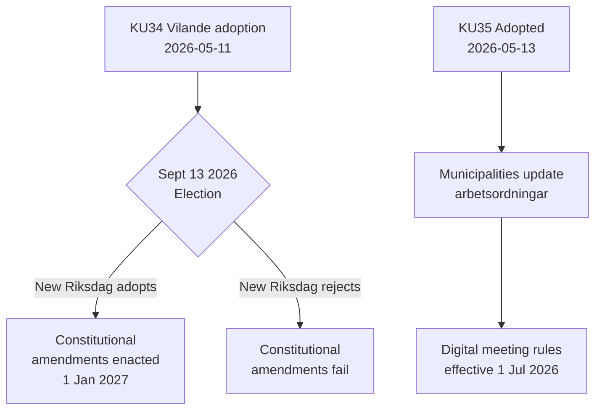

# Executive Brief — Committee Reports 2026-05-14

**Classification**: PUBLIC  
**Date**: 2026-05-14  
**Author**: Riksdagsmonitor Analysis Pipeline  
**Admiralty**: A2 (primary source documents)

## BLUF (Bottom Line Up Front)

Sweden's Constitutional Affairs Committee (KU) has advanced two landmark reports. The dominant event is adoption of **KU34** — a package of constitutional amendments (vilande) that must survive September 2026 elections and a second Riksdag vote to become law. The secondary event is the unanimous passage of **KU35** modernizing digital participation in municipal governance, effective 1 July 2026. Together, these represent Sweden's most significant constitutional moment in a decade.

## Key Decisions

| Decision | dok_id | Status | Effect Date |
|----------|--------|--------|-------------|
| Constitutional right to abortion (RF) | HD01KU34 | Vilande — awaits election + second passage | 1 Jan 2027 |
| Citizenship revocation for dual citizens | HD01KU34 | Vilande | 1 Jan 2027 |
| Freedom of association limits for criminal gangs | HD01KU34 | Vilande | 1 Jan 2027 |
| Digital municipal meeting rules | HD01KU35 | Adopted | 1 Jul 2026 |
| Private contractor oversight + annual reporting | HD01KU35 | Adopted | 1 Jul 2026 |
| New Riksdagen medal law | HD01KU43 | Adopted | TBC |

## Decision Flow

## Intelligence Significance

- **KU34 DIW 7.0 (L3)**: First constitutional enshrinement of abortion right in Swedish history. Citizenship revocation restores a tool removed by 2001 constitutional reform. Gang association restriction fills a gap enabling full criminalization of gang membership.
- **KU35 DIW 5.0 (L2)**: Affects 290 municipalities, 21 regions. Digital participation modernization + welfare contracting oversight chain; low controversy but high implementation risk.
- **Election dependency**: The September 2026 election is not just a political event — it is a constitutional prerequisite. The composition of the new riksdag determines whether Sweden's fundamental law changes.

## Time-Sensitive Indicators

1. **June 2026**: Opposition parties (S, V, C, MP) publish election manifestos with positions on KU34 second passage
2. **September 13, 2026**: Election — decisive for constitutional future
3. **October–November 2026**: New riksdag constituted; KU34 second passage vote scheduled
4. **1 July 2026**: KU35 municipal governance rules enter force
