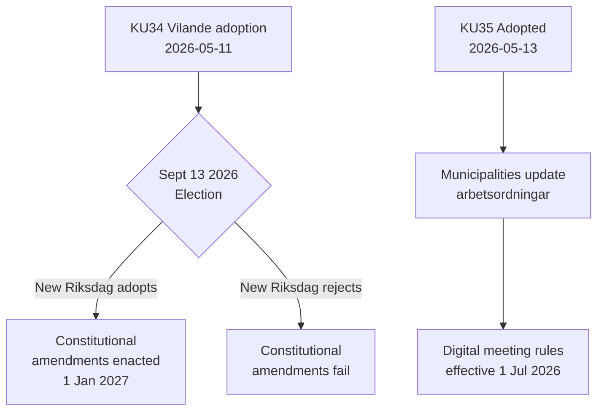

<!-- dir: rtl -->
# تقرير النشاط — تقارير اللجان 2026-05-14

**التصنيف**: عام  
**التاريخ**: 2026-05-14  
**المؤلف**: خط تحليل Riksdagsmonitor  
**تقييم الأميرالية**: A2 (وثائق المصادر الأولية)

## الخلاصة (الاستنتاج في المقدمة)

تقدمت لجنة الشؤون الدستورية السويدية (KU) بتقريرين بارزين. الحدث المهيمن هو اعتماد **KU34** — حزمة تعديلات دستورية (vilande) يجب أن تنجو من انتخابات سبتمبر 2026 وتصويت ثانٍ في الريكسداغ لتصبح قانوناً. الحدث الثانوي هو الاعتماد بالإجماع لـ**KU35** الذي يحدّث المشاركة الرقمية في الحوكمة البلدية، نافذاً اعتباراً من 1 يوليو 2026. مجتمعَين، يمثلان أهم لحظة دستورية في السويد منذ عقد.

## القرارات الرئيسية

| القرار | dok_id | الحالة | تاريخ النفاذ |
|--------|--------|--------|--------------|
| الحق الدستوري في الإجهاض (RF) | HD01KU34 | Vilande — ينتظر الانتخابات + الموافقة الثانية | 1 يناير 2027 |
| إلغاء الجنسية من حاملي الجنسية المزدوجة | HD01KU34 | Vilande | 1 يناير 2027 |
| تقييد حرية تكوين الجمعيات للعصابات الإجرامية | HD01KU34 | Vilande | 1 يناير 2027 |
| قواعد الاجتماعات البلدية الرقمية | HD01KU35 | معتمد | 1 يوليو 2026 |
| الإشراف على المقاولين الخاصين + التقارير السنوية | HD01KU35 | معتمد | 1 يوليو 2026 |
| قانون أوسمة الريكسداغ الجديد | HD01KU43 | معتمد | TBD |

## تدفق القرارات

## الأهمية الاستراتيجية الاستخباراتية

- **KU34 DIW 7,0 (L3)**: أول تكريس دستوري لحق الإجهاض في التاريخ السويدي. يستعيد إلغاء الجنسية أداةً أُزيلت بإصلاح دستوري عام 2001. تقييد الانتساب للعصابات يسد فجوة تتيح التجريم الكامل لعضوية العصابات.
- **KU35 DIW 5,0 (L2)**: يؤثر في 290 بلدية و21 منطقة. تحديث المشاركة الرقمية + سلسلة الإشراف على عقود الرعاية الاجتماعية؛ مستوى خلافي منخفض لكن مخاطر تنفيذ عالية.
- **الاعتماد على الانتخابات**: انتخابات سبتمبر 2026 ليست مجرد حدث سياسي — بل هي شرط دستوري مسبق. تكوين الريكسداغ الجديد يحدد ما إذا كان القانون الأساسي السويدي سيتغير.

## المؤشرات ذات الحساسية الزمنية

1. **يونيو 2026**: تنشر أحزاب المعارضة (S, V, C, MP) برامج انتخابية تتضمن مواقفها من التمرير الثاني لـ KU34
2. **13 سبتمبر 2026**: الانتخابات — حاسمة للمستقبل الدستوري
3. **أكتوبر–نوفمبر 2026**: تكوين الريكسداغ الجديد؛ جدولة التصويت على التمرير الثاني لـ KU34
4. **1 يوليو 2026**: قواعد الحوكمة البلدية لـ KU35 تدخل حيز التنفيذ

<!-- source-sha: 8763c85e325be570e196122722c24336774b5787 -->
