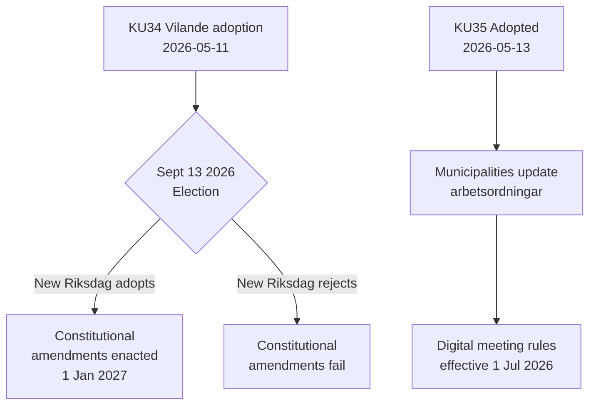

# Aktivitetsrapport — Udvalgsbetænkninger 2026-05-14

**Klassificering**: OFFENTLIG  
**Dato**: 2026-05-14  
**Forfatter**: Riksdagsmonitor Analyseflow  
**Admiralitetsvurdering**: A2 (primærkilder)

## BLUF (Bundlinje Øverst)

Sveriges Grundlovsudvalg (KU) har fremmet to banebrydende betænkninger. Den dominerende begivenhed er vedtagelsen af **KU34** — en pakke med grundlovsændringer (vilande) der skal overleve valget i september 2026 og en anden riksdagsafstemning for at blive lov. Den sekundære begivenhed er den enstemmige vedtagelse af **KU35**, der moderniserer digital deltagelse i kommunal forvaltning, ikrafttrædelse 1. juli 2026. Tilsammen repræsenterer disse Sveriges mest betydningsfulde grundlovsøjeblik i et årti.

## Vigtige beslutninger

| Beslutning | dok_id | Status | Ikrafttrædelsesdato |
|------------|--------|--------|---------------------|
| Grundlovsfæstet ret til abort (RF) | HD01KU34 | Vilande — afventer valg + anden behandling | 1. jan 2027 |
| Tilbagekaldelse af statsborgerskab for dobbeltstatsborger | HD01KU34 | Vilande | 1. jan 2027 |
| Begrænsning af foreningsfrihed for kriminelle bander | HD01KU34 | Vilande | 1. jan 2027 |
| Digitale kommunale møde-regler | HD01KU35 | Vedtaget | 1. jul 2026 |
| Tilsyn med private leverandører + årsrapportering | HD01KU35 | Vedtaget | 1. jul 2026 |
| Ny Riksdagen-medaljelov | HD01KU43 | Vedtaget | TBD |

## Beslutningsflow

## Efterretningsstrategisk betydning

- **KU34 DIW 7,0 (L3)**: Første grundlovsfæstelse af abortretten i svensk historie. Tilbagekaldelse af statsborgerskab genindføres som et redskab fjernet ved grundlovsreformen i 2001. Bandeassoceringsbegrænsning udfylder et hul, der muliggør fuld kriminalisering af bandemedlemskab.
- **KU35 DIW 5,0 (L2)**: Berører 290 kommuner og 21 regioner. Modernisering af digital deltagelse + tilsynskæde for velfærdskontrakter; lav kontroversiel niveau men høj implementeringsrisiko.
- **Valgafhængighed**: Valget i september 2026 er ikke blot en politisk begivenhed — det er en grundlovsforudsætning. Den nye riksdags sammensætning afgør, om Sveriges grundlov ændres.

## Tidsfølsomme indikatorer

1. **Juni 2026**: Oppositionspartier (S, V, C, MP) offentliggør valgprogrammer med holdninger til KU34's anden behandling
2. **13. september 2026**: Valget — afgørende for grundlovsens fremtid
3. **Oktober–november 2026**: Ny riksdag konstitueres; afstemning om KU34's anden behandling planlægges
4. **1. juli 2026**: KU35's kommunale styringsregler træder i kraft

<!-- source-sha: 8763c85e325be570e196122722c24336774b5787 -->
