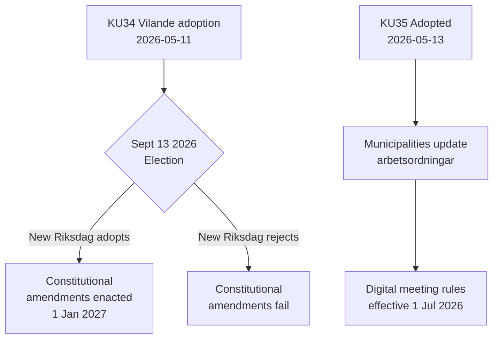

# Tätigkeitsbericht — Ausschussberichte 2026-05-14

**Klassifizierung**: ÖFFENTLICH  
**Datum**: 2026-05-14  
**Autor**: Riksdagsmonitor Analysepipeline  
**Admiralitätsbewertung**: A2 (Primärquelldokumente)

## BLUF (Fazit vorab)

Der schwedische Verfassungsausschuss (KU) hat zwei wegweisende Berichte vorangebracht. Das dominierende Ereignis ist die Annahme von **KU34** — ein Paket verfassungsrechtlicher Änderungen (vilande), das die Wahlen im September 2026 und eine zweite Riksdag-Abstimmung überstehen muss, um Gesetz zu werden. Das sekundäre Ereignis ist die einstimmige Verabschiedung von **KU35**, das die digitale Teilhabe in der kommunalen Verwaltung modernisiert, in Kraft ab 1. Juli 2026. Zusammen stellen diese Schwedensignifikantesten verfassungsrechtlichen Moment seit einem Jahrzehnt dar.

## Wichtige Entscheidungen

| Entscheidung | dok_id | Status | Datum des Inkrafttretens |
|--------------|--------|--------|--------------------------|
| Verfassungsrechtliches Recht auf Abtreibung (RF) | HD01KU34 | Vilande — wartet auf Wahlen + zweite Lesung | 1. Jan 2027 |
| Widerruf der Staatsangehörigkeit bei Doppelstaatsbürgern | HD01KU34 | Vilande | 1. Jan 2027 |
| Einschränkung der Vereinigungsfreiheit für kriminelle Banden | HD01KU34 | Vilande | 1. Jan 2027 |
| Digitale kommunale Versammlungsregeln | HD01KU35 | Verabschiedet | 1. Jul 2026 |
| Aufsicht über private Auftragnehmer + Jahresberichterstattung | HD01KU35 | Verabschiedet | 1. Jul 2026 |
| Neues Riksdagen-Medaillengesetz | HD01KU43 | Verabschiedet | TBD |

## Entscheidungsfluss

## Nachrichtendienstliche Bedeutung

- **KU34 DIW 7,0 (L3)**: Erste verfassungsrechtliche Verankerung des Abtreibungsrechts in der schwedischen Geschichte. Der Staatsangehörigkeitswiderruf stellt ein durch die Verfassungsreform 2001 abgeschafftes Instrument wieder her. Die Gangassozierungsbeschränkung schließt eine Lücke, die die vollständige Kriminalisierung der Bandenmitgliedschaft ermöglicht.
- **KU35 DIW 5,0 (L2)**: Betrifft 290 Kommunen und 21 Regionen. Modernisierung der digitalen Teilhabe + Überwachungskette für Wohlfahrtsverträge; geringes Kontroversitätsniveau, aber hohes Implementierungsrisiko.
- **Wahlabhängigkeit**: Die Wahlen im September 2026 sind nicht nur ein politisches Ereignis — sie sind eine verfassungsrechtliche Voraussetzung. Die Zusammensetzung des neuen Riksdags entscheidet, ob Schwedens Grundgesetz sich ändert.

## Zeitkritische Indikatoren

1. **Juni 2026**: Oppositionsparteien (S, V, C, MP) veröffentlichen Wahlprogramme mit Positionen zur zweiten Lesung von KU34
2. **13. September 2026**: Wahl — entscheidend für die verfassungsrechtliche Zukunft
3. **Oktober–November 2026**: Neuer Riksdag konstituiert sich; Abstimmung über zweite Lesung von KU34 geplant
4. **1. Juli 2026**: KU35-Kommunalverwaltungsregeln treten in Kraft

<!-- source-sha: 8763c85e325be570e196122722c24336774b5787 -->
