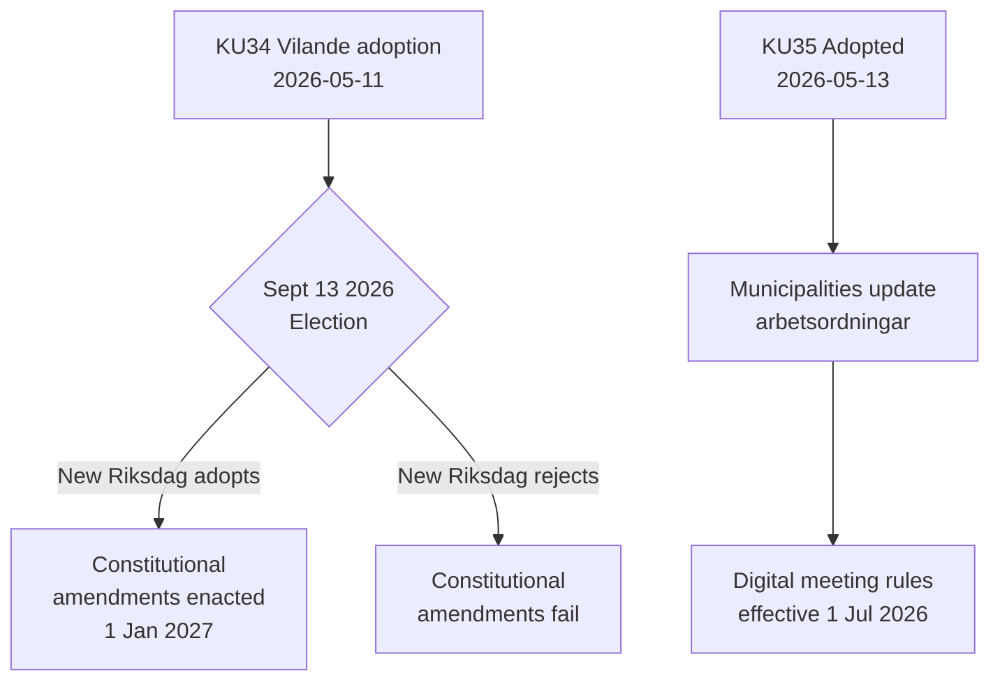

# Informe de Actividad — Informes de Comisión 2026-05-14

**Clasificación**: PÚBLICO  
**Fecha**: 2026-05-14  
**Autor**: Pipeline de Análisis Riksdagsmonitor  
**Calificación Almirantazgo**: A2 (documentos fuente primarios)

## BLUF (Conclusión al Frente)

El Comité de Asuntos Constitucionales sueco (KU) ha avanzado dos informes históricos. El evento dominante es la adopción de **KU34** — un paquete de enmiendas constitucionales (vilande) que debe superar las elecciones de septiembre de 2026 y una segunda votación del Riksdag para convertirse en ley. El evento secundario es la adopción unánime de **KU35** que moderniza la participación digital en la gobernanza municipal, en vigor el 1 de julio de 2026. Juntos representan el momento constitucional más significativo de Suecia en una década.

## Decisiones Clave

| Decisión | dok_id | Estado | Fecha de entrada en vigor |
|----------|--------|--------|---------------------------|
| Derecho constitucional al aborto (RF) | HD01KU34 | Vilande — espera elecciones + segunda aprobación | 1 ene 2027 |
| Revocación de ciudadanía para ciudadanos dobles | HD01KU34 | Vilande | 1 ene 2027 |
| Limitación de la libertad de asociación para bandas criminales | HD01KU34 | Vilande | 1 ene 2027 |
| Normas de reunión municipal digital | HD01KU35 | Adoptado | 1 jul 2026 |
| Supervisión de contratistas privados + informe anual | HD01KU35 | Adoptado | 1 jul 2026 |
| Nueva ley de medallas del Riksdagen | HD01KU43 | Adoptado | TBD |

## Flujo de Decisiones

## Significación Estratégica de Inteligencia

- **KU34 DIW 7,0 (L3)**: Primera consagración constitucional del derecho al aborto en la historia sueca. La revocación de ciudadanía restaura una herramienta suprimida por la reforma constitucional de 2001. La restricción de asociación de bandas llena un vacío que permite la criminalización total de la membresía en bandas.
- **KU35 DIW 5,0 (L2)**: Afecta a 290 municipios y 21 regiones. Modernización de la participación digital + cadena de supervisión de contratos de bienestar; bajo nivel de controversia pero alto riesgo de implementación.
- **Dependencia electoral**: Las elecciones de septiembre de 2026 no son solo un evento político — son un requisito constitucional previo. La composición del nuevo Riksdag determina si cambia la ley fundamental de Suecia.

## Indicadores Sensibles al Tiempo

1. **Junio 2026**: Partidos de oposición (S, V, C, MP) publican programas electorales con posiciones sobre la segunda aprobación de KU34
2. **13 de septiembre de 2026**: Elección — decisiva para el futuro constitucional
3. **Octubre–noviembre 2026**: Nuevo Riksdag constituido; votación sobre segunda aprobación de KU34 programada
4. **1 de julio de 2026**: Normas de gobernanza municipal de KU35 entran en vigor

<!-- source-sha: 8763c85e325be570e196122722c24336774b5787 -->
