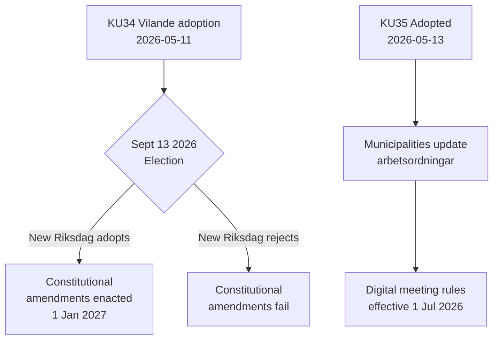

# Toimintaraportti — Valiokunnan Mietinnöt 2026-05-14

**Luokittelu**: JULKINEN  
**Päivämäärä**: 2026-05-14  
**Tekijä**: Riksdagsmonitor Analyysiputki  
**Admiraliteettiarvo**: A2 (primäärilähteet)

## BLUF (Yhteenveto Ensin)

Ruotsin perustuslakivaliokunta (KU) on edistänyt kahta merkittävää mietintöä. Hallitseva tapahtuma on **KU34**:n hyväksyminen — paketti perustuslaillisia muutoksia (vilande), joiden on selvitettävä syyskuun 2026 vaaleista ja toisesta valtiopäivääänestyksestä tullakseen laiksi. Toissijainen tapahtuma on **KU35**:n yksimielinen hyväksyminen, joka modernisoi digitaalista osallistumista kunnallisessa hallinnossa, voimaan 1. heinäkuuta 2026. Yhdessä nämä edustavat Ruotsin merkittävintä perustuslaillista hetkeä vuosikymmeniä.

## Tärkeimmät päätökset

| Päätös | dok_id | Tila | Voimaantulopäivä |
|--------|--------|------|------------------|
| Perustuslaillinen oikeus aborttiin (RF) | HD01KU34 | Vilande — odottaa vaaleja + toista käsittelyä | 1.1.2027 |
| Kansalaisuuden peruuttaminen kaksoiskansalaisilta | HD01KU34 | Vilande | 1.1.2027 |
| Yhdistymisvapauden rajoittaminen rikollisille jengille | HD01KU34 | Vilande | 1.1.2027 |
| Digitaaliset kunnalliset kokousmääräykset | HD01KU35 | Hyväksytty | 1.7.2026 |
| Yksityisten urakoitsijoiden valvonta + vuosiraportointi | HD01KU35 | Hyväksytty | 1.7.2026 |
| Uusi valtiopäivien mitalilaki | HD01KU43 | Hyväksytty | TBD |

## Päätösvirta

## Tiedustelustrateginen merkitys

- **KU34 DIW 7,0 (L3)**: Ensimmäinen abortioikeuden perustuslaillinen kirjaaminen Ruotsin historiassa. Kansalaisuuden peruuttaminen palauttaa 2001 vuoden perustuslakiuudistuksessa poistetun välineen. Jengiassosiaatiorajoitus täyttää aukon, joka mahdollistaa jengienjäsenyyden täydellisen kriminalisoinnin.
- **KU35 DIW 5,0 (L2)**: Koskee 290 kuntaa ja 21 aluetta. Digitaalisen osallistumisen modernisointi + hyvinvointisopimusten valvontaketju; matala kiistanalainen taso mutta korkea toteutusriski.
- **Vaali riippuvuus**: Syyskuun 2026 vaalit eivät ole vain poliittinen tapahtuma — ne ovat perustuslaillinen edellytys. Uuden valtiopäivien kokoonpano ratkaisee muuttuuko Ruotsin perustuslaki.

## Aikaherkät indikaattorit

1. **Kesäkuu 2026**: Oppositiopuolueet (S, V, C, MP) julkaisevat vaaliohjelmat KU34:n toista käsittelyä koskevilla kannoilla
2. **13. syyskuuta 2026**: Vaalit — ratkaisevat perustuslain tulevaisuuden kannalta
3. **Lokakuu–marraskuu 2026**: Uusi valtiopäivät muodostetaan; KU34:n toinen käsittely äänestetään
4. **1. heinäkuuta 2026**: KU35:n kunnallisen hallinnon säännöt astuvat voimaan

<!-- source-sha: 8763c85e325be570e196122722c24336774b5787 -->
