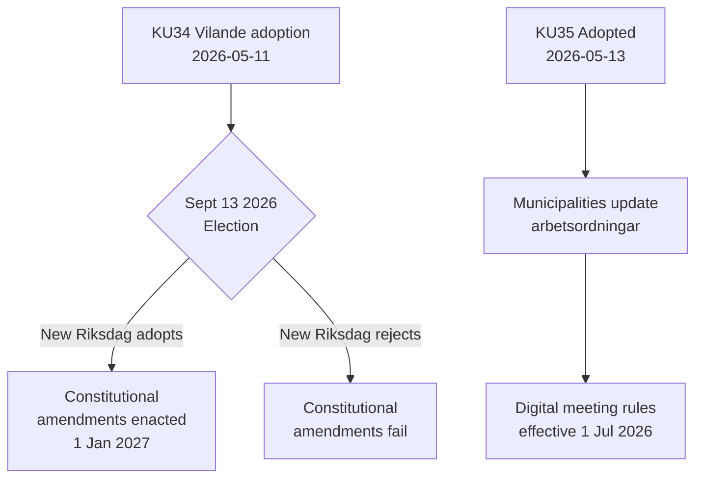

# Rapport d'Activité — Rapports de Commission 2026-05-14

**Classification**: PUBLIC  
**Date**: 2026-05-14  
**Auteur**: Pipeline d'Analyse Riksdagsmonitor  
**Évaluation Amirauté**: A2 (documents sources primaires)

## BLUF (Conclusion en Tête)

La Commission des affaires constitutionnelles suédoise (KU) a fait avancer deux rapports historiques. L'événement dominant est l'adoption de **KU34** — un paquet d'amendements constitutionnels (vilande) qui doit survivre aux élections de septembre 2026 et à un second vote du Riksdag pour devenir loi. L'événement secondaire est l'adoption unanime de **KU35** modernisant la participation numérique dans la gouvernance municipale, en vigueur le 1er juillet 2026. Ensemble, ils représentent le moment constitutionnel le plus significatif de la Suède depuis une décennie.

## Décisions Clés

| Décision | dok_id | Statut | Date d'entrée en vigueur |
|----------|--------|--------|--------------------------|
| Droit constitutionnel à l'avortement (RF) | HD01KU34 | Vilande — attend les élections + deuxième passage | 1er jan 2027 |
| Révocation de la nationalité pour les doubles nationaux | HD01KU34 | Vilande | 1er jan 2027 |
| Limitation de la liberté d'association pour les gangs criminels | HD01KU34 | Vilande | 1er jan 2027 |
| Règles numériques de réunion municipale | HD01KU35 | Adopté | 1er jul 2026 |
| Surveillance des contractants privés + rapport annuel | HD01KU35 | Adopté | 1er jul 2026 |
| Nouvelle loi sur les médailles du Riksdagen | HD01KU43 | Adopté | TBD |

## Flux de Décision

## Signification Stratégique du Renseignement

- **KU34 DIW 7,0 (L3)**: Première consécration constitutionnelle du droit à l'avortement dans l'histoire suédoise. La révocation de la nationalité rétablit un outil supprimé par la réforme constitutionnelle de 2001. La restriction d'association de gangs comble une lacune permettant la criminalisation complète de l'appartenance à un gang.
- **KU35 DIW 5,0 (L2)**: Concerne 290 communes et 21 régions. Modernisation de la participation numérique + chaîne de supervision des contrats de protection sociale; faible niveau de controverse mais risque élevé d'implémentation.
- **Dépendance électorale**: L'élection de septembre 2026 n'est pas seulement un événement politique — c'est une condition préalable constitutionnelle. La composition du nouveau Riksdag détermine si la loi fondamentale suédoise change.

## Indicateurs Temporellement Sensibles

1. **Juin 2026**: Les partis d'opposition (S, V, C, MP) publient des programmes électoraux avec des positions sur le second passage de KU34
2. **13 septembre 2026**: Élection — décisive pour l'avenir constitutionnel
3. **Octobre–novembre 2026**: Nouveau Riksdag constitué ; vote sur le second passage de KU34 programmé
4. **1er juillet 2026**: Les règles de gouvernance municipale de KU35 entrent en vigueur

<!-- source-sha: 8763c85e325be570e196122722c24336774b5787 -->
