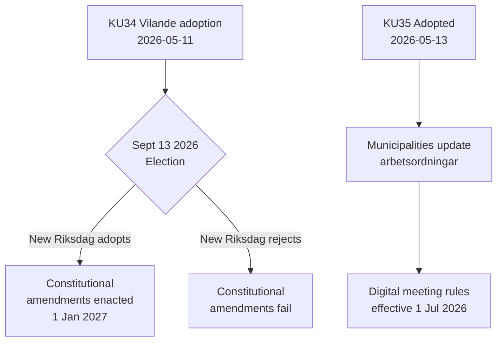

<!-- dir: rtl -->
# דוח פעילות — דוחות ועדה 2026-05-14

**סיווג**: ציבורי  
**תאריך**: 2026-05-14  
**מחבר**: צינור ניתוח Riksdagsmonitor  
**דירוג אדמירלות**: A2 (מסמכי מקורות ראשוניים)

## סיכום (מסקנה בראש)

ועדת ענייני החוקה השוודית (KU) קידמה שני דוחות מהותיים. האירוע הדומיננטי הוא אימוץ **KU34** — חבילת תיקונים חוקתיים (vilande) שעליה לשרוד את הבחירות בספטמבר 2026 ואת ההצבעה השנייה בריקסדאג כדי להפוך לחוק. האירוע המשני הוא האימוץ הפה-אחד של **KU35** המחדש את ההשתתפות הדיגיטלית בממשל העירוני, בתוקף מה-1 ביולי 2026. יחד, הם מייצגים את הרגע החוקתי המשמעותי ביותר בשוודיה מאז עשור.

## החלטות מרכזיות

| החלטה | dok_id | מצב | תאריך כניסה לתוקף |
|--------|--------|-----|-------------------|
| זכות חוקתית להפלה (RF) | HD01KU34 | Vilande — ממתין לבחירות + מעבר שני | 1 ינואר 2027 |
| ביטול אזרחות לבעלי אזרחות כפולה | HD01KU34 | Vilande | 1 ינואר 2027 |
| הגבלת חופש ההתאגדות לכנופיות פשע | HD01KU34 | Vilande | 1 ינואר 2027 |
| כללי ישיבות עירוניות דיגיטליות | HD01KU35 | אומץ | 1 יולי 2026 |
| פיקוח על קבלני משנה פרטיים + דיווח שנתי | HD01KU35 | אומץ | 1 יולי 2026 |
| חוק מדליות ריקסדאגן חדש | HD01KU43 | אומץ | TBD |

## זרימת ההחלטות

## חשיבות אסטרטגית של מודיעין

- **KU34 DIW 7.0 (L3)**: עיגון חוקתי ראשון של זכות ההפלה בהיסטוריה השוודית. ביטול האזרחות משחזר כלי שהוסר ברפורמה החוקתית ב-2001. הגבלת שיוך לכנופיות ממלאת פרצה המאפשרת הפללה מלאה של חברות בכנופיות.
- **KU35 DIW 5.0 (L2)**: משפיע על 290 עיריות ו-21 מחוזות. מודרניזציה של השתתפות דיגיטלית + שרשרת פיקוח על חוזי רווחה; רמת מחלוקת נמוכה אך סיכון גבוה ליישום.
- **תלות בבחירות**: בחירות ספטמבר 2026 אינן רק אירוע פוליטי — הן תנאי מוקדם חוקתי. הרכב הריקסדאג החדש קובע אם חוק היסוד של שוודיה ישתנה.

## מחוונים רגישים לזמן

1. **יוני 2026**: מפלגות האופוזיציה (S, V, C, MP) מפרסמות מצעים בחירות עם עמדות לגבי המעבר השני של KU34
2. **13 בספטמבר 2026**: הבחירות — מכריעות לעתיד החוקתי
3. **אוקטובר–נובמבר 2026**: ריקסדאג חדש מתכונן; הצבעה על מעבר שני של KU34 מתוכננת
4. **1 ביולי 2026**: כללי ממשל עירוני של KU35 נכנסים לתוקף

<!-- source-sha: 8763c85e325be570e196122722c24336774b5787 -->
