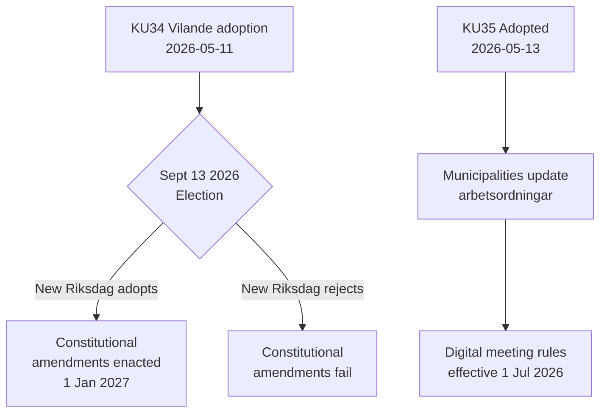

# 活動報告 — 委員会報告書 2026-05-14

**分類**: 公開  
**日付**: 2026-05-14  
**著者**: Riksdagsmonitor 分析パイプライン  
**海軍評価**: A2 (一次資料文書)

## 要旨

スウェーデン憲法委員会（KU）は2つの画期的な報告書を前進させた。主要な出来事は**KU34**の採択——選挙前保留（vilande）の憲法改正パッケージで、2026年9月の選挙と第2次議会採決を経ないと法律にならない。副次的な出来事は**KU35**の全会一致採択で、地方自治体のデジタル参加を近代化し、2026年7月1日施行。合わせて、これらは10年来のスウェーデン最重要な憲法的瞬間を代表する。

## 主要決定

| 決定 | dok_id | 状況 | 施行日 |
|------|--------|------|--------|
| 中絶の憲法上の権利（RF） | HD01KU34 | Vilande — 選挙 + 第2次採決待ち | 2027年1月1日 |
| 二重国籍者の市民権剥奪 | HD01KU34 | Vilande | 2027年1月1日 |
| 犯罪組織の結社の自由制限 | HD01KU34 | Vilande | 2027年1月1日 |
| デジタル市議会規則 | HD01KU35 | 採択 | 2026年7月1日 |
| 民間委託業者監督 + 年次報告 | HD01KU35 | 採択 | 2026年7月1日 |
| 新リクスダーゲン勲章法 | HD01KU43 | 採択 | TBD |

## 決定フロー

## 情報戦略的意義

- **KU34 DIW 7.0 (L3)**: スウェーデン史上初の中絶権の憲法的保障。市民権剥奪は2001年憲法改正で廃止されたツールを復元。組織犯罪加入制限は組織完全犯罪化を可能にする空白を埋める。
- **KU35 DIW 5.0 (L2)**: 290の地方自治体と21の地域に影響。デジタル参加の近代化 + 福祉契約の監督チェーン；低い論争レベルだが高い実施リスク。
- **選挙依存性**: 2026年9月の選挙は単なる政治的イベントではなく——憲法上の前提条件。新議会の構成がスウェーデンの基本法が変わるかどうかを決定する。

## 時間的に敏感な指標

1. **2026年6月**: 野党（S、V、C、MP）がKU34第2次採決への立場を含む選挙公約を発表
2. **2026年9月13日**: 選挙——憲法的未来を左右する
3. **2026年10月〜11月**: 新議会が構成；KU34第2次採決投票が予定
4. **2026年7月1日**: KU35の地方自治体ガバナンス規則施行

<!-- source-sha: 8763c85e325be570e196122722c24336774b5787 -->
