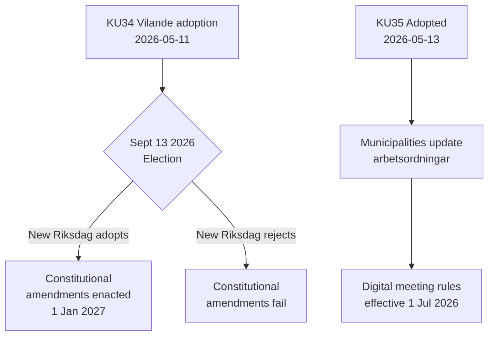

# 활동 보고서 — 위원회 보고서 2026-05-14

**분류**: 공개  
**날짜**: 2026-05-14  
**저자**: Riksdagsmonitor 분석 파이프라인  
**해군 평가**: A2 (1차 출처 문서)

## 핵심 요약

스웨덴 헌법위원회(KU)가 두 가지 획기적인 보고서를 추진했다. 주요 사건은 **KU34** 채택——법률로 되려면 2026년 9월 선거와 두 번째 의회 투표를 통과해야 하는 헌법 개정 패키지(vilande). 부수적 사건은 지방자치 디지털 참여를 현대화하는 **KU35**의 만장일치 채택으로, 2026년 7월 1일 시행. 합쳐서 이것들은 10년간 스웨덴의 가장 중요한 헌법적 순간을 대표한다.

## 주요 결정

| 결정 | dok_id | 현황 | 발효일 |
|------|--------|------|--------|
| 헌법적 낙태권(RF) | HD01KU34 | Vilande — 선거 + 두 번째 통과 대기 | 2027년 1월 1일 |
| 이중국적자 시민권 박탈 | HD01KU34 | Vilande | 2027년 1월 1일 |
| 범죄 조직에 대한 결사의 자유 제한 | HD01KU34 | Vilande | 2027년 1월 1일 |
| 디지털 지방자치 회의 규칙 | HD01KU35 | 채택 | 2026년 7월 1일 |
| 민간 계약업체 감독 + 연간 보고 | HD01KU35 | 채택 | 2026년 7월 1일 |
| 새 리크스다겐 훈장법 | HD01KU43 | 채택 | TBD |

## 결정 흐름

## 정보 전략적 의의

- **KU34 DIW 7.0 (L3)**: 스웨덴 역사상 최초의 헌법적 낙태권 명문화. 시민권 박탈은 2001년 헌법 개혁으로 폐지된 도구를 복원. 조직범죄 가입 제한은 조직 가입의 완전한 범죄화를 가능하게 하는 공백을 채움.
- **KU35 DIW 5.0 (L2)**: 290개 지방자치단체와 21개 광역 영향. 디지털 참여 현대화 + 복지 계약 감독 체계; 낮은 논란 수준이나 높은 실행 위험.
- **선거 의존성**: 2026년 9월 선거는 단순한 정치적 사건이 아니라——헌법적 전제 조건. 새 의회 구성이 스웨덴 기본법 변경 여부를 결정.

## 시간 민감 지표

1. **2026년 6월**: 야당(S, V, C, MP)이 KU34 두 번째 통과에 대한 입장이 담긴 선거 공약 발표
2. **2026년 9월 13일**: 선거——헌법적 미래에 결정적
3. **2026년 10월~11월**: 새 의회 구성; KU34 두 번째 통과 투표 예정
4. **2026년 7월 1일**: KU35 지방자치 거버넌스 규칙 시행

<!-- source-sha: 8763c85e325be570e196122722c24336774b5787 -->
