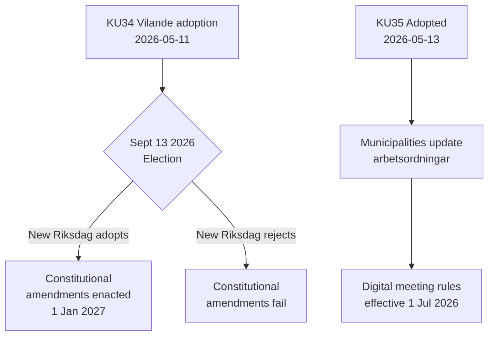

# Activiteitenrapport — Commissierapporten 2026-05-14

**Classificatie**: OPENBAAR  
**Datum**: 2026-05-14  
**Auteur**: Riksdagsmonitor Analysepipeline  
**Admiraliteitsbeoordeling**: A2 (primaire brondocumenten)

## BLUF (Conclusie Voorop)

De Zweedse Commissie voor Constitutionele Zaken (KU) heeft twee baanbrekende rapporten voortgezet. De dominante gebeurtenis is de aanvaarding van **KU34** — een pakket grondwettelijke wijzigingen (vilande) dat de verkiezingen van september 2026 en een tweede Riksdag-stemming moet doorstaan om wet te worden. De secundaire gebeurtenis is de unaniem aanvaarding van **KU35** dat de digitale participatie in de gemeentelijke bestuur moderniseert, van kracht op 1 juli 2026. Samen vertegenwoordigen deze het meest significante grondwettelijke moment van Zweden in een decennium.

## Belangrijke Beslissingen

| Beslissing | dok_id | Status | Datum van inwerkingtreding |
|------------|--------|--------|----------------------------|
| Grondwettelijk recht op abortus (RF) | HD01KU34 | Vilande — wacht op verkiezingen + tweede lezing | 1 jan 2027 |
| Intrekking van burgerschap voor dubbele nationaliteitshouders | HD01KU34 | Vilande | 1 jan 2027 |
| Beperking van vrijheid van vereniging voor criminele bendes | HD01KU34 | Vilande | 1 jan 2027 |
| Digitale gemeentelijke vergaderregels | HD01KU35 | Aanvaard | 1 jul 2026 |
| Toezicht op private aannemers + jaarrapportage | HD01KU35 | Aanvaard | 1 jul 2026 |
| Nieuwe Riksdagen-medaillenwet | HD01KU43 | Aanvaard | TBD |

## Beslissingsflow

## Strategische Inlichtingenbetekenis

- **KU34 DIW 7,0 (L3)**: Eerste grondwettelijke verankering van het abortusrecht in de Zweedse geschiedenis. Intrekking van burgerschap herstelt een instrument dat door de grondwetshervorming van 2001 was afgeschaft. Bendeassociatiebeperking vult een leemte die volledige criminalisering van bendelidmaatschap mogelijk maakt.
- **KU35 DIW 5,0 (L2)**: Betreft 290 gemeenten en 21 regio's. Modernisering van digitale participatie + toezichtketen voor welzijnscontracten; laag controversieniveau maar hoog implementatierisico.
- **Verkiezingsafhankelijkheid**: De verkiezingen van september 2026 zijn niet alleen een politieke gebeurtenis — ze zijn een grondwettelijke voorwaarde. De samenstelling van de nieuwe Riksdag bepaalt of de Zweedse grondwet verandert.

## Tijdgevoelige Indicatoren

1. **Juni 2026**: Oppositiepartijen (S, V, C, MP) publiceren verkiezingsprogramma's met standpunten over de tweede lezing van KU34
2. **13 september 2026**: Verkiezingen — beslissend voor de grondwettelijke toekomst
3. **Oktober–november 2026**: Nieuwe Riksdag geconstitueerd; stemming over tweede lezing van KU34 gepland
4. **1 juli 2026**: KU35-gemeentelijke bestuursregels treden in werking

<!-- source-sha: 8763c85e325be570e196122722c24336774b5787 -->
