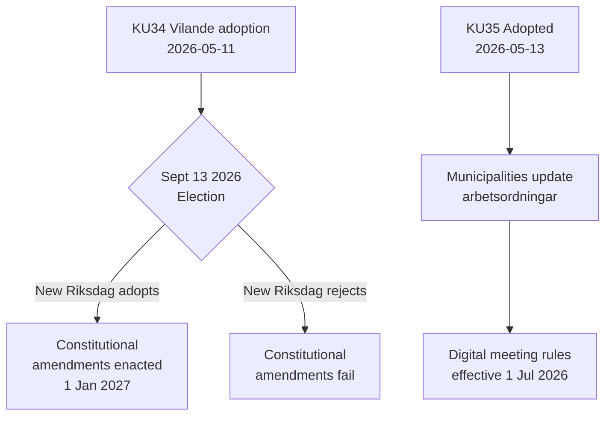

# Aktivitetsrapport — Komitébetenkninger 2026-05-14

**Klassifisering**: OFFENTLIG  
**Dato**: 2026-05-14  
**Forfatter**: Riksdagsmonitor Analyseflyt  
**Admiralitetsvurdering**: A2 (primærkilder)

## BLUF (Bunnlinje Øverst)

Sveriges grunnlovsutvalg (KU) har fremmet to banebrytende betenkninger. Den dominerende hendelsen er vedtakelsen av **KU34** — en pakke med grunnlovsendringer (vilande) som må overleve valget i september 2026 og en andre riksdagsavstemning for å bli lov. Den sekundære hendelsen er den enstemmige vedtakelsen av **KU35** som moderniserer digital deltakelse i kommunal styring, ikrafttredelse 1. juli 2026. Til sammen representerer disse Sveriges mest betydningsfulle grunnlovsøyeblikk på et tiår.

## Viktige beslutninger

| Beslutning | dok_id | Status | Ikrafttredelsesdato |
|------------|--------|--------|---------------------|
| Grunnlovsfestet rett til abort (RF) | HD01KU34 | Vilande — avventer valg + andre behandling | 1. jan 2027 |
| Tilbakekalling av statsborgerskap for dobbeltstatsborger | HD01KU34 | Vilande | 1. jan 2027 |
| Begrensning av foreningsfrihet for kriminelle gjenger | HD01KU34 | Vilande | 1. jan 2027 |
| Digitale kommunale møteregler | HD01KU35 | Vedtatt | 1. jul 2026 |
| Tilsyn med private leverandører + årsrapportering | HD01KU35 | Vedtatt | 1. jul 2026 |
| Ny riksdagsmedaljelov | HD01KU43 | Vedtatt | TBD |

## Beslutningsflyt

## Etterretningsstrategisk betydning

- **KU34 DIW 7,0 (L3)**: Første grunnlovsfesting av abortretten i svensk historie. Tilbakekalling av statsborgerskap gjeninnfører et verktøy som ble fjernet ved grunnlovsreformen i 2001. Gjengassosiasjonsbegrensning fyller et hull som muliggjør full kriminalisering av gjengemedlemskap.
- **KU35 DIW 5,0 (L2)**: Berører 290 kommuner og 21 regioner. Modernisering av digital deltakelse + tilsynskjede for velferdskontrakter; lav kontroversiell nivå men høy implementeringsrisiko.
- **Valgavhengighet**: Valget i september 2026 er ikke bare en politisk begivenhet — det er en grunnlovsforutsetning. Den nye riksdagens sammensetning avgjør om Sveriges grunnlov endres.

## Tidssensitive indikatorer

1. **Juni 2026**: Opposisjonspartier (S, V, C, MP) publiserer valgprogrammer med standpunkter om KU34:s andre behandling
2. **13. september 2026**: Valget — avgjørende for grunnlovens fremtid
3. **Oktober–november 2026**: Ny riksdag konstitueres; avstemning om KU34:s andre behandling planlegges
4. **1. juli 2026**: KU35:s kommunale styringsregler trer i kraft

<!-- source-sha: 8763c85e325be570e196122722c24336774b5787 -->
