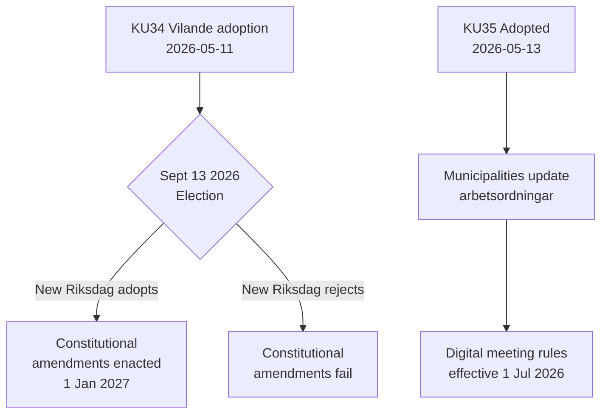

# Verksamhetsrapport — Utskottsbetänkanden 2026-05-14

**Klassificering**: OFFENTLIG  
**Datum**: 2026-05-14  
**Författare**: Riksdagsmonitor Analysflöde  
**Admiralitetsgrad**: A2 (primärkällsdokument)

## BLUF (Slutsats i förväg)

Sveriges konstitutionsutskott (KU) har avancerat med två banbrytande betänkanden. Den dominerande händelsen är antagandet av **KU34** — ett paket med konstitutionella ändringar (vilande) som måste överleva valet i september 2026 och en andra riksdagsomröstning för att bli lag. Den sekundära händelsen är det enhälliga antagandet av **KU35** som moderniserar digitalt deltagande i kommunal förvaltning, ikraft 1 juli 2026. Tillsammans utgör dessa Sveriges mest betydelsefulla konstitutionella ögonblick på ett decennium.

## Viktiga beslut

| Beslut | dok_id | Status | Ikraftträdandedatum |
|--------|--------|--------|---------------------|
| Konstitutionell rätt till abort (RF) | HD01KU34 | Vilande — inväntar val + andra behandling | 1 jan 2027 |
| Medborgarskapsåterkallelse för dubbla medborgare | HD01KU34 | Vilande | 1 jan 2027 |
| Begränsning av föreningsfrihet för kriminella gäng | HD01KU34 | Vilande | 1 jan 2027 |
| Digitala kommunala mötesregler | HD01KU35 | Antaget | 1 jul 2026 |
| Tillsyn av privata entreprenörer + årsrapportering | HD01KU35 | Antaget | 1 jul 2026 |
| Ny medallagstiftning för riksdagen | HD01KU43 | Antaget | TBD |

## Beslutsflöde

## Underrättelsestrategisk betydelse

- **KU34 DIW 7,0 (L3)**: Första konstitutionella inskrivningen av aborträtten i svensk historia. Medborgarskapsåterkallelse återinför ett verktyg som avlägsnades vid 2001 års grundlagsreform. Gangassociationsbegränsning fyller en lucka som möjliggör fullständig kriminalisering av gängmedlemskap.
- **KU35 DIW 5,0 (L2)**: Berör 290 kommuner och 21 regioner. Modernisering av digitalt deltagande + tillsynskedja för välfärdsentreprenad; låg kontroversiell nivå men hög implementeringsrisk.
- **Valberoende**: Valet i september 2026 är inte bara en politisk händelse — det är en konstitutionell förutsättning. Den nya riksdagens sammansättning avgör om Sveriges grundlag förändras.

## Tidskänsliga indikatorer

1. **Juni 2026**: Oppositionspartier (S, V, C, MP) publicerar valmanifest med ställningstaganden om KU34:s andra behandling
2. **13 september 2026**: Valet — avgörande för konstitutionell framtid
3. **Oktober–november 2026**: Ny riksdag konstitueras; omröstning om KU34:s andra behandling planeras
4. **1 juli 2026**: KU35:s kommunala styrningsregler träder i kraft

<!-- source-sha: 8763c85e325be570e196122722c24336774b5787 -->
