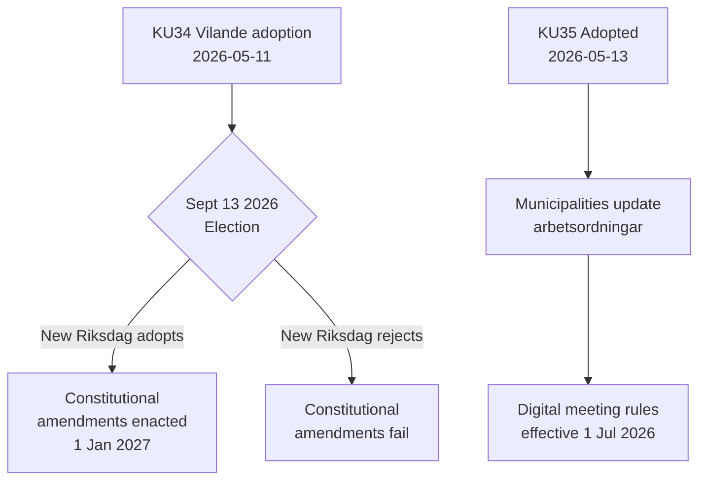

# 活动报告 — 委员会报告 2026-05-14

**分类**: 公开  
**日期**: 2026-05-14  
**作者**: Riksdagsmonitor 分析管道  
**海军评级**: A2 (主要来源文件)

## 核心摘要

瑞典宪法事务委员会（KU）推进了两份具有里程碑意义的报告。主要事件是采纳**KU34**——一套宪法修正案（vilande），必须在2026年9月大选和议会第二次表决后才能成为法律。次要事件是**KU35**的全票通过，现代化了市政治理中的数字参与，自2026年7月1日生效。两者合计，代表着瑞典十年来最重要的宪法时刻。

## 关键决定

| 决定 | dok_id | 状态 | 生效日期 |
|------|--------|------|----------|
| 宪法性堕胎权（RF） | HD01KU34 | Vilande — 等待选举 + 第二次通过 | 2027年1月1日 |
| 吊销双重国籍者公民身份 | HD01KU34 | Vilande | 2027年1月1日 |
| 限制犯罪团伙的结社自由 | HD01KU34 | Vilande | 2027年1月1日 |
| 数字市政会议规则 | HD01KU35 | 已采纳 | 2026年7月1日 |
| 私人承包商监督 + 年度报告 | HD01KU35 | 已采纳 | 2026年7月1日 |
| 新议会勋章法 | HD01KU43 | 已采纳 | TBD |

## 决策流程

## 情报战略意义

- **KU34 DIW 7.0 (L3)**: 瑞典历史上首次宪法性确立堕胎权。撤销公民身份恢复了2001年宪法改革中废除的工具。帮派关联限制填补了允许全面将帮派成员身份入刑的空白。
- **KU35 DIW 5.0 (L2)**: 影响290个市政府和21个地区。数字参与现代化 + 福利合同监督链；争议水平低但实施风险高。
- **选举依赖性**: 2026年9月选举不仅是政治事件——它是宪法前提条件。新议会的组成决定了瑞典基本法是否改变。

## 时效性指标

1. **2026年6月**: 反对党（S、V、C、MP）发布选举宣言，表明对KU34第二次通过的立场
2. **2026年9月13日**: 选举——宪法未来的决定性因素
3. **2026年10月–11月**: 新议会组成；KU34第二次通过投票预定
4. **2026年7月1日**: KU35市政治理规则生效

<!-- source-sha: 8763c85e325be570e196122722c24336774b5787 -->
