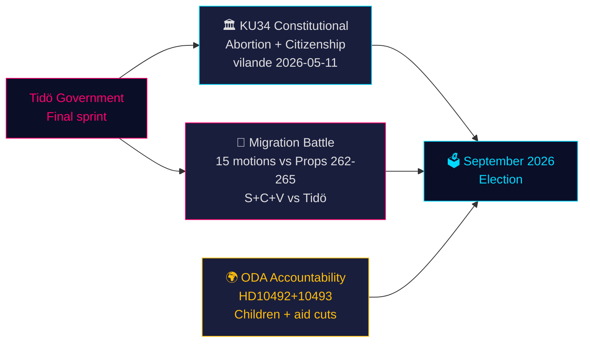

# Sweden's Constitutional Moment and Pre-Election Policy Sprint — Evening Intelligence, 14 May 2026

**Author**: James Pether Sörling  
**Date**: 2026-05-14  
**Classification**: PUBLIC | **Admiralty**: B2 (Reliable; probably true)  
**Confidence**: HIGH on factual reporting; MEDIUM on electoral projections  
**Election proximity**: ≤6 months (September 2026) — 1.5× DIW multiplier active

---

## BLUF

Sweden's parliamentary record for 14 May 2026 is defined by three intersecting crises that will shape the September election: a historic constitutional amendment package (*vilande*) protecting abortion rights and enabling citizenship revocation (KU34); a migration policy confrontation between the Tidö coalition and a coordinated S+C+V opposition bloc contesting four migration propositions; and a ministerial accountability crisis over development aid cuts harming children. Together, these issues constitute the policy battlefield for the 2026 election — and the government's choices today will be tested at the ballot box in 127 days.

---

## Decisions This Brief Supports

1. **Constitutional tracking**: Will the KU34 *vilande* adoption survive the post-election composition change? (65% base case: yes, if current coalition survives; 20% partial; 15% failure)
2. **Migration litigation risk**: Should legal/compliance teams prepare for ECHR challenge to HD03267 (security deportation) and Lagrådet scrutiny of prop 265 (child detention)?
3. **ODA accountability exposure**: How will Minister Dousa's response to HD10492 (due 2026-05-29) affect the government's human rights credibility before the election?

---

## 60-Second Intelligence Bullets

- 🏛️ **Constitutional amendment** (KU34): *vilande* adopted 11 May 2026 — Swedish constitution now en route to protecting abortion rights and enabling revocation of citizenship for gang members. Second passage required after September 2026 election. Historic — most significant constitutional change since 2010-2011.
- 🛂 **Migration battle**: 15 opposition motions filed 13 May 2026 by S, C, V contesting government's migration propositions 262-265. Government has 176/349 seats — passage likely, but prop 265 (child detention) carries Lagrådet CRC Art. 37 risk and possible government concession.
- 🌍 **ODA accountability**: V interpellations HD10492-10493 demand Dousa explain why no *barnkonsekvensanalys* was conducted before Sweden's largest-ever ODA restructuring, which closed programs for malnourished children and maternal healthcare in conflict zones.
- 💻 **Government sprint**: Three propositions (HD03250 digital identity, HD03261 Skatteverket, HD03267 security deportation) form Tidö government's final pre-election governance statement. All likely enacted before September.
- 📊 **Economic context**: Sweden GDP growth +1.1% (2025), +2.0% projected (2026) per WEO Apr-2026. Public debt 35.9% of GDP — fiscally conservative baseline that anchors government's competence narrative.

---

## Top Forward Trigger

**⚠️ Critical watch — 2026-05-29**: Dousa response to HD10492 on children and development aid. This single ministerial answer will either: (a) create a major pre-election accountability crisis if defensive, or (b) defuse NGO pressure with a credible Sida evaluation mandate. Current probability of substantive commitment: **LOW (20%)**.

---

## Confidence Summary

| Domain | Confidence | Basis |
|--------|------------|-------|
| KU34 constitutional outcome | MEDIUM | Two-passage requirement; post-election uncertainty |
| Migration passage | HIGH | Government majority secure; SD stable |
| ODA ministerial response | LOW-MEDIUM | No prior commitments from Dousa |
| Electoral impact | MEDIUM | Polling consistent but 127 days remain |

