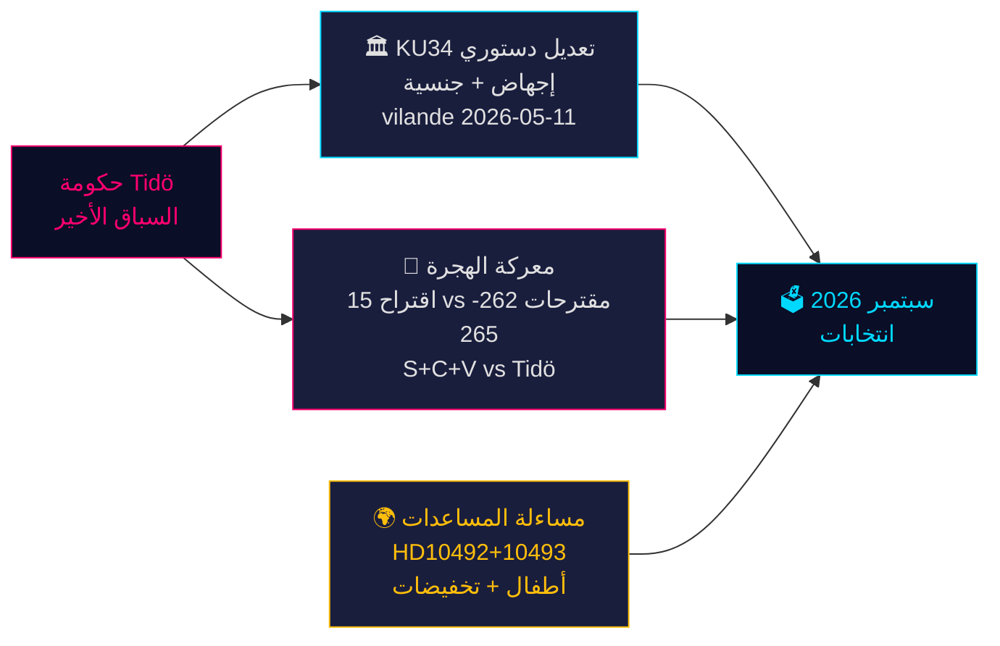

<!-- dir: rtl -->
# اللحظة الدستورية السويدية وسباق ما قبل الانتخابات — استخبارات المساء، 14 مايو 2026

**المؤلف**: James Pether Sörling  
**التاريخ**: 2026-05-14  
**التصنيف**: عام | **Admiralty**: B2 (موثوق؛ على الأرجح صحيح)  
**مستوى الثقة**: عالٍ في التقارير الواقعية؛ متوسط في التوقعات الانتخابية  
**القرب من الانتخابات**: ≤6 أشهر (سبتمبر 2026) — مضاعف DIW 1.5× نشط

---

## الملخص التنفيذي

يتسم البروتوكول البرلماني السويدي ليوم 14 مايو 2026 بثلاث أزمات متشابكة ستحدد شكل انتخابات سبتمبر: حزمة تعديلات دستورية تاريخية (*vilande*) تحمي حقوق الإجهاض وتتيح إلغاء الجنسية (KU34)؛ ومواجهة في السياسة المتعلقة بالهجرة بين ائتلاف Tidö وكتلة المعارضة المنسقة S+C+V التي تطعن في أربعة مقترحات هجرة؛ وأزمة مساءلة وزارية حول تخفيضات المساعدات الإنمائية الضارة بالأطفال. وتشكّل هذه القضايا معاً ساحة المعركة السياسية لانتخابات 2026 — وستُختبر خيارات الحكومة اليوم في صناديق الاقتراع بعد 127 يوماً.

---

## القرارات التي تدعمها هذه الوثيقة

1. **المتابعة الدستورية**: هل سيصمد قرار KU34 *vilande* أمام التغيير في التركيبة ما بعد الانتخابات؟ (65% السيناريو الأساسي: نعم، إذا نجا الائتلاف الحالي؛ 20% جزئي؛ 15% فشل)
2. **المخاطر القانونية للهجرة**: هل ينبغي للفرق القانونية/الامتثال الاستعداد لطعن أمام المحكمة الأوروبية لحقوق الإنسان ضد HD03267 (الترحيل الأمني) ومراجعة Lagrådet للمقترح 265 (احتجاز الأطفال)؟
3. **التعرض لمساءلة المساعدات الإنمائية الرسمية**: كيف سيؤثر رد الوزير Dousa على HD10492 (الموعد النهائي 2026-05-29) على مصداقية الحكومة في مجال حقوق الإنسان قبل الانتخابات؟

---

## نقاط الاستخبارات في 60 ثانية

- 🏛️ **التعديل الدستوري** (KU34): اعتُمد *vilande* في 11 مايو 2026 — الدستور السويدي في طريقه الآن لحماية حقوق الإجهاض وإتاحة إلغاء الجنسية لأعضاء العصابات. القراءة الثانية مطلوبة بعد انتخابات سبتمبر 2026. تاريخي — أهم تعديل دستوري منذ 2010–2011.
- 🛂 **معركة الهجرة**: 15 اقتراحاً معارضاً قُدِّم في 13 مايو 2026 من S و C و V يطعن في مقترحات الهجرة الحكومية 262–265. الحكومة تملك 176/349 مقعداً — التمرير محتمل، لكن المقترح 265 (احتجاز الأطفال) ينطوي على مخاطر CRC المادة 37 في Lagrådet وتنازل حكومي محتمل.
- 🌍 **مساءلة المساعدات الإنمائية الرسمية**: مطالبات V الاستجوابية HD10492–10493 تطلب من Dousa توضيح لماذا لم تُجرَ *barnkonsekvensanalys* قبل أكبر إعادة هيكلة للمساعدات الإنمائية في تاريخ السويد، التي أغلقت برامج للأطفال سوء التغذية والصحة الأمومية في مناطق النزاع.
- 💻 **سباق الحكومة**: ثلاثة مقترحات (HD03250 الهوية الرقمية، HD03261 Skatteverket، HD03267 الترحيل الأمني) تشكّل البيان الحوكمي النهائي لحكومة Tidö قبل الانتخابات. يُرجَّح اعتمادها جميعاً قبل سبتمبر.
- 📊 **السياق الاقتصادي**: نمو الناتج المحلي الإجمالي السويدي +1.1% (2025)، +2.0% متوقع (2026) وفق IMF WEO أبريل-2026. الدين العام 35.9% من الناتج المحلي الإجمالي — قاعدة مالية محافظة ترسّخ سرديةالكفاءة الحكومية.

---

## أهم المحفزات المستقبلية

**⚠️ مراقبة حرجة — 2026-05-29**: رد Dousa على HD10492 بشأن الأطفال والمساعدات الإنمائية. هذا الرد الوزاري المنفرد إما: (أ) سيخلق أزمة مساءلة كبرى قبيل الانتخابات إن كان دفاعياً، أو (ب) سيفكّك ضغط المنظمات غير الحكومية بولاية تقييم Sida موثوقة. الاحتمال الحالي لالتزام جوهري: **منخفض (20%)**.

---

## ملخص مستوى الثقة

| المجال | الثقة | الأساس |
|--------|-------|--------|
| المآل الدستوري لـ KU34 | متوسط | متطلب القراءة المزدوجة؛ عدم اليقين ما بعد الانتخابات |
| تمرير قرارات الهجرة | عالٍ | أغلبية حكومية مضمونة؛ SD مستقر |
| الرد الوزاري على المساعدات الإنمائية | منخفض-متوسط | لا توجد التزامات سابقة من Dousa |
| التأثير الانتخابي | متوسط | استطلاعات متسقة لكن 127 يوماً لا تزال متبقية |

<!-- source-sha: da8028e83f1cd6c0437e57058cd843114b4719fa -->