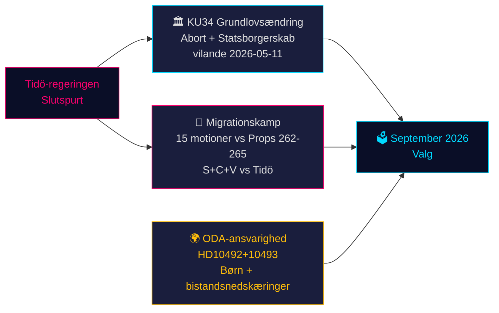

# Sveriges forfatningsmæssige øjeblik og forvalgspolitisk sprint — Aftenefterretning, 14. maj 2026

**Forfatter**: James Pether Sörling  
**Dato**: 2026-05-14  
**Klassificering**: OFFENTLIG | **Admiralty**: B2 (Pålidelig; sandsynligvis sand)  
**Konfidensniveau**: HØJ for faktarapportering; MIDDEL for valgprognoser  
**Valnærhed**: ≤6 måneder (september 2026) — 1,5× DIW-multiplikator aktiv

---

## Resumé

Danmarks parlamentariske protokol for 14. maj 2026 er præget af tre sammenvævede kriser, der vil forme septembervalget: en historisk grundlovspakke (*vilande*) der beskytter abortrettigheder og muliggør fratagelse af statsborgerskab (KU34); en migrationspolitisk konfrontation mellem Tidö-koalitionen og et koordineret S+C+V-oppositionsblok der bestrider fire migrationspropositioner; samt en ministeriel ansvarskrise over bistandsnedskæringer, der skader børn. Tilsammen udgør disse spørgsmål valgkampens slagmark for 2026 — og regeringens valg i dag vil blive prøvet ved stemmeurnerne om 127 dage.

---

## Beslutninger dette notat understøtter

1. **Forfatningsmæssig opfølgning**: Vil KU34 *vilande*-vedtagelsen overleve den postelektorale sammensætningsændring? (65 % grundscenario: ja, hvis den nuværende koalition overlever; 20 % delvis; 15 % fiasko)
2. **Migrationsretslig risiko**: Bør juridiske/complianceteams forberede sig på ECHR-udfordring mod HD03267 (sikkerhedsudvisning) og Lagrådets granskning af prop 265 (børneforvaring)?
3. **ODA-ansvarseksponering**: Hvordan vil minister Dousas svar på HD10492 (forfaldsdato 2026-05-29) påvirke regeringens troværdighed vedrørende menneskerettigheder inden valget?

---

## 60-sekunders efterretningspunkter

- 🏛️ **Grundlovsændring** (KU34): *vilande* vedtaget 11. maj 2026 — den svenske grundlov er nu på vej til at beskytte abortrettigheder og muliggøre fratagelse af statsborgerskab for bandemedlemmer. Anden behandling kræves efter september 2026-valget. Historisk — den mest betydningsfulde grundlovsændring siden 2010–2011.
- 🛂 **Migrationskamp**: 15 oppositionsmotioner indgivet 13. maj 2026 af S, C, V imod regeringens migrationspropositioner 262–265. Regeringen har 176/349 mandater — vedtagelse sandsynlig, men prop 265 (børneforvaring) bærer Lagrådets CRC art. 37-risiko og mulig regeringsindrømmelse.
- 🌍 **ODA-ansvarighed**: V's interpellationer HD10492–10493 kræver, at Dousa forklarer, hvorfor ingen *barnkonsekvensanalys* blev foretaget inden Sveriges største bistandsomlægning nogensinde, som lukkede programmer for underernærede børn og mødresundhed i konfliktzoner.
- 💻 **Regeringssprint**: Tre propositioner (HD03250 digital identitet, HD03261 Skatteverket, HD03267 sikkerhedsudvisning) udgør Tidö-regeringens endelige forvaltningspolitiske erklæring inden valget. Alle forventes vedtaget inden september.
- 📊 **Økonomisk kontekst**: Sveriges BNP-vækst +1,1 % (2025), +2,0 % forventet (2026) ifølge IMF WEO apr-2026. Offentlig gæld 35,9 % af BNP — finanspolitisk konservativt udgangspunkt der forankrer regeringens kompetencefortælling.

---

## Vigtigste fremtidige udløser

**⚠️ Kritisk observation — 2026-05-29**: Dousas svar på HD10492 om børn og bistand. Dette ene ministerielle svar vil enten: (a) skabe en stor prævalgsmæssig ansvarskrise hvis det er defensivt, eller (b) afvæbne NGO-pres med et troværdigt Sida-evalueringsmandat. Nuværende sandsynlighed for substantiel forpligtelse: **LAV (20 %)**.

---

## Konfidensoversigt

| Domæne | Konfidens | Grundlag |
|--------|-----------|---------|
| KU34 forfatningsmæssigt udfald | MEDEL | To-behandlingskrav; postelektoral usikkerhed |
| Migrationsvedtagelse | HØJ | Regeringsflertal sikkert; SD stabilt |
| ODA ministerielt svar | LAV-MEDEL | Ingen tidligere forpligtelser fra Dousa |
| Valgpåvirkning | MEDEL | Meningsmålinger konsistente men 127 dage tilbage |

<!-- source-sha: da8028e83f1cd6c0437e57058cd843114b4719fa -->