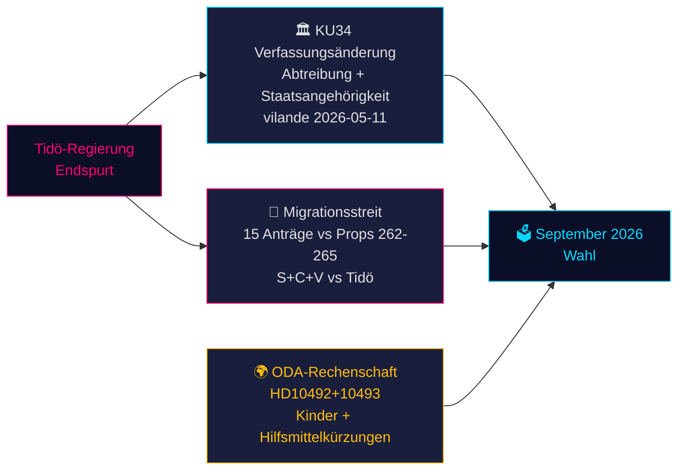

# Schwedens Verfassungsmoment und Wahlkampf-Sprint — Abendanalyse, 14. Mai 2026

**Autor**: James Pether Sörling  
**Datum**: 2026-05-14  
**Klassifizierung**: ÖFFENTLICH | **Admiralty**: B2 (Zuverlässig; wahrscheinlich wahr)  
**Konfidenz**: HOCH bei Faktenberichterstattung; MITTEL bei Wahlprognosen  
**Wahlnähe**: ≤6 Monate (September 2026) — 1,5× DIW-Multiplikator aktiv

---

## Zusammenfassung

Das schwedische Parlamentsprotokoll vom 14. Mai 2026 ist von drei sich überschneidenden Krisen geprägt, die die Septemberwahl bestimmen werden: ein historisches Verfassungsänderungspaket (*vilande*), das Abtreibungsrechte schützt und die Aberkennung der Staatsangehörigkeit ermöglicht (KU34); eine migrationspolitische Konfrontation zwischen der Tidö-Koalition und einem koordinierten S+C+V-Oppositionsblock, der vier Migrationspropositionenbestreitet; und eine ministerielle Rechenschaftskrise über Entwicklungshilfekürzungen, die Kindern schaden. Zusammen bilden diese Themen das politische Schlachtfeld der Wahl 2026 — und die heutigen Entscheidungen der Regierung werden in 127 Tagen an der Wahlurne geprüft.

---

## Entscheidungen, die dieses Dokument unterstützt

1. **Verfassungstracking**: Wird die KU34 *vilande*-Verabschiedung die postelektorale Zusammensetzungsänderung überstehen? (65 % Basisszenario: ja, wenn die aktuelle Koalition überlebt; 20 % teilweise; 15 % Scheitern)
2. **Migrationsrechtliches Risiko**: Sollten Rechts-/Compliance-Teams sich auf eine ECHR-Herausforderung gegen HD03267 (Sicherheitsabschiebung) und die Lagrådet-Prüfung von Prop 265 (Kinderinternierung) vorbereiten?
3. **ODA-Haftungsexposition**: Wie wird Minister Dousas Antwort auf HD10492 (fällig 2026-05-29) die Glaubwürdigkeit der Regierung in Menschenrechtsfragen vor der Wahl beeinflussen?

---

## 60-Sekunden-Nachrichtenpunkte

- 🏛️ **Verfassungsänderung** (KU34): *vilande* am 11. Mai 2026 verabschiedet — das schwedische Grundgesetz ist nun auf dem Weg, Abtreibungsrechte zu schützen und die Aberkennung der Staatsangehörigkeit für Bandenmitglieder zu ermöglichen. Zweite Lesung nach der Wahl im September 2026 erforderlich. Historisch — die bedeutendste Verfassungsänderung seit 2010–2011.
- 🛂 **Migrationsstreit**: 15 Oppositionsanträge am 13. Mai 2026 von S, C, V eingereicht, die die Migrationspropositionender Regierung 262–265 anfechten. Die Regierung hat 176/349 Sitze — Verabschiedung wahrscheinlich, aber Prop 265 (Kinderinternierung) trägt das Lagrådet-Risiko nach CRC Art. 37 und eine mögliche Regierungskonzession.
- 🌍 **ODA-Rechenschaft**: V-Interpellationen HD10492–10493 fordern Dousa auf zu erklären, warum keine *barnkonsekvensanalys* vor Schwedens größter Umstrukturierung der Entwicklungshilfe aller Zeiten durchgeführt wurde, die Programme für mangelernährte Kinder und Müttergesundheit in Konfliktgebieten schloss.
- 💻 **Regierungs-Sprint**: Drei Propositionen (HD03250 digitale Identität, HD03261 Skatteverket, HD03267 Sicherheitsabschiebung) bilden das abschließende Regierungspolitische Statement der Tidö-Regierung vor der Wahl. Alle werden wahrscheinlich vor September verabschiedet.
- 📊 **Wirtschaftlicher Kontext**: Schweden BIP-Wachstum +1,1 % (2025), +2,0 % prognostiziert (2026) laut IMF WEO Apr-2026. Staatsschulden 35,9 % des BIP — fiskalisch konservative Ausgangslage, die das Kompetenznarrativ der Regierung verankert.

---

## Wichtigster Vorwärtsauslöser

**⚠️ Kritische Beobachtung — 2026-05-29**: Dousas Antwort auf HD10492 zu Kindern und Entwicklungshilfe. Diese einzelne ministerielle Antwort wird entweder: (a) eine große Rechenschaftskrise vor der Wahl auslösen, wenn sie defensiv ist, oder (b) den NGO-Druck mit einem glaubwürdigen Sida-Evaluierungsmandat entschärfen. Aktuelle Wahrscheinlichkeit eines substanziellen Engagements: **NIEDRIG (20 %)**.

---

## Konfidenzzusammenfassung

| Bereich | Konfidenz | Grundlage |
|---------|-----------|-----------|
| KU34 verfassungsrechtliches Ergebnis | MITTEL | Zweitepassageanforderung; postelektorale Unsicherheit |
| Migrationsverabschiedung | HOCH | Regierungsmehrheit gesichert; SD stabil |
| ODA-Ministerantwort | NIEDRIG-MITTEL | Keine früheren Verpflichtungen von Dousa |
| Wahlauswirkung | MITTEL | Umfragen konsistent, aber 127 Tage verbleiben |

<!-- source-sha: da8028e83f1cd6c0437e57058cd843114b4719fa -->