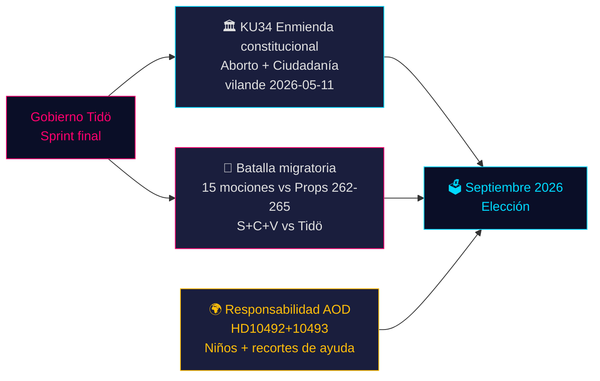

# El momento constitucional de Suecia y el sprint preelectoral — Análisis vespertino, 14 de mayo de 2026

**Autor**: James Pether Sörling  
**Fecha**: 2026-05-14  
**Clasificación**: PÚBLICO | **Admiralty**: B2 (Fiable; probablemente cierto)  
**Nivel de confianza**: ALTO en reportaje factual; MEDIO en proyecciones electorales  
**Proximidad electoral**: ≤6 meses (septiembre 2026) — multiplicador DIW 1,5× activo

---

## Resumen

El expediente parlamentario sueco del 14 de mayo de 2026 está definido por tres crisis que se entrecruzan y darán forma a las elecciones de septiembre: un histórico paquete de enmiendas constitucionales (*vilande*) que protege los derechos al aborto y permite la revocación de la ciudadanía (KU34); una confrontación de política migratoria entre la coalición Tidö y un bloque de oposición coordinado S+C+V que impugna cuatro proposiciones migratorias; y una crisis de responsabilidad ministerial por los recortes en ayuda al desarrollo que perjudican a la infancia. En conjunto, estos asuntos constituyen el campo de batalla político de las elecciones de 2026 — y las decisiones del gobierno de hoy serán juzgadas en las urnas dentro de 127 días.

---

## Decisiones que este documento apoya

1. **Seguimiento constitucional**: ¿Sobrevivirá la adopción *vilande* de KU34 al cambio de composición poselectoral? (65 % escenario base: sí, si la coalición actual sobrevive; 20 % parcial; 15 % fracaso)
2. **Riesgo jurídico migratorio**: ¿Deben los equipos jurídicos/de cumplimiento prepararse para un recurso ante el TEDH contra HD03267 (deportación por seguridad) y el escrutinio del Lagrådet sobre la prop 265 (internamiento de menores)?
3. **Exposición a la responsabilidad AOD**: ¿Cómo afectará la respuesta del ministro Dousa a HD10492 (vencimiento 2026-05-29) a la credibilidad del gobierno en derechos humanos antes de las elecciones?

---

## Puntos de inteligencia de 60 segundos

- 🏛️ **Enmienda constitucional** (KU34): *vilande* adoptado el 11 de mayo de 2026 — la constitución sueca está ahora en camino de proteger los derechos al aborto y permitir la revocación de la ciudadanía para miembros de bandas. Se requiere segunda lectura tras las elecciones de septiembre de 2026. Histórico — el cambio constitucional más significativo desde 2010–2011.
- 🛂 **Batalla migratoria**: 15 mociones de oposición presentadas el 13 de mayo de 2026 por S, C, V impugnando las proposiciones migratorias del gobierno 262–265. El gobierno tiene 176/349 escaños — aprobación probable, pero la prop 265 (internamiento de menores) conlleva riesgo Lagrådet CRC Art. 37 y posible concesión gubernamental.
- 🌍 **Responsabilidad AOD**: Las interpelaciones V HD10492–10493 exigen que Dousa explique por qué no se realizó ningún *barnkonsekvensanalys* antes de la mayor reestructuración de ayuda al desarrollo de Suecia de todos los tiempos, que cerró programas para niños desnutridos y salud materna en zonas de conflicto.
- 💻 **Sprint gubernamental**: Tres proposiciones (HD03250 identidad digital, HD03261 Skatteverket, HD03267 deportación por seguridad) constituyen la declaración final de gobernanza preelectoral del gobierno Tidö. Todas probablemente aprobadas antes de septiembre.
- 📊 **Contexto económico**: Crecimiento del PIB sueco +1,1 % (2025), +2,0 % proyectado (2026) según FMI PEM abr-2026. Deuda pública 35,9 % del PIB — base fiscalmente conservadora que ancla el relato de competencia del gobierno.

---

## Principal catalizador prospectivo

**⚠️ Vigilancia crítica — 2026-05-29**: La respuesta de Dousa a HD10492 sobre niños y ayuda al desarrollo. Esta única respuesta ministerial o bien: (a) creará una gran crisis de responsabilidad preelectoral si es defensiva, o (b) desactivará la presión de las ONG con un mandato creíble de evaluación Sida. Probabilidad actual de compromiso sustancial: **BAJA (20 %)**.

---

## Resumen de confianza

| Ámbito | Confianza | Base |
|--------|-----------|------|
| Resultado constitucional KU34 | MEDIO | Requisito de doble lectura; incertidumbre poselectoral |
| Aprobación migratoria | ALTO | Mayoría gubernamental asegurada; SD estable |
| Respuesta ministerial AOD | BAJO-MEDIO | Sin compromisos previos de Dousa |
| Impacto electoral | MEDIO | Encuestas consistentes pero 127 días restantes |

<!-- source-sha: da8028e83f1cd6c0437e57058cd843114b4719fa -->