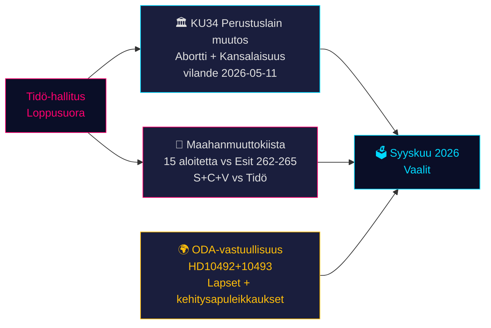

# Ruotsin perustuslaillinen hetki ja vaalikampanjapolitiikan spurtti — Ilta-analyysi, 14. toukokuuta 2026

**Tekijä**: James Pether Sörling  
**Päivämäärä**: 2026-05-14  
**Luokitus**: JULKINEN | **Admiralty**: B2 (Luotettava; todennäköisesti totta)  
**Luottamustaso**: KORKEA faktaraportoinnissa; KESKITASO vaaliennusteissa  
**Vaalien läheisyys**: ≤6 kuukautta (syyskuu 2026) — 1,5× DIW-kerroin aktiivinen

---

## Yhteenveto

Ruotsin parlamenttiprotokolla 14. toukokuuta 2026 on kolmen toisiinsa kietoutuneen kriisin leimaamaa, jotka muovaavat syyskuun vaaleja: historiallinen perustuslain muutospaketti (*vilande*) aborttioikeuksien suojaamiseksi ja kansalaisuuden peruuttamisen mahdollistamiseksi (KU34); maahanmuuttopolitiikan vastakkainasettelu Tidö-koalition ja koordinoidun S+C+V-oppositioblokin välillä neljästä maahanmuuttoesityksestä; sekä ministerinen vastuullisuuskriisi kehitysapuleikkauksista, jotka vahingoittavat lapsia. Nämä kysymykset muodostavat vuoden 2026 vaalitaistelun — ja hallituksen valinnat tänään koetaan vaaliuurnilla 127 päivän kuluttua.

---

## Päätökset, joita tämä katsaus tukee

1. **Perustuslaillinen seuranta**: Selviääkö KU34 *vilande*-päätös vaalien jälkeisestä kokoonpanomuutoksesta? (65 % perusskenaario: kyllä, jos nykyinen koalitio selviää; 20 % osittain; 15 % epäonnistuminen)
2. **Maahanmuutto-oikeudellinen riski**: Tulisiko lakitiimien valmistautua ECHR-haasteeseen HD03267:aa (turvallisuuspalautus) vastaan ja Lagrådets:n valvontaan ehdotuksesta 265 (lasten säilöönotto)?
3. **ODA-vastuualtistus**: Kuinka ministeri Doussan vastaus HD10492:een (erääntyy 2026-05-29) vaikuttaa hallituksen ihmisoikeuksien uskottavuuteen ennen vaaleja?

---

## 60 sekunnin tietopisteet

- 🏛️ **Perustuslain muutos** (KU34): *vilande* hyväksytty 11. toukokuuta 2026 — Ruotsin perustuslaki on nyt matkalla suojaamaan aborttioikeuksia ja mahdollistamaan kansalaisuuden peruuttaminen jengiläisiltä. Toinen käsittely vaaditaan syyskuun 2026 vaalien jälkeen. Historiallinen — merkittävin perustuslaillinen muutos vuodesta 2010–2011.
- 🛂 **Maahanmuuttotaistelu**: 15 oppositioaloitetta jätetty 13. toukokuuta 2026 S:n, C:n, V:n toimesta hallituksen maahanmuuttoesityksiä 262–265 vastaan. Hallituksella 176/349 paikkaa — hyväksyminen todennäköistä, mutta esitys 265 (lasten säilöönotto) kantaa Lagrådets CRC art. 37 -riskin ja mahdollisen hallituksen myönnytyksen.
- 🌍 **ODA-vastuullisuus**: V:n välikysymykset HD10492–10493 vaativat Doussaa selittämään, miksi *barnkonsekvensanalys*-arviointia ei tehty ennen Ruotsin kaikkien aikojen suurinta kehitysapurakenneuudistusta, joka sulki ohjelmat aliravituille lapsille ja äitiysterveydelle konfliktisonien alueilla.
- 💻 **Hallituksen spurtti**: Kolme esitystä (HD03250 digitaalinen henkilöllisyys, HD03261 Skatteverket, HD03267 turvallisuuspalautus) muodostavat Tidö-hallituksen viimeisen vaalienohjauspoliittisen lausunnon. Kaikki todennäköisesti hyväksytty ennen syyskuuta.
- 📊 **Taloudellinen konteksti**: Ruotsin BKT-kasvu +1,1 % (2025), +2,0 % ennustettu (2026) IMF WEO huhti-2026 mukaan. Julkinen velka 35,9 % BKT:stä — talouspoliittisesti konservatiivinen lähtötaso, joka tukee hallituksen osaamisnarratiivia.

---

## Tärkein eteenpäin katsova laukaisija

**⚠️ Kriittinen seuranta — 2026-05-29**: Doussan vastaus HD10492:een lasten kehitysavusta. Tämä yksittäinen ministerillinen vastaus joko: (a) luo suuren vaaleja edeltävän vastuukriisin jos se on puolustautuva, tai (b) purkaa kansalaisjärjestöjen paineen uskottavalla Sida-arviointimandaatilla. Nykyinen todennäköisyys merkitykselliselle sitoutumiselle: **MATALA (20 %)**.

---

## Luottamusyhteenveto

| Ala | Luottamustaso | Peruste |
|-----|---------------|---------|
| KU34 perustuslaillinen tulos | KESKI | Kaksi käsittelykierrosta; vaalien jälkeinen epävarmuus |
| Maahanmuuton hyväksyminen | KORKEA | Hallituksen enemmistö turvattu; SD vakaa |
| ODA-ministerinen vastaus | MATALA-KESKI | Ei aiempia sitoumuksia Doussalta |
| Vaikutus vaalitulokseen | KESKI | Mielipidekyselyt johdonmukaisia mutta 127 päivää jäljellä |

<!-- source-sha: da8028e83f1cd6c0437e57058cd843114b4719fa -->