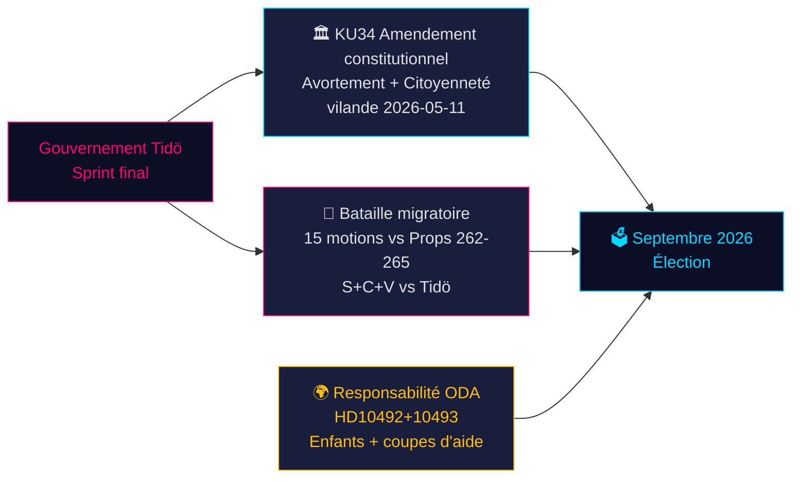

# Le moment constitutionnel de la Suède et le sprint préélectoral — Analyse du soir, 14 mai 2026

**Auteur**: James Pether Sörling  
**Date**: 2026-05-14  
**Classification**: PUBLIC | **Admiralty**: B2 (Fiable ; probablement vrai)  
**Niveau de confiance**: ÉLEVÉ pour le reportage factuel ; MOYEN pour les projections électorales  
**Proximité électorale**: ≤6 mois (septembre 2026) — multiplicateur DIW 1,5× actif

---

## Résumé

Le protocole parlementaire suédois du 14 mai 2026 est marqué par trois crises qui se croisent et qui façonneront l'élection de septembre : un paquet historique d'amendements constitutionnels (*vilande*) protégeant les droits à l'avortement et permettant la révocation de la citoyenneté (KU34) ; une confrontation de politique migratoire entre la coalition Tidö et un bloc d'opposition coordonné S+C+V contestant quatre propositions migratoires ; et une crise de responsabilité ministérielle sur les coupes dans l'aide au développement nuisant aux enfants. Ensemble, ces enjeux constituent le champ de bataille politique de l'élection 2026 — et les choix du gouvernement aujourd'hui seront éprouvés aux urnes dans 127 jours.

---

## Décisions que ce document soutient

1. **Suivi constitutionnel** : L'adoption *vilande* de KU34 survivra-t-elle au changement de composition post-électoral ? (65 % scénario de base : oui, si la coalition actuelle survit ; 20 % partiel ; 15 % échec)
2. **Risque juridique migratoire** : Les équipes juridiques/conformité doivent-elles se préparer à un recours CEDH contre HD03267 (expulsion sécuritaire) et au contrôle du Lagrådet sur la prop 265 (détention des enfants) ?
3. **Exposition à la responsabilité ODA** : Comment la réponse du ministre Dousa à HD10492 (échéance 2026-05-29) affectera-t-elle la crédibilité du gouvernement en matière de droits humains avant l'élection ?

---

## Points de renseignement en 60 secondes

- 🏛️ **Amendement constitutionnel** (KU34) : *vilande* adopté le 11 mai 2026 — la constitution suédoise est désormais en voie de protéger les droits à l'avortement et de permettre la révocation de la citoyenneté pour les membres de gangs. Deuxième lecture requise après l'élection de septembre 2026. Historique — changement constitutionnel le plus significatif depuis 2010–2011.
- 🛂 **Bataille migratoire** : 15 motions d'opposition déposées le 13 mai 2026 par S, C, V contestant les propositions migratoires du gouvernement 262–265. Le gouvernement dispose de 176/349 sièges — adoption probable, mais la prop 265 (détention d'enfants) comporte un risque Lagrådet CRC Art. 37 et une possible concession gouvernementale.
- 🌍 **Responsabilité ODA** : Les interpellations V HD10492–10493 exigent que Dousa explique pourquoi aucune *barnkonsekvensanalys* n'a été réalisée avant la plus grande restructuration de l'aide au développement jamais menée par la Suède, qui a fermé des programmes pour enfants malnutris et la santé maternelle dans des zones de conflit.
- 💻 **Sprint gouvernemental** : Trois propositions (HD03250 identité numérique, HD03261 Skatteverket, HD03267 expulsion sécuritaire) constituent la dernière déclaration de gouvernance préélectorale du gouvernement Tidö. Toutes devraient être adoptées avant septembre.
- 📊 **Contexte économique** : Croissance du PIB suédois +1,1 % (2025), +2,0 % projeté (2026) selon le FMI Perspectives économiques mondiales avr-2026. Dette publique 35,9 % du PIB — base fiscalement conservatrice qui ancre le narratif de compétence du gouvernement.

---

## Principal déclencheur prospectif

**⚠️ Surveillance critique — 2026-05-29** : La réponse de Dousa à HD10492 sur les enfants et l'aide au développement. Cette réponse ministérielle unique soit : (a) créera une grande crise de responsabilité préélectorale si elle est défensive, soit (b) désamorcera la pression des ONG avec un mandat crédible d'évaluation Sida. Probabilité actuelle d'engagement substantiel : **FAIBLE (20 %)**.

---

## Récapitulatif de confiance

| Domaine | Confiance | Base |
|---------|-----------|------|
| Issue constitutionnelle KU34 | MOYEN | Exigence de double passage ; incertitude post-électorale |
| Adoption migratoire | ÉLEVÉ | Majorité gouvernementale assurée ; SD stable |
| Réponse ministérielle ODA | FAIBLE-MOYEN | Aucun engagement antérieur de Dousa |
| Impact électoral | MOYEN | Sondages cohérents mais 127 jours restants |

<!-- source-sha: da8028e83f1cd6c0437e57058cd843114b4719fa -->