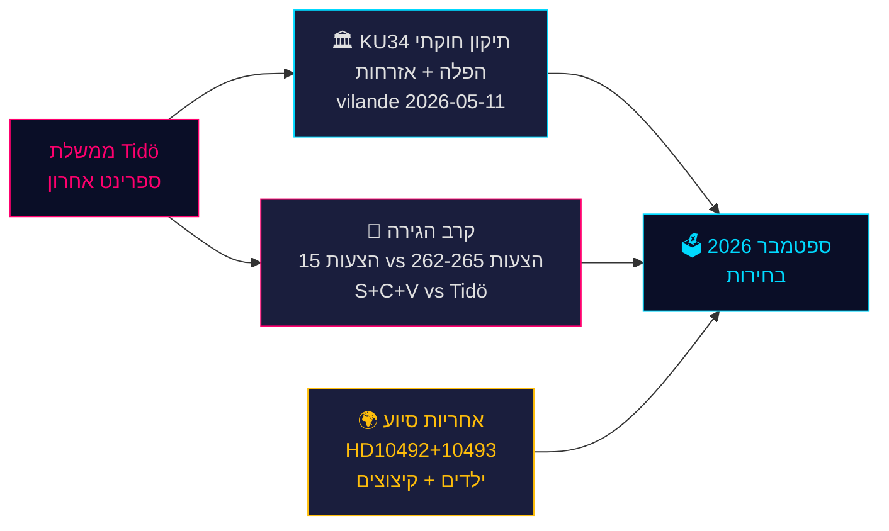

<!-- dir: rtl -->
# הרגע החוקתי של שוודיה וספרינט המדיניות טרום-הבחירות — ניתוח ערב, 14 במאי 2026

**מחבר**: James Pether Sörling  
**תאריך**: 2026-05-14  
**סיווג**: ציבורי | **Admiralty**: B2 (אמין׃ סביר שנכון)  
**רמת ביטחון**: גבוהה בדיווח עובדתי׃ בינונית בתחזיות בחירות  
**קרבה לבחירות**: ≤6 חודשים (ספטמבר 2026) — מכפיל DIW 1.5× פעיל

---

## תמצית

הפרוטוקול הפרלמנטרי השוודי מה-14 במאי 2026 מוגדר על ידי שלוש משברים חוצי-גבולות שיעצבו את הבחירות בספטמבר: חבילה היסטורית של תיקוני חוקה (*vilande*) המגנה על זכויות הפלה ומאפשרת ביטול אזרחות (KU34)׃ עימות מדיניות הגירה בין קואליציית Tidö לבלוק אופוזיציה מתואם S+C+V המערער על ארבעה הצעות הגירה׃ ומשבר אחריות שרים על קיצוצים בסיוע לפיתוח הפוגעים בילדים. יחד, נושאים אלה מהווים את שדה הקרב הפוליטי של בחירות 2026 — ובחירות הממשלה היום תיבחנה בקלפי בעוד 127 יום.

---

## החלטות שמסמך זה תומך בהן

1. **מעקב חוקתי**: האם אימוץ KU34 *vilande* יחיה את שינוי ההרכב שלאחר הבחירות? (65% תרחיש בסיס: כן, אם הקואליציה הנוכחית תשרוד׃ 20% חלקי׃ 15% כישלון)
2. **סיכון משפטי להגירה**: האם על צוותי משפט/ציות להתכונן לאתגר ב-ECHR נגד HD03267 (גירוש ביטחוני) ולבחינת Lagrådet על הצעה 265 (מעצר ילדים)?
3. **חשיפת אחריות סיוע לפיתוח**: כיצד תשפיע תשובת השר Dousa על HD10492 (מועד אחרון 2026-05-29) על אמינות הממשלה בזכויות אדם לפני הבחירות?

---

## נקודות מודיעין ב-60 שניות

- 🏛️ **תיקון חוקתי** (KU34): *vilande* אומץ ב-11 במאי 2026 — החוקה השוודית בדרכה להגן על זכויות הפלה ולאפשר ביטול אזרחות לחברי כנופיות. קריאה שנייה נדרשת לאחר בחירות ספטמבר 2026. היסטורי — השינוי החוקתי המשמעותי ביותר מאז 2010–2011.
- 🛂 **קרב ההגירה**: 15 הצעות אופוזיציה הוגשו ב-13 במאי 2026 על ידי S, C, V המערערות על הצעות ההגירה הממשלתיות 262–265. לממשלה 176/349 מושבים — אישור סביר, אך הצעה 265 (מעצר ילדים) נושאת סיכון Lagrådet CRC סעיף 37 ואפשרות לוויתור ממשלתי.
- 🌍 **אחריות סיוע לפיתוח**: בקשות הבהרה V HD10492–10493 דורשות מ-Dousa להסביר מדוע לא נערכה *barnkonsekvensanalys* לפני ארגון-מחדש הגדול ביותר בהיסטוריה של הסיוע לפיתוח שוודי, שסגר תוכניות לילדים תת-תזונה ובריאות אמהות באזורי סכסוך.
- 💻 **ספרינט הממשלה**: שלוש הצעות (HD03250 זהות דיגיטלית, HD03261 Skatteverket, HD03267 גירוש ביטחוני) מהוות את ההצהרה הממשלתית הסופית לפני הבחירות. כולן צפויות לאישור לפני ספטמבר.
- 📊 **הקשר כלכלי**: צמיחת תמ"ג שוודיה +1.1% (2025), +2.0% צפוי (2026) לפי IMF WEO אפריל-2026. חוב ציבורי 35.9% מהתמ"ג — בסיס שמרני פיסקאלית המעגן את נרטיב הכשירות הממשלתי.

---

## הטריגר העתידי המרכזי

**⚠️ מעקב קריטי — 2026-05-29**: תשובת Dousa על HD10492 בנושא ילדים וסיוע לפיתוח. תשובה שרית יחידה זו או: (א) תיצור משבר אחריות גדול לפני הבחירות אם תהיה הגנתית, או (ב) תנטרל לחץ ארגונים לא-ממשלתיים עם מנדט הערכת Sida אמין. הסתברות נוכחית להתחייבות מהותית: **נמוכה (20%)**.

---

## סיכום רמת הביטחון

| תחום | ביטחון | בסיס |
|------|--------|------|
| תוצאה חוקתית KU34 | בינוני | דרישת קריאה כפולה׃ אי-ודאות שלאחר הבחירות |
| אישור הגירה | גבוה | רוב ממשלתי מובטח׃ SD יציב |
| תגובה שרית לסיוע לפיתוח | נמוך-בינוני | אין התחייבויות קודמות מ-Dousa |
| השפעה בחירות | בינוני | סקרים עקביים אך 127 יום נותרו |

<!-- source-sha: da8028e83f1cd6c0437e57058cd843114b4719fa -->