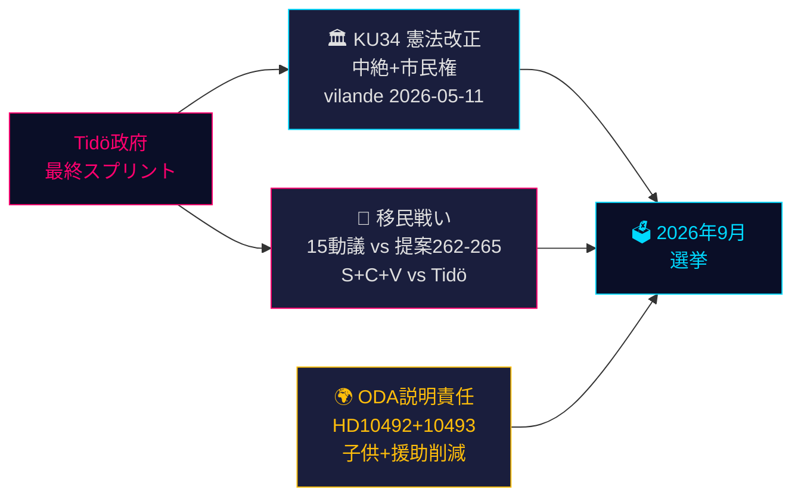

# スウェーデンの憲法的瞬間と選挙前政策スプリント — 夜間情報分析、2026年5月14日

**著者**: James Pether Sörling  
**日付**: 2026-05-14  
**分類**: 公開 | **Admiralty**: B2（信頼性高い；おそらく真実）  
**信頼度**: 事実報道は高、選挙予測は中程度  
**選挙近接度**: ≤6ヶ月（2026年9月）— DIW乗数1.5×有効

---

## 要約

2026年5月14日のスウェーデン議会記録は、9月の選挙を形成する3つの交差する危機によって定義される：中絶権を保護し市民権剥奪を可能にする歴史的な憲法改正パッケージ（*vilande*、KU34）；Tidö連立とS+C+V協調野党ブロックの間の移民政策対立（4つの移民提案に異議）；そして子供たちに害を与える開発援助削減をめぐる閣僚責任危機。これらの問題が2026年選挙の政治的戦場を構成し、今日の政府の選択は127日後に投票箱で試される。

---

## この文書が支援する決定

1. **憲法的追跡**: KU34の*vilande*採択は選挙後の構成変更を生き残るか？（65%基本シナリオ：現在の連立が存続すれば可能；20%部分的；15%失敗）
2. **移民法的リスク**: 法務・コンプライアンスチームはHD03267（安全保障上の国外追放）に対するECHR訴訟とLagrådetによる提案265（児童拘留）の審査に備えるべきか？
3. **ODA責任エクスポージャー**: Dousa大臣のHD10492（期限：2026-05-29）への回答は、選挙前の人権に関する政府の信頼性にどのような影響を与えるか？

---

## 60秒情報要点

- 🏛️ **憲法改正**（KU34）：*vilande*が2026年5月11日に採択 — スウェーデン憲法は今や中絶権を保護し、ギャングメンバーの市民権剥奪を可能にする方向に進んでいる。2026年9月選挙後に第二読会が必要。歴史的 — 2010–2011年以来最も重要な憲法変更。
- 🛂 **移民戦い**: 2026年5月13日にS、C、Vが政府の移民提案262–265に対して15の野党動議を提出。政府は176/349議席を保有 — 可決は見込まれるが、提案265（児童拘留）はLagrådet CRC第37条リスクと政府譲歩の可能性を伴う。
- 🌍 **ODA説明責任**: V質問HD10492–10493は、栄養不足の子供たちや紛争地帯の母子保健プログラムを閉鎖したスウェーデン史上最大の開発援助再編前に*barnkonsekvensanalys*が実施されなかった理由をDousaに説明するよう要求。
- 💻 **政府スプリント**: 3つの提案（HD03250デジタルID、HD03261 Skatteverket、HD03267安全保障上の国外追放）がTidö政府の選挙前最終ガバナンス声明を形成。すべて9月前に制定見込み。
- 📊 **経済的背景**: スウェーデンGDP成長率+1.1%（2025年）、+2.0%見込み（2026年）IMF世界経済見通し2026年4月版。公的債務はGDPの35.9% — 政府の能力ナラティブを支える財政的に保守的なベースライン。

---

## 最重要の将来的トリガー

**⚠️ 重要監視 — 2026-05-29**: 子供と開発援助に関するHD10492へのDousaの回答。この単独の閣僚回答は：（a）防衛的であれば大規模な選挙前責任危機を生む、または（b）信頼できるSida評価権限でNGOの圧力を解除する。実質的なコミットメントの現在の確率：**低（20%）**。

---

## 信頼度サマリー

| 分野 | 信頼度 | 根拠 |
|------|--------|------|
| KU34憲法的結果 | 中 | 二読会要件；選挙後の不確実性 |
| 移民可決 | 高 | 政府多数派確保；SD安定 |
| ODA閣僚回答 | 低-中 | Dousaからの事前のコミットなし |
| 選挙への影響 | 中 | 世論調査は一貫しているが127日残存 |

<!-- source-sha: da8028e83f1cd6c0437e57058cd843114b4719fa -->