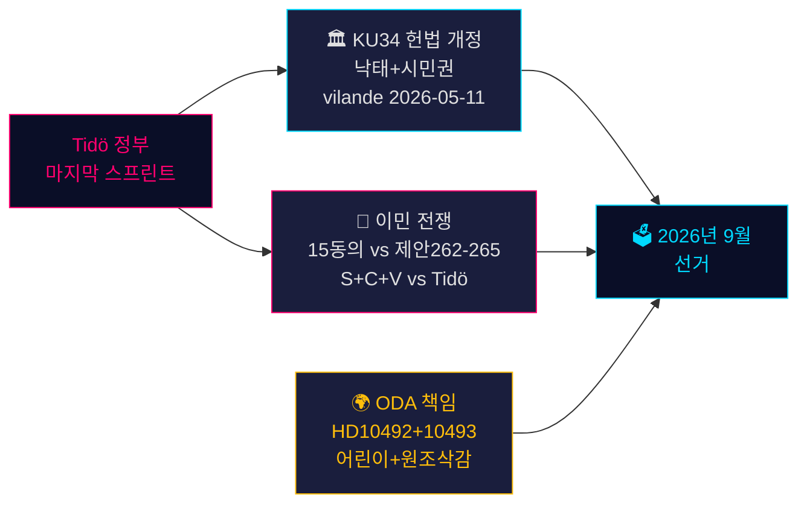

# 스웨덴의 헌법적 순간과 선거 전 정책 스프린트 — 저녁 정보 브리핑, 2026년 5월 14일

**저자**: James Pether Sörling  
**날짜**: 2026-05-14  
**분류**: 공개 | **Admiralty**: B2 (신뢰할 수 있음; 아마도 사실)  
**신뢰도**: 사실 보도에 대해 높음; 선거 전망에 대해 중간  
**선거 근접성**: ≤6개월 (2026년 9월) — DIW 승수 1.5× 활성

---

## 요약

2026년 5월 14일의 스웨덴 의회 기록은 9월 선거를 형성할 세 가지 교차하는 위기로 정의된다: 낙태 권리를 보호하고 시민권 박탈을 가능하게 하는 역사적인 헌법 개정 패키지(*vilande*, KU34); 네 개의 이민 제안에 이의를 제기하는 Tidö 연립과 조율된 S+C+V 야당 블록 사이의 이민 정책 대립; 그리고 어린이에게 해를 끼치는 개발 원조 삭감에 관한 장관 책임 위기. 이러한 문제들이 함께 2026년 선거의 정치적 전쟁터를 구성하며, 오늘 정부의 선택은 127일 후 투표함에서 시험받을 것이다.

---

## 이 문서가 지원하는 결정

1. **헌법 추적**: KU34 *vilande* 채택이 선거 후 구성 변경을 견뎌낼 것인가? (65% 기본 시나리오: 현재 연립이 생존하면 예; 20% 부분적; 15% 실패)
2. **이민 법적 위험**: 법무/준법 팀이 HD03267 (보안 추방)에 대한 ECHR 도전과 제안 265 (아동 구금)에 대한 Lagrådet 검토에 대비해야 하는가?
3. **ODA 책임 노출**: Dousa 장관의 HD10492 (마감일 2026-05-29) 답변이 선거 전 인권에 대한 정부 신뢰성에 어떤 영향을 미칠 것인가?

---

## 60초 정보 요점

- 🏛️ **헌법 개정** (KU34): *vilande*가 2026년 5월 11일 채택됨 — 스웨덴 헌법이 이제 낙태 권리를 보호하고 갱단원들의 시민권 박탈을 가능하게 하는 방향으로 나아가고 있다. 2026년 9월 선거 후 2차 독회가 필요. 역사적 — 2010–2011년 이후 가장 중요한 헌법 변경.
- 🛂 **이민 전쟁**: 2026년 5월 13일 S, C, V가 정부의 이민 제안 262–265에 대한 15개 야당 동의를 제출. 정부는 176/349석 보유 — 통과 가능성 높으나 제안 265 (아동 구금)는 Lagrådet CRC 제37조 위험과 정부 양보 가능성 내포.
- 🌍 **ODA 책임**: V 질의 HD10492–10493은 영양실조 어린이 및 분쟁 지역 모자보건 프로그램을 폐쇄한 스웨덴 역사상 최대 개발 원조 구조조정 전 *barnkonsekvensanalys*가 왜 실시되지 않았는지 Dousa에게 설명을 요구.
- 💻 **정부 스프린트**: 세 가지 제안 (HD03250 디지털 신원, HD03261 Skatteverket, HD03267 보안 추방)이 선거 전 Tidö 정부의 마지막 거버넌스 성명을 구성. 모두 9월 전 제정될 것으로 예상.
- 📊 **경제적 맥락**: 스웨덴 GDP 성장률 +1.1% (2025), +2.0% 전망 (2026) IMF 세계경제전망 2026년 4월판 기준. 공공 부채 GDP의 35.9% — 정부의 역량 서사를 고정하는 재정적으로 보수적인 기준.

---

## 주요 미래 트리거

**⚠️ 중요 감시 — 2026-05-29**: 어린이와 개발 원조에 관한 HD10492에 대한 Dousa의 답변. 이 단일 장관 답변은 다음 중 하나가 될 것이다: (a) 방어적일 경우 선거 전 대규모 책임 위기를 초래하거나, (b) 신뢰할 수 있는 Sida 평가 권한으로 NGO 압력을 해소. 실질적인 약속의 현재 확률: **낮음 (20%)**.

---

## 신뢰도 요약

| 분야 | 신뢰도 | 근거 |
|------|--------|------|
| KU34 헌법적 결과 | 중간 | 2차 독회 요건; 선거 후 불확실성 |
| 이민 통과 | 높음 | 정부 다수결 확보; SD 안정 |
| ODA 장관 답변 | 낮음-중간 | Dousa의 이전 약속 없음 |
| 선거 영향 | 중간 | 여론조사 일관되나 127일 남음 |

<!-- source-sha: da8028e83f1cd6c0437e57058cd843114b4719fa -->