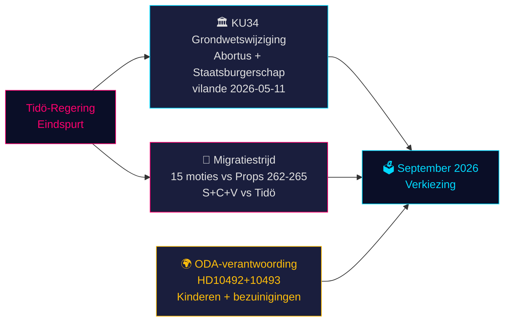

# Zweden's grondwettelijk moment en pre-electorale beleidssprint — Avondanalyse, 14 mei 2026

**Auteur**: James Pether Sörling  
**Datum**: 2026-05-14  
**Classificatie**: OPENBAAR | **Admiralty**: B2 (Betrouwbaar; waarschijnlijk waar)  
**Betrouwbaarheidsniveau**: HOOG voor feitelijke rapportage; GEMIDDELD voor electorale projecties  
**Verkiezingsnabijheid**: ≤6 maanden (september 2026) — 1,5× DIW-vermenigvuldiger actief

---

## Samenvatting

Het Zweedse parlementaire dossier van 14 mei 2026 wordt bepaald door drie samenhangende crises die de verkiezingen van september zullen vormgeven: een historisch grondwetswijzigingspakket (*vilande*) dat abortusrechten beschermt en het intrekken van staatsburgerschap mogelijk maakt (KU34); een migratiebeleidconfrontatie tussen de Tidö-coalitie en een gecoördineerd S+C+V-oppositieblok dat vier migratievoorstellen betwist; en een ministeriële verantwoordingscrisis over bezuinigingen op ontwikkelingshulp die kinderen schaden. Samen vormen deze kwesties het politieke strijdtoneel van de verkiezingen 2026 — en de keuzes van de regering vandaag worden over 127 dagen aan de stembus getoetst.

---

## Beslissingen die dit document ondersteunt

1. **Grondwettelijke monitoring**: Zal de KU34 *vilande*-aanneming de post-electorale samenstellingswijziging overleven? (65 % basisscenario: ja, als de huidige coalitie overleeft; 20 % gedeeltelijk; 15 % mislukking)
2. **Migratievermogensrisico**: Moeten juridische/compliance-teams zich voorbereiden op een EVRM-uitdaging tegen HD03267 (veiligheidsdeportatie) en de Lagrådet-controle van prop 265 (kinderdetentie)?
3. **ODA-aansprakelijkheidsblootstelling**: Hoe zal minister Dousas reactie op HD10492 (vervaldatum 2026-05-29) de geloofwaardigheid van de regering op het gebied van mensenrechten vóór de verkiezingen beïnvloeden?

---

## 60-secondes inlichtingenpunten

- 🏛️ **Grondwetswijziging** (KU34): *vilande* aangenomen op 11 mei 2026 — de Zweedse grondwet is nu op weg om abortusrechten te beschermen en het intrekken van staatsburgerschap voor bendeleden mogelijk te maken. Tweede lezing vereist na de verkiezingen van september 2026. Historisch — de meest significante grondwetswijziging sinds 2010–2011.
- 🛂 **Migratiestrijd**: 15 oppositiemoties ingediend op 13 mei 2026 door S, C, V die de migratievoorstellen van de regering 262–265 betwisten. De regering heeft 176/349 zetels — aanneming waarschijnlijk, maar prop 265 (kinderdetentie) draagt Lagrådet CRC Art. 37-risico en mogelijke regeringsconcessie.
- 🌍 **ODA-verantwoording**: V-interpellaties HD10492–10493 eisen dat Dousa uitlegt waarom geen *barnkonsekvensanalys* is uitgevoerd vóór Zweden's grootste ooit ontwikkelingshulpherstructurering, die programma's voor ondervoede kinderen en moedergezondheid in conflictzones sloot.
- 💻 **Regeringssprint**: Drie voorstellen (HD03250 digitale identiteit, HD03261 Skatteverket, HD03267 veiligheidsdeportatie) vormen de laatste pre-electorale bestuursverklaring van de Tidö-regering. Alle waarschijnlijk aangenomen vóór september.
- 📊 **Economische context**: Zweden BBP-groei +1,1 % (2025), +2,0 % geprojecteerd (2026) volgens IMF WEO apr-2026. Staatsschuld 35,9 % van BBP — fiscaal conservatieve basis die het competentieverhaal van de regering verankert.

---

## Belangrijkste vooruitziende trigger

**⚠️ Kritische observatie — 2026-05-29**: Dousas reactie op HD10492 over kinderen en ontwikkelingshulp. Dit ene ministeriële antwoord zal ofwel: (a) een grote pre-electorale verantwoordingscrisis creëren als het defensief is, ofwel (b) de NGO-druk ontmantelen met een geloofwaardig Sida-evaluatiemandaat. Huidige kans op substantiële toezegging: **LAAG (20 %)**.

---

## Betrouwbaarheidssamenvatting

| Domein | Betrouwbaarheid | Basis |
|--------|-----------------|-------|
| Grondwettelijk resultaat KU34 | GEMIDDELD | Tweede-lezingsvereiste; post-electorale onzekerheid |
| Migratieaanneming | HOOG | Regeringsmeerderheid veiliggesteld; SD stabiel |
| ODA-ministeriele reactie | LAAG-GEMIDDELD | Geen eerdere toezeggingen van Dousa |
| Electorale impact | GEMIDDELD | Peilingen consistent maar 127 dagen resterend |

<!-- source-sha: da8028e83f1cd6c0437e57058cd843114b4719fa -->