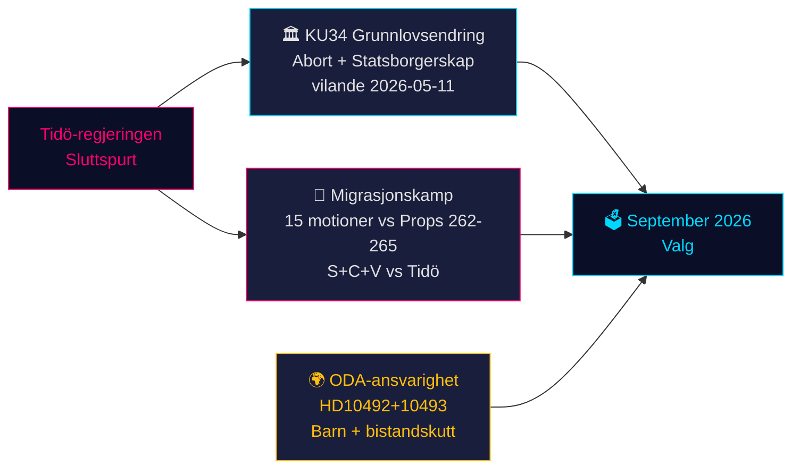

# Sveriges konstitusjonelle øyeblikk og forvalgspolitisk sprint — Kveldsunderretning, 14. mai 2026

**Forfatter**: James Pether Sörling  
**Dato**: 2026-05-14  
**Klassifisering**: OFFENTLIG | **Admiralty**: B2 (Pålitelig; trolig sant)  
**Konfidensnivå**: HØY for faktarapportering; MIDDELS for valgprognoser  
**Valnærhet**: ≤6 måneder (september 2026) — 1,5× DIW-multiplikator aktiv

---

## Sammendrag

Sveriges parlamentariske protokoll for 14. mai 2026 er preget av tre sammenvevde kriser som vil forme septembervalget: en historisk grunnlovsendringspakke (*vilande*) som beskytter aborttrettigheter og muliggjør tilbakekallelse av statsborgerskap (KU34); en migrasjonspolitisk konfrontasjon mellom Tidö-koalisjonen og et koordinert S+C+V-opposisjonsblokk som bestrider fire migrasjonspropisisjoner; og en ministeransvarskrise om bistandskutt som skader barn. Til sammen utgjør disse spørsmålene slagmarken for 2026-valget — og regjeringens valg i dag vil bli prøvet ved valgurnene om 127 dager.

---

## Beslutninger dette notatet støtter

1. **Konstitusjonell oppfølging**: Vil KU34 *vilande*-vedtaket overleve den postelektorale sammensetningsendringen? (65 % grunnscenario: ja, hvis nåværende koalisjon overlever; 20 % delvis; 15 % svikt)
2. **Migrasjonsrettslig risiko**: Bør juridiske/compliance-team forberede seg på ECHR-utfordring mot HD03267 (sikkerhetsutvisning) og Lagrådets gransking av prop 265 (barnefengsling)?
3. **ODA-ansvarseksponering**: Hvordan vil statsråd Dousas svar på HD10492 (forfaller 2026-05-29) påvirke regjeringens troverdighet på menneskerettigheter før valget?

---

## 60-sekunders etterretningspunkter

- 🏛️ **Grunnlovsendring** (KU34): *vilande* vedtatt 11. mai 2026 — den svenske grunnloven er nå på vei til å beskytte aborttrettigheter og muliggjøre tilbakekallelse av statsborgerskap for gjengmedlemmer. Andre gangs behandling kreves etter september 2026-valget. Historisk — den mest betydningsfulle grunnlovsendringen siden 2010–2011.
- 🛂 **Migrasjonskamp**: 15 opposisjonsforslag levert 13. mai 2026 av S, C, V mot regjeringens migrasjonsproposisjoner 262–265. Regjeringen har 176/349 mandater — vedtakelse trolig, men prop 265 (barnefengsling) bærer Lagrådets CRC art. 37-risiko og mulig regjeringsinnrømmelse.
- 🌍 **ODA-ansvarighet**: V:s interpellasjoner HD10492–10493 krever at Dousa forklarer hvorfor ingen *barnkonsekvensanalys* ble gjennomført før Sveriges største bistandsomstrukturering noensinne, som stengte programmer for underernærte barn og mødrehelse i konfliktsoner.
- 💻 **Regjeringssprint**: Tre proposisjoner (HD03250 digital identitet, HD03261 Skatteverket, HD03267 sikkerhetsutvisning) utgjør Tidö-regjeringens endelige forvaltningspolitiske erklæring før valget. Alle forventes vedtatt før september.
- 📊 **Økonomisk kontekst**: Sveriges BNP-vekst +1,1 % (2025), +2,0 % anslått (2026) ifølge IMF WEO apr-2026. Offentlig gjeld 35,9 % av BNP — finanspolitisk konservativt utgangspunkt som forankrer regjeringens kompetansefortelling.

---

## Viktigste fremtidige utløser

**⚠️ Kritisk observasjon — 2026-05-29**: Dousas svar på HD10492 om barn og bistand. Dette ene ministerielle svaret vil enten: (a) skape en stor forvalgsmessig ansvarskrise hvis det er defensivt, eller (b) avvæpne NGO-press med et troverdig Sida-evalueringsmandat. Nåværende sannsynlighet for substansielt engasjement: **LAV (20 %)**.

---

## Konfidensoversikt

| Domene | Konfidens | Grunnlag |
|--------|-----------|---------|
| KU34 konstitusjonelt utfall | MIDDELS | To-behandlingskrav; postelektoral usikkerhet |
| Migrasjonsvedtakelse | HØY | Regjeringsflertall sikret; SD stabilt |
| ODA ministersvar | LAV-MIDDELS | Ingen tidligere forpliktelser fra Dousa |
| Valgpåvirkning | MIDDELS | Meningsmålinger konsistente men 127 dager gjenstår |

<!-- source-sha: da8028e83f1cd6c0437e57058cd843114b4719fa -->