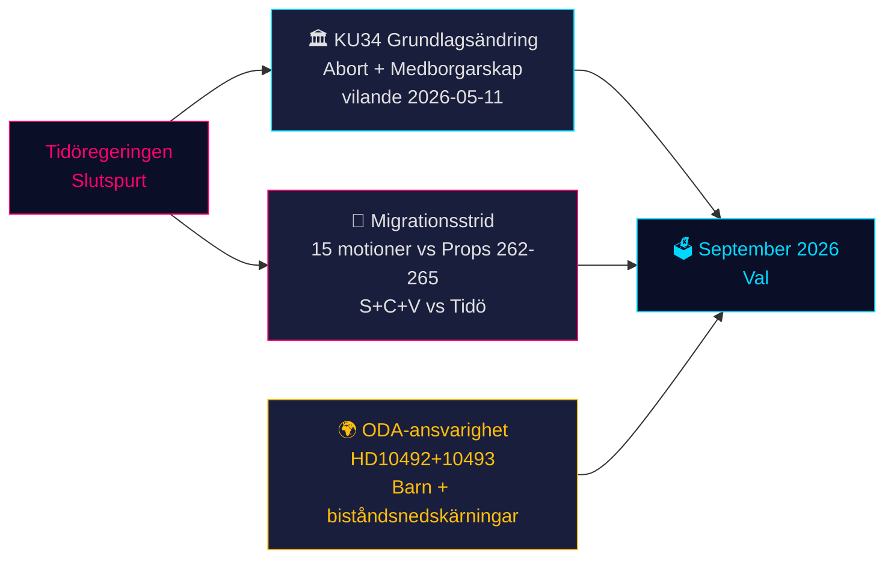

# Sveriges konstitutionella stund och valpolitisk sprint — Kvällsunderrättelse, 14 maj 2026

**Författare**: James Pether Sörling  
**Datum**: 2026-05-14  
**Klassificering**: OFFENTLIG | **Admiralty**: B2 (Tillförlitlig; troligen sant)  
**Konfidensgrad**: HÖG för faktarapportering; MEDEL för valrörelseprognoser  
**Valnärhet**: ≤6 månader (september 2026) — 1,5× DIW-multiplikator aktiv

---

## Sammanfattning

Sveriges riksdagsprotokoll för 14 maj 2026 präglas av tre sammanvävda kriser som kommer att forma septembervalet: ett historiskt grundlagsändringspaket (*vilande*) som skyddar abortrechten och möjliggör medborgarskapsåterkallelse (KU34); en migrationspolitisk konfrontation mellan Tidökoalitionen och ett samordnat S+C+V-oppositionsblock som bestrider fyra migrationspropositoner; samt en ministeriell ansvarskris kring biståndsnedskärningar som skadar barn. Sammantaget utgör dessa frågor slagfältet för 2026 års val — och regeringens val idag prövas vid valurnan om 127 dagar.

---

## Beslut som detta underlag stöder

1. **Konstitutionell uppföljning**: Kommer KU34 *vilande*-beslutet att överleva den postelektorala sammansättningsförändringen? (65 % grundscenario: ja, om nuvarande koalition överlever; 20 % delvis; 15 % misslyckande)
2. **Migrationsrättslig risk**: Bör juridik-/complianceteam förbereda sig för ECHR-utmaningar mot HD03267 (säkerhetsavvisning) och Lagrådets granskning av prop 265 (barnförvar)?
3. **ODA-ansvarsexponering**: Hur påverkar minister Dousas svar på HD10492 (förfaller 2026-05-29) regeringens trovärdighet i mänskliga rättighetsfrågor inför valet?

---

## 60-sekunders underrättelsepunkter

- 🏛️ **Grundlagsändring** (KU34): *vilande* antaget 11 maj 2026 — den svenska grundlagen är nu på väg att skydda aborträtten och möjliggöra återkallelse av medborgarskap för gängmedlemmar. Andra behandling krävs efter september 2026 års val. Historisk — den mest betydelsefulla grundlagsändringen sedan 2010–2011.
- 🛂 **Migrationsstrid**: 15 oppositionsmotioner inlämnade 13 maj 2026 av S, C, V mot regeringens migrationspropositoner 262–265. Regeringen har 176/349 mandat — passage trolig, men prop 265 (barnförvar) bär Lagrådets CRC art. 37-risk och möjlig regeringskoncession.
- 🌍 **ODA-ansvarighet**: V:s interpellationer HD10492–10493 kräver att Dousa förklarar varför ingen *barnkonsekvensanalys* genomfördes inför Sveriges största biståndsomsrtukturering någonsin, som stängde program för undernärda barn och mödravård i konfliktzoner.
- 💻 **Regeringssprint**: Tre propositioner (HD03250 digital identitet, HD03261 Skatteverket, HD03267 säkerhetsavvisning) utgör Tidöregeringens slutliga förvaltningspolitiska uttalande inför valet. Alla troligen antagna före september.
- 📊 **Ekonomisk kontext**: Sverige BNP-tillväxt +1,1 % (2025), +2,0 % prognostiserat (2026) enl. IMF WEO apr-2026. Offentlig skuld 35,9 % av BNP — finanspolitiskt konservativ baslinje som förankrar regeringens kompetensnarrativ.

---

## Viktigaste framåtblickande utlösare

**⚠️ Kritisk bevakning — 2026-05-29**: Dousas svar på HD10492 om barn och bistånd. Detta enskilda ministerielle svar kommer antingen: (a) skapa en stor förvalektoral ansvarskris om det är defensivt, eller (b) avdramatisera påtryckningen från enskilda organisationer med ett trovärdigt Sida-utvärderingsmandat. Nuvarande sannolikhet för substantiellt åtagande: **LÅG (20 %)**.

---

## Konfidenssammanfattning

| Domän | Konfidensgrad | Underlag |
|-------|---------------|---------|
| KU34 konstitutionellt utfall | MEDEL | Tvåpassagekrav; postelektoral osäkerhet |
| Migrationspassage | HÖG | Regeringsmajoritet säkrad; SD stabilt |
| ODA-ministerielt svar | LÅG-MEDEL | Inga tidigare åtaganden från Dousa |
| Valrörelsepåverkan | MEDEL | Opinionsmätningar konsekventa men 127 dagar kvarstår |

<!-- source-sha: da8028e83f1cd6c0437e57058cd843114b4719fa -->